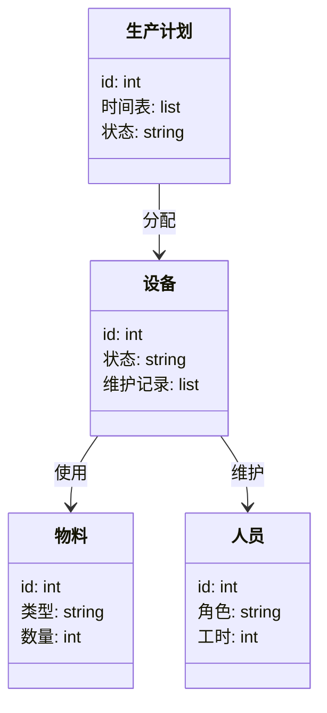
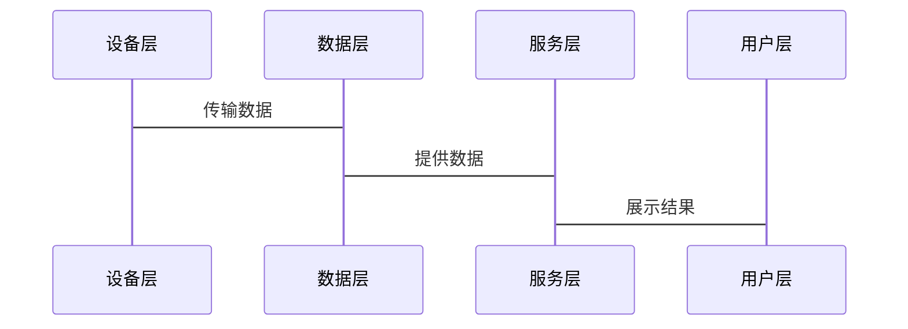

                 


# AI Agent在智能制造中的实践应用

> 关键词：智能制造，AI Agent，工业自动化，人工智能，数字化工厂

> 摘要：本文探讨了AI Agent在智能制造中的应用，分析了其核心概念、算法原理、系统架构，并通过实际案例展示了如何实现AI Agent在智能制造中的价值。文章内容涵盖背景介绍、技术原理、项目实战以及最佳实践，为读者提供了全面的视角。

---

## 第一部分: AI Agent与智能制造的背景与基础

### 第1章: AI Agent与智能制造概述

#### 1.1 AI Agent的基本概念
##### 1.1.1 AI Agent的定义与特征
AI Agent（智能体）是指在计算机系统中能够感知环境并采取行动以实现目标的实体。其核心特征包括自主性、反应性、目标导向性和社会性。AI Agent能够根据环境反馈调整行为，适用于复杂问题的解决。

##### 1.1.2 AI Agent的核心功能与类型
AI Agent的功能包括感知、推理、决策和行动。根据应用场景的不同，可以分为简单反射型、基于模型推理型、目标驱动型和效用驱动型等类型。

##### 1.1.3 AI Agent在智能制造中的作用
在智能制造中，AI Agent用于优化生产流程、提高设备利用率和实现智能化决策。例如，AI Agent可以实时监控生产线状态，预测设备故障并进行自主修复。

#### 1.2 智能制造的基本概念
##### 1.2.1 智能制造的定义与特点
智能制造是以数字化技术为基础，通过物联网、大数据和人工智能等技术实现生产过程的智能化。其特点是高效、灵活和可持续。

##### 1.2.2 智能制造的关键技术与发展趋势
关键技术包括物联网、大数据分析、人工智能和数字孪生。发展趋势是向个性化生产、智能维护和绿色制造方向发展。

##### 1.2.3 智能制造与传统制造的区别
智能制造强调数据驱动和自动化，而传统制造依赖人工操作和固定流程。智能制造能够快速响应市场变化，提高生产效率。

#### 1.3 AI Agent在智能制造中的应用背景
##### 1.3.1 智能制造中的问题与挑战
传统制造面临生产效率低、资源浪费和设备维护成本高等问题。智能制造通过AI Agent技术可以有效解决这些问题。

##### 1.3.2 AI Agent如何解决智能制造中的问题
AI Agent能够实时分析生产数据，预测潜在问题，并采取自主行动优化生产流程。例如，AI Agent可以自动调整生产线参数以提高产品质量。

##### 1.3.3 AI Agent在智能制造中的应用前景
随着人工智能技术的不断进步，AI Agent在智能制造中的应用将更加广泛，推动制造业向智能化和数字化转型。

---

## 第二部分: AI Agent的核心概念与原理

### 第2章: AI Agent的核心概念与原理

#### 2.1 AI Agent的决策机制
##### 2.1.1 知识表示与推理
知识表示是将问题转化为计算机可以理解的形式，如逻辑推理和概率推理。AI Agent通过知识库进行推理，做出决策。

##### 2.1.2 行为规划与选择
行为规划是指AI Agent根据目标生成一系列行动，并选择最优行动。常用算法包括A*算法和贪心算法。

##### 2.1.3 动态环境中的适应性
动态环境中，AI Agent需要实时调整策略以应对变化。这可以通过强化学习和自适应控制实现。

#### 2.2 AI Agent的通信与协作
##### 2.2.1 多智能体系统概述
多智能体系统由多个相互作用的AI Agent组成，共同完成复杂任务。协作机制包括分布式协调和任务分配。

##### 2.2.2 智能体之间的通信协议
通信协议定义了智能体之间的数据交换格式和规则。常用的通信协议包括HTTP和WebSocket。

##### 2.2.3 协作与冲突解决机制
在协作过程中，AI Agent需要解决冲突，确保任务顺利完成。常用方法包括协商和仲裁机制。

#### 2.3 AI Agent的学习与优化
##### 2.3.1 监督学习与强化学习
监督学习通过标记数据训练模型，强化学习通过奖励机制优化策略。两者结合可以提高AI Agent的学习能力。

##### 2.3.2 迁移学习与自适应学习
迁移学习将知识迁移到新任务，自适应学习根据反馈动态调整模型参数。

##### 2.3.3 神经网络在AI Agent中的应用
神经网络，特别是深度学习模型，广泛应用于AI Agent的感知和决策过程中。例如，卷积神经网络用于图像识别，循环神经网络用于时间序列预测。

---

## 第三部分: AI Agent在智能制造中的系统架构

### 第3章: 智能制造系统的架构设计

#### 3.1 智能制造系统的整体架构
##### 3.1.1 系统层次划分
智能制造系统通常分为设备层、控制层、管理层和决策层。设备层负责数据采集，控制层进行实时控制，管理层进行生产调度，决策层提供战略决策。

##### 3.1.2 各层次的功能
- 设备层：传感器和执行器，负责数据采集和执行操作。
- 控制层：PLC和SCADA系统，实现设备控制和数据监控。
- 管理层：MES和ERP系统，进行生产计划和资源管理。
- 决策层：大数据平台和AI系统，提供决策支持。

#### 3.2 AI Agent在智能制造系统中的应用架构
##### 3.2.1 系统功能设计
系统功能包括数据采集、分析、决策和执行。AI Agent负责数据处理、模型训练和策略执行。

##### 3.2.2 系统架构设计
采用分层架构，设备层通过边缘计算处理数据，控制层进行实时控制，管理层提供管理支持，决策层进行战略决策。

##### 3.2.3 系统接口设计
系统接口包括设备接口、数据库接口和用户接口。设备接口用于数据传输，数据库接口用于数据存储，用户接口用于人机交互。

##### 3.2.4 系统交互设计
通过事件驱动的方式进行系统交互，AI Agent根据事件触发相应操作。例如，当设备出现故障时，AI Agent触发维护流程。

---

## 第四部分: AI Agent在智能制造中的系统架构

### 第4章: AI Agent的算法原理

#### 4.1 强化学习算法
##### 4.1.1 强化学习的基本原理
强化学习通过智能体与环境的交互，学习最优策略。智能体通过执行动作获得奖励，优化策略以最大化累积奖励。

##### 4.1.2 Q-Learning算法
Q-Learning是一种常用的强化学习算法，通过Q表记录状态-动作对的值，更新策略以最大化Q值。

##### 4.1.3 Deep Q-Network (DQN)算法
DQN算法结合神经网络和Q-Learning，通过经验回放和目标网络提高学习效率。例如，DQN可以用于优化生产线的排程问题。

##### 4.1.4 算法实现的Python代码示例
```python
import numpy as np
import gym

# 创建环境
env = gym.make('CartPole-v0')
env.seed(1)

# 初始化Q表
Q = np.zeros([env.observation_space.shape[0], env.action_space.n])
alpha = 0.1
gamma = 0.99

# Q-Learning算法
for episode in range(1000):
    state = env.reset()
    while True:
        # 选择动作
        action = np.argmax(Q[state])
        # 执行动作并获得奖励
        next_state, reward, done, _ = env.step(action)
        # 更新Q表
        Q[state][action] += alpha * (reward + gamma * np.max(Q[next_state])) * (not done)
        state = next_state
        if done:
            break
```

##### 4.1.5 算法的数学模型
Q-Learning算法的更新公式为：
$$ Q(s, a) = Q(s, a) + \alpha [r + \gamma \max Q(s', a') - Q(s, a)] $$

#### 4.2 监督学习算法
##### 4.2.1 线性回归
线性回归用于预测连续型变量，例如预测设备的剩余寿命。

##### 4.2.2 支持向量机
支持向量机用于分类问题，例如分类产品是否合格。

##### 4.2.3 神经网络
深度神经网络用于复杂模式识别，例如图像识别和语音识别。

##### 4.2.4 算法实现的Python代码示例
```python
from sklearn.linear_model import LinearRegression
from sklearn.svm import SVC
import tensorflow as tf

# 线性回归
model = LinearRegression()
X = np.array([[1], [2], [3]])
y = np.array([2, 4, 6])
model.fit(X, y)
print(model.predict([[4]]))  # 输出: [[8.]]
```

#### 4.3 聚类分析
聚类分析用于将数据分成若干类，例如将生产线上的产品按质量分组。

##### 4.3.1 K-means算法
K-means算法将数据分成K个簇，适用于无监督学习场景。

##### 4.3.2 层次聚类
层次聚类通过构建树状结构进行数据分组，适用于复杂数据结构。

##### 4.3.3 算法实现的Python代码示例
```python
from sklearn.cluster import KMeans
import numpy as np

X = np.array([[1, 2], [1, 3], [2, 2], [2, 3], [4, 5], [4, 6]])
kmeans = KMeans(n_clusters=2)
kmeans.fit(X)
print(kmeans.labels_)
```

---

## 第五部分: AI Agent在智能制造中的系统架构

### 第5章: 系统分析与架构设计

#### 5.1 问题场景介绍
##### 5.1.1 生产线监控
实时监控生产线状态，预测设备故障，优化生产流程。

##### 5.1.2 质量控制
通过AI Agent进行产品质量检测，减少人工干预。

##### 5.1.3 供应链优化
优化供应链管理，降低库存成本，提高交付效率。

#### 5.2 系统功能设计
##### 5.2.1 领域模型设计
领域模型包括设备、物料、人员和生产计划等实体，用mermaid类图展示。



##### 5.2.2 系统架构设计
系统架构采用分层设计，包括设备层、数据层、服务层和用户层，用mermaid架构图展示。


##### 5.2.3 系统接口设计
系统接口包括设备接口、数据库接口和用户接口，用mermaid序列图展示。



#### 5.3 项目实战
##### 5.3.1 环境安装
安装Python、TensorFlow、Keras和相关库，配置开发环境。

##### 5.3.2 核心代码实现
实现AI Agent的核心功能，包括数据采集、模型训练和策略执行。

##### 5.3.3 实际案例分析
分析一个智能制造案例，展示AI Agent如何优化生产流程。

##### 5.3.4 项目小结
总结项目成果和经验，提出改进建议。

---

## 第六部分: AI Agent在智能制造中的系统架构

### 第6章: 最佳实践与总结

#### 6.1 最佳实践
##### 6.1.1 系统设计中的注意事项
- 明确系统目标和范围
- 选择合适的算法和技术
- 确保数据安全和隐私保护

##### 6.1.2 开发过程中的注意事项
- 迭代开发，从小到大
- 注重代码可维护性
- 做好文档记录

##### 6.1.3 部署与维护中的注意事项
- 定期更新模型
- 监控系统运行状态
- 处理异常情况

#### 6.2 总结
AI Agent在智能制造中的应用前景广阔，能够显著提高生产效率和产品质量。通过合理设计和实施，AI Agent可以帮助企业实现智能化转型。

#### 6.3 未来展望
随着技术进步，AI Agent在智能制造中的应用将更加深入，可能出现新的算法和应用场景，如边缘计算和区块链技术的结合。

#### 6.4 拓展阅读
推荐阅读《机器学习实战》、《深度学习》和《智能制造2025》等书籍，深入理解相关技术。

---

## 作者

作者：AI天才研究院/AI Genius Institute & 禅与计算机程序设计艺术 /Zen And The Art of Computer Programming

---

**摘要**：本文系统地探讨了AI Agent在智能制造中的应用，从理论基础到实际案例，全面分析了其在生产优化、质量控制和供应链管理中的作用。通过详细的技术分析和代码示例，展示了如何利用AI Agent技术提升智能制造水平，为企业的数字化转型提供参考。

