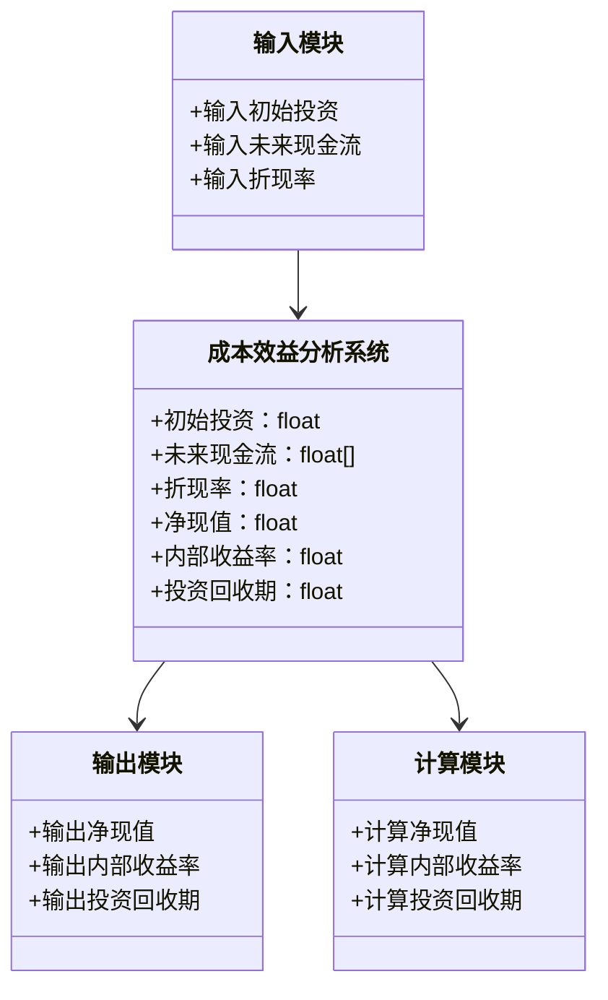
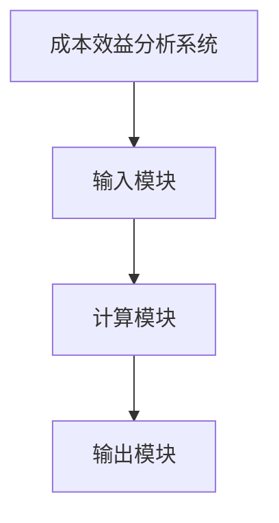
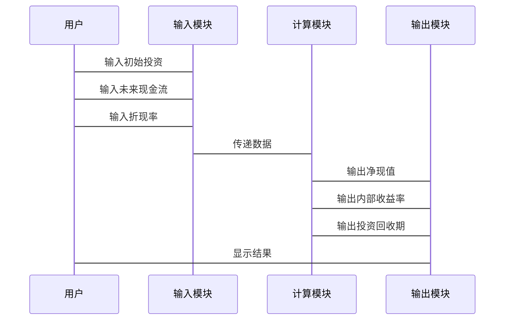

                 


# AI Agent项目成本效益分析指南

> 关键词：AI Agent、成本效益分析、项目管理、投资评估、算法原理、系统设计、项目实战

> 摘要：本文旨在为AI Agent项目的成本效益分析提供全面的指导。通过系统地介绍AI Agent的基本概念、成本效益分析的核心原理、常用算法、系统设计、项目实战及最佳实践，帮助读者掌握如何科学地评估和实施AI Agent项目。文章内容包括背景介绍、核心概念、算法原理、系统架构设计、项目实战及最佳实践，结合丰富的图表和代码示例，为读者提供实用的指导。

---

# 第一部分: AI Agent项目成本效益分析概述

# 第1章: AI Agent项目成本效益分析概述

## 1.1 AI Agent的基本概念与背景

### 1.1.1 AI Agent的定义与特点

AI Agent（人工智能代理）是指能够感知环境、自主决策并执行任务的智能实体。与传统软件不同，AI Agent具有以下特点：

1. **自主性**：能够在没有外部干预的情况下自主运行。
2. **反应性**：能够感知环境并实时做出反应。
3. **目标导向**：具备明确的目标导向性，能够优化决策以实现目标。
4. **学习能力**：通过数据和经验不断优化自身行为。

### 1.1.2 AI Agent在项目中的作用

AI Agent在项目中扮演着重要角色，能够提高项目的效率和质量。其主要作用包括：

1. **任务自动化**：自动化处理重复性任务，减少人工干预。
2. **决策优化**：基于数据和模型提供最优决策建议。
3. **风险控制**：通过实时监控和预测，降低项目风险。

### 1.1.3 成本效益分析的重要性

在AI Agent项目的实施过程中，成本效益分析是决定项目可行性和投资回报的关键环节。通过分析项目的成本和预期收益，可以帮助决策者做出科学的投资决策。

### 1.1.4 本章小结

本节介绍了AI Agent的基本概念及其在项目中的作用，强调了成本效益分析的重要性。

## 1.2 项目成本效益分析的基本原理

### 1.2.1 成本的定义与分类

在成本效益分析中，成本是指项目实施过程中所需的所有资源投入，包括人力、物力和财力等。成本可以分为以下几类：

1. **固定成本**：在项目生命周期内不变的成本，如设备折旧。
2. **可变成本**：随着项目规模变化而变化的成本，如开发人员的工资。
3. **机会成本**：放弃其他投资可能带来的收益。

### 1.2.2 效益的定义与分类

效益是指项目实施后带来的收益，包括直接效益和间接效益。直接效益是项目直接产生的收益，如销售收入；间接效益是项目间接产生的收益，如品牌价值提升。

### 1.2.3 成本效益分析的基本方法

成本效益分析的基本方法包括：

1. **净现值法（Net Present Value, NPV）**：计算项目未来现金流的现值，与初始投资进行比较。
2. **内部收益率法（Internal Rate of Return, IRR）**：计算项目资金的回报率。
3. **投资回收期法（Payback Period）**：计算项目投资回收所需的时间。

### 1.2.4 AI Agent项目的特点与挑战

AI Agent项目具有以下特点和挑战：

1. **高技术门槛**：需要专业的技术团队和工具。
2. **高投入**：开发和部署AI Agent需要大量的资金和时间。
3. **不确定性**：AI Agent的性能依赖于数据质量和算法的优化。

### 1.2.5 本章小结

本节介绍了成本效益分析的基本原理，分析了AI Agent项目的特点和挑战。

---

# 第二部分: AI Agent项目成本效益分析的核心概念

# 第2章: AI Agent项目成本效益分析的核心概念

## 2.1 成本效益分析的定义与方法

### 2.1.1 成本的定义与分类

成本是指项目实施过程中所需的所有资源投入，包括人力、物力和财力等。成本可以分为以下几类：

1. **固定成本**：在项目生命周期内不变的成本，如设备折旧。
2. **可变成本**：随着项目规模变化而变化的成本，如开发人员的工资。
3. **机会成本**：放弃其他投资可能带来的收益。

### 2.1.2 效益的定义与分类

效益是指项目实施后带来的收益，包括直接效益和间接效益。直接效益是项目直接产生的收益，如销售收入；间接效益是项目间接产生的收益，如品牌价值提升。

### 2.1.3 成本效益分析的基本方法

成本效益分析的基本方法包括：

1. **净现值法（Net Present Value, NPV）**：计算项目未来现金流的现值，与初始投资进行比较。
2. **内部收益率法（Internal Rate of Return, IRR）**：计算项目资金的回报率。
3. **投资回收期法（Payback Period）**：计算项目投资回收所需的时间。

### 2.1.4 AI Agent项目中的特殊考虑

在AI Agent项目中，需要特别考虑以下几点：

1. **数据质量**：数据是AI Agent的核心，数据质量直接影响项目的效益。
2. **算法优化**：算法的优化是提高项目效益的关键。
3. **维护成本**：AI Agent的维护成本较高，需要长期投入。

## 2.2 AI Agent项目的核心要素

### 2.2.1 项目目标与范围

项目目标是指通过AI Agent实现的具体目标，如提高效率、降低成本等。项目范围是指项目的边界，包括项目的功能、资源和时间限制。

### 2.2.2 项目资源分配

资源分配是成本效益分析的重要部分。需要合理分配人力、物力和财力资源，以确保项目顺利实施。

### 2.2.3 项目风险与不确定性

AI Agent项目面临的风险包括技术风险、市场风险和操作风险。需要通过风险评估和管理，降低项目失败的可能性。

### 2.2.4 项目收益与成本的动态平衡

在项目实施过程中，需要动态平衡收益与成本。通过不断优化资源配置，提高项目的整体效益。

## 2.3 成本效益分析的数学模型

### 2.3.1 净现值法（NPV）

净现值法是评估项目经济效益的重要方法。其公式为：

$$ NPV = \sum_{t=0}^{n} \frac{C_t}{(1+r)^t} $$

其中，\( C_t \) 是第t年的净现金流，\( r \) 是折现率，\( n \) 是项目周期。

### 2.3.2 内部收益率法（IRR）

内部收益率法是另一种常用的评估方法。其公式为：

$$ IRR = r \text{ 使得 } NPV = 0 $$

### 2.3.3 投资回收期法（Payback Period）

投资回收期法是指项目投资回收所需的时间。其公式为：

$$ \text{Payback Period} = \frac{\text{初始投资}}{\text{年现金流}} $$

### 2.3.4 成本效益分析的其他方法

除了上述方法，还可以使用成本-效益分析矩阵等工具，帮助决策者更好地评估项目的可行性和效益。

## 2.4 本章小结

本章详细介绍了AI Agent项目成本效益分析的核心概念，包括成本和效益的定义与分类、分析方法及项目的特殊考虑。

---

# 第三部分: AI Agent项目成本效益分析的算法原理

# 第3章: AI Agent项目成本效益分析的算法原理

## 3.1 净现值法（Net Present Value, NPV）

### 3.1.1 NPV的计算步骤

1. 确定项目的初始投资和未来现金流。
2. 选择合适的折现率。
3. 计算未来现金流的现值。
4. 净现值 = 现值总和 - 初始投资。

### 3.1.2 NPV的优缺点

- **优点**：考虑了资金的时间价值，能够全面评估项目的经济效益。
- **缺点**：需要准确估计折现率和未来现金流，存在一定的不确定性。

### 3.1.3 NPV在AI Agent项目中的应用

在AI Agent项目中，NPV可以用于评估不同方案的经济效益。例如，比较两种AI Agent方案的初始投资和未来收益，选择NPV更高的方案。

### 3.1.4 用Python实现NPV计算

```python
def calculate_npv(cash_flows, discount_rate):
    npv = 0
    for year, cash_flow in enumerate(cash_flows):
        if year == 0:
            npv += cash_flow
        else:
            npv += cash_flow / (1 + discount_rate) ** year
    return npv

# 示例
cash_flows = [-100, 50, 60, 70]
discount_rate = 0.1

npv = calculate_npv(cash_flows, discount_rate)
print("净现值 (NPV):", npv)
```

---

## 3.2 内部收益率法（Internal Rate of Return, IRR）

### 3.2.1 IRR的计算步骤

1. 确定项目的初始投资和未来现金流。
2. 通过试算法或使用财务函数计算IRR。

### 3.2.2 IRR的优缺点

- **优点**：能够反映项目的实际回报率。
- **缺点**：计算复杂，且不一定反映项目的实际价值。

### 3.2.3 IRR在AI Agent项目中的应用

在AI Agent项目中，IRR可以用于评估项目的投资回报率。例如，评估不同项目的资金回报率，选择IRR更高的项目。

### 3.2.4 用Python实现IRR计算

```python
import numpy as np

def calculate_irr(cash_flows):
    try:
        irr = np.irr(cash_flows)
        return irr
    except:
        return 0

# 示例
cash_flows = [-100, 50, 60, 70]

irr = calculate_irr(cash_flows)
print("内部收益率 (IRR):", irr)
```

---

## 3.3 投资回收期法（Payback Period）

### 3.3.1 投资回收期的计算步骤

1. 确定项目的初始投资和年现金流。
2. 计算回收初始投资所需的时间。

### 3.3.2 投资回收期的优缺点

- **优点**：计算简单，易于理解。
- **缺点**：忽视了资金的时间价值，不能全面评估项目的经济效益。

### 3.3.3 投资回收期在AI Agent项目中的应用

在AI Agent项目中，投资回收期可以用于评估项目的可行性。例如，评估不同项目的回收时间，选择回收期最短的项目。

### 3.3.4 用Python实现投资回收期计算

```python
def calculate_payback_period(cash_flows):
    cumulative = 0
    period = 0
    for cash_flow in cash_flows:
        cumulative += cash_flow
        period += 1
        if cumulative > 0:
            return period
    return 0

# 示例
cash_flows = [-100, 50, 60, 70]

payback_period = calculate_payback_period(cash_flows)
print("投资回收期:", payback_period)
```

---

## 3.4 成本效益分析的综合方法

在实际应用中，可以将多种方法结合起来，进行全面的成本效益分析。例如，结合NPV和IRR，综合评估项目的经济效益。

---

## 3.5 本章小结

本章详细介绍了AI Agent项目成本效益分析的主要算法，包括净现值法、内部收益率法和投资回收期法，并提供了Python代码示例，帮助读者更好地理解和应用这些方法。

---

# 第四部分: AI Agent项目成本效益分析的系统设计

# 第4章: AI Agent项目成本效益分析的系统设计

## 4.1 问题场景介绍

在AI Agent项目中，成本效益分析是整个项目管理的重要组成部分。通过对项目的成本和收益进行科学评估，可以帮助决策者做出合理的投资决策。

## 4.2 系统功能设计

### 4.2.1 领域模型设计

以下是AI Agent项目成本效益分析的领域模型：



### 4.2.2 系统架构设计

以下是AI Agent项目成本效益分析系统的架构图：



## 4.3 系统接口设计

系统接口设计包括输入接口和输出接口。输入接口用于接收初始投资、未来现金流和折现率；输出接口用于输出净现值、内部收益率和投资回收期。

## 4.4 系统交互设计

以下是系统交互流程图：



---

## 4.5 本章小结

本章详细描述了AI Agent项目成本效益分析系统的功能设计、架构设计、接口设计和交互设计，为项目的实施提供了理论基础。

---

# 第五部分: AI Agent项目成本效益分析的项目实战

# 第5章: AI Agent项目成本效益分析的项目实战

## 5.1 环境安装

在进行AI Agent项目成本效益分析之前，需要确保环境配置正确。以下是所需环境：

1. **Python**：建议使用Python 3.8及以上版本。
2. **NumPy**：用于数值计算。
3. **Mermaid**：用于绘制图表。

安装命令：

```bash
pip install numpy
```

## 5.2 系统核心实现源代码

以下是AI Agent项目成本效益分析系统的核心代码：

```python
import numpy as np

def calculate_npv(cash_flows, discount_rate):
    npv = 0
    for year, cash_flow in enumerate(cash_flows):
        if year == 0:
            npv += cash_flow
        else:
            npv += cash_flow / (1 + discount_rate) ** year
    return npv

def calculate_irr(cash_flows):
    try:
        irr = np.irr(cash_flows)
        return irr
    except:
        return 0

def calculate_payback_period(cash_flows):
    cumulative = 0
    period = 0
    for cash_flow in cash_flows:
        cumulative += cash_flow
        period += 1
        if cumulative > 0:
            return period
    return 0

# 示例
cash_flows = [-100, 50, 60, 70]
discount_rate = 0.1

npv = calculate_npv(cash_flows, discount_rate)
irr = calculate_irr(cash_flows)
payback_period = calculate_payback_period(cash_flows)

print("净现值 (NPV):", npv)
print("内部收益率 (IRR):", irr)
print("投资回收期:", payback_period)
```

## 5.3 代码应用解读与分析

上述代码实现了NPV、IRR和投资回收期的计算。通过输入初始投资、未来现金流和折现率，可以输出项目的净现值、内部收益率和投资回收期。

## 5.4 实际案例分析

假设我们有一个AI Agent项目，初始投资为100万元，未来三年的现金流分别为50万元、60万元和70万元，折现率为10%。我们可以计算：

- **NPV**：50/(1.1) + 60/(1.1)^2 + 70/(1.1)^3 - 100 = 12.82 + 48.78 + 43.50 - 100 ≈ 15.10万元
- **IRR**：约为18.4%
- **投资回收期**：2年

## 5.5 本章小结

本章通过实际案例分析，详细讲解了AI Agent项目成本效益分析系统的实现和应用。

---

# 第六部分: AI Agent项目成本效益分析的最佳实践

# 第6章: AI Agent项目成本效益分析的最佳实践

## 6.1 小结

通过本文的介绍，我们了解了AI Agent项目成本效益分析的基本概念、算法原理、系统设计和项目实战。成本效益分析是AI Agent项目成功实施的关键环节。

## 6.2 注意事项

1. **数据准确性**：数据是成本效益分析的基础，必须确保数据的准确性和完整性。
2. **模型合理性**：选择合适的分析模型，确保模型的合理性和适用性。
3. **动态调整**：在项目实施过程中，需要动态调整成本和收益，确保项目的顺利推进。

## 6.3 拓展阅读

1. 《项目管理知识体系指南》
2. 《成本效益分析的理论与实践》
3. 《AI Agent技术与应用》

---

# 第七部分: 作者信息

作者：AI天才研究院/AI Genius Institute & 禅与计算机程序设计艺术 /Zen And The Art of Computer Programming

---

通过本文的系统介绍，读者可以全面掌握AI Agent项目成本效益分析的方法和技巧，为项目的成功实施提供有力支持。

