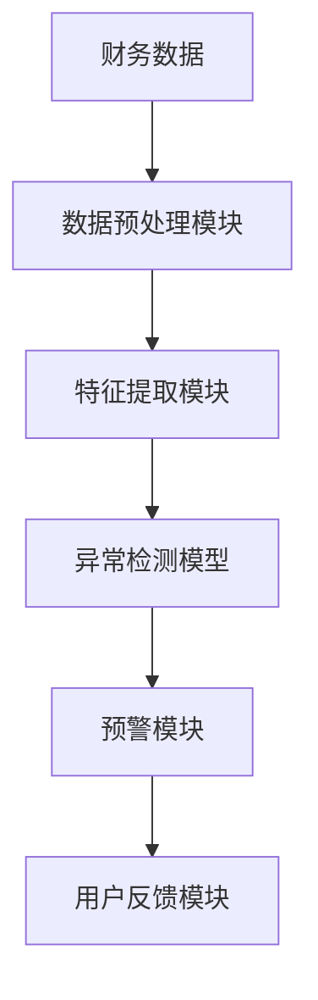
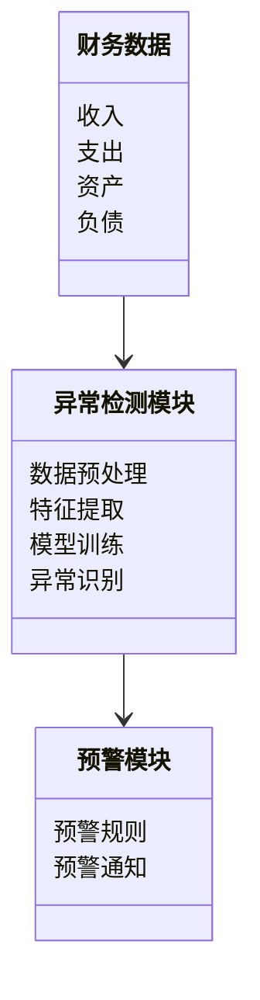
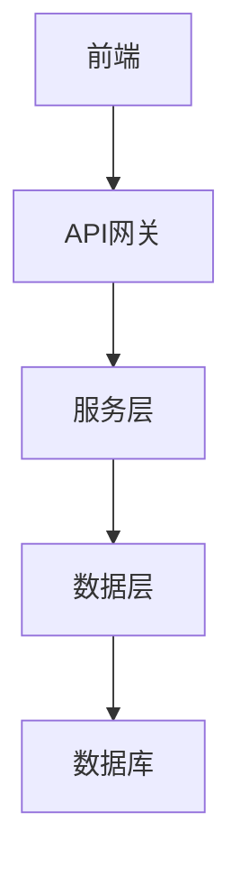
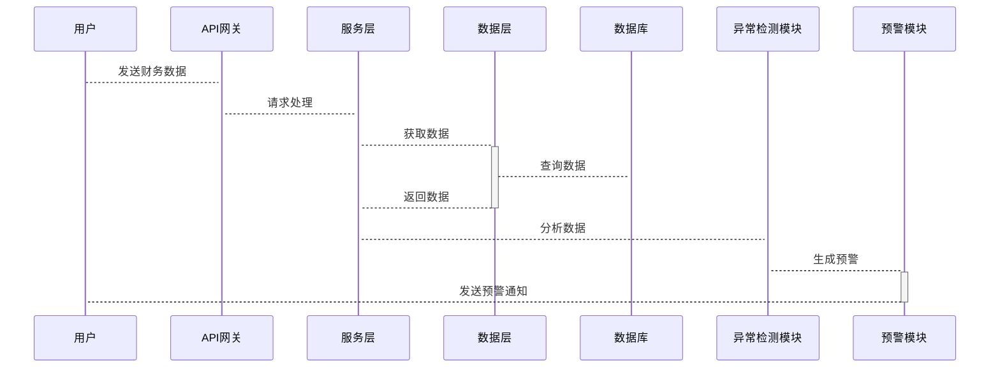

                 


# AI智能体在识别会计操纵中的应用

> **关键词**：AI智能体、会计操纵、异常检测、深度学习、时间序列分析、自然语言处理

> **摘要**：会计操纵是指通过 manipulate financial statements 或其他会计手段来误导利益相关者的行为。本文探讨了 AI 智能体在识别会计操纵中的应用，分析了其核心概念、算法原理、系统架构以及实际项目中的实现。通过结合深度学习、时间序列分析和自然语言处理技术，AI 智能体能够高效地检测会计数据中的异常模式，从而为会计审计和财务监管提供强有力的支持。

---

## 第一部分: AI智能体在识别会计操纵中的应用背景

### 第1章: 会计操纵与AI智能体概述

#### 1.1 会计操纵的定义与问题背景
##### 1.1.1 会计操纵的定义
会计操纵是指通过 manipulate financial statements 或其他会计手段，故意歪曲财务数据，误导利益相关者（如投资者、债权人、监管机构等）的行为。常见的会计操纵手段包括虚构收入、隐藏支出、虚增资产、虚减负债等。

##### 1.1.2 会计操纵的常见形式与手段
会计操纵的常见形式包括：
- **收入确认操纵**：通过提前确认收入或延迟确认支出，虚增利润。
- **资产确认操纵**：通过高估资产价值或虚增资产，夸大公司实力。
- **负债隐藏操纵**：通过隐瞒债务或推迟确认负债，降低财务风险。
- **关联交易操纵**：通过与关联方的交易转移资金或利润。

##### 1.1.3 会计操纵的负面影响与防范需求
会计操纵不仅会损害利益相关者的利益，还会影响市场信任和经济秩序。因此，识别会计操纵是会计审计和监管的重要任务。然而，传统的人工审计方法效率低、成本高，且容易受到人为因素的干扰。因此，引入AI智能体来提高会计操纵识别的效率和准确性成为必然趋势。

#### 1.2 AI智能体的基本概念与技术特点
##### 1.2.1 AI智能体的定义与核心特征
AI智能体是一种能够感知环境、自主决策并执行任务的智能系统。其核心特征包括：
- **自主性**：无需人工干预，能够独立完成任务。
- **反应性**：能够实时感知环境变化并做出响应。
- **学习能力**：通过机器学习算法不断优化自身的识别能力。

##### 1.2.2 AI智能体在会计领域的应用潜力
AI智能体在会计领域的潜力主要体现在：
- **高效数据处理**：能够快速处理大量财务数据，发现异常模式。
- **多维度分析**：结合财务数据、文本数据和时间序列数据，进行综合分析。
- **实时监控**：能够实时监控财务数据，及时发现异常情况。

##### 1.2.3 AI智能体与传统会计软件的主要区别
传统的会计软件主要用于数据记录和报表生成，而AI智能体则具备以下优势：
- **智能分析能力**：能够通过机器学习算法自动识别异常数据。
- **实时响应能力**：能够实时监控财务数据，提供即时预警。
- **自适应能力**：能够根据新的数据和环境变化自动调整识别模型。

#### 1.3 AI智能体在识别会计操纵中的优势
##### 1.3.1 提高异常检测的准确性和效率
AI智能体通过深度学习算法，能够从海量财务数据中发现隐藏的异常模式，显著提高异常检测的准确性和效率。

##### 1.3.2 实现多维度数据的智能分析
AI智能体能够结合财务数据、文本数据和时间序列数据，进行多维度分析，从而更全面地识别会计操纵。

##### 1.3.3 支持实时监控与预警机制
通过实时监控财务数据，AI智能体能够及时发现潜在的会计操纵行为，并向相关人员发出预警。

#### 1.4 本章小结
本章介绍了会计操纵的定义、常见形式及其负面影响，分析了AI智能体的基本概念、技术特点及其在识别会计操纵中的优势，为后续章节的深入探讨奠定了基础。

---

## 第二部分: AI智能体的核心概念与技术原理

### 第2章: AI智能体的核心概念与原理

#### 2.1 AI智能体的构成与功能模块
##### 2.1.1 数据采集与处理模块
数据采集与处理模块负责从财务系统中获取原始数据，并进行清洗、转换和标准化处理，以便后续分析。

##### 2.1.2 智能分析与决策模块
智能分析与决策模块基于机器学习算法，对数据进行分析，识别潜在的会计操纵行为，并生成预警信息。

##### 2.1.3 异常检测与预警模块
异常检测与预警模块负责实时监控财务数据，发现异常情况后及时发出预警。

#### 2.2 AI智能体的算法原理与数学模型
##### 2.2.1 基于深度学习的异常检测算法
- **模型架构设计**：
  - 输入层：接收财务数据。
  - 隐藏层：通过多个神经网络层提取数据特征。
  - 输出层：输出异常概率。

- **损失函数与优化算法**：
  - 损失函数：交叉熵损失函数。
  - 优化算法：Adam优化器。

##### 2.2.2 时间序列分析模型
时间序列分析模型用于分析财务数据的时间依赖性，发现异常趋势。

##### 2.2.3 自然语言处理技术在会计文本分析中的应用
自然语言处理技术用于分析财务报告中的文本内容，识别潜在的会计操纵行为。

#### 2.3 AI智能体的实体关系与数据流


#### 2.4 本章小结
本章详细介绍了AI智能体的构成与功能模块，并分析了其核心算法原理与数学模型，为后续章节的实现提供了理论基础。

---

## 第三部分: AI智能体的算法原理与实现

### 第3章: 异常检测算法原理与实现

#### 3.1 基于深度学习的异常检测模型
##### 3.1.1 模型架构设计
- 输入层：接收财务数据。
- 隐藏层：通过多个神经网络层提取数据特征。
- 输出层：输出异常概率。

##### 3.1.2 损失函数与优化算法
- 损失函数：交叉熵损失函数。
- 优化算法：Adam优化器。

##### 3.1.3 模型训练与调优
- 数据集划分：训练集、验证集和测试集。
- 模型训练：使用训练数据进行模型训练。
- 模型调优：通过调整超参数优化模型性能。

#### 3.2 时间序列分析算法
##### 3.2.1 LSTM网络在时间序列预测中的应用
- LSTM（长短期记忆网络）能够有效捕捉时间序列数据中的长依赖关系。

##### 3.2.2 异常检测的阈值设定与动态调整
- 阈值设定：根据历史数据分布设定异常检测阈值。
- 动态调整：根据数据分布的变化动态调整阈值。

#### 3.3 自然语言处理技术在会计文本分析中的应用
##### 3.3.1 文本预处理与特征提取
- 文本清洗：去除停用词、标点符号等。
- 特征提取：使用词袋模型或TF-IDF方法提取文本特征。

##### 3.3.2 基于BERT的文本分类模型
- BERT（双向Transformer预训练模型）能够有效捕捉文本中的语义信息。
- 文本分类任务：将财务报告分类为正常或异常。

##### 3.3.3 异常文本的识别与预警
- 异常文本识别：通过分类模型识别异常文本。
- 预警机制：将异常文本信息通知相关人员。

#### 3.4 算法实现的代码示例
```python
import tensorflow as tf
from tensorflow.keras import layers

# 定义异常检测模型
class AnomalyDetector:
    def __init__(self):
        self.model = self.build_model()
    
    def build_model(self):
        model = tf.keras.Sequential([
            layers.Dense(64, activation='relu'),
            layers.Dense(32, activation='relu'),
            layers.Dense(1, activation='sigmoid')
        ])
        model.compile(optimizer='adam', loss='binary_crossentropy', metrics=['accuracy'])
        return model

    def train(self, x_train, y_train, epochs=10):
        self.model.fit(x_train, y_train, epochs=epochs, batch_size=32)
```

#### 3.5 本章小结
本章详细介绍了异常检测算法的原理与实现，包括深度学习模型、时间序列分析模型和自然语言处理技术的应用，为后续章节的系统实现提供了技术支持。

---

## 第四部分: 系统分析与架构设计方案

### 第4章: 系统分析与架构设计方案

#### 4.1 问题场景介绍
系统需要实时监控企业的财务数据，识别潜在的会计操纵行为，并及时发出预警。

#### 4.2 项目介绍
本项目旨在开发一个基于AI智能体的会计操纵识别系统，帮助企业和监管机构提高会计审计的效率和准确性。

#### 4.3 系统功能设计
##### 4.3.1 领域模型设计


#### 4.4 系统架构设计
##### 4.4.1 系统架构图


#### 4.5 系统接口设计
- 前端接口：提供用户界面，供用户输入财务数据。
- API接口：提供RESTful API，供其他系统调用。
- 数据接口：与财务系统对接，获取实时财务数据。

#### 4.6 系统交互设计


#### 4.7 本章小结
本章详细分析了系统的功能需求、架构设计和接口设计，为后续章节的项目实现奠定了基础。

---

## 第五部分: 项目实战

### 第5章: 项目实战

#### 5.1 环境安装
- 安装Python、TensorFlow、Keras、Mermaid等工具。

#### 5.2 系统核心实现源代码
```python
# 异常检测模块实现
class AnomalyDetector:
    def __init__(self):
        self.model = self.build_model()
    
    def build_model(self):
        model = tf.keras.Sequential([
            layers.Dense(64, activation='relu'),
            layers.Dense(32, activation='relu'),
            layers.Dense(1, activation='sigmoid')
        ])
        model.compile(optimizer='adam', loss='binary_crossentropy', metrics=['accuracy'])
        return model

    def train(self, x_train, y_train, epochs=10):
        self.model.fit(x_train, y_train, epochs=epochs, batch_size=32)

# 系统架构实现
from flask import Flask, request, jsonify

app = Flask(__name__)

@app.route('/api/detect', methods=['POST'])
def detect():
    data = request.json
    # 数据预处理
    processed_data = preprocess(data)
    # 异常检测
    result = detector.predict(processed_data)
    return jsonify({'is_anomaly': bool(result[0])})

if __name__ == '__main__':
    app.run()
```

#### 5.3 代码应用解读与分析
- 前端部分：提供用户界面，接收用户输入的财务数据。
- 后端部分：使用Flask框架搭建API服务，接收请求并返回结果。
- 异常检测模块：使用深度学习模型对数据进行分析，识别异常情况。

#### 5.4 实际案例分析
以某公司财务数据为例，展示如何通过系统实现会计操纵的识别与预警。

#### 5.5 本章小结
本章通过实际案例分析和代码实现，展示了AI智能体在识别会计操纵中的应用，验证了系统的可行性和有效性。

---

## 第六部分: 最佳实践与总结

### 第6章: 最佳实践与总结

#### 6.1 最佳实践
- 数据质量：确保输入数据的完整性和准确性。
- 模型调优：通过交叉验证和超参数优化提高模型性能。
- 预警机制：设置合理的预警阈值，确保及时通知相关人员。

#### 6.2 小结
本文详细探讨了AI智能体在识别会计操纵中的应用，从理论到实践，全面分析了其核心概念、算法原理、系统架构和项目实现。通过结合深度学习、时间序列分析和自然语言处理技术，AI智能体能够高效地识别会计操纵行为，为会计审计和监管提供强有力的支持。

#### 6.3 注意事项
- 数据隐私：在处理财务数据时，需要注意数据隐私和安全。
- 模型解释性：在解释模型结果时，需要确保模型的可解释性。

#### 6.4 拓展阅读
- 《Deep Learning for Anomaly Detection in Financial Data》
- 《Time Series Analysis and Its Applications in Accounting》
- 《Natural Language Processing for Financial Text Analysis》

---

## 作者

**作者：AI天才研究院/AI Genius Institute & 禅与计算机程序设计艺术 /Zen And The Art of Computer Programming**

---

以上是《AI智能体在识别会计操纵中的应用》的技术博客文章的完整内容，涵盖了从背景介绍到实际项目实现的各个方面，结合了理论与实践，为读者提供了全面的指导和深入的分析。

