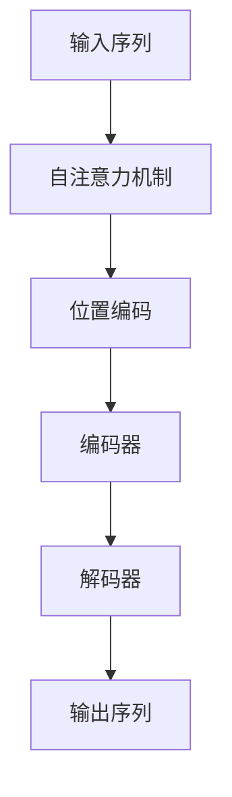

                 


# Transformer架构：构建高效的序列处理AI Agent

> 关键词：Transformer架构，自注意力机制，序列处理，AI Agent，深度学习

> 摘要：本文详细探讨了Transformer架构在构建高效序列处理AI Agent中的应用。从背景到核心概念，从算法原理到系统架构设计，再到项目实战，全面解析Transformer的优势和实现细节，帮助读者深入理解其在序列处理任务中的高效性和广泛适用性。

---

## 第1章: Transformer架构的背景与起源

### 1.1 从序列处理到Transformer的演进

#### 1.1.1 传统序列处理模型的局限性

- **循环神经网络（RNN）的局限性**：RNN在处理长序列时会遇到梯度消失或爆炸的问题，导致模型难以捕捉长距离依赖关系。
- **卷积神经网络（CNN）的局限性**：CNN擅长局部依赖，难以处理序列数据中的长距离关系。

#### 1.1.2 Transformer的提出与核心思想

- **提出背景**：为了解决RNN和CNN在处理长序列数据时的不足，Vaswani等人提出了Transformer架构。
- **核心思想**：引入自注意力机制（Self-Attention），允许模型在处理每个位置时考虑整个序列的信息，从而捕捉全局依赖。

#### 1.1.3 Transformer在AI Agent中的应用前景

- **序列处理任务**：Transformer在自然语言处理、时间序列预测等领域表现出色，为AI Agent提供了强大的处理能力。
- **实时响应需求**：通过并行计算能力，Transformer能够高效处理序列数据，满足AI Agent实时响应的需求。

### 1.2 Transformer的基本概念与核心要素

#### 1.2.1 什么是Transformer架构

- **编码器-解码器结构**：Transformer由编码器和解码器组成，编码器负责将输入序列转换为中间表示，解码器负责将中间表示解码为输出序列。
- **自注意力机制**：允许模型在编码和解码过程中关注输入序列中的重要部分，提升模型的表达能力。

#### 1.2.2 Transformer的核心组成：编码器与解码器

- **编码器**：将输入序列转换为上下文表示，捕捉序列中的全局信息。
- **解码器**：根据编码器输出生成目标序列，通常用于机器翻译等任务。

#### 1.2.3 Transformer与RNN/CNN的对比分析

| 特性                | RNN           | CNN          | Transformer     |
|---------------------|---------------|--------------|----------------|
| 并行计算能力         | 串行          | 并行          | 并行            |
| 处理长度             | 有限          | 局部          | 全局            |
| 捕捉依赖关系         | 难            | 局部          | 易              |

### 1.3 Transformer在AI Agent中的作用

#### 1.3.1 序列处理任务的典型场景

- **自然语言理解**：Transformer在BERT等模型中的应用，显著提升了自然语言处理任务的性能。
- **时间序列预测**：通过自注意力机制，Transformer能够有效捕捉时间序列中的长期依赖关系。

#### 1.3.2 Transformer在AI Agent中的具体实现

- **输入处理**：将输入序列转换为模型可处理的形式，通常包括词嵌入和位置编码。
- **自注意力计算**：计算每个位置与其他位置的相关性，生成注意力权重。
- **前馈网络处理**：对注意力加权后的输入进行非线性变换，生成最终的输出。

## 第2章: Transformer的核心概念与联系

### 2.1 Transformer的核心概念原理

#### 2.1.1 自注意力机制（Self-Attention）

- **计算过程**：
  1. **查询（Query）**：表示当前位置的特征。
  2. **键（Key）**：表示其他位置的特征。
  3. **值（Value）**：根据键和查询的相似性，调整值的权重。
- **公式**：
  $$\text{Attention}(Q, K, V) = \text{softmax}\left(\frac{QK^T}{\sqrt{d_k}}\right)V$$

#### 2.1.2 前馈神经网络（FFN）

- **结构**：
  1. **输入层**：接收编码器输出的特征。
  2. **前馈层**：进行前向传播，通常包括多个全连接层和激活函数。
  3. **输出层**：生成最终的输出特征。

#### 2.1.3 段间位置编码（Positional Encoding）

- **目的**：为每个位置添加位置信息，帮助模型理解序列的顺序关系。
- **实现方式**：通过预定义的函数生成位置编码，通常嵌入到输入特征中。

### 2.2 Transformer核心概念属性特征对比表格

| 概念       | 输入         | 输出         | 核心特征                     |
|------------|--------------|--------------|------------------------------|
| Self-Attention | 序列输入     | 注意力权重   | 并行计算，全局依赖           |
| FFN        | 编码结果     | 解码输出     | 层次结构，非线性变换         |
| Positional Encoding | 位置信息   | 嵌入特征     | 绝对位置信息嵌入             |

### 2.3 Transformer实体关系图（Mermaid）



### 2.4 本章小结

- Transformer的核心概念包括自注意力机制、前馈网络和位置编码。
- 这些概念共同作用，使Transformer能够高效处理序列数据，捕捉全局依赖关系。

---

## 第3章: Transformer架构的算法原理

### 3.1 Transformer算法的整体流程

#### 3.1.1 模型输入与编码

- **输入处理**：将输入序列转换为词嵌入，并添加位置编码。
- **编码器处理**：通过自注意力机制和前馈网络处理输入，生成上下文表示。

#### 3.1.2 模型输出与解码

- **解码器输入**：使用编码器输出作为解码器的输入。
- **解码器处理**：通过自注意力机制和前馈网络生成最终输出。

### 3.2 自注意力机制的实现细节

#### 3.2.1 多头注意力机制

- **多头注意力的必要性**：通过多个并行的注意力头，捕捉不同语义的信息。
- **实现步骤**：
  1. 将查询、键、值进行线性变换。
  2. 计算每个头的注意力权重。
  3. 对每个头的输出进行加权求和。

#### 3.2.2 多头注意力的计算公式

$$\text{Multi-Head}(Q,K,V) = \text{Concat}(\text{Attention}(Q_i,K_i,V_i), \dots, \text{Attention}(Q_n,K_n,V_n))$$

### 3.3 前馈神经网络的实现细节

#### 3.3.1 前馈网络的结构

- **输入层**：接收编码器输出的特征。
- **前馈层**：进行前向传播，通常包括多个全连接层和激活函数。
- **输出层**：生成最终的输出特征。

#### 3.3.2 前馈网络的计算公式

$$f(x) = \text{ReLU}(Wx + b)$$

### 3.4 Transformer模型的训练流程

#### 3.4.1 训练数据的准备

- **数据预处理**：将文本数据转换为词嵌入，并分割为训练集和测试集。
- **数据加载**：使用数据加载器批量加载训练数据。

#### 3.4.2 模型训练的步骤

1. **前向传播**：将输入数据输入模型，生成预测输出。
2. **计算损失**：使用交叉熵损失函数计算模型的预测误差。
3. **反向传播**：通过梯度下降优化模型参数。
4. **更新参数**：调整模型参数以最小化损失函数。

### 3.5 Transformer模型的优化策略

#### 3.5.1 参数初始化

- **词嵌入初始化**：使用随机初始化或预训练的词向量。
- **位置编码初始化**：通常使用固定函数生成位置编码。

#### 3.5.2 模型训练的优化技巧

- **学习率调度**：使用学习率衰减策略，避免训练过程中的过拟合。
- **批次归一化**：在前馈网络中加入批次归一化层，加速训练过程。

---

## 第4章: Transformer架构的系统架构设计

### 4.1 系统架构设计概述

#### 4.1.1 系统架构的整体框架

- **输入模块**：接收输入序列数据，并进行预处理。
- **编码器模块**：负责将输入序列转换为上下文表示。
- **解码器模块**：根据编码器输出生成目标序列。
- **输出模块**：将模型输出转换为可读的形式。

#### 4.1.2 系统架构的模块化设计

- **输入模块**：处理输入数据，生成词嵌入和位置编码。
- **编码器模块**：实现自注意力机制和前馈网络，生成上下文表示。
- **解码器模块**：实现自注意力机制和前馈网络，生成目标序列。
- **输出模块**：将模型输出转换为最终的输出形式，如文本或数值。

### 4.2 系统架构的详细设计

#### 4.2.1 编码器模块的设计

- **自注意力机制实现**：通过多头注意力机制捕捉序列中的全局依赖。
- **前馈网络实现**：使用多个全连接层和激活函数进行非线性变换。

#### 4.2.2 解码器模块的设计

- **自注意力机制实现**：通过多头注意力机制生成解码器的输出。
- **前馈网络实现**：使用多个全连接层和激活函数进行非线性变换。

### 4.3 系统架构的交互流程

#### 4.3.1 输入模块与编码器模块的交互

- **输入处理**：输入模块将预处理后的数据传递给编码器模块。
- **编码器处理**：编码器模块生成上下文表示，并传递给解码器模块。

#### 4.3.2 解码器模块与输出模块的交互

- **解码器处理**：解码器模块生成目标序列，并传递给输出模块。
- **输出处理**：输出模块将目标序列转换为可读的形式。

### 4.4 系统架构的优化策略

#### 4.4.1 并行计算优化

- **模型并行**：将模型参数分布在多个GPU上，加速训练过程。
- **数据并行**：将数据分割成多个批次，分布在多个GPU上进行训练。

#### 4.4.2 模型压缩优化

- **剪枝技术**：通过剪枝技术减少模型参数，降低计算复杂度。
- **量化技术**：通过量化技术降低模型参数的精度，减少存储空间。

---

## 第5章: Transformer架构的项目实战

### 5.1 项目实战概述

#### 5.1.1 项目背景

- **项目目标**：实现一个基于Transformer的AI Agent，用于自然语言处理任务。
- **项目需求**：支持文本生成、机器翻译等序列处理任务。

#### 5.1.2 项目环境安装

- **安装Python**：确保安装了最新版本的Python。
- **安装依赖库**：使用pip安装必要的依赖库，如TensorFlow、Keras等。

### 5.2 项目核心实现

#### 5.2.1 模型实现

- **编码器实现**：实现自注意力机制和前馈网络。
- **解码器实现**：实现自注意力机制和前馈网络。

#### 5.2.2 训练实现

- **数据加载**：加载训练数据并进行预处理。
- **模型训练**：使用训练数据训练模型，并保存最优模型参数。

#### 5.2.3 测试实现

- **数据加载**：加载测试数据并进行预处理。
- **模型测试**：使用测试数据评估模型的性能。

### 5.3 代码实现与解读

#### 5.3.1 Transformer模型实现

```python
class Transformer:
    def __init__(self, vocab_size, d_model, n_head, dff):
        self.embedding = Embedding(vocab_size, d_model)
        self.positional_encoding = PositionalEncoding(d_model)
        self.encoder = Encoder(d_model, dff, n_head)
        self.decoder = Decoder(d_model, dff, n_head)
        self.linear = Linear(d_model, vocab_size)
```

#### 5.3.2 训练流程实现

```python
def train_model(model, optimizer, criterion, train_loader, epochs):
    for epoch in range(epochs):
        for batch, (x, y) in enumerate(train_loader):
            outputs = model(x)
            loss = criterion(outputs, y)
            loss.backward()
            optimizer.step()
            optimizer.zero_grad()
```

### 5.4 案例分析与详细解读

#### 5.4.1 案例分析

- **训练数据**：使用大规模文本数据进行训练，提升模型的泛化能力。
- **测试数据**：使用未见数据进行测试，评估模型的性能。

#### 5.4.2 详细解读

- **模型性能**：分析模型在训练和测试过程中的表现，找出优化的方向。
- **训练曲线**：绘制训练和测试损失曲线，观察模型的收敛情况。

---

## 第6章: Transformer架构的最佳实践

### 6.1 最佳实践概述

#### 6.1.1 模型调优策略

- **超参数调整**：调整学习率、批量大小等超参数，优化模型性能。
- **模型结构优化**：通过增加或减少注意力头数，优化模型的复杂度。

#### 6.1.2 训练优化技巧

- **学习率调度**：使用学习率衰减策略，避免训练过程中的过拟合。
- **数据增强**：通过数据增强技术，增加训练数据的多样性。

### 6.2 小结

- Transformer架构在序列处理任务中表现出色，但在实际应用中仍需注意模型的调优和优化。
- 通过合理的模型设计和训练策略，可以进一步提升模型的性能和效率。

### 6.3 注意事项

- **计算资源**：Transformer模型通常需要较多的计算资源，建议使用GPU加速训练。
- **内存管理**：注意模型的内存占用，避免出现内存不足的问题。

### 6.4 拓展阅读

- **Transformer的变体**：了解不同变体如BERT、GPT等的实现和应用。
- **序列处理任务**：探索更多序列处理任务，如时间序列预测、语音识别等。

---

## 作者：AI天才研究院/AI Genius Institute & 禅与计算机程序设计艺术 /Zen And The Art of Computer Programming

---

**总结**：通过本文的详细讲解，读者可以全面了解Transformer架构的核心概念、算法原理和系统架构设计。结合项目实战和最佳实践，能够更好地掌握Transformer在序列处理AI Agent中的应用。

