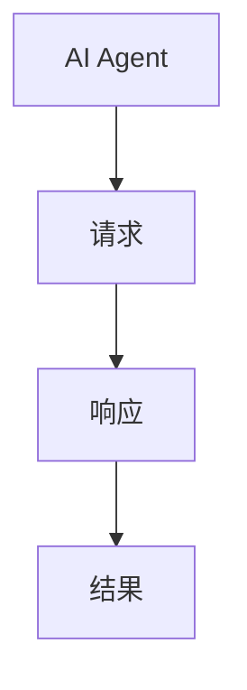
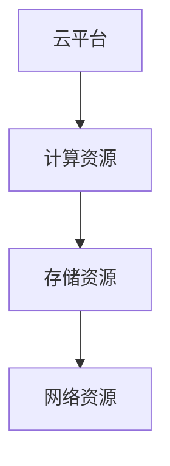
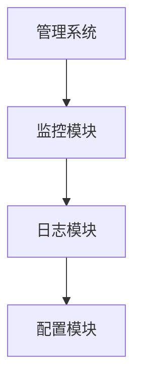
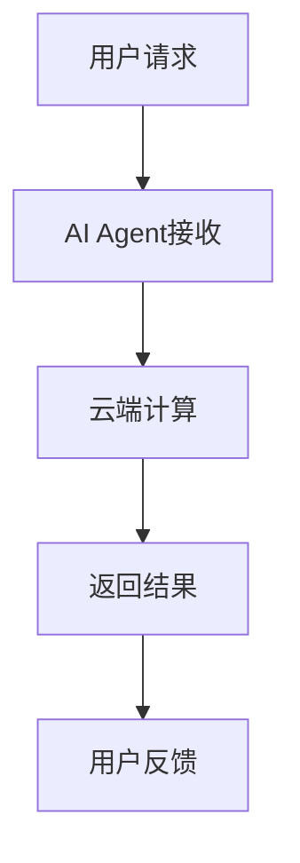
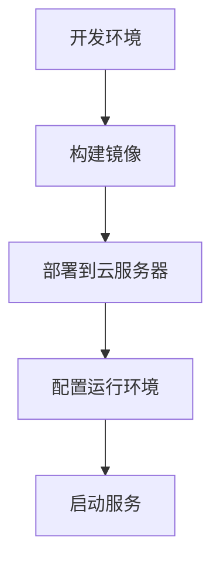
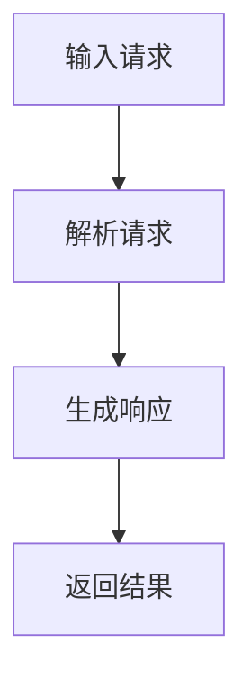
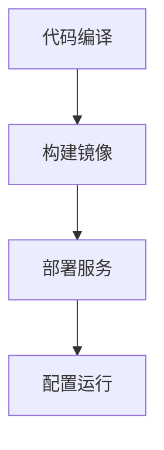

                 


# 企业AI Agent的云端部署与管理

## 关键词：企业AI Agent，云端部署，人工智能，系统架构，项目实战

## 摘要：本文详细探讨了企业AI Agent的云端部署与管理，从背景、核心概念、算法原理到系统架构、项目实战和最佳实践等方面进行了全面分析。文章内容丰富，逻辑清晰，结合实际案例，为读者提供了深入的技术指导。

---

# 第一部分: 企业AI Agent的背景与概念

## 第1章: 企业AI Agent的背景与概念

### 1.1 问题背景
#### 1.1.1 企业智能化转型的需求
随着人工智能技术的快速发展，企业智能化转型已成为必然趋势。AI Agent（智能代理）作为企业智能化的重要组成部分，能够帮助企业实现自动化决策、智能交互和高效管理。

#### 1.1.2 AI Agent在企业中的作用
AI Agent能够处理复杂的业务逻辑，提供智能化的解决方案，提升企业的运营效率和客户体验。例如，在客服系统中，AI Agent可以自动响应客户问题，实现24/7的高效服务。

#### 1.1.3 云端部署的必要性
AI Agent的高性能计算需求和大规模数据处理能力，使得云端部署成为必然选择。通过云平台，企业可以灵活扩展计算资源，降低运维成本。

### 1.2 问题描述
#### 1.2.1 企业AI Agent的核心问题
AI Agent需要处理实时请求、复杂任务调度和大规模数据处理。此外，还需要保证系统的高可用性和安全性。

#### 1.2.2 云端部署的挑战
云端部署涉及复杂的资源管理、网络配置和安全性问题。如何高效利用云资源、降低部署成本是企业面临的重要挑战。

#### 1.2.3 管理与维护的复杂性
AI Agent的管理涉及版本更新、性能监控和故障排查。如何建立高效的管理机制，确保系统的稳定运行，是企业在部署过程中需要解决的关键问题。

### 1.3 问题解决
#### 1.3.1 AI Agent的解决方案
通过结合机器学习、自然语言处理和分布式计算等技术，构建高效的AI Agent系统。同时，利用云平台提供的弹性计算资源，实现灵活的部署和扩展。

#### 1.3.2 云端部署的技术路径
采用容器化技术（如Docker）、微服务架构和自动化部署工具（如Kubernetes），实现AI Agent的高效部署和管理。

#### 1.3.3 管理与优化的方法
建立完善的监控体系，实时跟踪系统性能；制定合理的资源分配策略，优化计算资源利用率；通过日志分析和故障排查，确保系统的稳定运行。

### 1.4 边界与外延
#### 1.4.1 企业AI Agent的边界
AI Agent的边界包括功能范围、数据处理范围和系统交互范围。例如，AI Agent可以处理特定类型的请求，但不涉及企业的核心数据处理。

#### 1.4.2 云端部署的范围
云端部署的范围包括计算资源、存储资源和网络资源的配置与管理。需要明确资源分配策略和成本控制方法。

#### 1.4.3 相关概念的外延
AI Agent与企业其他系统的集成，例如与CRM系统、ERP系统的对接，属于AI Agent的外延部分。

### 1.5 概念结构与核心要素
#### 1.5.1 AI Agent的组成
AI Agent通常由感知层、决策层和执行层组成。感知层负责数据采集和分析，决策层负责策略制定，执行层负责任务执行。

#### 1.5.2 云端部署的核心要素
云端部署的核心要素包括计算资源、存储资源、网络资源和安全资源。需要合理配置这些资源，确保系统的高效运行。

#### 1.5.3 管理系统的功能模块
管理系统包括监控模块、日志模块、配置模块和报警模块。这些模块协同工作，确保系统的稳定运行。

### 1.6 本章小结
本章从企业智能化转型的需求出发，介绍了AI Agent的核心概念、问题背景、解决方法以及系统边界。为后续章节的深入分析奠定了基础。

---

## 第2章: 企业AI Agent的核心概念与联系

### 2.1 核心概念原理
#### 2.1.1 AI Agent的基本原理
AI Agent通过感知环境、分析数据、制定决策并执行任务，实现智能化的业务处理。其核心在于数据的处理能力和算法的优化。

#### 2.1.2 云端部署的技术原理
云端部署利用虚拟化技术、容器化技术和分布式计算技术，实现AI Agent的高效运行和弹性扩展。

#### 2.1.3 管理系统的运行机制
管理系统通过实时监控、资源调度和故障处理，确保AI Agent的稳定运行。其运行机制包括资源分配、状态监控和异常处理。

### 2.2 核心概念属性特征对比
#### 2.2.1 AI Agent的特征对比表
| 特征       | 描述                                         |
|------------|----------------------------------------------|
| 智能性      | 能够理解上下文，提供智能化的解决方案           |
| 实时性      | 能够处理实时请求，提供快速响应                 |
| 可扩展性    | 支持业务规模的扩展，适应企业需求变化           |

#### 2.2.2 云端部署的特征对比表
| 特征       | 描述                                         |
|------------|----------------------------------------------|
| 弹性计算     | 根据负载动态调整计算资源                     |
| 高可用性    | 确保系统在故障发生时仍能提供服务               |
| 成本效益     | 按需付费，降低企业的固定资产投入               |

#### 2.2.3 管理系统的特征对比表
| 特征       | 描述                                         |
|------------|----------------------------------------------|
| 实时监控     | 实时跟踪系统状态，及时发现异常               |
| 自动化处理    | 通过自动化工具实现资源调度和故障修复         |
| 可配置性     | 支持灵活的配置，适应不同的业务需求           |

### 2.3 ER实体关系图
#### 2.3.1 AI Agent的实体关系


#### 2.3.2 云端部署的实体关系


#### 2.3.3 管理系统的实体关系


### 2.4 Mermaid流程图
#### 2.4.1 AI Agent的工作流程


#### 2.4.2 云端部署的流程


### 2.5 本章小结
本章详细分析了企业AI Agent的核心概念和相关实体关系，通过特征对比和流程图，展示了AI Agent、云端部署和管理系统之间的联系。

---

## 第3章: 企业AI Agent的算法原理

### 3.1 算法原理概述
#### 3.1.1 AI Agent的核心算法
AI Agent的核心算法包括自然语言处理（NLP）、机器学习（ML）和强化学习（RL）。这些算法共同实现智能化的业务处理。

#### 3.1.2 云端部署的算法优化
通过分布式计算和并行处理，优化算法的执行效率。例如，利用GPU加速技术提升机器学习模型的训练速度。

#### 3.1.3 管理系统的算法应用
管理系统利用聚类算法、异常检测算法等，实现资源的合理分配和故障的快速定位。

### 3.2 算法流程图
#### 3.2.1 AI Agent的算法流程


#### 3.2.2 云端部署的算法流程


### 3.3 算法数学模型
#### 3.3.1 AI Agent的数学模型
$$f(x) = y$$
其中，$x$表示输入数据，$y$表示输出结果。

#### 3.3.2 云端部署的数学模型
$$g(x) = y$$
其中，$x$表示计算资源，$y$表示系统性能。

### 3.4 算法实现代码
#### 3.4.1 AI Agent的核心代码
```python
def process_request(request):
    # 解析请求
    parsed_request = parse_request(request)
    # 生成响应
    response = generate_response(parsed_request)
    # 返回结果
    return response
```

#### 3.4.2 云端部署的核心代码
```python
def deploy_service(service):
    # 构建镜像
    image = build_image(service)
    # 部署到云服务器
    deploy_to_cloud(image)
    # 配置运行环境
    configure_environment(image)
    # 启动服务
    start_service(image)
```

### 3.5 本章小结
本章通过流程图和代码示例，详细分析了AI Agent和云端部署的核心算法及其数学模型。为后续章节的系统设计和项目实战提供了理论基础。

---

## 第4章: 企业AI Agent的系统架构

### 4.1 系统分析与架构设计方案
#### 4.1.1 问题场景介绍
企业需要部署一个高效的AI Agent系统，支持大规模的并发请求和复杂的任务处理。系统需要具备高可用性、可扩展性和安全性。

#### 4.1.2 项目介绍
本项目旨在构建一个基于云端的AI Agent系统，实现智能化的业务处理和高效的资源管理。

#### 4.1.3 系统功能设计
系统功能设计包括请求处理、任务调度、资源管理、监控与报警等模块。

#### 4.1.4 系统架构设计
采用微服务架构，通过容器化技术和自动化部署工具实现系统的弹性扩展和高可用性。

#### 4.1.5 系统接口设计
系统接口设计包括API接口、消息队列接口和数据库接口。通过这些接口实现系统的高效交互和数据共享。

#### 4.1.6 系统交互设计
系统交互设计包括用户与AI Agent的交互、AI Agent与云平台的交互以及管理系统与各模块的交互。

### 4.2 本章小结
本章通过系统分析和架构设计，明确了AI Agent系统的功能模块和交互流程。为项目的实施提供了清晰的指导。

---

## 第5章: 企业AI Agent的项目实战

### 5.1 项目环境安装
#### 5.1.1 安装开发环境
安装Python、Jupyter Notebook、Docker和Kubernetes等开发工具。

#### 5.1.2 安装云平台
选择合适的云平台（如AWS、Azure或阿里云），并配置相应的资源。

#### 5.1.3 安装依赖库
安装必要的Python库，如TensorFlow、Flask、Docker和Kubernetes-client。

### 5.2 系统核心实现
#### 5.2.1 AI Agent的核心实现
编写AI Agent的主程序，实现请求处理和任务调度功能。

#### 5.2.2 云端部署的实现
编写Dockerfile和部署脚本，实现AI Agent的容器化部署和自动化扩展。

#### 5.2.3 管理系统的实现
编写监控模块、日志模块和报警模块，实现系统的实时监控和异常处理。

### 5.3 代码应用解读与分析
#### 5.3.1 AI Agent的核心代码
```python
def process_request(request):
    # 解析请求
    parsed_request = parse_request(request)
    # 生成响应
    response = generate_response(parsed_request)
    # 返回结果
    return response
```

#### 5.3.2 云端部署的核心代码
```dockerfile
FROM python:3.8

WORKDIR /app

COPY requirements.txt .
RUN pip install --no-cache-dir -r requirements.txt

COPY app/ .

CMD ["gunicorn", "--bind", "0.0.0.0:8080", "--workers", "4", "app.app:app"]
```

### 5.4 实际案例分析
#### 5.4.1 案例背景
某企业希望部署一个客服AI Agent系统，实现客户咨询的自动响应。

#### 5.4.2 案例分析
通过部署AI Agent系统，企业实现了24/7的客户支持，显著提升了客户满意度和运营效率。

### 5.5 本章小结
本章通过项目实战，详细展示了AI Agent的环境搭建、代码实现和案例分析。为读者提供了实际操作的指导。

---

## 第6章: 企业AI Agent的最佳实践

### 6.1 小结
本章总结了企业AI Agent的云端部署与管理的关键点，包括系统的高可用性、可扩展性和安全性。

### 6.2 注意事项
在部署和管理AI Agent系统时，需要注意资源分配的合理性、系统的安全性以及日志的管理。

### 6.3 拓展阅读
推荐阅读相关的技术书籍和论文，深入了解AI Agent的核心算法和系统架构设计。

### 6.4 本章小结
本章通过总结和注意事项，为读者提供了实际部署和管理AI Agent系统的重要指导。

---

## 作者信息

作者：AI天才研究院/AI Genius Institute & 禅与计算机程序设计艺术 /Zen And The Art of Computer Programming

---

以上是《企业AI Agent的云端部署与管理》的技术博客文章的完整目录大纲和部分章节内容。

