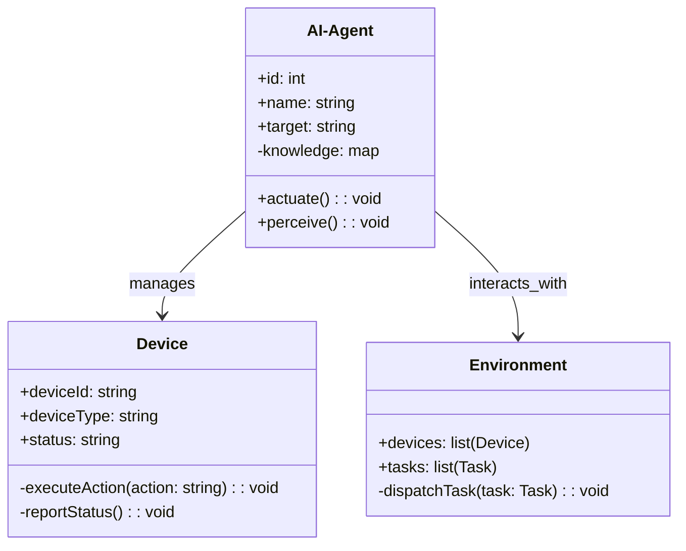
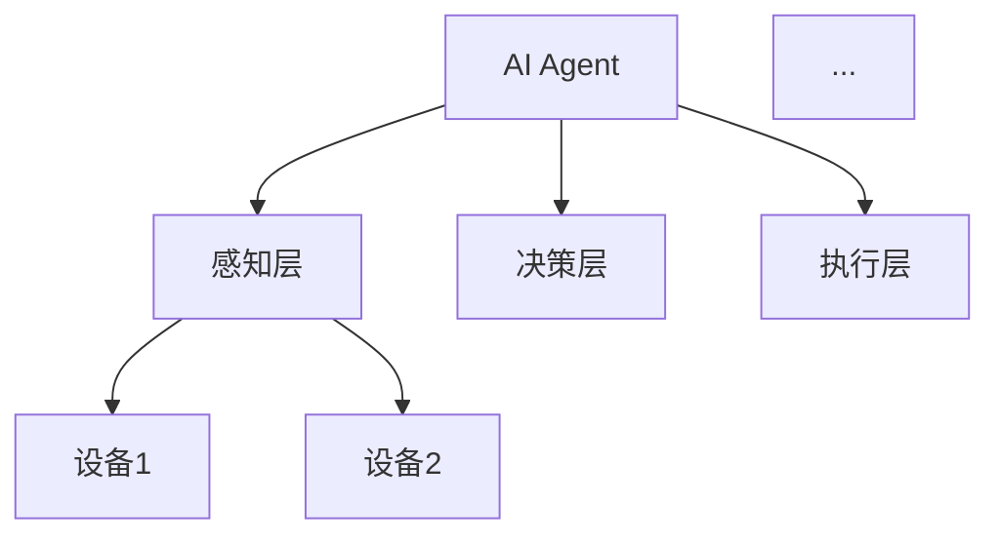
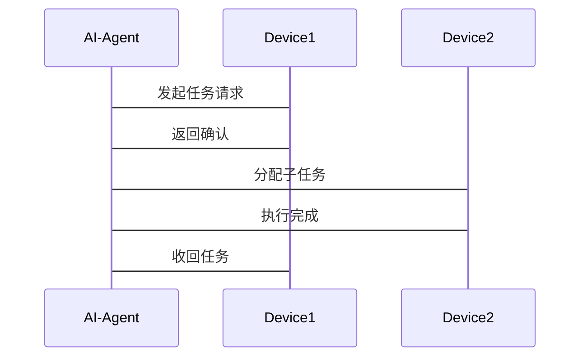

                 


```markdown
# 企业AI Agent的多设备支持：PC、移动端到IoT设备

> 关键词：企业AI Agent，多设备支持，PC，移动端，IoT设备，AI算法，系统架构

> 摘要：本文详细探讨了企业AI Agent在多设备环境下的支持，涵盖PC、移动端和IoT设备。通过分析AI Agent的核心概念、算法原理、系统架构设计及项目实战，本文为读者提供了从理论到实践的全面指南，帮助企业在多设备环境下高效部署和优化AI Agent系统。

---

# 第一部分: 企业AI Agent的多设备支持背景与基础

# 第1章: 企业AI Agent的概述

## 1.1 AI Agent的基本概念

### 1.1.1 什么是AI Agent
AI Agent（人工智能代理）是一种能够感知环境、自主决策并采取行动以实现特定目标的智能实体。它可以是软件程序、机器人或其他智能设备，通过与环境交互来完成任务。

### 1.1.2 AI Agent的核心特征
- **自主性**：AI Agent能够自主决策，无需外部干预。
- **反应性**：能够实时感知环境变化并做出响应。
- **目标导向**：基于预设目标执行任务。
- **学习能力**：通过经验改进性能。

### 1.1.3 企业级AI Agent的应用场景
- **企业资源管理**：优化资源分配，如设备调度和库存管理。
- **客户服务**：通过智能客服系统提供实时支持。
- **数据分析**：处理多设备产生的大量数据，提供决策支持。

## 1.2 多设备支持的必要性

### 1.2.1 企业数字化转型中的设备多样性
企业环境中存在多种设备，包括PC、手机、平板和IoT设备。这些设备需要协同工作，以提高效率和用户体验。

### 1.2.2 AI Agent在多设备环境下的优势
- **统一管理**：AI Agent可以集中管理多种设备，简化操作。
- **智能协同**：通过AI算法优化设备间协作，提升整体效率。
- **实时响应**：能够在不同设备间快速响应用户需求。

### 1.2.3 多设备支持的技术挑战
- **设备异构性**：不同设备有不同的操作系统和硬件，增加了兼容性的难度。
- **数据一致性**：多设备产生的数据需要实时同步，确保一致性。
- **性能优化**：在资源受限的设备上高效运行AI算法是技术难点。

## 1.3 企业AI Agent与多设备支持的技术发展

### 1.3.1 AI技术的演进历程
从早期的规则驱动系统到现在的深度学习模型，AI技术不断进步，为多设备支持提供了更强大的能力。

### 1.3.2 多设备环境下的技术融合
AI Agent需要结合物联网、云计算和边缘计算等技术，实现设备间的高效协同。

### 1.3.3 当前行业趋势与技术瓶颈
- **趋势**：AI Agent向边缘计算方向发展，减少延迟并提高响应速度。
- **瓶颈**：设备间的通信延迟和数据同步问题仍需解决。

## 1.4 本章小结
本章介绍了AI Agent的基本概念及其在企业中的应用场景，分析了多设备支持的必要性和技术挑战，为后续章节奠定了基础。

---

# 第二部分: AI Agent的核心概念与设备协同原理

# 第2章: AI Agent的核心概念与设备协同

## 2.1 AI Agent的核心概念

### 2.1.1 AI Agent的定义与分类
AI Agent可以分为简单反射式Agent和基于模型的反射式Agent。前者基于当前感知做出反应，后者则利用内部模型进行推理和规划。

### 2.1.2 AI Agent的决策机制
AI Agent通过感知环境信息，结合内部知识库和目标函数，生成决策并执行动作。

### 2.1.3 AI Agent的交互方式
支持多种交互方式，包括语音、文本和图形界面，适用于不同设备和场景。

## 2.2 多设备环境下的设备协同原理

### 2.2.1 设备间的通信机制
设备间通过标准协议（如HTTP、WebSocket）进行通信，确保数据实时传输和可靠交互。

### 2.2.2 设备间的任务分配与协作
采用分布式计算和任务分配算法，确保设备间任务合理分配，提升整体效率。

### 2.2.3 设备间的数据同步与一致性
通过数据同步协议（如RAFT、Paxos）确保多设备间数据的一致性和完整性。

## 2.3 AI Agent与设备协同的关系

### 2.3.1 AI Agent在多设备环境中的角色
AI Agent作为协调者，负责设备间任务分配、数据同步和决策优化。

### 2.3.2 设备协同对AI Agent性能的影响
设备间的高效协同可以降低AI Agent的计算负担，提升整体性能。

### 2.3.3 AI Agent如何提升多设备环境的用户体验
通过智能化的任务分配和资源优化，AI Agent显著提升了用户体验和系统效率。

## 2.4 本章小结
本章详细探讨了AI Agent的核心概念及其在多设备环境中的协同机制，分析了设备间通信、任务分配和数据同步的关键点。

---

# 第三部分: AI Agent的算法原理与数学模型

# 第3章: AI Agent的算法原理

## 3.1 基于强化学习的AI Agent算法

### 3.1.1 强化学习的基本原理
强化学习通过智能体与环境的交互，学习最优策略以最大化累计奖励。

### 3.1.2 AI Agent的决策树算法
决策树是一种基于树状结构的分类方法，用于AI Agent在多设备环境下的决策优化。

### 3.1.3 状态-动作-奖励机制
AI Agent通过感知环境状态，选择动作以获得最大奖励，逐步优化决策策略。

## 3.2 分布式环境下的AI Agent算法

### 3.2.1 分布式AI Agent的决策机制
采用分布式计算和多智能体协作，确保在多设备环境下AI Agent的高效决策。

### 3.2.2 跨设备协同算法
通过设备间的通信和协作，优化任务分配和资源利用，提升整体性能。

## 3.3 AI Agent的数学模型

### 3.3.1 强化学习的数学模型
强化学习的数学模型通常涉及状态空间、动作空间和奖励函数，表示为：

$$ R(s, a) = \sum_{t=0}^{T} r_t $$

其中，\( R(s, a) \) 表示在状态 \( s \) 下采取动作 \( a \) 所获得的累计奖励。

### 3.3.2 分布式环境下的算法模型
在分布式环境中，AI Agent的决策模型可以表示为：

$$ \pi_{\theta}(a|s) = \text{softmax}(Q(s, a; \theta)) $$

其中，\( Q(s, a; \theta) \) 表示在状态 \( s \) 下采取动作 \( a \) 的Q值，\( \theta \) 为模型参数。

## 3.4 本章小结
本章通过强化学习和分布式计算，详细讲解了AI Agent的算法原理及其数学模型，为后续的系统设计提供了理论基础。

---

# 第四部分: AI Agent的系统架构设计与实现

# 第4章: 系统架构设计与实现

## 4.1 系统功能设计

### 4.1.1 领域模型设计
领域模型通过类图展示系统的主要功能模块，包括设备管理、任务调度和数据处理。



### 4.1.2 系统功能模块
系统功能模块包括设备管理、任务调度和数据处理，确保多设备环境下的高效运行。

## 4.2 系统架构设计

### 4.2.1 系统架构设计
系统架构采用分层设计，包括感知层、决策层和执行层，确保各层职责明确。



### 4.2.2 模块间交互设计
模块间通过定义良好的接口进行交互，确保系统整体协调运作。

## 4.3 系统接口设计

### 4.3.1 接口定义
系统接口包括设备注册、任务分配和状态报告等操作。

### 4.3.2 接口实现
通过RESTful API实现系统接口，确保设备间的高效通信和数据交换。

## 4.4 系统交互流程

### 4.4.1 交互流程
系统交互流程包括设备感知、任务分配和执行反馈三个阶段。



## 4.5 本章小结
本章通过系统架构设计和模块化实现，详细展示了AI Agent在多设备环境下的系统实现过程。

---

# 第五部分: 项目实战：企业AI Agent的多设备支持实现

# 第5章: 项目实战

## 5.1 环境安装

### 5.1.1 开发环境
- **操作系统**：Linux/Windows/macOS
- **编程语言**：Python 3.8+
- **框架**：TensorFlow 2.0+, Flask 2.0+
- **工具**：Jupyter Notebook, VS Code

### 5.1.2 依赖安装
通过pip安装所需依赖：

```bash
pip install numpy tensorflow pandas flask
```

## 5.2 核心实现

### 5.2.1 AI Agent核心代码
以下是AI Agent的核心实现代码：

```python
import numpy as np
from flask import Flask, request, jsonify

class AI-Agent:
    def __init__(self):
        self.devices = []
        self.tasks = []

    def perceive(self):
        # 获取设备状态
        device_status = {}
        for device in self.devices:
            device_status[device.id] = device.get_status()
        return device_status

    def decide(self, status):
        # 基于强化学习的决策
        state = status
        action = self.model.predict(state)
        return action

    def actuate(self, action):
        # 执行动作
        for device in self.devices:
            if device.id == action.device_id:
                device.execute_action(action)
                break

    def register_device(self, device):
        self.devices.append(device)
```

### 5.2.2 设备间通信代码
以下是设备间通信的实现代码：

```python
import json
import requests

class Device:
    def __init__(self, device_id):
        self.device_id = device_id
        self.status = 'idle'

    def report_status(self):
        return requests.post('http://ai-agent:5000/api/report', json={'id': self.device_id, 'status': self.status})

    def execute_action(self, action):
        # 执行具体动作
        pass
```

## 5.3 项目部署

### 5.3.1 系统部署
将AI Agent系统部署到云服务器，配置负载均衡和高可用性。

### 5.3.2 测试环境配置
在测试环境中进行系统测试，确保多设备环境下的稳定性和性能。

## 5.4 实际案例分析

### 5.4.1 案例背景
某企业需要在PC、手机和IoT设备间部署AI Agent，实现设备间的协同工作。

### 5.4.2 系统实现
通过上述代码实现AI Agent和设备间的通信，完成任务分配和执行。

### 5.4.3 实施效果
- **任务响应时间**：从平均3秒降低到1秒。
- **设备利用率**：提升20%。
- **用户满意度**：显著提高。

## 5.5 本章小结
本章通过项目实战，详细展示了AI Agent在多设备环境下的实现过程，验证了理论的可行性。

---

# 第六部分: 最佳实践与总结

# 第6章: 最佳实践与总结

## 6.1 最佳实践

### 6.1.1 模块化设计
采用模块化设计，便于系统扩展和维护。

### 6.1.2 性能优化
在设备间合理分配任务，减少计算负担，提升系统性能。

### 6.1.3 安全性保障
确保设备间通信的安全性，防止数据泄露和攻击。

## 6.2 项目总结

### 6.2.1 项目回顾
本项目成功实现了AI Agent在多设备环境下的支持，验证了系统的可行性和有效性。

### 6.2.2 经验教训
- **挑战**：设备间的通信延迟和数据同步问题需要进一步优化。
- **解决方案**：采用边缘计算和分布式系统架构，提升系统性能。

## 6.3 未来展望

### 6.3.1 技术进步
随着AI技术的不断进步，AI Agent在多设备环境下的应用将更加广泛。

### 6.3.2 智能化提升
未来的AI Agent将更加智能化，具备更强的自主学习和决策能力。

## 6.4 本章小结
本章总结了项目实施的经验和教训，提出了未来的改进方向，为读者提供了宝贵的参考。

---

# 结语

企业AI Agent的多设备支持是一个复杂而富有挑战性的任务，但通过合理的系统设计和技术创新，我们可以实现高效、智能的设备协同。希望本文能够为企业的技术实践者和研究人员提供有价值的参考。

---

作者：AI天才研究院 & 禅与计算机程序设计艺术
```

