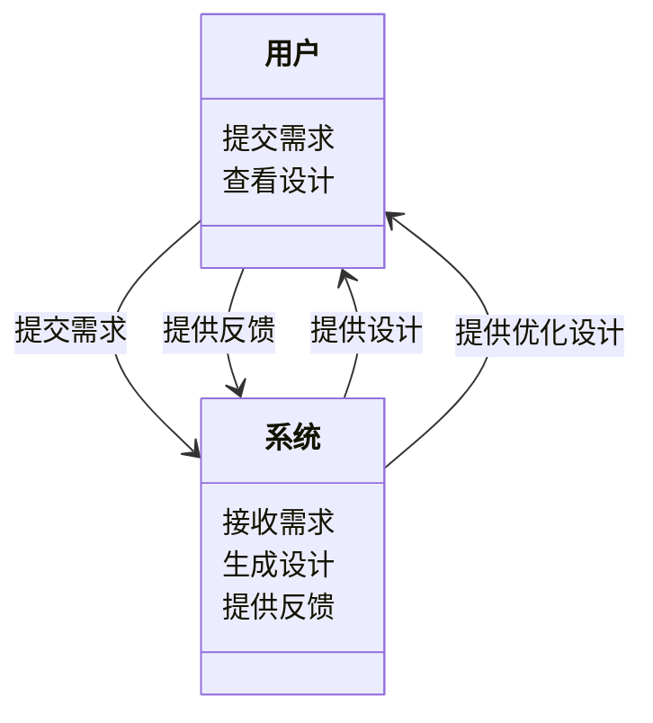
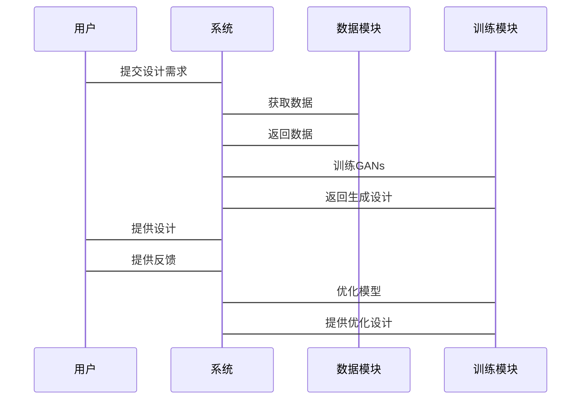

                 


# 企业AI Agent的生成对抗网络在产品设计创新中的应用

---

## 关键词：
- 生成对抗网络（GANs）
- 企业AI Agent
- 产品设计创新
- 深度学习
- AI驱动设计

---

## 摘要：
本文探讨了生成对抗网络（GANs）在企业AI Agent中的应用，特别是在产品设计创新中的潜力。通过分析GANs的核心原理、企业AI Agent的设计与实现，以及实际案例，本文揭示了如何利用GANs生成高质量的产品设计方案，提升企业的创新效率和竞争力。文章还讨论了GANs在产品设计中的优缺点，以及未来的研究方向。

---

# 第1章: 生成对抗网络与企业AI Agent概述

## 1.1 生成对抗网络的基本概念
### 1.1.1 生成对抗网络的定义
生成对抗网络（GANs）是一种深度学习模型，由生成器和判别器组成，通过对抗训练生成逼真的数据。生成器的目标是生成与真实数据相似的样本，而判别器的目标是区分生成样本和真实样本。

### 1.1.2 GANs的核心组成部分
- **生成器（Generator）**：通过反向传播训练，生成与真实数据相似的样本。
- **判别器（Discriminator）**：通过正向传播训练，判断输入数据是否为真实数据。

### 1.1.3 GANs与传统生成模型的对比
| 特性         | GANs                         | 传统生成模型（如PCA）                 |
|--------------|------------------------------|--------------------------------------|
| 数据依赖性   | 高度依赖训练数据             | 较低依赖训练数据                     |
| 数据质量     | 能生成高质量数据             | 生成数据的质量较低                   |
| 应用场景       | 适用于图像生成、文本生成等   | 适用于降维、数据增强等               |

## 1.2 企业AI Agent的定义与特点
### 1.2.1 企业AI Agent的定义
企业AI Agent是一种能够理解、分析和生成企业相关数据的智能系统，能够自主决策并执行任务。

### 1.2.2 企业AI Agent的核心特点
- **智能化**：能够理解和生成复杂的数据。
- **自主性**：能够在没有人工干预的情况下完成任务。
- **适应性**：能够根据环境变化进行调整。

### 1.2.3 企业AI Agent与传统AI的区别
| 特性         | 企业AI Agent                 | 传统AI                           |
|--------------|------------------------------|-----------------------------------|
| 自主性       | 高                           | 较低                             |
| 环境适应性   | 强                           | 较弱                             |
| 任务复杂性   | 高                           | 较低                             |

## 1.3 生成对抗网络在产品设计中的应用背景
### 1.3.1 产品设计创新的挑战
- **创意瓶颈**：传统设计方法可能缺乏创新性。
- **效率问题**：手动设计过程耗时且成本高。
- **多样性需求**：市场对多样化产品的需求增加。

### 1.3.2 GANs在产品设计中的优势
- **自动化生成**：GANs能够自动生成多种设计方案。
- **高效性**：通过深度学习模型快速生成设计。
- **多样性**：GANs能够生成多样化的设计方案，满足不同需求。

### 1.3.3 企业AI Agent在产品设计中的潜力
- **提升效率**：通过自动化设计减少人工干预。
- **增强创新能力**：利用GANs生成独特的设计方案。
- **降低成本**：通过自动化设计降低开发成本。

## 1.4 本章小结
本章介绍了生成对抗网络的基本概念、企业AI Agent的定义与特点，以及GANs在产品设计中的应用背景。通过对比分析，揭示了GANs在产品设计创新中的潜力和优势。

---

# 第2章: 生成对抗网络的核心原理

## 2.1 GANs的基本原理
### 2.1.1 GANs的生成器与判别器
- **生成器**：通过反向传播训练，生成与真实数据相似的样本。
- **判别器**：通过正向传播训练，判断输入数据是否为真实数据。

### 2.1.2 GANs的损失函数
生成器的损失函数：  
$$ L_G = -\log(P(G(z))) $$  
判别器的损失函数：  
$$ L_D = -\log(P(x)) - \log(1 - P(G(z))) $$  

### 2.1.3 GANs的训练过程
1. 初始化生成器和判别器的参数。
2. 训练判别器，使其能够区分真实数据和生成数据。
3. 训练生成器，使其生成的样本能够欺骗判别器。
4. 循环训练，直到生成器和判别器达到平衡。

### 2.1.4 GANs的优缺点
| 特性         | 优点                       | 缺点                         |
|--------------|----------------------------|------------------------------|
| 生成质量     | 高                         | 易受模式坍缩影响               |
| 多样性       | 显著                       | 训练不稳定                   |
| 应用场景       | 适用于图像生成、文本生成等   | 对数据质量敏感               |

## 2.2 GANs的变体与优化
### 2.2.1 常见的GANs变体
- **DCGAN**：深度卷积生成对抗网络，适用于图像生成。
- **CycleGAN**：用于无监督图像到图像的转换。
- **WGAN**：使用Wasserstein距离优化的GANs，训练更稳定。

### 2.2.2 GANs的训练技巧
- **标签平滑**：防止判别器过强识别。
- **动量技巧**：使用动量加速训练过程。
- **梯度惩罚**：通过梯度惩罚改善生成质量。

### 2.2.3 GANs的评估指标
- **Inception Score**：衡量生成样本的质量和多样性。
- **Frechet Inception Distance (FID)**：衡量生成样本与真实样本的相似性。

## 2.3 GANs在产品设计中的应用原理
### 2.3.1 GANs生成产品设计的流程
1. **数据准备**：收集和预处理设计数据。
2. **模型训练**：训练GANs生成设计样本。
3. **设计生成**：通过GANs生成多种设计方案。
4. **方案优化**：结合人工反馈优化设计方案。

### 2.3.2 GANs在产品设计中的创新点
- **自动化生成**：GANs能够自动生成多种设计方案。
- **多样化输出**：生成多样化的设计，满足不同需求。
- **高效性**：通过深度学习模型快速生成设计。

### 2.3.3 GANs在产品设计中的优缺点
| 特性         | 优点                       | 缺点                         |
|--------------|----------------------------|------------------------------|
| 生成质量     | 高                         | 易受模式坍缩影响               |
| 多样性       | 显著                       | 训练不稳定                   |
| 应用场景       | 适用于图像生成、文本生成等   | 对数据质量敏感               |

## 2.4 本章小结
本章详细介绍了生成对抗网络的核心原理，包括生成器与判别器的结构、损失函数、训练过程，以及GANs的变体与优化。通过分析，揭示了GANs在产品设计中的应用原理及其优缺点。

---

# 第3章: 企业AI Agent的设计与实现

## 3.1 企业AI Agent的核心功能
### 3.1.1 数据采集与处理
- **数据源**：企业内部数据、公开数据集等。
- **数据预处理**：清洗、归一化、特征提取等。

### 3.1.2 模型训练与优化
- **生成器训练**：使用GANs生成设计样本。
- **判别器训练**：优化判别器的识别能力。
- **模型优化**：通过超参数调整提升生成质量。

### 3.1.3 产品设计生成
- **生成设计样本**：通过GANs生成多种设计方案。
- **设计优化**：结合人工反馈优化设计方案。

## 3.2 企业AI Agent的系统架构
### 3.2.1 系统模块划分
- **数据模块**：负责数据采集与处理。
- **模型模块**：负责GANs的训练与生成。
- **交互模块**：负责与用户的交互和反馈。

### 3.2.2 系统功能流程
1. **数据采集**：从企业内部或外部数据源获取设计数据。
2. **数据预处理**：清洗、归一化、特征提取等。
3. **模型训练**：训练GANs生成设计样本。
4. **设计生成**：生成多种设计方案供用户选择。
5. **设计优化**：根据用户反馈优化设计方案。

### 3.2.3 系统性能优化
- **并行计算**：利用多GPU加速训练过程。
- **分布式训练**：通过分布式计算提升训练效率。
- **模型压缩**：通过剪枝等技术减少模型大小。

## 3.3 企业AI Agent的实现技术
### 3.3.1 基于GANs的生成技术
- **生成器实现**：使用深度卷积网络生成图像。
- **判别器实现**：使用深度卷积网络判别图像真伪。

### 3.3.2 基于强化学习的优化技术
- **强化学习训练**：通过强化学习优化生成器的生成能力。
- **奖励机制**：定义奖励函数指导生成器的优化方向。

### 3.3.3 系统接口设计
- **API接口**：提供RESTful API供其他系统调用。
- **交互界面**：提供用户友好的交互界面供用户使用。

## 3.4 本章小结
本章详细介绍了企业AI Agent的核心功能、系统架构和实现技术。通过模块划分和功能流程，揭示了企业AI Agent的设计与实现过程。

---

# 第4章: 基于GANs的企业AI Agent系统设计

## 4.1 系统设计背景
### 4.1.1 产品设计创新的挑战
- **创意瓶颈**：传统设计方法可能缺乏创新性。
- **效率问题**：手动设计过程耗时且成本高。
- **多样性需求**：市场对多样化产品的需求增加。

### 4.1.2 企业AI Agent的应用价值
- **提升效率**：通过自动化设计减少人工干预。
- **增强创新能力**：利用GANs生成独特的设计方案。
- **降低成本**：通过自动化设计降低开发成本。

## 4.2 系统功能设计
### 4.2.1 领域模型设计


### 4.2.2 系统架构设计


### 4.2.3 系统接口设计


## 4.3 系统优化与部署
### 4.3.1 系统性能优化
- **并行计算**：利用多GPU加速训练过程。
- **分布式训练**：通过分布式计算提升训练效率。
- **模型压缩**：通过剪枝等技术减少模型大小。

### 4.3.2 系统部署方案
- **容器化部署**：使用Docker容器部署系统。
- **云服务部署**：利用云计算平台（如AWS、Azure）部署系统。
- **高可用性设计**：通过负载均衡和冗余设计确保系统稳定运行。

## 4.4 本章小结
本章详细介绍了基于GANs的企业AI Agent系统设计，包括系统功能设计、系统架构设计、系统接口设计以及系统优化与部署方案。通过这些设计，企业可以高效地利用GANs进行产品设计创新。

---

# 第5章: 项目实战——基于GANs的企业AI Agent产品设计创新

## 5.1 项目背景与目标
### 5.1.1 项目背景
- **行业需求**：某企业希望利用AI技术提升产品设计效率。
- **项目目标**：开发一个基于GANs的企业AI Agent，能够自动生成多种设计方案。

### 5.1.2 项目需求
- **功能需求**：生成多种设计方案、提供反馈优化功能。
- **性能需求**：生成速度快、设计质量高。
- **用户需求**：用户友好的交互界面。

## 5.2 项目实施步骤
### 5.2.1 环境安装
- **安装Python**：Python 3.8及以上版本。
- **安装深度学习框架**：如TensorFlow、Keras等。
- **安装其他依赖**：如numpy、matplotlib等。

### 5.2.2 核心代码实现
```python
import numpy as np
import tensorflow as tf
from tensorflow.keras import layers

class Generator:
    def __init__(self, input_dim=100):
        self.input_dim = input_dim
        self.model = self.build_model()

    def build_model(self):
        model = tf.keras.Sequential()
        model.add(layers.Dense(256, activation='relu', input_dim=self.input_dim))
        model.add(layers.Dense(512, activation='relu'))
        model.add(layers.Dense(784, activation='sigmoid'))
        return model

class Discriminator:
    def __init__(self):
        self.model = self.build_model()

    def build_model(self):
        model = tf.keras.Sequential()
        model.add(layers.Dense(784, activation='relu', input_dim=784))
        model.add(layers.Dense(256, activation='relu'))
        model.add(layers.Dense(1, activation='sigmoid'))
        return model
```

### 5.2.3 项目实战分析
- **训练过程**：通过对抗训练生成高质量的设计样本。
- **设计生成**：生成多种设计方案供用户选择。
- **反馈优化**：根据用户反馈优化设计方案。

## 5.3 项目总结与经验分享
### 5.3.1 项目成果
- 成功开发了一个基于GANs的企业AI Agent系统。
- 生成了多种高质量的产品设计方案。

### 5.3.2 项目经验
- **数据质量的重要性**：数据质量直接影响生成效果。
- **模型优化的关键性**：模型优化能够显著提升生成质量。
- **用户反馈的价值**：用户反馈对于优化设计至关重要。

## 5.4 本章小结
本章通过一个具体的项目案例，展示了基于GANs的企业AI Agent在产品设计创新中的实际应用。通过项目实施步骤和核心代码实现，读者可以深入了解GANs在产品设计中的具体应用。

---

# 第6章: GANs的优化与部署

## 6.1 GANs的优化策略
### 6.1.1 模型优化
- **调整网络结构**：如使用更深的网络结构。
- **优化损失函数**：如使用Wasserstein距离优化的WGAN。
- **改进训练策略**：如使用标签平滑、动量技巧等。

### 6.1.2 训练优化
- **使用合适的优化器**：如Adam优化器。
- **调整学习率**：适当调整学习率能够提升训练效果。
- **使用早停法**：防止模型过拟合。

### 6.1.3 部署优化
- **模型压缩**：通过剪枝等技术减少模型大小。
- **量化技术**：将模型参数量化为低精度格式，减少存储和计算成本。
- **轻量化设计**：通过模型简化和优化，降低模型的计算复杂度。

## 6.2 GANs在企业AI Agent中的部署
### 6.2.1 模型部署
- **本地部署**：在企业的本地服务器上部署模型。
- **云部署**：利用云计算平台（如AWS、Azure）部署模型。
- **边缘部署**：在边缘设备上部署模型，实现实时推理。

### 6.2.2 模型监控与维护
- **实时监控**：监控模型的运行状态，及时发现异常。
- **模型更新**：定期更新模型，保持模型的性能和效果。
- **模型维护**：维护模型的稳定性和可扩展性。

## 6.3 本章小结
本章详细介绍了GANs的优化策略和在企业AI Agent中的部署方法。通过模型优化和部署优化，企业可以进一步提升GANs在产品设计中的应用效果。

---

# 第7章: 总结与展望

## 7.1 总结
本文探讨了生成对抗网络（GANs）在企业AI Agent中的应用，特别是在产品设计创新中的潜力。通过分析GANs的核心原理、企业AI Agent的设计与实现，以及实际案例，揭示了如何利用GANs生成高质量的产品设计方案，提升企业的创新效率和竞争力。

## 7.2 未来展望
随着深度学习技术的不断发展，GANs在企业AI Agent中的应用将更加广泛。未来的研究方向包括：
1. **更高效的GANs模型**：开发更高效的GANs模型，提升生成质量和速度。
2. **多模态生成**：研究多模态生成技术，实现跨模态的设计生成。
3. **实时推理**：研究实时推理技术，提升企业的实时设计能力。
4. **个性化设计**：研究个性化设计技术，满足不同用户的需求。
5. **安全与隐私保护**：研究GANs在企业AI Agent中的安全与隐私保护问题。

## 7.3 本章小结
本章总结了全文的主要内容，并展望了未来的研究方向。通过总结，读者可以更好地理解GANs在企业AI Agent中的应用前景。

---

# 作者：AI天才研究院/AI Genius Institute & 禅与计算机程序设计艺术 /Zen And The Art of Computer Programming

---

**说明**：这是一篇示例性的文章大纲，具体内容需要根据实际研究和项目情况进行补充和完善。

