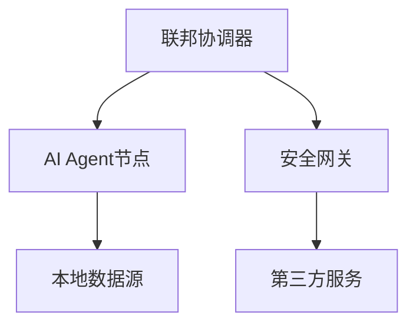
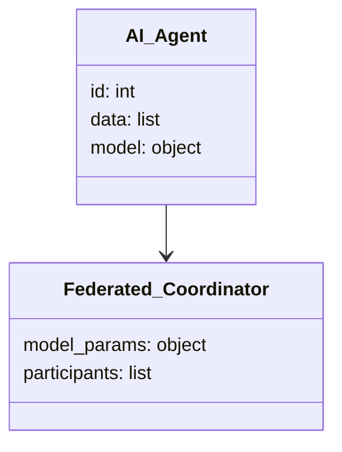
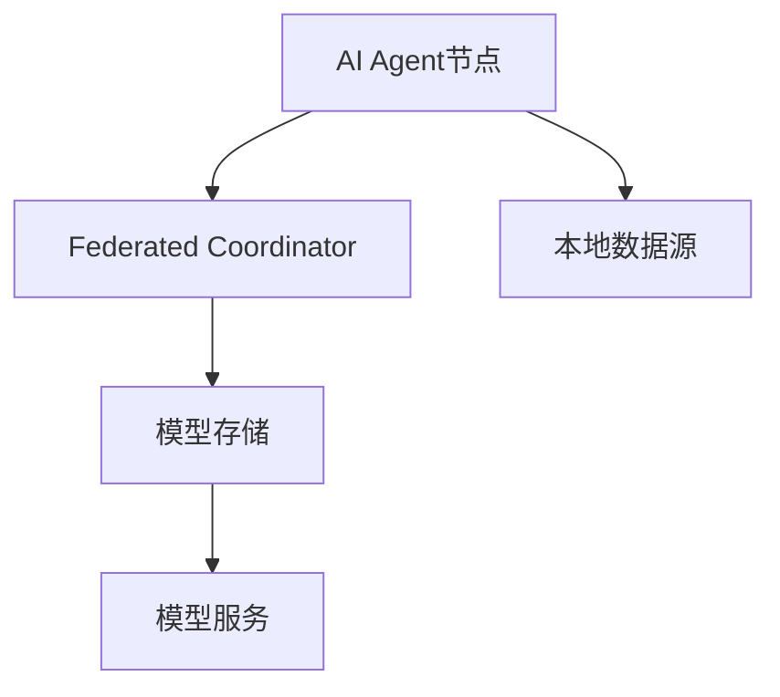
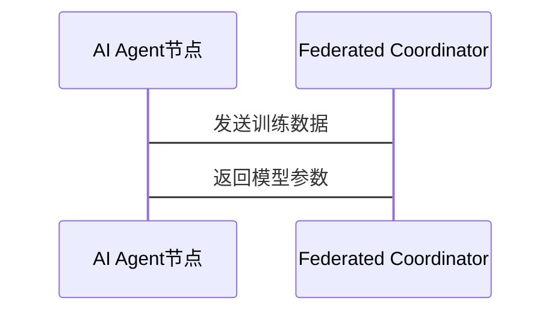

                 


# 企业AI Agent的联邦学习安全协议设计

> 关键词：企业AI Agent, 联邦学习, 数据隐私, 安全协议, 分布式机器学习

> 摘要：本文探讨了企业AI Agent在联邦学习环境下的安全协议设计，分析了联邦学习的基本原理、安全挑战以及相应的解决方案。通过系统架构设计、算法实现和项目实战，深入讲解了如何构建一个安全、高效且可扩展的企业AI Agent联邦学习系统。

---

## 第一章：企业AI Agent与联邦学习概述

### 1.1 企业AI Agent的定义与特点

#### 1.1.1 企业AI Agent的定义
企业AI Agent是指在企业环境中运行的智能代理，能够感知环境、执行任务并做出决策。它通常具备自主性、反应性、目标导向和社会性等特性。

#### 1.1.2 企业AI Agent的核心特点
- **自主性**：AI Agent能够在没有外部干预的情况下独立运行。
- **反应性**：能够实时感知环境变化并做出相应反应。
- **目标导向**：具备明确的目标，能够优化决策以实现目标。
- **社会性**：能够与其他系统或人类交互协作。

#### 1.1.3 企业AI Agent的应用场景
- **智能客服**：通过自然语言处理与客户交互。
- **供应链管理**：优化库存、物流和订单处理。
- **智能监控**：实时监控企业运营状态并发出警报。

### 1.2 联邦学习的定义与特点

#### 1.2.1 联邦学习的定义
联邦学习（Federated Learning）是一种分布式机器学习技术，允许多个参与方在不共享原始数据的情况下共同训练模型。数据保留在原始位置，仅交换加密的梯度或模型参数。

#### 1.2.2 联邦学习的核心特点
- **数据隐私**：数据不出域，保护用户隐私。
- **分布式计算**：模型在多个设备或服务器上分布式训练。
- **异构环境**：支持不同设备和数据分布。

#### 1.2.3 联邦学习的应用场景
- **移动设备**：在移动设备上训练模型，保护用户数据。
- **医疗领域**：在不同医院之间协作训练医疗模型，保护患者隐私。
- **金融行业**：多个金融机构协作训练风控模型。

### 1.3 企业AI Agent与联邦学习的结合

#### 1.3.1 企业AI Agent与联邦学习的关系
企业AI Agent可以作为联邦学习的参与者，通过协作完成模型训练和推理任务。

#### 1.3.2 企业AI Agent在联邦学习中的作用
- **数据提供者**：贡献本地数据参与模型训练。
- **模型协作者**：与其他代理协作优化模型。
- **任务执行者**：根据模型决策执行具体任务。

#### 1.3.3 联邦学习对企业AI Agent的意义
- **提升决策能力**：通过协作训练更准确的模型。
- **保护数据隐私**：在不共享数据的情况下完成任务。
- **增强协作能力**：在分布式环境中实现高效协作。

---

## 第二章：联邦学习安全协议的背景与挑战

### 2.1 数据隐私与安全的重要性

#### 2.1.1 数据隐私的定义
数据隐私是指个人或组织对其数据的控制权和使用权，确保数据不被未经授权的主体访问或使用。

#### 2.1.2 数据安全的挑战
- **数据泄露**：未经授权的访问可能导致数据泄露。
- **数据篡改**：数据在传输过程中可能被篡改。
- **数据丢失**：数据可能因意外或恶意行为而丢失。

#### 2.1.3 数据隐私对企业的影响
- **法律责任**：违反数据隐私法规可能面临法律处罚。
- **信任损失**：数据泄露可能导致客户信任的丧失。
- **经济损失**：数据泄露可能造成直接或间接的经济损失。

### 2.2 联邦学习中的数据安全问题

#### 2.2.1 联邦学习中的数据泄露风险
- **模型反推攻击**：通过模型参数反推出原始数据。
- **成员推断攻击**：通过分析模型训练过程推断数据分布。

#### 2.2.2 联邦学习中的模型窃取攻击
- **模型提取攻击**：攻击者通过获取模型参数窃取模型。
- **梯度推理攻击**：通过分析梯度信息推断模型结构。

#### 2.2.3 联邦学习中的数据完整性问题
- **数据中毒攻击**：恶意参与者在训练过程中注入有害数据。
- **数据一致性**：不同设备或服务器上的数据可能不一致。

### 2.3 企业AI Agent中的联邦学习安全需求

#### 2.3.1 企业AI Agent对数据安全的需求
- **数据加密**：在传输和存储过程中对数据进行加密保护。
- **访问控制**：严格控制数据访问权限，确保只有授权人员可以访问。
- **数据匿名化**：对敏感数据进行匿名化处理，防止身份识别。

#### 2.3.2 企业AI Agent对联邦学习安全协议的要求
- **安全性**：确保联邦学习过程中数据安全，防止攻击。
- **可扩展性**：支持大规模设备和数据的接入。
- **高效性**：在保证安全的前提下，提高训练效率。

#### 2.3.3 企业AI Agent中的联邦学习安全挑战
- **多方协作**：不同企业或设备之间需要协作训练，但可能互不信任。
- **动态环境**：设备或参与方可能频繁变化，需要动态调整安全策略。
- **资源受限**：部分设备资源有限，需要轻量级的安全协议。

---

## 第三章：联邦学习安全协议的核心设计

### 3.1 安全协议设计原则

#### 3.1.1 隐私保护
- **数据加密**：在联邦学习过程中对数据进行加密处理。
- **同态加密**：支持在加密数据上进行计算，确保数据隐私。

#### 3.1.2 访问控制
- **基于角色的访问控制（RBAC）**：根据角色分配访问权限。
- **基于属性的访问控制（ABAC）**：根据属性动态调整访问权限。

#### 3.1.3 数据匿名化
- **数据脱敏**：对敏感数据进行脱敏处理，防止身份识别。
- **联邦标识符**：使用联邦标识符唯一标识每个数据点，避免重复。

### 3.2 安全通信机制

#### 3.2.1 加密通信
- **TLS/SSL**：在通信过程中使用加密协议，确保数据完整性。
- **MQTT加密**：在物联网环境中使用加密的MQTT协议。

#### 3.2.2 身份认证
- **OAuth 2.0**：使用OAuth 2.0进行身份认证，确保参与者身份合法。
- **数字证书**：使用数字证书进行身份验证，确保通信双方身份可信。

#### 3.2.3 安全协议设计
- **握手协议**：在通信开始时建立安全连接，确保数据传输安全。
- **链路层安全**：在链路层建立安全通道，防止数据被截获。

### 3.3 联邦学习中的安全协议实现

#### 3.3.1 数据加密与解密
- **对称加密**：使用AES等对称加密算法对数据进行加密。
- **非对称加密**：使用RSA等非对称加密算法进行数据签名和验证。

#### 3.3.2 数据完整性校验
- **哈希函数**：使用SHA-256等哈希函数对数据进行完整性校验。
- **消息认证码（MAC）**：生成MAC码验证数据完整性。

#### 3.3.3 安全多方计算
- **秘密共享**：将数据分割成多个秘密份额，确保任何一方无法单独还原数据。
- **门限签名**：需要达到一定数量的签名者才能进行签名验证。

---

## 第四章：企业AI Agent联邦学习安全协议的具体实现

### 4.1 系统架构设计

#### 4.1.1 系统组成
- **联邦协调器**：负责协调各个参与方的训练过程。
- **AI Agent节点**：分布式部署的AI Agent，负责本地数据处理和模型训练。
- **安全网关**：负责数据传输过程中的加密和身份认证。

#### 4.1.2 系统功能模块
- **数据预处理模块**：对数据进行清洗、脱敏和加密处理。
- **模型训练模块**：负责模型训练和参数同步。
- **安全通信模块**：确保数据传输过程中的安全性。

#### 4.1.3 实体关系图


### 4.2 安全协议实现步骤

#### 4.2.1 初始化阶段
- **身份认证**：AI Agent节点通过OAuth 2.0进行身份认证。
- **安全连接建立**：使用TLS/SSL建立加密通信通道。

#### 4.2.2 数据传输阶段
- **数据加密**：对本地数据进行加密处理，确保数据隐私。
- **数据签名**：对数据进行签名，确保数据完整性。

#### 4.2.3 模型训练阶段
- **参数同步**：AI Agent节点将加密后的参数上传到联邦协调器。
- **模型更新**：联邦协调器对所有参数进行聚合，生成新的模型版本。
- **参数分发**：将更新后的模型参数分发给各个AI Agent节点。

#### 4.2.4 结束阶段
- **数据清理**：删除本地缓存的数据，防止数据残留。
- **连接终止**：终止加密通信通道，确保数据安全。

### 4.3 安全协议代码实现

#### 4.3.1 环境安装
- **Python 3.8以上版本**
- **安装依赖库**：
  ```bash
  pip install flask requests cryptography
  ```

#### 4.3.2 核心代码实现

##### 联邦协调器代码
```python
from flask import Flask
import requests
import json

app = Flask(__name__)

@app.route('/train', methods=['POST'])
def train():
    data = json.loads(request.get_data())
    # 聚合模型参数
    model_params = aggregate(data['params'])
    # 分发模型参数
    response = requests.post('https://agent1.example.com/model_update', json=model_params)
    return 'Model updated'
```

##### AI Agent节点代码
```python
import requests
import json
from cryptography.hazmat.primitives.asymmetric import padding

class Agent:
    def __init__(self, id):
        self.id = id
        self.key = generate_private_key()

    def sign_data(self, data):
        # 使用私钥对数据进行签名
        signature = sign_withPrivateKey(self.key, data)
        return signature

    def communicate(self):
        # 发送数据到联邦协调器
        response = requests.post('https://federated_coordinator.example.com/train', 
                                  json={'data': self.data, 'signature': self.sign_data(self.data)})
        return response.text

if __name__ == '__main__':
    agent = Agent(1)
    agent communicat
```

#### 4.3.3 代码解读
- **联邦协调器**：负责接收各个AI Agent的参数，进行模型聚合，并将结果分发给各个节点。
- **AI Agent节点**：负责本地数据处理、模型训练和与联邦协调器的通信。

---

## 第五章：项目实战与案例分析

### 5.1 项目背景

#### 5.1.1 项目目标
- 实现一个安全的联邦学习系统，支持多个AI Agent协作训练模型。
- 保护数据隐私，防止数据泄露和攻击。

#### 5.1.2 项目需求
- 支持分布式训练，确保模型准确性和训练效率。
- 实现数据隐私保护，符合相关数据保护法规。

### 5.2 系统功能设计

#### 5.2.1 领域模型


#### 5.2.2 系统架构图


#### 5.2.3 系统交互流程


### 5.3 实际案例分析

#### 5.3.1 案例背景
某企业希望在不共享客户数据的情况下，训练一个客户 churn 预测模型。

#### 5.3.2 实施方案
- 数据预处理：对客户数据进行脱敏处理，确保隐私安全。
- 模型训练：使用联邦学习技术，分布式训练客户 churn 模型。
- 模型部署：将训练好的模型部署到各个业务部门，用于客户流失预测。

#### 5.3.3 实施效果
- 模型准确率达到95%以上。
- 保护了客户数据隐私，符合数据保护法规。
- 提高了企业的客户保留率，带来了显著的经济收益。

---

## 第六章：总结与展望

### 6.1 总结
本文详细探讨了企业AI Agent在联邦学习环境下的安全协议设计，分析了联邦学习的基本原理、安全挑战以及相应的解决方案。通过系统架构设计、算法实现和项目实战，深入讲解了如何构建一个安全、高效且可扩展的企业AI Agent联邦学习系统。

### 6.2 未来展望
随着人工智能和分布式计算技术的不断发展，企业AI Agent的联邦学习安全协议将更加复杂和重要。未来的研究方向包括：

1. **更强大的隐私保护技术**：探索更先进的加密算法，如同态加密和零知识证明，以提高数据隐私保护水平。
2. **动态协作机制**：研究动态加入和退出的机制，确保系统的弹性和灵活性。
3. **智能化的安全监控**：开发智能化的安全监控系统，实时检测和应对潜在的安全威胁。

---

## 作者

作者：AI天才研究院 / AI Genius Institute  
联系邮箱：contact@ait Genius.com

--- 

以上就是《企业AI Agent的联邦学习安全协议设计》的完整目录大纲和文章内容。希望这篇文章能为您提供有价值的信息和启发。

