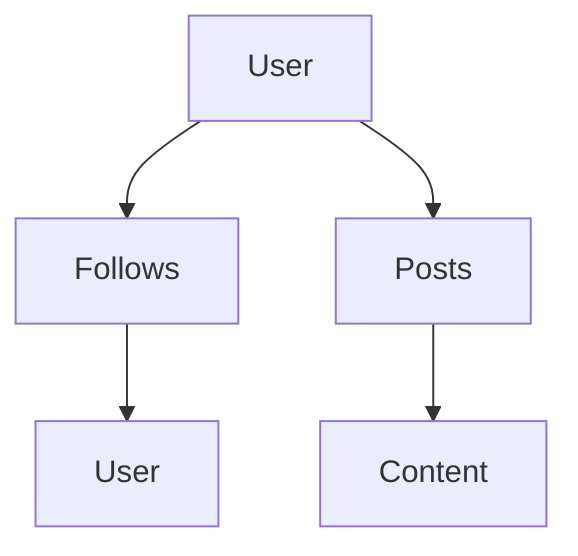
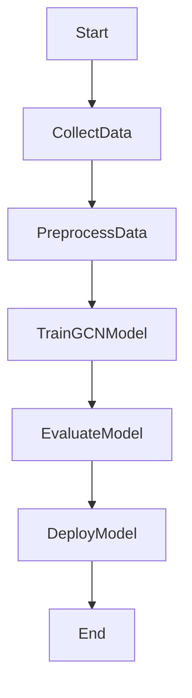
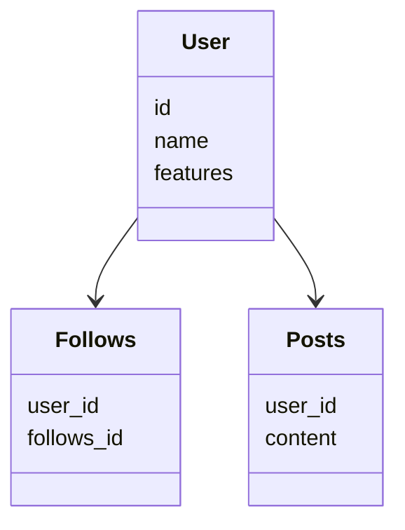
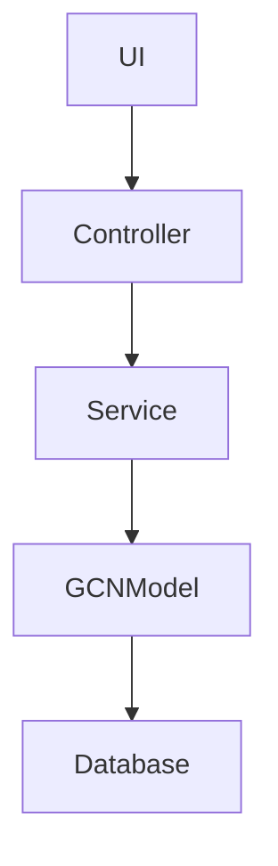
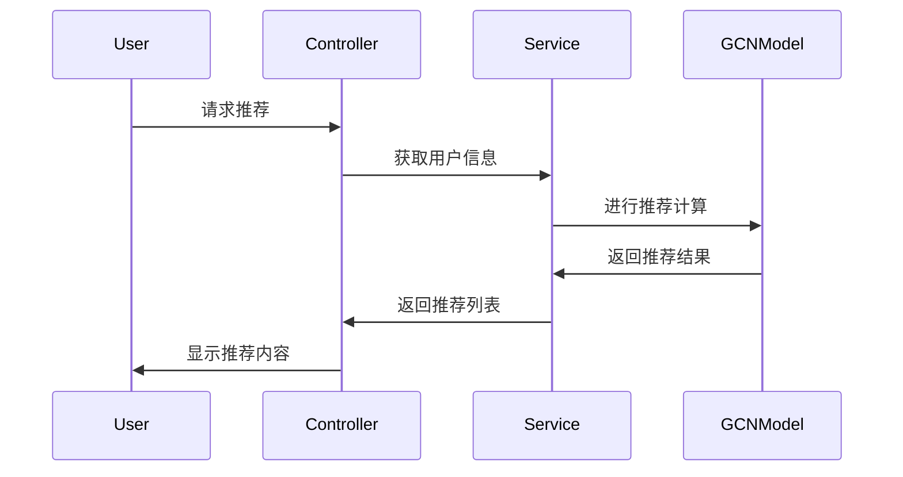

                 


# 基于图卷积网络的AI Agent社交网络分析

> 关键词：图卷积网络，AI Agent，社交网络分析，深度学习，图数据

> 摘要：本文探讨了基于图卷积网络（GCN）的AI Agent在社交网络分析中的应用。通过分析GCN的核心原理、AI Agent的设计与实现，展示了如何利用GCN提升AI Agent在社交网络中的分析能力。文章从背景、核心概念、算法原理、系统设计到实际应用，详细阐述了基于GCN的AI Agent社交网络分析的全过程，最后总结了该技术的优势与未来发展方向。

---

## 第一部分：背景介绍

### 第1章：社交网络分析的背景与问题

#### 1.1 社交网络分析的背景

- **问题背景**：随着社交媒体的普及，社交网络数据呈现爆炸式增长。如何高效地分析和利用这些数据成为一个重要挑战。
- **问题描述**：社交网络分析涉及用户行为、关系建模、影响力传播等多个方面，传统的数据分析方法难以捕捉复杂的网络关系。
- **解决方法**：引入图卷积网络（GCN），通过深度学习方法捕获图结构中的复杂关系，提升社交网络分析的准确性和效率。
- **概念结构**：社交网络分析涉及用户节点、关系边、社区等多个核心要素，GCN能够有效建模这些要素之间的关系。

#### 1.2 AI Agent在社交网络中的应用

- **AI Agent的定义与特点**：AI Agent是一种智能体，能够感知环境、自主决策并执行任务。在社交网络中，AI Agent可以用于用户推荐、信息传播分析等功能。
- **AI Agent在社交网络中的作用**：通过分析社交网络数据，AI Agent能够帮助用户发现潜在关系、预测用户行为，提升用户体验。
- **当前应用案例**：例如，AI Agent可以用于社交网络中的用户推荐系统，通过分析用户的社交关系和行为，提供个性化的内容推荐。

### 第2章：图卷积网络（GCN）基础

#### 2.1 图论基础

- **图的定义与表示**：图由节点和边组成，节点代表实体，边代表实体之间的关系。图可以表示为$G = (V, E)$，其中$V$是节点集合，$E$是边集合。
- **图的属性与特征**：节点的度数、中心性、社区归属等是图的重要属性，这些属性可以通过GCN进行建模和分析。
- **图数据的存储与处理**：图数据可以存储为邻接矩阵或邻接表。邻接矩阵适合小图，邻接表适合大图。

#### 2.2 卷积神经网络基础

- **卷积神经网络的定义与特点**：CNN是一种深度学习模型，常用于图像处理。它通过卷积操作提取图像的局部特征，并通过池化操作降低计算复杂度。
- **卷积神经网络的工作原理**：CNN通过多个卷积层和池化层提取图像的特征，最终通过全连接层进行分类或回归任务。
- **图卷积网络的引入**：GCN是将卷积操作扩展到图数据的一种方法，它利用图的结构信息进行特征传播和聚合。

#### 2.3 图卷积网络的核心概念

- **图卷积的定义与特点**：GCN通过在图的节点之间传播信息，捕获节点之间的关系。与传统卷积不同，GCN处理的是图结构数据。
- **图卷积的数学表示**：GCN的传播规则可以表示为$H^{(l+1)} = \text{ReLU}(A H^{(l)} W^{(l)})$，其中$A$是邻接矩阵，$H^{(l)}$是第$l$层的节点表示，$W^{(l)}$是权重矩阵。
- **图卷积的实现方式**：GCN可以通过矩阵乘法和激活函数实现，常见的实现方式包括基于邻接矩阵的传播和基于拉普拉斯矩阵的传播。

### 第3章：基于图卷积网络的AI Agent设计

#### 3.1 AI Agent的核心模块

- **感知模块**：负责收集和处理环境中的信息。在社交网络中，感知模块可以通过爬取社交数据、解析用户行为等方式获取信息。
- **决策模块**：基于感知模块提供的信息，AI Agent需要做出决策。决策模块可以通过GCN分析社交网络的结构，预测用户行为。
- **执行模块**：负责执行决策模块的指令。在社交网络中，执行模块可以发布内容、与用户互动等。

#### 3.2 图卷积网络在AI Agent中的应用

- **图卷积网络在感知模块中的应用**：感知模块可以通过GCN分析社交网络的结构，提取用户关系和社区信息。
- **图卷积网络在决策模块中的应用**：决策模块可以通过GCN预测用户行为，例如预测用户的兴趣、影响力等。
- **图卷积网络在执行模块中的应用**：执行模块可以通过GCN优化互动策略，例如选择关键用户进行推广。

#### 3.3 基于图卷积网络的AI Agent设计流程

- **需求分析**：明确AI Agent的目标和功能需求，例如用户推荐、信息传播分析等。
- **模块设计**：根据需求设计AI Agent的感知、决策和执行模块，并确定各模块之间的接口。
- **模型实现**：选择合适的GCN模型，进行模型训练和优化，确保模型在社交网络分析中的效果。

---

## 第二部分：核心概念与联系

### 第4章：图卷积网络与AI Agent的关系

#### 4.1 图卷积网络的核心原理

- **图卷积的传播规则**：GCN通过在图的节点之间传播信息，捕获节点之间的关系。传播规则可以表示为$H^{(l+1)} = \text{ReLU}(A H^{(l)} W^{(l)})$。
- **图卷积的计算流程**：GCN的计算流程包括特征聚合、特征传播和非线性变换。特征聚合通过邻接矩阵进行，特征传播通过卷积操作完成，非线性变换通过激活函数实现。
- **图卷积的优化方法**：为了提高GCN的性能，可以采用多种优化方法，例如归一化、Dropout、学习率调整等。

#### 4.2 AI Agent的核心原理

- **AI Agent的感知机制**：通过传感器或其他数据源获取环境信息，并进行预处理和特征提取。
- **AI Agent的决策机制**：基于感知到的信息，结合内部知识库和决策模型，做出决策。
- **AI Agent的执行机制**：根据决策结果，通过执行器与环境交互，执行具体的任务。

#### 4.3 图卷积网络与AI Agent的结合

- **图卷积网络在AI Agent感知中的应用**：通过GCN分析社交网络的结构，提取用户关系和社区信息，帮助AI Agent更好地感知环境。
- **图卷积网络在AI Agent决策中的应用**：通过GCN预测用户行为，例如预测用户的兴趣、影响力等，帮助AI Agent做出更精准的决策。
- **图卷积网络在AI Agent执行中的应用**：通过GCN优化互动策略，例如选择关键用户进行推广，提高传播效率。

### 第5章：核心概念对比与ER图分析

#### 5.1 图卷积网络与传统卷积网络的对比

| 属性       | 图卷积网络（GCN）         | 传统卷积网络（CNN）       |
|------------|--------------------------|--------------------------|
| 数据类型     | 图结构数据               | 图像数据                 |
| 结构处理方式 | 节点间传播信息           | 局部特征提取             |
| 应用场景     | 社交网络分析、推荐系统    | 图像分类、目标检测       |

#### 5.2 ER实体关系图架构



---

## 第三部分：算法原理讲解

### 第6章：基于GCN的AI Agent算法实现

#### 6.1 GCN算法流程



#### 6.2 GCN数学模型

- **邻接矩阵**：$A$ 表示节点之间的关系，$A_{i,j} = 1$ 表示节点$i$和节点$j$之间有边相连，否则为0。
- **特征矩阵**：$X$ 表示节点的初始特征，维度为$n \times d$，其中$n$是节点数，$d$是特征维度。
- **传播规则**：$H^{(l+1)} = \text{ReLU}(A H^{(l)} W^{(l)})$，其中$W^{(l)}$是第$l$层的权重矩阵。

#### 6.3 代码实现

```python
import torch
import torch.nn as nn
import torch.nn.functional as F

class GCN(nn.Module):
    def __init__(self, input_dim, hidden_dim, output_dim):
        super(GCN, self).__init__()
        self.W1 = nn.Parameter(torch.randn(input_dim, hidden_dim))
        self.W2 = nn.Parameter(torch.randn(hidden_dim, output_dim))
    
    def forward(self, A, X):
        H = F.relu(torch.mm(A, torch.mm(X, self.W1)))
        H = torch.mm(A, torch.mm(H, self.W2))
        return H

# 示例用法
input_dim = 10
hidden_dim = 20
output_dim = 5
gcn = GCN(input_dim, hidden_dim, output_dim)
A = torch.randn(n, n)  # 邻接矩阵
X = torch.randn(n, input_dim)  # 特征矩阵
output = gcn(A, X)
print(output)
```

#### 6.4 示例分析

- **输入数据**：假设我们有一个社交网络，包含$n=100$个用户，每个用户的特征维度为$d=10$。
- **模型训练**：使用上述GCN模型进行训练，输入邻接矩阵$A$和特征矩阵$X$，输出节点的表示。
- **结果解读**：输出的节点表示可以用于用户聚类、分类等任务，帮助AI Agent进行社交网络分析。

---

## 第四部分：系统分析与架构设计

### 第7章：系统设计

#### 7.1 项目介绍

- **项目背景**：开发一个基于GCN的AI Agent，用于社交网络中的用户推荐和影响力分析。
- **系统功能设计**：包括数据采集、特征提取、模型训练、用户推荐等功能。
- **领域模型设计**：使用Mermaid绘制领域模型类图。



#### 7.2 系统架构设计



#### 7.3 系统接口设计

- **输入接口**：接收社交网络数据，包括用户信息、关系信息等。
- **输出接口**：输出用户推荐列表、影响力分析结果等。

#### 7.4 系统交互设计



---

## 第五部分：项目实战

### 第8章：环境安装与实现

#### 8.1 环境安装

- **安装PyTorch**：`pip install torch`
- **安装PyMermaid**：`pip install pymermaid`

#### 8.2 核心代码实现

```python
import torch
import torch.nn as nn
import torch.nn.functional as F

class GCN(nn.Module):
    def __init__(self, input_dim, hidden_dim, output_dim):
        super(GCN, self).__init__()
        self.W1 = nn.Parameter(torch.randn(input_dim, hidden_dim))
        self.W2 = nn.Parameter(torch.randn(hidden_dim, output_dim))
    
    def forward(self, A, X):
        H = F.relu(torch.mm(A, torch.mm(X, self.W1)))
        H = torch.mm(A, torch.mm(H, self.W2))
        return H

# 示例用法
input_dim = 10
hidden_dim = 20
output_dim = 5
gcn = GCN(input_dim, hidden_dim, output_dim)
A = torch.randn(n, n)  # 邻接矩阵
X = torch.randn(n, input_dim)  # 特征矩阵
output = gcn(A, X)
print(output)
```

#### 8.3 实际案例分析

- **数据准备**：收集社交网络数据，构建邻接矩阵和特征矩阵。
- **模型训练**：使用收集的数据训练GCN模型。
- **结果分析**：分析模型输出，进行用户推荐和影响力分析。

---

## 第六部分：总结与展望

### 第9章：总结与展望

#### 9.1 核心内容总结

- **GCN的核心原理**：通过在图的节点之间传播信息，捕获节点之间的关系。
- **AI Agent的设计与实现**：通过GCN提升AI Agent在社交网络中的分析能力。
- **系统设计与实现**：基于GCN的AI Agent系统设计，包括数据采集、模型训练、用户推荐等功能。

#### 9.2 未来展望

- **结合强化学习**：未来可以将强化学习与GCN结合，进一步提升AI Agent的决策能力。
- **实时分析能力**：开发实时分析系统，提升AI Agent的响应速度和准确性。
- **多模态数据融合**：结合文本、图像等多种数据源，提升AI Agent的分析能力。

---

## 作者信息

作者：AI天才研究院/AI Genius Institute & 禅与计算机程序设计艺术 /Zen And The Art of Computer Programming

---

**Note:** 由于篇幅限制，本文仅为目录和部分章节内容的示例。完整文章将涵盖每个章节的详细内容，包括数学公式的详细推导、代码的详细解读以及实际案例的深入分析。

