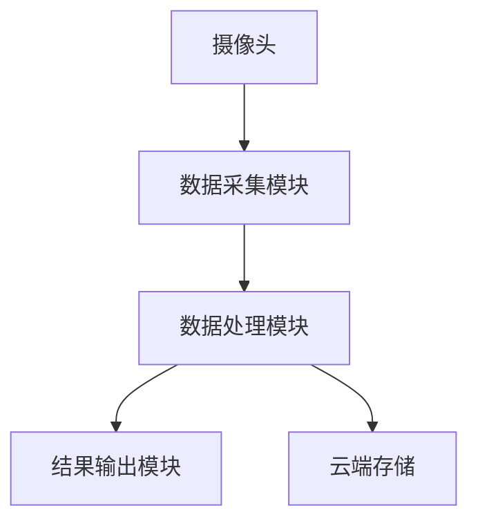
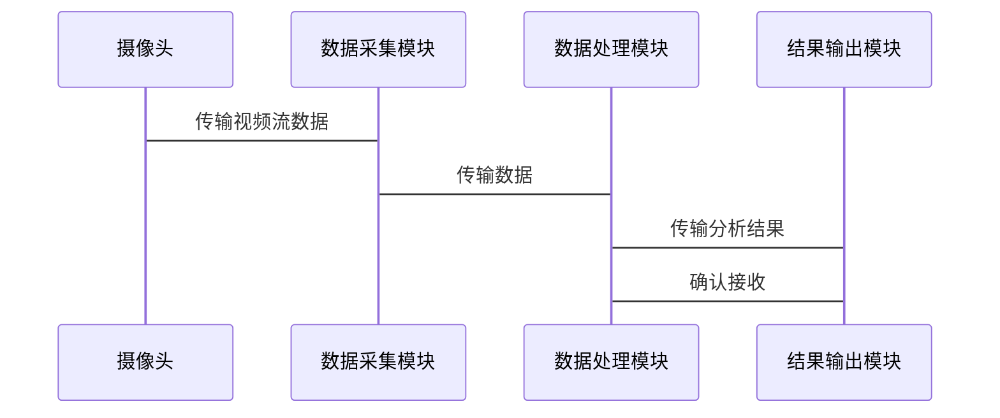
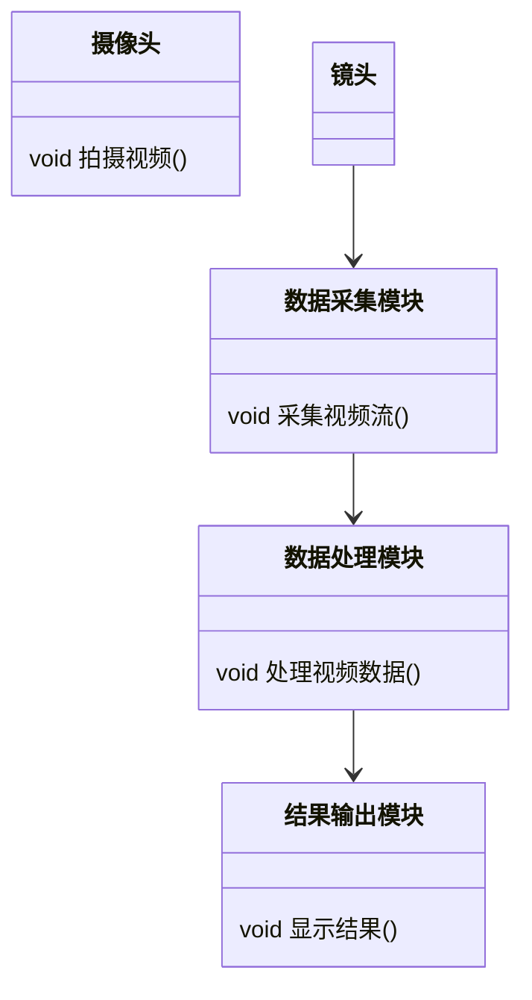

                 


# 如何识别企业的边缘计算实时视频分析优势

## 关键词：
边缘计算、实时视频分析、企业优势、系统架构、算法优化

## 摘要：
本文将深入探讨如何识别企业在边缘计算实时视频分析中的优势。通过分析边缘计算和实时视频分析的核心概念、算法原理、系统架构以及项目实战，帮助读者理解如何在企业中有效应用这些技术，提升数据处理效率、降低延迟，并优化资源利用。同时，本文将提供详细的数学模型和代码示例，帮助读者掌握相关技术。

---

# 第1章: 边缘计算与实时视频分析概述

## 1.1 边缘计算的基本概念

### 1.1.1 边缘计算的定义
边缘计算是一种分布式计算范式，将计算能力从中心服务器扩展到网络边缘，使数据在生成的位置进行处理，减少延迟和带宽消耗。

### 1.1.2 边缘计算的核心特点
- **低延迟**：数据在生成点处理，减少传输延迟。
- **高实时性**：实时响应，适用于需要快速决策的场景。
- **带宽优化**：减少向云端传输的数据量，节省带宽成本。
- **分布式架构**：计算资源分布在网络边缘，提升系统的可靠性和容错能力。

### 1.1.3 边缘计算与云计算的区别
| 特性 | 边缘计算 | 云计算 |
|------|----------|--------|
| 数据处理位置 | 边缘节点 | 中心服务器 |
| 延迟 | 低延迟 | 高延迟 |
| 带宽需求 | 低 | 高 |
| 应用场景 | 实时监控、物联网 | 数据存储、大数据分析 |

## 1.2 实时视频分析的定义与特点

### 1.2.1 实时视频分析的定义
实时视频分析是对视频流数据进行实时处理，识别和分析视频中的关键信息，如目标检测、行为分析等。

### 1.2.2 实时视频分析的核心技术
- **目标检测**：识别视频中的物体或人物。
- **行为分析**：分析视频中人物的行为模式。
- **视频流处理**：对连续的视频数据进行实时处理。

### 1.2.3 实时视频分析的应用场景
- **智能监控**：实时监控视频流，检测异常行为。
- **智能制造**：实时分析生产过程中的视频数据，优化生产流程。
- **智慧城市**：实时分析交通流量、环境监测等视频数据。

## 1.3 企业边缘计算实时视频分析的优势

### 1.3.1 提高数据处理效率
边缘计算将数据处理能力扩展到边缘节点，减少数据传输到云端的延迟，提高数据处理效率。

### 1.3.2 降低延迟
通过在边缘节点进行实时视频分析，减少数据传输到云端的时间，实现低延迟的实时响应。

### 1.3.3 优化资源利用
边缘计算将计算资源分布在网络边缘，充分利用边缘节点的资源，避免云端资源的过度集中和浪费。

## 1.4 本章小结
本章介绍了边缘计算和实时视频分析的基本概念及其在企业中的应用优势，为后续章节的深入分析奠定了基础。

---

# 第2章: 边缘计算与实时视频分析的核心原理

## 2.1 边缘计算的架构原理

### 2.1.1 边缘计算的分层架构
边缘计算的分层架构包括边缘设备层、边缘计算层和云端层。

### 2.1.2 边缘节点的功能模块
- **数据采集**：从边缘设备采集数据。
- **数据处理**：对采集的数据进行预处理和分析。
- **数据通信**：将处理后的数据传输到云端或其他边缘节点。

### 2.1.3 边缘计算与中心云的协同
边缘计算和中心云协同工作，边缘节点负责实时数据处理，云端负责存储和分析。

## 2.2 实时视频分析的算法原理

### 2.2.1 视频流处理的基本流程
1. 数据采集：从摄像头或其他传感器获取视频流数据。
2. 数据预处理：对视频数据进行降噪、调整亮度等预处理。
3. 特征提取：提取视频中的关键特征，如颜色、纹理、形状等。
4. 模型训练：基于提取的特征训练模型，用于目标检测和行为分析。
5. 实时分析：对视频流进行实时分析，输出结果。

### 2.2.2 常用的实时视频分析算法
- **目标检测算法**：如YOLO、Faster R-CNN等。
- **行为分析算法**：如基于光流的运动检测、基于深度学习的行为识别。

### 2.2.3 算法的性能优化
- **模型轻量化**：减少模型的参数量，提高推理速度。
- **并行计算**：利用多核处理器或GPU加速计算。
- **动态调整**：根据实时负载动态调整计算资源。

## 2.3 边缘计算与实时视频分析的结合

### 2.3.1 边缘计算在视频分析中的作用
- **实时数据处理**：在边缘节点实时处理视频数据，减少延迟。
- **资源优化**：利用边缘节点的计算资源，减少云端负载。

### 2.3.2 视频分析数据的实时处理
通过边缘计算，实时处理视频数据，快速响应和决策。

### 2.3.3 边缘计算与实时视频分析的协同优化
边缘节点和云端协同工作，边缘节点负责实时分析，云端负责存储和深度分析。

## 2.4 本章小结
本章详细讲解了边缘计算和实时视频分析的核心原理及其结合方式，为后续章节的系统设计和实现奠定了理论基础。

---

# 第3章: 边缘计算实时视频分析的算法原理与实现

## 3.1 视频流处理算法

### 3.1.1 常用视频流处理算法介绍
- **基于CNN的目标检测**：使用卷积神经网络进行目标检测。
- **基于光流的运动检测**：通过计算视频帧之间的光流，检测运动区域。

### 3.1.2 视频流处理的数学模型
目标检测的数学模型如下：

$$ y = f(x) $$

其中，\( x \) 是输入的视频数据，\( y \) 是输出的检测结果，\( f \) 是目标检测模型。

### 3.1.3 算法的优化策略
- **模型量化**：将模型的权重和激活值量化为较低精度，减少计算量。
- **并行计算**：利用多核处理器或GPU加速计算。

## 3.2 边缘计算中的实时视频分析算法

### 3.2.1 基于边缘计算的实时视频分析流程
1. 数据采集：从边缘设备获取视频流数据。
2. 数据预处理：对视频数据进行降噪、调整亮度等预处理。
3. 特征提取：提取视频中的关键特征。
4. 模型推理：使用预训练的模型进行目标检测和行为分析。
5. 结果输出：将分析结果输出到显示屏或发送到云端。

### 3.2.2 算法的实现步骤
1. 环境安装：安装必要的依赖库，如OpenCV、TensorFlow等。
2. 数据采集：使用摄像头或其他设备获取视频流。
3. 数据预处理：对视频数据进行预处理，如调整分辨率、归一化等。
4. 模型加载：加载预训练的目标检测模型。
5. 实时推理：对视频流进行实时推理，输出检测结果。

### 3.2.3 算法的性能评估
- **推理速度**：每秒处理的帧数（FPS）。
- **准确率**：目标检测的准确率。

## 3.3 算法实现的代码示例

### 3.3.1 环境安装与配置
```bash
pip install numpy
pip install opencv-python
pip install tensorflow
```

### 3.3.2 核心算法代码实现
```python
import cv2
import numpy as np
import tensorflow as tf

# 加载预训练模型
model = tf.keras.models.load_model('model.h5')

# 数据预处理
def preprocess_image(image):
    image = cv2.resize(image, (224, 224))
    image = image / 255.0
    return image

# 实时推理
cap = cv2.VideoCapture(0)
while cap.isOpened():
    ret, frame = cap.read()
    if not ret:
        break
    preprocessed = preprocess_image(frame)
    prediction = model.predict(np.array([preprocessed]))
    # 处理预测结果
    cv2.imshow('实时视频分析', frame)
    if cv2.waitKey(1) == ord('q'):
        break
cap.release()
cv2.destroyAllWindows()
```

### 3.3.3 代码的功能解读与分析
- **数据预处理**：将视频帧调整为模型输入的大小，并进行归一化处理。
- **模型推理**：使用预训练模型对预处理后的视频帧进行推理，输出检测结果。
- **实时显示**：将处理后的视频帧显示在窗口中，用户可以通过按键退出。

## 3.4 本章小结
本章通过代码示例和数学模型详细讲解了边缘计算实时视频分析的算法原理和实现步骤，帮助读者理解如何在实际项目中应用这些技术。

---

# 第4章: 边缘计算实时视频分析的系统架构与设计

## 4.1 系统功能设计

### 4.1.1 系统功能模块
- **数据采集模块**：负责采集视频流数据。
- **数据处理模块**：对视频数据进行预处理和分析。
- **结果输出模块**：将分析结果输出到显示屏或发送到云端。

### 4.1.2 功能模块之间的关系
数据采集模块将视频流数据传输到数据处理模块，数据处理模块对数据进行处理后，将结果传输到结果输出模块。

### 4.1.3 功能模块的实现
- **数据采集模块**：使用摄像头或其他传感器获取视频流数据。
- **数据处理模块**：对视频数据进行预处理和模型推理。
- **结果输出模块**：将分析结果显示在显示屏上或发送到云端。

## 4.2 系统架构设计

### 4.2.1 系统架构图


### 4.2.2 系统组件之间的交互
- **数据采集模块**与摄像头交互，获取视频流数据。
- **数据处理模块**对视频数据进行处理，并将结果传输到结果输出模块和云端存储。

## 4.3 系统接口设计

### 4.3.1 接口定义
- **数据采集接口**：接收视频流数据。
- **数据处理接口**：处理视频数据并输出结果。
- **结果输出接口**：显示分析结果或发送到云端。

### 4.3.2 接口实现
- **数据采集接口**：使用API从摄像头获取视频流数据。
- **数据处理接口**：调用预训练模型进行推理，输出结果。
- **结果输出接口**：将结果显示在窗口中或发送到云端。

## 4.4 系统交互设计

### 4.4.1 交互流程
1. 数据采集模块接收视频流数据。
2. 数据处理模块对数据进行预处理和推理。
3. 结果输出模块显示分析结果或发送到云端。

### 4.4.2 交互序列图


## 4.5 本章小结
本章通过系统架构设计和交互设计，详细讲解了边缘计算实时视频分析的系统实现，为后续章节的项目实战奠定了基础。

---

# 第5章: 边缘计算实时视频分析的项目实战

## 5.1 项目介绍

### 5.1.1 项目背景
在智能制造领域，实时监控生产线上的设备运行状态，及时发现和处理异常情况。

### 5.1.2 项目目标
实现对生产线视频流的实时分析，检测设备异常情况，减少停机时间。

## 5.2 系统功能设计

### 5.2.1 领域模型类图


### 5.2.2 系统架构图


### 5.2.3 系统交互序列图


## 5.3 核心代码实现

### 5.3.1 环境安装
```bash
pip install numpy
pip install opencv-python
pip install tensorflow
```

### 5.3.2 核心代码实现
```python
import cv2
import numpy as np
import tensorflow as tf

# 加载预训练模型
model = tf.keras.models.load_model('model.h5')

# 数据预处理
def preprocess_image(image):
    image = cv2.resize(image, (224, 224))
    image = image / 255.0
    return image

# 实时推理
cap = cv2.VideoCapture(0)
while cap.isOpened():
    ret, frame = cap.read()
    if not ret:
        break
    preprocessed = preprocess_image(frame)
    prediction = model.predict(np.array([preprocessed]))
    # 处理预测结果
    cv2.imshow('实时视频分析', frame)
    if cv2.waitKey(1) == ord('q'):
        break
cap.release()
cv2.destroyAllWindows()
```

### 5.3.3 代码的功能解读与分析
- **数据预处理**：将视频帧调整为模型输入的大小，并进行归一化处理。
- **模型推理**：使用预训练模型对预处理后的视频帧进行推理，输出检测结果。
- **实时显示**：将处理后的视频帧显示在窗口中，用户可以通过按键退出。

## 5.4 实际案例分析

### 5.4.1 案例背景
在智能制造领域，实时监控生产线上的设备运行状态，及时发现和处理异常情况。

### 5.4.2 案例实现
通过边缘计算实时分析生产线上的视频流数据，检测设备异常情况，减少停机时间。

### 5.4.3 案例分析
- **优势**：降低延迟，快速响应异常情况，减少停机时间。
- **挑战**：边缘设备的计算能力有限，需要优化模型和算法。

## 5.5 项目小结
本章通过实际案例分析，详细讲解了边缘计算实时视频分析的项目实战，帮助读者理解如何将理论应用于实际场景。

---

# 第6章: 边缘计算实时视频分析的最佳实践

## 6.1 小结

### 6.1.1 核心内容回顾
- 边缘计算与实时视频分析的核心概念
- 算法原理与实现
- 系统架构与设计
- 项目实战与案例分析

## 6.2 注意事项

### 6.2.1 模型优化
- **模型轻量化**：减少模型的参数量，提高推理速度。
- **动态调整**：根据实时负载动态调整计算资源。

### 6.2.2 系统安全性
- **数据加密**：对传输和存储的数据进行加密，防止数据泄露。
- **访问控制**：限制对边缘节点的访问权限，确保系统安全。

## 6.3 拓展阅读

### 6.3.1 推荐书籍
- 《深度学习》
- 《边缘计算入门与实践》

### 6.3.2 技术博客与资源
- TensorFlow官方文档
- PyTorch官方文档
- 开源项目GitHub仓库

## 6.4 本章小结
本章总结了边缘计算实时视频分析的最佳实践，提供了注意事项和拓展阅读资源，帮助读者进一步深入学习和实践。

---

# 作者：AI天才研究院 & 禅与计算机程序设计艺术

---

# END

