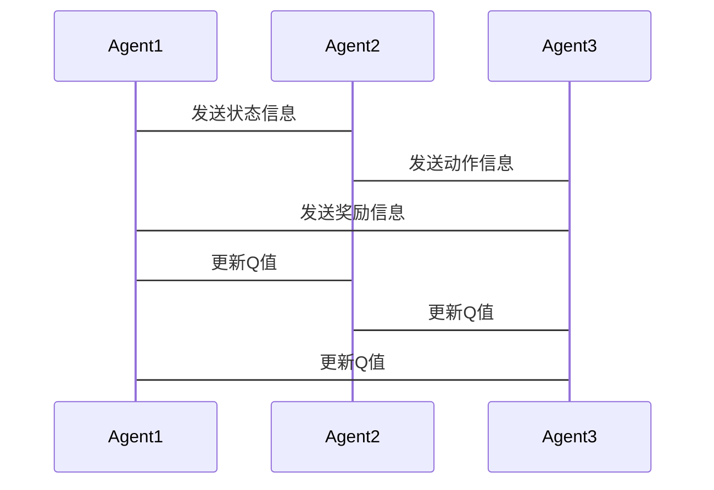
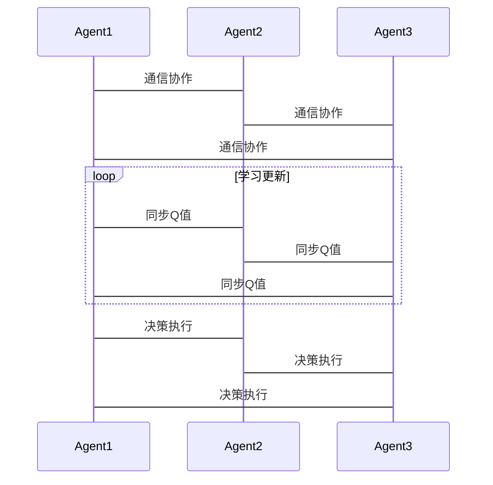

                 


# 开发具有多Agent协同学习能力的系统

> 关键词：多Agent系统、协同学习、分布式计算、强化学习、系统架构设计

> 摘要：本文详细探讨了开发具有多Agent协同学习能力系统的各个方面，从核心概念到算法原理，再到系统架构设计和项目实战，为读者提供全面的指导。通过本文，读者将能够理解多Agent协同学习的基本原理，掌握相关算法的设计与实现，并能够设计和开发高效的多Agent协同学习系统。

---

# 第一部分: 多Agent协同学习系统概述

## 第1章: 多Agent协同学习系统概述

### 1.1 多Agent系统的基本概念

#### 1.1.1 多Agent系统的定义
多Agent系统（Multi-Agent System, MAS）是由多个智能体（Agent）组成的分布式系统，这些智能体能够通过通信和协作完成复杂的任务。与传统的单Agent系统相比，多Agent系统具有更高的灵活性和适应性。

#### 1.1.2 多Agent系统的特征
- **分布式性**：多个Agent分布在不同的节点上，能够独立运行。
- **协作性**：Agent之间通过通信和协作完成共同目标。
- **自治性**：每个Agent具有自主决策的能力，能够独立完成任务。
- **动态性**：系统能够在动态变化的环境中自适应调整。

#### 1.1.3 多Agent系统与传统单Agent系统的区别
- **单Agent系统**：单个智能体完成所有任务，决策集中化。
- **多Agent系统**：多个智能体协作完成任务，决策分散化。

### 1.2 多Agent协同学习的背景与应用

#### 1.2.1 协同学习的定义
协同学习（Collaborative Learning）是指多个学习者通过协作和交流，共同完成学习任务的过程。在多Agent系统中，协同学习进一步扩展为多个智能体通过协作完成学习任务。

#### 1.2.2 多Agent协同学习的背景
随着人工智能技术的快速发展，多Agent系统在分布式计算、机器人协作、自动驾驶等领域得到了广泛应用。多Agent协同学习作为多Agent系统的重要组成部分，成为研究的热点。

#### 1.2.3 多Agent协同学习的应用场景
- **分布式计算**：多个Agent协同完成复杂的计算任务。
- **机器人协作**：多个机器人通过协作完成任务。
- **自动驾驶**：多个车辆协同完成交通任务。
- **游戏AI**：多个游戏AI协同完成游戏任务。

### 1.3 多Agent协同学习的核心问题

#### 1.3.1 协作性问题
- **任务分配**：如何合理分配任务给不同的Agent。
- **协作机制**：Agent之间如何通过协作完成任务。

#### 1.3.2 分布式学习问题
- **数据分布**：数据分布在多个Agent上，如何进行联合学习。
- **模型同步**：多个Agent学习的模型如何同步和更新。

#### 1.3.3 通信与协调问题
- **通信协议**：Agent之间如何进行通信和交互。
- **协调机制**：如何保证多个Agent之间的协作和同步。

## 第2章: 多Agent协同学习的核心概念与联系

### 2.1 多Agent系统的核心概念

#### 2.1.1 Agent的基本属性
- **自主性**：Agent能够自主决策。
- **反应性**：Agent能够感知环境并做出反应。
- **社会性**：Agent能够与其他Agent或人类进行交互。

#### 2.1.2 多Agent系统的组成要素
- **Agent**：系统的最基本单位。
- **环境**：Agent所处的外部环境。
- **通信机制**：Agent之间的通信方式。
- **协作机制**：Agent之间的协作方式。

#### 2.1.3 多Agent系统与传统单Agent系统的区别
- **单Agent系统**：单个Agent完成任务，决策集中。
- **多Agent系统**：多个Agent协作完成任务，决策分散。

### 2.2 多Agent协同学习的理论基础

#### 2.2.1 分布式计算的基本原理
- **分布式计算**：将计算任务分布在多个节点上，通过通信完成任务。
- **一致性**：确保分布式系统中数据的一致性。

#### 2.2.2 多智能体系统的核心原理
- **多智能体系统**：由多个智能体组成的系统，通过协作完成任务。
- **通信与协作**：智能体之间通过通信和协作完成任务。

#### 2.2.3 强化学习与协作学习的关系
- **强化学习**：通过试错学习，优化决策策略。
- **协作学习**：多个智能体通过协作学习共同优化决策策略。

### 2.3 多Agent协同学习的数学模型

#### 2.3.1 分布式强化学习模型
- **分布式Q-learning**：多个Agent分别学习Q值，通过通信同步策略。
- **分布式Deep Q-Networks (DQN)**：多个Agent分别维护DQN模型，通过通信同步模型参数。

#### 2.3.2 多智能体协作模型
- **通信模型**：Agent之间通过通信共享信息。
- **协作模型**：Agent之间通过协作完成共同目标。

#### 2.3.3 协作学习的数学表达式
- **Q值更新公式**：
  $$ Q_i(s, a) = Q_i(s, a) + \alpha (r + \max_j Q_j(s', a') - Q_i(s, a)) $$
  其中，\( Q_i \) 表示第i个Agent的Q值，\( \alpha \) 是学习率，\( r \) 是奖励，\( \max_j Q_j(s', a') \) 是其他Agent的最大Q值。

---

# 第三部分: 多Agent协同学习的算法实现

## 第3章: 多Agent协同学习的算法原理

### 3.1 分布式强化学习算法

#### 3.1.1 分布式Q-learning算法
- **算法步骤**：
  1. 每个Agent在自己的环境中执行动作，获得奖励。
  2. 每个Agent更新自己的Q值。
  3. Agent之间通过通信同步Q值。

- **代码示例**：
  ```python
  import numpy as np
  import random

  class Agent:
      def __init__(self, state_space, action_space):
          self.q_table = np.zeros((state_space, action_space))
          
      def choose_action(self, state, epsilon=0.1):
          if random.random() < epsilon:
              return random.randint(0, action_space-1)
          return np.argmax(self.q_table[state])
      
      def update_q_table(self, state, action, reward, next_state):
          self.q_table[state][action] += 0.1 * (reward + np.max(self.q_table[next_state]) - self.q_table[state][action])

  # 初始化多个Agent
  agents = [Agent(state_space, action_space) for _ in range(num_agents)]

  # 通信同步Q值
  def synchronize_q_tables(agents):
      q_tables = [agent.q_table for agent in agents]
      average_q = np.mean(q_tables, axis=0)
      for agent in agents:
          agent.q_table = average_q
  ```

#### 3.1.2 分布式Deep Q-Networks (DQN) 算法
- **算法步骤**：
  1. 每个Agent在自己的环境中执行动作，获得奖励。
  2. 每个Agent更新自己的DQN模型。
  3. Agent之间通过通信同步模型参数。

- **代码示例**：
  ```python
  import torch
  import torch.nn as nn
  import torch.optim as optim

  class DQN:
      def __init__(self, input_size, output_size):
          self.model = nn.Linear(input_size, output_size)
          self.optimizer = optim.Adam(self.model.parameters(), lr=0.001)
          self.criterion = nn.MSELoss()
          
      def forward(self, x):
          return self.model(x)
      
      def update(self, inputs, targets):
          outputs = self.model(inputs)
          loss = self.criterion(outputs, targets)
          self.optimizer.zero_grad()
          loss.backward()
          self.optimizer.step()

  # 初始化多个Agent
  dqn_agents = [DQN(input_size, output_size) for _ in range(num_agents)]

  # 通信同步模型参数
  def synchronize_dqn(dqn_agents):
      models = [agent.model for agent in dqn_agents]
      average_model = average_models(models)
      for agent in dqn_agents:
          agent.model = average_model
  ```

#### 3.1.3 分布式策略梯度算法
- **算法步骤**：
  1. 每个Agent在自己的环境中执行动作，获得奖励。
  2. 每个Agent更新自己的策略梯度。
  3. Agent之间通过通信同步策略参数。

- **代码示例**：
  ```python
  import torch
  import torch.nn as nn
  import torch.optim as optim

  class PolicyNetwork:
      def __init__(self, input_size, output_size):
          self.model = nn.Sequential(nn.Linear(input_size, 128), nn.ReLU(), nn.Linear(128, output_size))
          self.optimizer = optim.Adam(self.model.parameters(), lr=0.001)
          
      def forward(self, x):
          return self.model(x)
      
      def update_policy(self, inputs, actions, rewards):
          outputs = self.model(inputs)
          loss = -torch.mean(torch.log(outputs) * actions - outputs * rewards)
          self.optimizer.zero_grad()
          loss.backward()
          self.optimizer.step()

  # 初始化多个Agent
  policy_agents = [PolicyNetwork(input_size, output_size) for _ in range(num_agents)]

  # 通信同步策略参数
  def synchronize_policy(policy_agents):
      models = [agent.model for agent in policy_agents]
      average_model = average_models(models)
      for agent in policy_agents:
          agent.model = average_model
  ```

### 3.2 多智能体协作学习算法

#### 3.2.1 基于通信的多智能体协作算法
- **算法步骤**：
  1. 每个Agent感知环境，发送信息给其他Agent。
  2. Agent基于收到的信息，调整自己的策略。
  3. 通过多次交互，达到协作完成任务的目的。

- **代码示例**：
  ```python
  import socket

  class CollaborativeAgent:
      def __init__(self, team_size):
          self.team_size = team_size
          self.socket = socket.socket(socket.AF_INET, socket.SOCK_STREAM)
          self.socket.bind(('localhost', 1234))
          self.socket.listen(1)
          
      def communicate(self, message):
          client_socket, addr = self.socket.accept()
          client_socket.send(message.encode())
          response = client_socket.recv(1024).decode()
          client_socket.close()
          return response

  # 初始化多个Agent
  agents = [CollaborativeAgent(team_size) for _ in range(num_agents)]

  # 通信示例
  message = "协同完成任务"
  response = agents[0].communicate(message)
  print(response)
  ```

#### 3.2.2 基于价值函数的协作算法
- **算法步骤**：
  1. 每个Agent学习自己的价值函数。
  2. Agent之间通过通信共享价值函数信息。
  3. 基于共享的价值函数，调整协作策略。

- **代码示例**：
  ```python
  import numpy as np

  class ValueFunction:
      def __init__(self, state_space):
          self.theta = np.random.randn(state_space, 1)
          
      def evaluate(self, state):
          return np.dot(state, self.theta)
      
      def update(self, state, target_value):
          gradient = state * (target_value - self.evaluate(state))
          self.theta += 0.1 * gradient

  # 初始化多个Agent
  value_functions = [ValueFunction(state_space) for _ in range(num_agents)]

  # 通信同步价值函数
  def synchronize_value_functions(value_functions):
      thetas = [vf.theta for vf in value_functions]
      average_theta = np.mean(thetas, axis=0)
      for vf in value_functions:
          vf.theta = average_theta
  ```

#### 3.2.3 基于策略的协作算法
- **算法步骤**：
  1. 每个Agent学习自己的策略。
  2. Agent之间通过通信共享策略信息。
  3. 基于共享的策略信息，调整协作策略。

- **代码示例**：
  ```python
  import torch
  import torch.nn as nn
  import torch.optim as optim

  class Strategy:
      def __init__(self, input_size):
          self.model = nn.Linear(input_size, 1)
          self.optimizer = optim.Adam(self.model.parameters(), lr=0.001)
          
      def predict(self, state):
          return self.model(state)
      
      def update(self, state, action):
          loss = nn.MSELoss()((self.model(state)), action)
          self.optimizer.zero_grad()
          loss.backward()
          self.optimizer.step()

  # 初始化多个Agent
  strategies = [Strategy(input_size) for _ in range(num_agents)]

  # 通信同步策略
  def synchronize_strategies(strategies):
      models = [strat.model for strat in strategies]
      average_model = average_models(models)
      for strat in strategies:
          strat.model = average_model
  ```

### 3.3 多Agent协同学习的数学模型

#### 3.3.1 分布式Q-learning的数学模型
- **Q值更新公式**：
  $$ Q_i(s, a) = Q_i(s, a) + \alpha (r + \max_j Q_j(s', a') - Q_i(s, a)) $$
  其中，\( \alpha \) 是学习率，\( r \) 是奖励，\( \max_j Q_j(s', a') \) 是其他Agent的最大Q值。

#### 3.3.2 多智能体协作模型
- **协作模型**：
  $$ C(s, a) = \sum_{i=1}^n Q_i(s, a) $$
  其中，\( C(s, a) \) 是协作值，\( Q_i(s, a) \) 是第i个Agent的Q值。

#### 3.3.3 协作学习的数学推导
- **推导过程**：
  1. 每个Agent学习自己的Q值。
  2. Agent之间通过通信同步Q值。
  3. 基于同步的Q值，调整协作策略。

---

# 第四部分: 多Agent协同学习的系统架构设计

## 第4章: 多Agent协同学习的系统架构设计

### 4.1 系统功能设计

#### 4.1.1 多Agent协同学习的功能模块划分
- **感知模块**：感知环境状态。
- **决策模块**：基于感知状态做出决策。
- **通信模块**：与其他Agent通信。
- **学习模块**：学习和更新策略。

#### 4.1.2 系统的输入输出设计
- **输入**：环境状态、其他Agent的信息。
- **输出**：决策动作、学习更新后的策略。

#### 4.1.3 系统的性能指标设计
- **响应时间**：系统完成任务的时间。
- **通信效率**：Agent之间的通信效率。
- **学习效率**：系统的学习速度。

### 4.2 系统架构设计

#### 4.2.1 分布式架构设计
- **节点分布**：多个Agent分布在不同的节点上。
- **通信机制**：通过网络通信进行信息交换。
- **任务分配**：根据Agent的能力分配任务。

#### 4.2.2 多智能体协作架构设计
- **协作机制**：Agent之间通过协作完成任务。
- **通信协议**：定义Agent之间的通信规则。
- **协调机制**：保证Agent之间的协作和同步。

#### 4.2.3 系统的通信架构设计
- **通信方式**：支持点对点通信和广播通信。
- **通信内容**：包括状态、动作和奖励信息。
- **通信频率**：根据任务需求调整通信频率。

### 4.3 系统接口设计

#### 4.3.1 Agent之间的通信接口
- **发送接口**：`send(message)`。
- **接收接口**：`receive()`。

#### 4.3.2 外部系统的接口设计
- **输入接口**：`input_state()`。
- **输出接口**：`output_action()`。

#### 4.3.3 系统管理接口设计
- **监控接口**：`monitor_agents()`。
- **控制接口**：`control_agents()`。

### 4.4 系统交互流程设计

#### 4.4.1 多Agent协同学习的交互流程
- **初始化**：启动多个Agent。
- **感知环境**：每个Agent感知环境状态。
- **通信协作**：Agent之间通过通信协作。
- **决策执行**：基于协作结果，执行决策。
- **学习更新**：根据奖励更新学习策略。

#### 4.4.2 交互流程的Mermaid序列图


---

# 第五部分: 多Agent协同学习的项目实战

## 第5章: 多Agent协同学习的项目实战

### 5.1 项目环境配置

#### 5.1.1 环境安装
- **Python**：安装Python 3.x。
- **库依赖**：安装`numpy`, `torch`, `mermaid`, `matplotlib`等库。

#### 5.1.2 系统配置
- **网络环境**：配置网络通信。
- **计算资源**：配置分布式计算资源。

### 5.2 系统核心代码实现

#### 5.2.1 多Agent协同学习的核心代码
```python
import torch
import torch.nn as nn
import torch.optim as optim
import numpy as np
import socket

class Agent:
    def __init__(self, state_space, action_space, id):
        self.state_space = state_space
        self.action_space = action_space
        self.id = id
        self.q_table = np.zeros((state_space, action_space))
        self.model = nn.Linear(state_space, action_space)
        self.optimizer = optim.Adam(self.model.parameters(), lr=0.001)
        self.socket = socket.socket(socket.AF_INET, socket.SOCK_STREAM)
        self.socket.bind(('localhost', 1234 + id))
        self.socket.listen(1)

    def perceive(self, state):
        return state

    def choose_action(self, state, epsilon=0.1):
        if np.random.random() < epsilon:
            return np.random.randint(0, self.action_space)
        else:
            return np.argmax(self.q_table[state])

    def learn(self, state, action, reward, next_state):
        target = reward + np.max(self.q_table[next_state])
        self.q_table[state][action] += 0.1 * (target - self.q_table[state][action])

    def communicate(self, message):
        client_socket, addr = self.socket.accept()
        client_socket.send(message.encode())
        response = client_socket.recv(1024).decode()
        client_socket.close()
        return response

# 初始化多个Agent
num_agents = 3
agents = [Agent(state_space=5, action_space=2, id=i) for i in range(num_agents)]

# 通信同步Q值
def synchronize_q_tables(agents):
    q_tables = [agent.q_table for agent in agents]
    average_q = np.mean(q_tables, axis=0)
    for agent in agents:
        agent.q_table = average_q

# 项目实战
for _ in range(100):
    for agent in agents:
        state = agent.perceive(agent.q_table)
        action = agent.choose_action(state)
        reward = np.random.random()
        next_state = agent.perceive(agent.q_table)
        agent.learn(state, action, reward, next_state)
        if _ % 10 == 0:
            synchronize_q_tables(agents)
```

#### 5.2.2 代码实现解读与分析
- **Agent类**：定义了单个Agent的行为，包括感知、决策、学习和通信。
- **通信同步**：定期同步所有Agent的Q值，保证协作一致性。

#### 5.2.3 系统架构实现
- **分布式架构**：多个Agent分布在不同的节点上，通过网络通信协作。
- **协作机制**：通过同步Q值实现协作。

### 5.3 项目实战案例分析

#### 5.3.1 案例分析
- **案例背景**：多个Agent协同完成迷宫导航任务。
- **任务目标**：所有Agent协作找到出口。
- **实现步骤**：
  1. 初始化多个Agent。
  2. 每个Agent感知迷宫状态。
  3. Agent之间通过通信协作。
  4. 学习更新Q值。
  5. 重复步骤2-4，直到找到出口。

#### 5.3.2 案例分析的Mermaid流程图


### 5.4 项目总结

#### 5.4.1 项目成果
- 成功实现多Agent协同学习系统。
- 实现了Agent之间的通信与协作。
- 通过项目实战，验证了系统的有效性。

#### 5.4.2 经验与教训
- 通信效率影响系统性能。
- 学习率和奖励机制需要合理设计。
- 多Agent系统需要考虑同步和一致性问题。

---

# 第六部分: 总结与展望

## 第6章: 总结与展望

### 6.1 总结
本文详细探讨了开发具有多Agent协同学习能力系统的各个方面，从核心概念到算法原理，再到系统架构设计和项目实战。通过本文，读者将能够理解多Agent协同学习的基本原理，掌握相关算法的设计与实现，并能够设计和开发高效的多Agent协同学习系统。

### 6.2 展望
随着人工智能技术的不断发展，多Agent协同学习将得到更广泛的应用。未来的研究方向包括：
- **更高效的通信机制**：提高Agent之间的通信效率。
- **更智能的协作算法**：开发更智能的协作算法，提高系统性能。
- **更复杂的任务场景**：研究多Agent系统在更复杂任务场景中的应用。

---

# 作者：AI天才研究院/AI Genius Institute & 禅与计算机程序设计艺术 /Zen And The Art of Computer Programming

