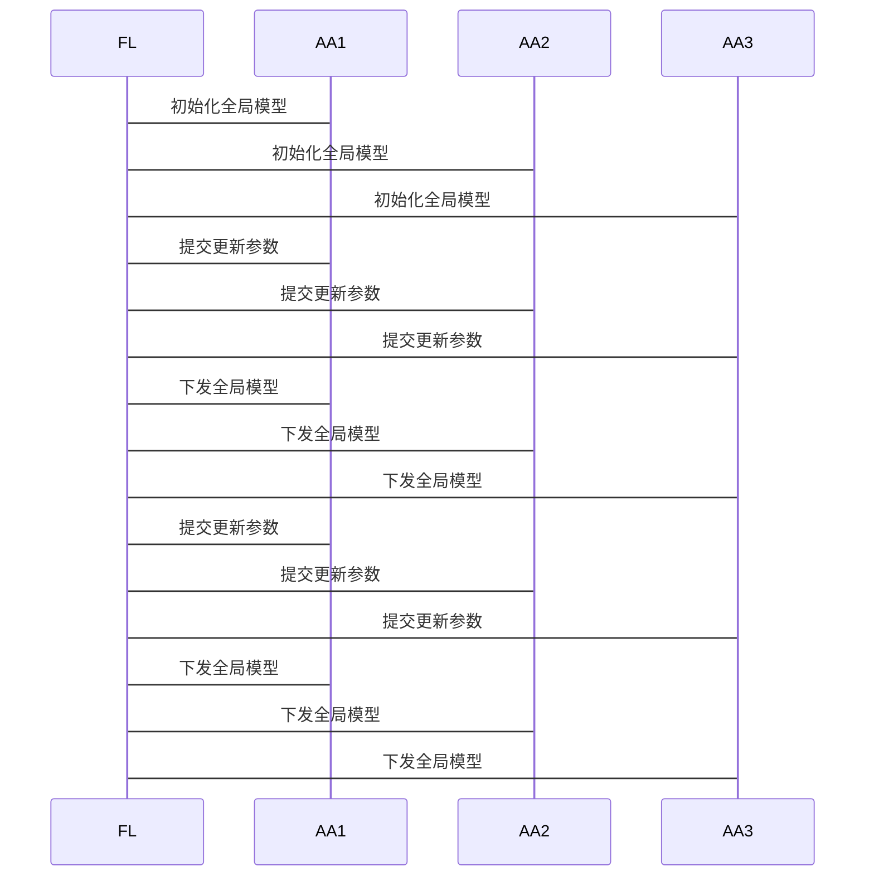

                 


# 构建具有联邦学习能力的AI Agent

> 关键词：联邦学习，AI Agent，数据协作，智能体，分布式系统，隐私保护，机器学习

> 摘要：随着人工智能技术的快速发展，AI Agent（智能体）在各个领域的应用越来越广泛。然而，数据孤岛和隐私保护问题成为了AI Agent发展的瓶颈。联邦学习作为一种新兴的技术，能够在保护数据隐私的前提下，实现跨机构的数据协作与模型训练。本文将详细介绍如何构建具有联邦学习能力的AI Agent，探讨其核心概念、算法原理、系统架构、实现方法以及实际应用案例。通过本文的讲解，读者将能够掌握联邦学习与AI Agent结合的核心技术，并能够将其应用于实际项目中。

---

# 第一部分: 背景介绍与核心概念

# 第1章: 联邦学习与AI Agent概述

## 1.1 联邦学习的基本概念

### 1.1.1 联邦学习的定义

联邦学习（Federated Learning）是一种分布式机器学习技术，允许多个参与方在不共享原始数据的前提下，共同训练一个全局模型。其核心思想是“数据不动，模型动”，即数据保留在本地，仅交换模型参数或中间结果。

### 1.1.2 联邦学习的核心特点

- **数据隐私保护**：数据无需离开本地，确保隐私和安全。
- **分布式协作**：多个机构或设备可以协同训练模型。
- **模型统一性**：最终生成的模型能够反映所有参与方的数据分布。

### 1.1.3 联邦学习与传统数据共享的区别

| 特性 | 联邦学习 | 传统数据共享 |
|------|----------|--------------|
| 数据流动 | 模型参数流动 | 数据本身流动 |
| 隐私风险 | 低 | 高 |
| 协作效率 | 高 | 低 |

## 1.2 AI Agent的基本概念

### 1.2.1 AI Agent的定义

AI Agent是一种能够感知环境、自主决策并执行任务的智能实体。它具备以下核心功能：
- **感知**：通过传感器或数据接口获取环境信息。
- **决策**：基于感知信息做出决策。
- **执行**：通过执行器或接口完成任务。

### 1.2.2 AI Agent的核心功能

- **自主性**：无需外部干预，自主完成任务。
- **反应性**：能够实时感知环境变化并做出响应。
- **学习能力**：通过经验或数据优化自身行为。

### 1.2.3 AI Agent与传统AI的区别

| 特性 | AI Agent | 传统AI |
|------|----------|--------|
| 自主性 | 高 | 低 |
| 适应性 | 强 | 弱 |
| 应用场景 | 动态、复杂环境 | 静态、简单环境 |

## 1.3 联邦学习与AI Agent的结合背景

### 1.3.1 数据孤岛问题的现状

- 数据分散在不同机构或设备中，无法有效共享。
- 数据隐私保护法规（如GDPR）限制了数据的自由流动。

### 1.3.2 联邦学习在AI Agent中的应用价值

- **隐私保护**：AI Agent可以在本地数据上进行训练，无需共享原始数据。
- **分布式协作**：多个AI Agent可以协同工作，共同优化全局模型。
- **实时性**：AI Agent能够快速响应环境变化，提升决策效率。

### 1.3.3 联邦学习与AI Agent结合的必要性

- **解决数据孤岛问题**：通过联邦学习，AI Agent可以在不共享数据的情况下协作训练模型。
- **提升决策效率**：联邦学习能够充分利用分布式数据资源，提升AI Agent的决策能力。
- **拓展应用场景**：联邦学习与AI Agent的结合可以应用于智能医疗、智能金融、智能制造等领域。

## 1.4 联邦学习AI Agent的整体框架

### 1.4.1 联邦学习AI Agent的架构组成

- **联邦层**：负责协调多个AI Agent的协作，管理模型训练过程。
- **AI Agent层**：负责感知环境、决策和执行任务。
- **数据层**：存储本地数据，仅交换模型参数或中间结果。

### 1.4.2 联邦学习AI Agent的核心流程

1. **初始化**：联邦层初始化全局模型，分配任务给各个AI Agent。
2. **本地训练**：各AI Agent在本地数据上训练模型，生成更新参数。
3. **参数同步**：AI Agent将更新参数上传至联邦层，联邦层汇总并更新全局模型。
4. **模型分发**：联邦层将更新后的全局模型分发给各AI Agent，供其使用。

### 1.4.3 联邦学习AI Agent的实现目标

- **隐私保护**：确保数据不被泄露。
- **高效协作**：优化联邦学习的通信效率和模型收敛速度。
- **智能决策**：提升AI Agent的自主决策能力和任务执行效率。

---

# 第2章: 联邦学习与AI Agent的核心概念与联系

## 2.1 联邦学习的核心原理

### 2.1.1 联邦学习的通信机制

- **加密通信**：使用加密技术确保通信过程中的数据安全。
- **协议设计**：定义数据交换的格式和流程，确保各参与方能够顺利协作。

### 2.1.2 联邦学习的加密机制

- **同态加密**：允许在加密数据上进行计算，确保数据隐私。
- **差分隐私**：通过添加噪声保护数据隐私。

### 2.1.3 联邦学习的同步策略

- **同步更新**：所有参与方同时更新模型参数。
- **异步更新**：参与方可以异步更新模型参数，减少通信开销。

## 2.2 AI Agent的核心原理

### 2.2.1 AI Agent的感知与决策机制

- **感知**：通过传感器或API获取环境信息。
- **决策**：基于感知信息和预设策略做出决策。
- **执行**：通过执行器或接口完成任务。

### 2.2.2 AI Agent的执行与反馈机制

- **任务执行**：AI Agent根据决策结果执行具体任务。
- **反馈接收**：AI Agent接收环境或用户的反馈，用于优化决策。

### 2.2.3 AI Agent的自适应学习机制

- **在线学习**：AI Agent在运行过程中实时更新模型。
- **离线学习**：AI Agent在特定时间段内离线更新模型。

## 2.3 联邦学习与AI Agent的关系分析

### 2.3.1 联邦学习如何赋能AI Agent

- **数据协作**：通过联邦学习，多个AI Agent可以共享模型参数，提升决策能力。
- **隐私保护**：联邦学习确保AI Agent在本地数据上进行训练，保护隐私。
- **分布式决策**：联邦学习支持分布式决策，提升AI Agent的协作效率。

### 2.3.2 AI Agent如何提升联邦学习的效率

- **本地计算能力**：AI Agent可以本地训练模型，减少对中心服务器的依赖。
- **动态协作**：AI Agent可以根据环境变化动态调整协作策略。
- **实时反馈**：AI Agent可以实时提供反馈，优化联邦学习过程。

### 2.3.3 联邦学习与AI Agent的协同工作流程

1. **任务分配**：联邦层将任务分配给多个AI Agent。
2. **本地训练**：各AI Agent在本地数据上训练模型，生成更新参数。
3. **参数同步**：AI Agent将更新参数上传至联邦层，联邦层汇总并更新全局模型。
4. **模型分发**：联邦层将更新后的全局模型分发给各AI Agent，供其使用。
5. **任务执行**：AI Agent根据全局模型做出决策，执行任务。

## 2.4 联邦学习与AI Agent的核心概念对比表

| 概念 | 联邦学习 | AI Agent |
|------|----------|----------|
| 核心目标 | 数据协作与隐私保护 | 自主决策与任务执行 |
| 实现方式 | 跨机构数据共享 | 自主感知与决策 |
| 关键技术 | 加密通信、模型同步 | 感知、决策、执行 |
| 应用场景 | 智能医疗、智能金融 | 智能家居、自动驾驶 |

---

# 第3章: 联邦学习AI Agent的算法原理

## 3.1 联邦学习的数学模型

### 3.1.1 模型定义

全局模型参数表示为$\theta = (\theta_1, \theta_2, ..., \theta_n)$，其中$\theta_i$表示第$i$个参与方的模型参数。

### 3.1.2 损失函数

损失函数为$L(\theta; x, y)$，其中$x$表示输入，$y$表示标签。

### 3.1.3 梯度更新

各参与方计算梯度$\nabla L_i(\theta_i; x_i, y_i)$，并将其上传至联邦层。

### 3.1.4 全局更新

联邦层汇总各参与方的梯度，更新全局模型参数$\theta$。

### 3.1.5 模型同步

联邦层将更新后的全局模型参数分发给各参与方，供其使用。

## 3.2 AI Agent的决策算法

### 3.2.1 决策树算法

- **ID3算法**：基于信息增益选择最优特征进行决策。
- **C4.5算法**：基于信息增益率选择最优特征进行决策。

### 3.2.2 支持向量机算法

- **SVM算法**：通过最大化间隔，找到最优超平面进行分类。

### 3.2.3 神经网络算法

- **前馈神经网络**：通过多层感知机进行非线性分类。
- **深度学习模型**：如卷积神经网络、循环神经网络等。

## 3.3 联邦学习与AI Agent的协同算法

### 3.3.1 联邦学习的同步算法

1. **同步频率**：定义联邦层与各参与方的同步频率，如周期性同步或事件驱动同步。
2. **同步策略**：选择同步方式，如全量同步或增量同步。
3. **同步机制**：定义数据交换的格式和流程，确保各参与方能够顺利协作。

### 3.3.2 AI Agent的自适应学习算法

1. **在线学习**：AI Agent在运行过程中实时更新模型。
2. **离线学习**：AI Agent在特定时间段内离线更新模型。
3. **模型融合**：将多个模型的预测结果进行融合，提升决策准确性。

---

# 第4章: 联邦学习AI Agent的系统分析与架构设计

## 4.1 系统分析

### 4.1.1 问题场景

- **数据孤岛**：数据分散在不同机构或设备中，无法有效共享。
- **隐私保护**：数据隐私保护法规限制了数据的自由流动。
- **协作效率**：传统数据共享方式效率低下，且隐私风险高。

### 4.1.2 项目介绍

- **项目目标**：构建具有联邦学习能力的AI Agent，实现跨机构的数据协作与模型训练。
- **项目范围**：涵盖联邦学习的核心技术、AI Agent的设计与实现、系统架构设计等。
- **项目需求**：
  - 数据隐私保护
  - 分布式协作
  - 高效模型训练

## 4.2 系统功能设计

### 4.2.1 领域模型（mermaid类图）

```mermaid
classDiagram

    class AI_Agent {
        +id: string
        +name: string
        +model: Model
        +data: Dataset
        -state: State
        +predict(x: Input): Output
        +train(): void
    }

    class Model {
        +weights: Parameters
        +loss_function: Function
        +optimizer: Optimizer
        -training_data: Dataset
    }

    class Dataset {
        +data: List[Sample]
        +label: List[Label]
    }

    class State {
        +current_decision: Decision
        +execution_status: Status
    }

    AI_Agent o Model
    AI_Agent o Dataset
    AI_Agent o State
```

### 4.2.2 系统架构设计（mermaid架构图）


### 4.2.3 系统接口设计

- **API接口**：
  - `GET /model`：获取全局模型参数。
  - `POST /update`：上传本地模型更新参数。
  - `POST /train`：触发本地训练任务。

- **数据接口**：
  - 数据读取接口：`read_data(source: string)`。
  - 数据存储接口：`save_data(data: any, source: string)`。

### 4.2.4 系统交互流程（mermaid序列图）



---

# 第5章: 联邦学习AI Agent的项目实战

## 5.1 环境安装与配置

### 5.1.1 环境需求

- **操作系统**：Linux/Windows/MacOS
- **编程语言**：Python 3.8+
- **依赖库**：TensorFlow、Keras、Flatten、PyTorch等。

### 5.1.2 安装依赖

```bash
pip install tensorflow==2.5.0
pip install keras==2.5.0
pip install flatten==0.1.5
pip install pytorch==1.9.0
```

## 5.2 系统核心实现

### 5.2.1 联邦层实现

```python
import numpy as np
import tensorflow as tf
from tensorflow.keras import layers

class FederatedLayer:
    def __init__(self, num_parties):
        self.num_parties = num_parties
        self.model = self.build_model()

    def build_model(self):
        model = tf.keras.Sequential([
            layers.Dense(64, activation='relu'),
            layers.Dense(10, activation='sigmoid')
        ])
        return model

    def aggregate_gradients(self, gradients_list):
        # 平均梯度
        return [np.mean([g[i] for g in gradients_list]) for i in range(len(gradients_list[0]))]
```

### 5.2.2 AI Agent实现

```python
class AIAgent:
    def __init__(self, party_id, data):
        self.party_id = party_id
        self.data = data
        self.model = self.build_model()

    def build_model(self):
        model = tf.keras.Sequential([
            layers.Dense(64, activation='relu'),
            layers.Dense(10, activation='sigmoid')
        ])
        return model

    def local_train(self):
        # 在本地数据上训练模型
        for x, y in self.data:
            with tf.GradientTape() as tape:
                prediction = self.model(x)
                loss = tf.losses.sparse_categorical_crossentropy(y, prediction)
            gradients = tape.gradient(loss, self.model.trainable_weights)
            self.optimizer.apply_gradients(zip(gradients, self.model.trainable_weights))
```

### 5.2.3 联邦学习与AI Agent协同实现

```python
class FederatedAI:
    def __init__(self, num_parties, data):
        self.num_parties = num_parties
        self.data = data
        self.agents = [AIAgent(i, data[i]) for i in range(num_parties)]
        self.federated_layer = FederatedLayer(num_parties)

    def train(self, epochs):
        for epoch in range(epochs):
            # 收集梯度
            gradients_list = []
            for agent in self.agents:
                agent.local_train()
                gradients = self.federated_layer.get_gradients(agent.model)
                gradients_list.append(gradients)
            # 聚合梯度
            aggregated_gradients = self.federated_layer.aggregate_gradients(gradients_list)
            # 更新全局模型
            self.federated_layer.model.optimizer.apply_gradients(zip(aggregated_gradients, self.federated_layer.model.trainable_weights))
```

## 5.3 项目实战案例分析

### 5.3.1 案例背景

假设我们有三个机构（机构1、机构2、机构3），每个机构都有自己的客户数据，但无法共享原始数据。我们需要构建一个联邦学习AI Agent，使得三个机构能够共同训练一个全局模型，用于客户信用评估。

### 5.3.2 数据准备

```python
data = {
    '机构1': (X1, y1),
    '机构2': (X2, y2),
    '机构3': (X3, y3)
}
```

### 5.3.3 模型训练

```python
federated_ai = FederatedAI(3, data)
federated_ai.train(10)
```

### 5.3.4 模型评估

```python
# 评估全局模型在各机构数据上的表现
for agent in federated_ai.agents:
    loss, accuracy = agent.model.evaluate(agent.data)
    print(f"机构{agent.party_id}的模型准确率：{accuracy}")
```

### 5.3.5 模型应用

```python
# 使用全局模型进行预测
global_model = federated_ai.federated_layer.model
for x, y in test_data:
    prediction = global_model.predict(x)
    print(f"预测结果：{prediction}, 真实标签：{y}")
```

## 5.4 项目小结

通过上述案例分析，我们可以看到联邦学习与AI Agent的结合能够有效解决数据孤岛问题，同时保证数据隐私。在实际应用中，还需要考虑以下几点：
- **通信效率**：优化数据交换的格式和流程，减少通信开销。
- **模型收敛速度**：优化联邦学习的同步策略，提升模型收敛速度。
- **隐私保护**：进一步加强加密机制，确保数据安全。

---

# 第6章: 总结与展望

## 6.1 总结

本文详细介绍了如何构建具有联邦学习能力的AI Agent，探讨了其核心概念、算法原理、系统架构、实现方法以及实际应用案例。通过联邦学习，AI Agent可以在不共享原始数据的前提下，实现跨机构的数据协作与模型训练，有效解决数据孤岛问题，同时保证数据隐私。本文还通过具体案例展示了联邦学习AI Agent的实现过程，为读者提供了宝贵的经验和参考。

## 6.2 展望

随着人工智能技术的不断发展，联邦学习与AI Agent的结合将会有更广泛的应用场景。未来的研究方向包括：
- **更高效的通信机制**：优化数据交换的格式和流程，减少通信开销。
- **更强的隐私保护**：进一步加强加密机制，确保数据安全。
- **更智能的决策算法**：研究更高效的决策算法，提升AI Agent的自主决策能力。
- **更广泛的应用场景**：将联邦学习AI Agent应用于更多领域，如智能医疗、智能金融、智能制造等。

---

# 作者：AI天才研究院/AI Genius Institute & 禅与计算机程序设计艺术 /Zen And The Art of Computer Programming

