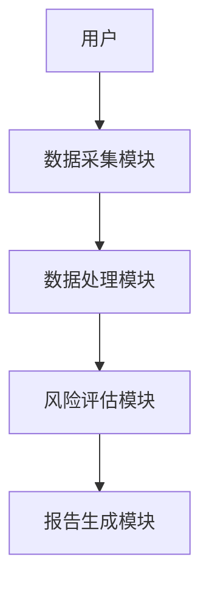

                 


# 《格雷厄姆特价股票理论对现代风险管理的启示》

## 关键词：格雷厄姆投资理论，风险管理，价值投资，安全边际，VaR，压力测试，风险管理算法

## 摘要：本文探讨格雷厄姆的价值投资理论如何对现代风险管理产生启示，分析安全边际、内在价值等概念在现代风险管理中的应用，并结合数学模型、算法和系统设计，展示如何将格雷厄姆的理论与现代风险管理方法相结合，以提高风险管理和投资决策的科学性和有效性。

---

## 第1章：格雷厄姆特价股票理论的核心理念

### 1.1 格雷厄姆投资理论的背景与起源

#### 1.1.1 20世纪初的华尔街投资环境

在20世纪初，华尔街的投资环境充满了不确定性和波动性。投资者们在股票市场的暴涨暴跌中寻求稳定的投资策略。格雷厄姆作为早期的价值投资者，意识到市场的非理性波动和投资者情绪的不可预测性，从而提出了一套以基本面分析为核心的投资理论。

#### 1.1.2 格雷厄姆与巴菲特的价值投资理念

格雷厄姆与巴菲特的价值投资理念强调购买低于内在价值的股票，即“廉价购买”。格雷厄姆通过计算公司的内在价值，寻找市场价格低于其价值的股票。巴菲特则进一步发展了这一理论，强调长期投资和公司的持续价值创造能力。

#### 1.1.3 安全边际的概念与重要性

安全边际是格雷厄姆理论中的核心概念，指的是市场价格与内在价值之间的差距。通过预留安全边际，投资者可以在市场波动中降低风险，确保投资的稳健性。安全边际的存在为投资者提供了缓冲区，避免因市场价格波动而造成损失。

### 1.2 特价股票理论的核心要素

#### 1.2.1 特价股票的定义与特征

特价股票是指市场价格低于其内在价值的股票。其特征包括低市盈率、低市净率、高股息率等，通常出现在市场低迷或公司暂时遇到困难时。

#### 1.2.2 市值与内在价值的计算方法

内在价值是基于公司财务状况和未来盈利能力计算的理论价值。格雷厄姆常用的方法包括DCF（现金流折现法）和资产净值法。市场价格与内在价值的差距即为安全边际。

#### 1.2.3 投资组合构建的原则与策略

格雷厄姆建议构建一个分散的投资组合，涵盖不同行业和公司的股票，以降低特定风险。同时，投资组合中的股票应具备较高的安全边际，确保在市场波动中保持稳健。

### 1.3 格雷厄姆理论在现代风险管理中的应用

#### 1.3.1 风险管理的基本概念与框架

风险管理涉及识别、评估和应对潜在风险，以降低其对投资组合的影响。格雷厄姆的理论为风险管理提供了基础，强调通过安全边际和基本面分析来降低风险。

#### 1.3.2 格雷厄姆理论与现代风险管理的联系

格雷厄姆的安全边际理念与现代风险管理中的风险调整后收益（RAROC）等方法有相似之处。两者都强调在投资决策中考虑风险因素，以实现长期稳健的收益。

#### 1.3.3 理论在金融市场的实际案例分析

通过分析历史案例，如2008年金融危机，可以发现格雷厄姆理论在风险管理中的有效性。在危机期间，采用价值投资策略的投资者因其对安全边际的重视，能够有效规避系统性风险。

---

## 第2章：现代风险管理的核心概念与方法

### 2.1 现代风险管理的理论基础

#### 2.1.1 风险的定义与分类

风险是指投资收益的不确定性，通常分为系统性风险和非系统性风险。系统性风险影响整个市场，而非系统性风险仅影响特定资产。

#### 2.1.2 风险管理的目标与流程

风险管理的目标是通过识别和应对潜在风险，降低投资组合的损失概率。流程包括风险识别、评估、应对和监控。

#### 2.1.3 风险度量的常用指标

常用的风险度量指标包括标准差、VaR（风险价值）和RAROC（风险调整后收益）。这些指标帮助投资者量化风险并做出决策。

### 2.2 格雷厄姆理论与现代风险管理的对比分析

#### 2.2.1 格雷厄姆理论的局限性

格雷厄姆理论主要适用于长期投资，且依赖于准确的内在价值计算。在面对市场结构性变化时，其有效性可能受到限制。

#### 2.2.2 现代风险管理的优势与不足

现代风险管理方法如VaR和压力测试提供了更全面的度量工具，但过度依赖数学模型可能导致对市场复杂性的忽视。

#### 2.2.3 两者的结合与互补

将格雷厄姆的安全边际理念与现代风险管理方法结合，可以在定量分析的基础上，加入定性因素，提高风险管理的有效性。

### 2.3 风险管理中的数学模型与工具

#### 2.3.1 风险价值（VaR）的计算方法

VaR计算的是在一定置信水平下，投资组合的最大潜在损失。其计算方法包括历史模拟法、方差-协方差法和蒙特卡洛模拟法。

#### 2.3.2 压力测试的原理与应用

压力测试用于评估投资组合在极端市场条件下的表现。常用的情景包括市场崩盘、利率上升和经济衰退等。

#### 2.3.3 风险调整后的收益（RAROC）的计算

RAROC是将投资收益与风险调整后的净收益之比，用于衡量单位风险的投资回报。

---

## 第3章：风险管理的算法原理与实现

### 3.1 风险管理的算法概述

#### 3.1.1 基于历史数据的风险评估方法

通过历史数据分析市场波动和资产回报，识别潜在风险因素。

#### 3.1.2 基于蒙特卡洛模拟的风险预测模型

蒙特卡洛模拟通过随机抽样模拟市场情景，评估投资组合在不同情况下的表现。

#### 3.1.3 基于机器学习的风险分类算法

使用机器学习算法如随机森林和神经网络，识别影响风险的关键因素。

### 3.2 风险管理算法的实现步骤

#### 3.2.1 数据采集与预处理

从多个数据源获取资产价格、财务报表等数据，并进行清洗和标准化。

#### 3.2.2 模型训练与参数优化

选择合适的模型并进行参数调整，以提高预测精度。

#### 3.2.3 模型验证与评估

通过回测和交叉验证评估模型的性能，确保其有效性和稳健性。

### 3.3 风险管理算法的数学模型

#### 3.3.1 均值-方差优化模型

$$ \text{Minimize } \sigma^2 \text{ subject to } \mathbf{w}^T \mathbf{r} = r_p $$

其中，$$\sigma^2$$是投资组合的方差，$$\mathbf{w}$$是权重向量，$$\mathbf{r}$$是收益向量，$$r_p$$是目标收益。

#### 3.3.2 风险价值（VaR）的计算公式

$$ \text{VaR}(\alpha) = \text{Value at risk at } \alpha \text{ confidence level} $$

#### 3.3.3 压力测试的数学框架

压力测试通常涉及极端情景分析，例如：

$$ \text{Market crash scenario: } S_t \rightarrow S_t \times (1 - \text{stress factor}) $$

---

## 第4章：风险管理系统的分析与设计

### 4.1 系统分析与需求分析

#### 4.1.1 系统目标与功能需求

系统目标是提供全面的风险管理解决方案，功能需求包括数据采集、风险评估和报告生成。

#### 4.1.2 用户角色与权限分配

用户角色包括管理员、投资经理和数据分析师，权限分配需确保数据安全和操作便捷。

#### 4.1.3 数据流与信息交互

系统通过数据接口获取实时市场数据和财务报表，进行风险评估并生成报告。

### 4.2 系统架构设计

#### 4.2.1 分层架构设计

系统分为数据层、业务逻辑层和用户界面层，确保模块化和可扩展性。

#### 4.2.2 模块划分与功能分配

模块包括数据采集、风险评估、报告生成和用户管理，每个模块负责特定功能。

#### 4.2.3 模块交互关系设计

模块之间通过API进行交互，确保数据流的顺畅和功能的协同。

---

## 第5章：风险管理系统的实现

### 5.1 系统实现的基础环境

#### 5.1.1 开发工具的安装与配置

使用Python和Jupyter Notebook进行开发，安装必要的库如Pandas、NumPy和Scikit-learn。

#### 5.1.2 数据库的选择与搭建

选择MySQL或MongoDB作为数据库，确保数据存储和查询效率。

#### 5.1.3 依赖库的安装与管理

使用pip安装必要的库，如pandas、numpy、scipy等。

### 5.2 核心功能模块的实现

#### 5.2.1 数据采集模块的实现

通过API获取市场数据，并进行清洗和预处理。

#### 5.2.2 风险评估模块的实现

基于历史数据和机器学习模型进行风险评估，生成VaR和压力测试报告。

#### 5.2.3 报告生成模块的实现

自动生成风险评估报告，包括图表和数据可视化。

### 5.3 系统测试与优化

#### 5.3.1 功能测试与验证

测试各模块的功能，确保系统运行正常。

#### 5.3.2 性能优化与调整

优化算法和数据结构，提高系统的运行效率。

#### 5.3.3 安全性测试与防护

加强系统安全性，防止数据泄露和网络攻击。

---

## 第6章：项目实战与案例分析

### 6.1 实战环境的搭建

#### 6.1.1 开发环境的配置

安装必要的开发工具和库，确保系统运行环境稳定。

#### 6.1.2 数据集的获取与预处理

收集历史市场数据和财务报表，进行清洗和标准化。

#### 6.1.3 模型的训练与部署

训练机器学习模型，并将其部署到系统中。

### 6.2 核心代码实现

#### 6.2.1 数据处理的Python代码

```python
import pandas as pd
import numpy as np

# 数据加载
df = pd.read_csv('market_data.csv')

# 数据清洗
df.dropna(inplace=True)
df = df[~df['close'].isin([np.nan])]

# 数据标准化
df['normalized_price'] = (df['close'] - df['close'].mean()) / df['close'].std()
```

#### 6.2.2 模型训练的Python代码

```python
from sklearn.ensemble import RandomForestRegressor
from sklearn.metrics import mean_squared_error

# 数据分割
X = df.drop('close', axis=1)
y = df['close']

# 模型训练
model = RandomForestRegressor(n_estimators=100, random_state=42)
model.fit(X, y)

# 模型评估
y_pred = model.predict(X)
print(mean_squared_error(y, y_pred))
```

#### 6.2.3 系统报告生成的代码

```python
import matplotlib.pyplot as plt

# 图表生成
plt.figure(figsize=(10, 6))
plt.plot(df['date'], df['close'], label='Market Price')
plt.xlabel('Date')
plt.ylabel('Price')
plt.title('Market Price Trend')
plt.legend()
plt.show()
```

### 6.3 实战案例分析

#### 6.3.1 案例背景介绍

以某股票为例，分析其历史价格波动和风险因素。

#### 6.3.2 数据分析与处理

使用上述代码进行数据清洗和建模，识别影响股票价格的关键因素。

#### 6.3.3 模型评估与优化

通过回测和参数调整，提高模型的预测精度和稳健性。

### 6.4 案例总结与经验分享

#### 6.4.1 成功经验总结

成功的经验包括准确的数据处理、合适的模型选择和有效的系统设计。

#### 6.4.2 常见问题与解决方案

常见问题包括数据缺失、模型过拟合等，解决方案包括数据补全和正则化方法。

#### 6.4.3 未来改进方向

未来可以考虑引入更多数据源、优化算法和增强系统的实时性。

---

## 第7章：总结与展望

### 7.1 全书总结

本文探讨了格雷厄姆的价值投资理论对现代风险管理的启示，分析了安全边际、内在价值等概念在风险管理中的应用，并结合数学模型、算法和系统设计，展示了如何将理论与实践相结合，提高风险管理的科学性和有效性。

### 7.2 未来展望

未来，随着人工智能和大数据技术的发展，风险管理将更加智能化和个性化。格雷厄姆的理论将继续为现代风险管理提供重要启示，同时需要结合新技术，推动风险管理领域的创新与发展。

---

## 附录

### 附录A：相关术语解释

- 内在价值：公司未来现金流的现值，用于评估股票的合理价格。
- 安全边际：市场价格与内在价值的差距，用于降低投资风险。

### 附录B：常用数学公式汇总

- 均值-方差优化模型：$$ \text{Minimize } \sigma^2 \text{ subject to } \mathbf{w}^T \mathbf{r} = r_p $$
- 风险价值（VaR）：$$ \text{VaR}(\alpha) = \text{Value at risk at } \alpha \text{ confidence level} $$

### 附录C：系统架构图



### 附录D：代码片段索引

- 数据处理代码：```python
import pandas as pd
import numpy as np

# 数据加载
df = pd.read_csv('market_data.csv')

# 数据清洗
df.dropna(inplace=True)
df = df[~df['close'].isin([np.nan])]

# 数据标准化
df['normalized_price'] = (df['close'] - df['close'].mean()) / df['close'].std()
```

---

## 参考文献

1. 格雷厄姆, B. F. (1974). 《聪明的投资者》。
2. 巴菲特, W. (1984). 《巴菲特致股东的信》。
3. Jorion, C. (2001). 《Value at Risk: The New Benchmark for Portfolio Risk Management》。
4. Hull, J. C. (2005). 《期权、期货和其他衍生产品》。

---

## 作者信息

作者：AI天才研究院/AI Genius Institute & 禅与计算机程序设计艺术 /Zen And The Art of Computer Programming

---

通过以上结构和内容安排，文章系统地探讨了格雷厄姆特价股票理论对现代风险管理的启示，结合理论分析、数学模型和系统实现，为读者提供了全面而深入的见解。

