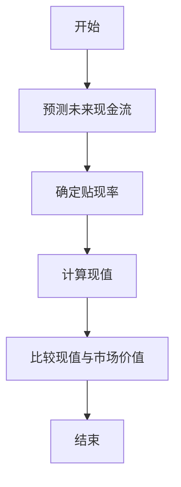

                 


# 现金流折现模型：企业内在价值的科学估算方法

## 关键词：
现金流折现模型, 内在价值, 贴现率, 财务分析, 企业估值

## 摘要：
现金流折现模型（DCF模型）是一种科学估算企业内在价值的重要方法。本文从现金流折现模型的基本原理出发，详细讲解其核心概念、算法原理、系统架构设计以及实际项目应用，帮助读者全面理解并掌握这一方法。通过本文的学习，读者可以掌握现金流折现模型的理论基础、数学模型、算法实现以及实际应用技巧。

---

# 第一部分: 现金流折现模型基础

## 第1章: 现金流折现模型的背景与概述

### 1.1 现金流折现模型的起源与发展

#### 1.1.1 资本资产定价模型的提出
资本资产定价模型（CAPM）是现代金融学的重要基石，它为资产定价提供了理论依据。CAPM的核心思想是：资产的预期收益与其系统性风险（beta）密切相关。CAPM的公式为：
$$E(r_i) = r_f + \beta_i (E(r_m) - r_f)$$
其中，$r_f$ 是无风险利率，$E(r_m)$ 是市场预期收益率，$\beta_i$ 是资产的beta系数。

#### 1.1.2 现金流折现模型的提出与发展
现金流折现模型（DCF模型）起源于20世纪中期，其核心思想是将企业未来产生的现金流贴现到现值，以评估企业的内在价值。DCF模型的基础是“资金的时间价值”理论，即未来的钱比现在的钱值钱，除非投资回报率低于无风险利率。

#### 1.1.3 现金流折现模型在投资决策中的应用
DCF模型在企业估值、并购决策、资本预算等方面具有广泛的应用。例如，投资者可以通过DCF模型估算一家公司的内在价值，判断其股票是否被市场高估或低估。

---

### 1.2 现金流折现模型的基本原理

#### 1.2.1 现金流折现的核心思想
现金流折现模型的核心思想是将企业未来产生的所有现金流折现到当前时点的现值，这个现值即为企业的内在价值。公式为：
$$PV = \sum_{t=1}^{n} \frac{CF_t}{(1 + r)^t}$$
其中，$CF_t$ 是第$t$年的现金流，$r$ 是贴现率，$n$ 是现金流的时间跨度。

#### 1.2.2 现金流折现模型的数学表达式
DCF模型的数学表达式可以分为两部分：自由现金流的计算和贴现。自由现金流公式为：
$$FCF = \text{EBITDA} - \text{资本支出} - \text{营运资金变化}$$
贴现公式为：
$$PV = \frac{FCF}{(1 + r)^t}$$

#### 1.2.3 现金流折现模型的应用场景
DCF模型适用于长期股权投资、企业并购、资本预算等场景。例如，企业在进行资本预算决策时，可以通过DCF模型评估项目的净现值（NPV），从而决定是否投资。

---

### 1.3 现金流折现模型的优缺点

#### 1.3.1 优点：科学性与精确性
DCF模型基于现金流的现值计算，能够科学地反映企业的未来盈利能力，是一种较为精确的企业估值方法。

#### 1.3.2 缺点：假设的局限性
DCF模型依赖于对未来现金流的预测和贴现率的选择，而这些假设往往具有较大的主观性和不确定性。例如，如果企业未来现金流预测不准确，或者贴现率选择不合理，将导致内在价值估算偏差。

#### 1.3.3 实际应用中的注意事项
在实际应用中，投资者需要结合行业特点、市场环境等因素，对DCF模型的假设进行合理调整，并结合其他估值方法（如市盈率、市净率等）进行交叉验证。

---

## 第2章: 现金流折现模型的核心概念与联系

### 2.1 现金流的定义与分类

#### 2.1.1 现金流的定义
现金流是指企业在一定时期内通过经营、投资和融资活动所获得或支出的现金和现金等价物。现金流是企业财务健康状况的重要指标。

#### 2.1.2 现金流的分类
现金流可以分为三类：
1. **经营性现金流**：来自企业日常经营活动中产生的现金流入和流出。
2. **投资性现金流**：来自企业投资活动（如购买或出售资产）产生的现金流入和流出。
3. **融资性现金流**：来自企业融资活动（如发行债券、偿还贷款）产生的现金流入和流出。

#### 2.1.3 现金流的时间价值
现金流的时间价值是指资金随着时间的推移而产生的价值变化。资金的时间价值可以用贴现率来衡量。

---

### 2.2 贴现率的定义与计算

#### 2.2.1 贴现率的定义
贴现率是指将未来现金流折现到现值时所使用的利率。贴现率反映了资金的机会成本，即投资者将资金投资于其他风险相当的资产所能获得的最低收益。

#### 2.2.2 贴现率的计算方法
贴现率的计算通常基于资本资产定价模型（CAPM）或加权平均资本成本（WACC）模型。

- **CAPM模型**：
$$r = r_f + \beta \times (E(r_m) - r_f)$$
其中，$r_f$ 是无风险利率，$\beta$ 是beta系数，$E(r_m)$ 是市场预期收益率。

- **WACC模型**：
$$WACC = \left( \frac{D}{D+E} \right) \times r_d \times (1 - t) + \left( \frac{E}{D+E} \right) \times r_e$$
其中，$D$ 是债务总额，$E$ 是股权总额，$r_d$ 是债务成本，$t$ 是税率，$r_e$ 是股权成本。

#### 2.2.3 贴现率的影响因素
贴现率受无风险利率、市场风险溢价、企业特定风险等因素的影响。

---

### 2.3 内在价值的定义与计算

#### 2.3.1 内在价值的定义
内在价值是指企业在正常经营条件下，通过未来现金流的现值计算出的理论价值，不考虑市场波动和外部干扰。

#### 2.3.2 内在价值的计算公式
$$IV = \sum_{t=1}^{n} \frac{CF_t}{(1 + r)^t}$$
其中，$IV$ 是内在价值，$CF_t$ 是第$t$年的现金流，$r$ 是贴现率。

#### 2.3.3 内在价值与市场价值的关系
内在价值与市场价值可能存在差异，当市场价值低于内在价值时，企业可能被低估；当市场价值高于内在价值时，企业可能被高估。

---

### 2.4 现金流折现模型的核心要素对比

#### 2.4.1 模型对比表格
| 模型 | 定义 | 适用场景 | 优点 | 缺点 |
|------|------|----------|------|------|
| DCF | 基于未来现金流的现值计算企业价值 | 企业估值、资本预算 | 精确性高 | 假设依赖性强 |
| DDM | 基于股息的现值计算股票价值 | 股票估值 | 简单易懂 | 适用于高分红企业 |
| WACC | 基于加权平均资本成本计算贴现率 | 企业估值 | 考虑资本结构 | 计算复杂 |

#### 2.4.2 ER实体关系图
```mermaid
ERDiagram
       企业
       o<----(1) 股东
       o<----(1) 债务人
       o<----(1) 股票
       o<----(1) 资产
```

---

## 第3章: 现金流折现模型的算法原理

### 3.1 现金流折现模型的算法流程

#### 3.1.1 现金流折现模型的步骤
1. **预测未来现金流**：根据企业的历史财务数据和行业趋势，预测未来自由现金流。
2. **确定贴现率**：基于CAPM或WACC模型计算贴现率。
3. **计算现值**：将未来现金流贴现到当前时点，计算现值。
4. **比较现值与市场价值**：判断企业是否被低估或高估。

#### 3.1.2 现金流预测与贴现
- **现金流预测**：需要考虑企业的营业收入、成本、资本支出等因素。
- **贴现**：使用公式$PV = \frac{CF_t}{(1 + r)^t}$将未来现金流折现。

#### 3.1.3 内在价值计算与比较
- **内在价值计算**：将所有未来现金流的现值相加，得到企业的内在价值。
- **比较**：将内在价值与市场价值进行比较，得出企业的投资价值。

---

### 3.2 现金流折现模型的数学模型

#### 3.2.1 现金流贴现公式
$$PV = \sum_{t=1}^{n} \frac{CF_t}{(1 + r)^t}$$
其中，$CF_t$ 是第$t$年的现金流，$r$ 是贴现率，$n$ 是现金流的时间跨度。

#### 3.2.2 终值公式
$$FV = PV \times (1 + r)^n$$
其中，$FV$ 是终值，$PV$ 是现值，$r$ 是贴现率，$n$ 是时间跨度。

---

### 3.3 现金流折现模型的算法实现

#### 3.3.1 算法流程图（Mermaid）


#### 3.3.2 Python代码实现
```python
import numpy as np

def discounted_cash_flows(cash_flows, discount_rate):
    return np.sum([cf / (1 + discount_rate) ** t for t, cf in enumerate(cash_flows)])

# 示例数据
cash_flows = [100, 200, 300]  # 未来三年的现金流
discount_rate = 0.10  # 贴现率

# 计算现值
pv = discounted_cash_flows(cash_flows, discount_rate)
print(f"现值：{pv}")
```

---

## 第4章: 现金流折现模型的系统分析与架构设计

### 4.1 系统分析

#### 4.1.1 问题场景介绍
以一家制造企业为例，假设我们需要估算该企业的内在价值。首先，我们需要收集企业的财务数据，包括营业收入、成本、资本支出等。

#### 4.1.2 系统功能设计
- **财务数据输入**：输入企业的财务数据，包括营业收入、成本、资本支出等。
- **现金流预测**：基于历史数据和行业趋势，预测未来自由现金流。
- **贴现率计算**：基于CAPM或WACC模型计算贴现率。
- **现值计算**：将未来现金流贴现到现值。
- **结果输出**：输出企业的内在价值，并与市场价值进行比较。

#### 4.1.3 系统架构设计（Mermaid）


---

## 第5章: 项目实战——现金流折现模型的应用

### 5.1 项目背景
假设我们是一家制造企业的投资者，我们需要估算该企业的内在价值，以判断其股票是否被低估或高估。

---

### 5.2 环境配置

#### 5.2.1 安装所需的Python库
```bash
pip install numpy pandas
```

---

### 5.3 系统核心实现

#### 5.3.1 现金流预测与贴现
```python
import numpy as np

def calculate_intrinsic_value(cash_flows, discount_rate):
    return np.sum([cf / (1 + discount_rate) ** t for t, cf in enumerate(cash_flows)])

# 示例数据
cash_flows = [100, 200, 300]  # 未来三年的现金流
discount_rate = 0.10  # 贴现率

# 计算内在价值
iv = calculate_intrinsic_value(cash_flows, discount_rate)
print(f"内在价值：{iv}")
```

#### 5.3.2 现金流预测
```python
import pandas as pd

# 假设企业过去三年的现金流数据
cash_flow_history = [80, 90, 100]  # 单位：万元

# 预测未来三年的现金流（假设每年增长5%）
future_cash_flows = [round(cf * 1.05, 2) for cf in cash_flow_history]
print(f"未来三年的现金流：{future_cash_flows}")
```

---

### 5.4 案例分析与结果解读

#### 5.4.1 案例分析
以某制造企业为例，假设企业未来三年的现金流分别为100万元、120万元和150万元，贴现率为10%。

计算其内在价值：
$$PV = \frac{100}{(1 + 0.10)^1} + \frac{120}{(1 + 0.10)^2} + \frac{150}{(1 + 0.10)^3}$$
$$PV = 90.91 + 100.00 + 115.76 = 306.67 \text{万元}$$

假设该企业的市场价值为300万元，低于内在价值，说明该企业可能被低估。

#### 5.4.2 结果解读
通过DCF模型计算出的企业内在价值为306.67万元，而市场价值为300万元，表明该企业可能被市场低估，具有投资价值。

---

## 第6章: 最佳实践与小结

### 6.1 最佳实践

#### 6.1.1 理论基础
DCF模型的理论基础是资金的时间价值，投资者需要理解贴现率的计算方法和现金流预测的重要性。

#### 6.1.2 实际应用
在实际应用中，DCF模型需要结合企业的实际情况，合理调整假设参数。例如，如果企业未来现金流预测难度较大，可以采用保守的预测方法。

#### 6.1.3 注意事项
- 确保现金流预测的准确性。
- 合理选择贴现率。
- 结合其他估值方法进行交叉验证。

---

### 6.2 小结

现金流折现模型是一种科学估算企业内在价值的重要方法，其核心在于将未来现金流折现到现值，以反映资金的时间价值。然而，DCF模型的假设具有一定的主观性和不确定性，因此在实际应用中需要结合企业的实际情况和市场环境，合理调整假设参数，并结合其他估值方法进行综合判断。

---

## 作者：AI天才研究院/AI Genius Institute & 禅与计算机程序设计艺术 /Zen And The Art of Computer Programming

---

**本文通过系统的分析和详细的讲解，帮助读者全面理解现金流折现模型的理论基础、数学模型和实际应用，为企业的内在价值估算提供了科学的方法。**

