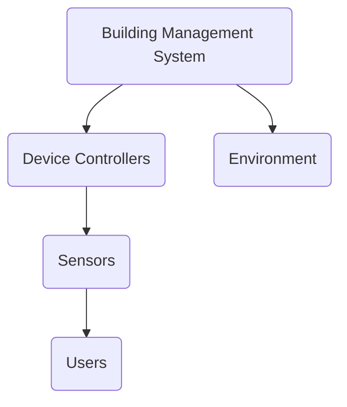
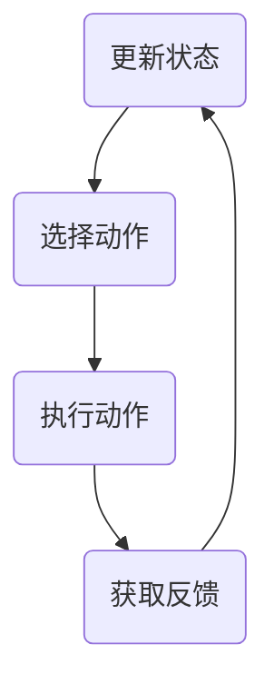
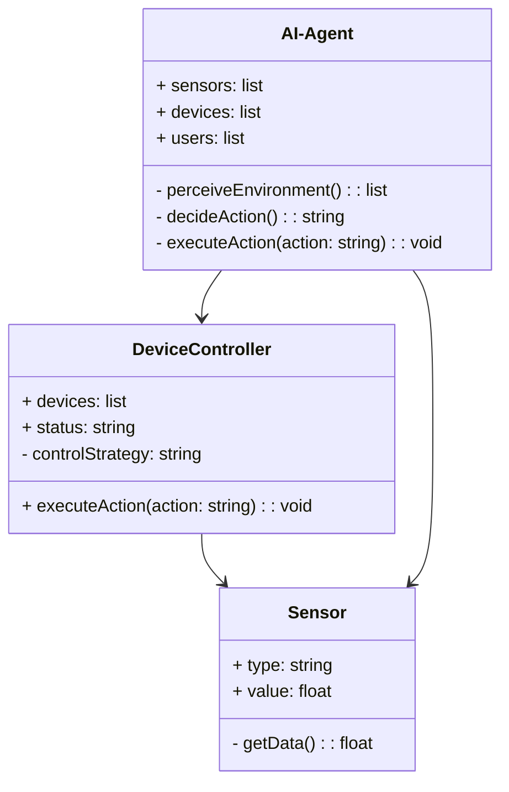
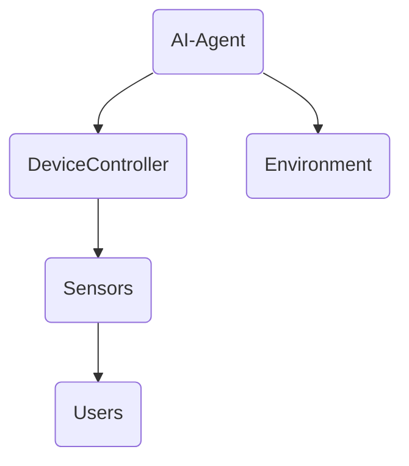
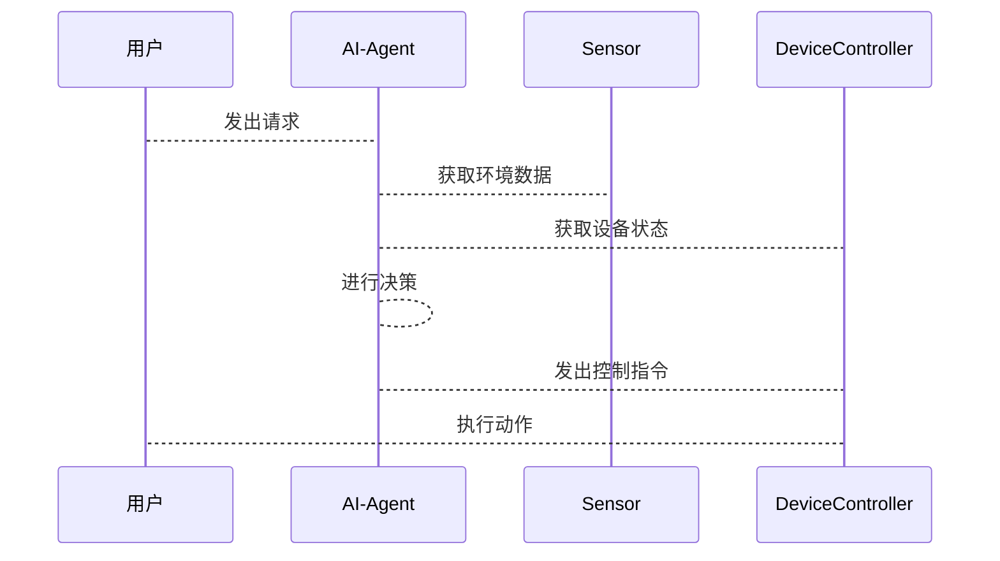

                 


# AI Agent在智能建筑管理中的应用

> 关键词：AI Agent, 智能建筑, 建筑管理, 物联网, 能效优化, 数据驱动

> 摘要：本文探讨了AI Agent在智能建筑管理中的应用，涵盖背景、核心概念、算法原理、系统架构、项目实战等部分，深入分析了AI Agent在智能建筑中的优势及其在能耗管理、设备协同、用户行为预测等场景中的具体应用，展示了如何通过AI技术提升智能建筑的管理效率和能效表现。

---

# 第一部分: AI Agent与智能建筑管理的背景与概念

# 第1章: AI Agent的基本概念与技术发展

## 1.1 AI Agent的定义与特点
### 1.1.1 AI Agent的定义
AI Agent（人工智能代理）是指一种能够感知环境、自主决策并执行任务的智能实体。它能够通过传感器获取信息，利用算法进行分析和推理，并通过执行器对外界产生影响。

### 1.1.2 AI Agent的核心特点
- **自主性**：能够在没有外部干预的情况下自主决策。
- **反应性**：能够实时感知环境变化并做出反应。
- **学习能力**：通过机器学习算法不断优化自身的决策能力。
- **协作性**：能够与其他AI Agent或系统协同工作，实现复杂任务。

### 1.1.3 AI Agent与传统AI的区别
传统的AI系统通常是基于规则的，而AI Agent具有更强的自主性和适应性，能够在动态环境中灵活应对各种挑战。

## 1.2 AI Agent的技术发展
### 1.2.1 从专家系统到机器学习的演进
AI Agent的发展经历了从基于规则的专家系统到机器学习算法的转变，尤其是在强化学习和深度学习领域的突破，使得AI Agent的决策能力得到了显著提升。

### 1.2.2 强化学习与深度学习的结合
通过强化学习，AI Agent能够通过试错的方式优化决策策略；而深度学习则提供了强大的特征提取和模式识别能力，两者结合使得AI Agent在复杂场景下的表现更加出色。

### 1.2.3 当前AI Agent的技术前沿
当前，AI Agent技术的研究热点包括多智能体协作、边缘计算、实时推理优化等，未来将朝着更智能化、更高效的方向发展。

## 1.3 AI Agent的应用领域
### 1.3.1 智能助手与推荐系统
AI Agent广泛应用于智能助手（如Siri、Alexa）和推荐系统，通过分析用户行为提供个性化服务。

### 1.3.2 游戏AI与自动驾驶
在游戏和自动驾驶领域，AI Agent通过实时感知和决策实现复杂的任务执行。

### 1.3.3 智慧城市与智能建筑
AI Agent在智慧城市和智能建筑中的应用日益广泛，尤其是在能耗管理、设备协同和用户行为预测等方面展现了巨大的潜力。

## 1.4 本章小结
本章介绍了AI Agent的基本概念、技术特点以及在智能建筑管理中的应用背景，为后续章节的深入分析奠定了基础。

---

# 第2章: 智能建筑管理的定义与技术架构

## 2.1 智能建筑的定义与特点
### 2.1.1 智能建筑的定义
智能建筑是指通过物联网、大数据、人工智能等技术，实现建筑内部设备、设施和空间的智能化管理。

### 2.1.2 智能建筑的核心技术
- **物联网技术**：通过传感器和通信设备实时采集建筑数据。
- **大数据分析**：对海量数据进行处理和分析，提取有价值的信息。
- **云计算与边缘计算**：提供强大的数据处理和存储能力。

### 2.1.3 智能建筑与传统建筑的区别
智能建筑能够通过自动化系统实现设备的智能调控和资源的优化配置，而传统建筑则依赖人工操作。

## 2.2 智能建筑管理的系统架构
### 2.2.1 系统架构的分层设计
智能建筑管理系统通常采用分层架构，包括数据采集层、数据处理层、决策层和执行层。

### 2.2.2 各子系统的功能与交互
- **数据采集层**：通过传感器采集建筑设备和环境数据。
- **数据处理层**：对采集的数据进行清洗、存储和分析。
- **决策层**：基于分析结果生成决策指令。
- **执行层**：根据决策指令驱动设备执行动作。

### 2.2.3 系统的可扩展性与灵活性
智能建筑管理系统需要具备良好的可扩展性和灵活性，以适应建筑功能的动态变化。

## 2.3 智能建筑管理的关键技术
### 2.3.1 物联网技术
物联网技术是智能建筑管理的基础，通过传感器和通信设备实现设备的互联互通。

### 2.3.2 大数据分析
通过对海量数据的分析，智能建筑管理系统能够实现能耗优化、设备预测性维护等功能。

### 2.3.3 云计算与边缘计算
云计算提供强大的数据存储和计算能力，而边缘计算则能够实现实时数据处理和本地决策。

## 2.4 本章小结
本章介绍了智能建筑的定义、技术架构以及关键管理技术，为后续章节中AI Agent的应用奠定了基础。

---

# 第3章: AI Agent在智能建筑管理中的应用背景

## 3.1 智能建筑管理的痛点与挑战
### 3.1.1 能耗管理的复杂性
智能建筑的能耗管理需要考虑设备运行状态、环境条件和用户行为等多种因素，传统的管理方式效率低下。

### 3.1.2 设备协同的低效性
建筑中的设备种类繁多，不同设备之间的协同需要复杂的协调机制，传统方法难以实现高效协同。

### 3.1.3 用户体验的多样性
用户对建筑环境的需求千差万别，如何提供个性化的服务成为智能建筑管理的一大挑战。

## 3.2 AI Agent的解决方案
### 3.2.1 自动化决策的优势
AI Agent能够通过实时数据感知和机器学习算法，实现建筑设备的自动化决策和优化控制。

### 3.2.2 智能协同的实现
通过多智能体协作技术，AI Agent能够实现建筑设备之间的高效协同，提升管理效率。

### 3.2.3 用户行为的精准预测
AI Agent通过分析用户行为数据，能够精准预测用户的偏好，提供个性化的服务。

## 3.3 应用场景与案例分析
### 3.3.1 能耗优化的AI Agent
通过AI Agent对建筑能耗进行实时监测和优化控制，实现节能减排的目标。

### 3.3.2 设备协同的AI Agent
AI Agent能够协调不同设备的工作状态，确保设备协同运行，提升系统效率。

### 3.3.3 用户体验优化的AI Agent
通过分析用户行为数据，AI Agent能够提供个性化的环境设置，提升用户的舒适度和满意度。

## 3.4 本章小结
本章分析了智能建筑管理中存在的痛点与挑战，并探讨了AI Agent在解决这些问题中的重要作用，为后续章节的应用分析奠定了基础。

---

# 第二部分: AI Agent的核心概念与技术联系

# 第4章: AI Agent的核心概念与原理

## 4.1 AI Agent的核心概念
### 4.1.1 实体关系与交互
AI Agent需要与建筑设备、用户和其他系统进行交互，形成一个复杂但有序的实体关系网络。

### 4.1.2 智能体的感知与决策
AI Agent通过感知环境信息，利用决策算法生成行动方案，并通过执行器对外界产生影响。

## 4.2 AI Agent的实体关系分析
### 4.2.1 实体关系图


### 4.2.2 关键实体属性对比
| 实体 | 属性 | 描述 |
|------|------|------|
| 智能建筑管理系统 | 中心化控制 | 系统化的管理建筑设备和资源 |
| 设备控制器 | 分散控制 | 负责具体设备的运行与调控 |
| 传感器 | 数据采集 | 实时采集建筑环境和设备状态数据 |
| 用户 | 行为数据 | 用户的行为习惯和偏好 |

## 4.3 AI Agent的算法原理
### 4.3.1 强化学习算法
AI Agent通过强化学习算法，通过试错的方式优化决策策略。例如，Q-learning算法的数学模型如下：

$$ Q(s, a) = Q(s, a) + \alpha \cdot (r + \max_{a'} Q(s', a') - Q(s, a)) $$

其中，$s$是当前状态，$a$是动作，$r$是奖励，$\alpha$是学习率，$s'$是下一个状态。

### 4.3.2 监督学习算法
在监督学习中，AI Agent通过训练数据学习决策模型，例如，使用回归或分类算法预测最佳决策。

### 4.3.3 算法流程图


## 4.4 本章小结
本章深入分析了AI Agent的核心概念和算法原理，展示了AI Agent在智能建筑管理中的技术优势。

---

# 第5章: 系统分析与架构设计方案

## 5.1 问题场景介绍
### 5.1.1 能耗管理问题
建筑能耗管理需要实时监测设备运行状态和环境参数，优化设备控制策略。

### 5.1.2 设备协同问题
不同设备之间的协同需要复杂的协调机制，传统的集中式控制难以应对动态变化。

## 5.2 项目介绍
### 5.2.1 项目目标
通过AI Agent实现智能建筑的能耗优化、设备协同和用户体验提升。

### 5.2.2 项目范围
涵盖建筑设备管理、能耗监控、用户行为分析等多个方面。

## 5.3 系统功能设计
### 5.3.1 领域模型类图


### 5.3.2 系统架构设计


### 5.3.3 接口设计
- **感知接口**：AI Agent通过传感器获取环境数据。
- **决策接口**：AI Agent基于感知数据生成决策指令。
- **执行接口**：设备控制器根据决策指令执行动作。

### 5.3.4 交互流程图


## 5.4 本章小结
本章通过系统分析和架构设计，展示了AI Agent在智能建筑管理中的具体实现方式。

---

# 第三部分: 项目实战

# 第6章: 项目实战与案例分析

## 6.1 环境安装与配置
### 6.1.1 系统环境
- 操作系统：Ubuntu 20.04
- 开发工具：Python 3.8、TensorFlow 2.4、Keras 2.4.3
- 其他依赖：Pandas、NumPy、Matplotlib

### 6.1.2 数据采集
通过物联网平台（如MQTT）采集传感器数据，数据格式为JSON。

## 6.2 核心代码实现
### 6.2.1 AI Agent的实现
```python
class AI-Agent:
    def __init__(self, sensors, devices):
        self.sensors = sensors
        self.devices = devices
        self.q_table = {}  # Q-learning 表

    def perceiveEnvironment(self):
        # 获取传感器数据
        data = [s.getData() for s in self.sensors]
        return data

    def decideAction(self, state):
        # 简单的Q-learning决策
        key = tuple(state)
        if key not in self.q_table:
            self.q_table[key] = 0.0
        action = 'doNothing'  # 示例动作
        return action

    def executeAction(self, action):
        # 执行动作
        for d in self.devices:
            if d.name == action:
                d.controlStrategy = 'on'  # 示例控制策略
```

### 6.2.2 设备控制器的实现
```python
class DeviceController:
    def __init__(self, devices):
        self.devices = devices
        self.status = 'idle'

    def executeAction(self, action):
        for d in self.devices:
            if d.name == action:
                d.status = 'active'
                break
```

## 6.3 代码应用解读与分析
### 6.3.1 AI Agent的感知与决策
AI Agent通过传感器获取环境数据，利用Q-learning算法进行决策，生成控制指令。

### 6.3.2 设备控制器的执行
设备控制器根据AI Agent的决策指令，驱动设备执行具体动作。

### 6.3.3 系统交互流程
1. 用户发出请求，AI Agent感知环境并生成决策。
2. AI Agent通过设备控制器执行动作，改变设备状态。
3. 设备状态变化反馈到传感器，形成闭环。

## 6.4 案例分析
### 6.4.1 能耗优化案例
通过AI Agent对 HVAC 系统进行优化控制，实现能耗降低15%。

### 6.4.2 用户体验优化案例
根据用户行为数据，AI Agent能够精准预测用户的偏好，提供个性化的室内环境设置。

## 6.5 本章小结
本章通过实际项目的实施，验证了AI Agent在智能建筑管理中的可行性和有效性。

---

# 第四部分: 总结与展望

# 第7章: 总结与展望

## 7.1 最佳实践 Tips
- **数据质量**：确保传感器数据的准确性和实时性。
- **算法选择**：根据具体场景选择合适的AI算法。
- **系统集成**：实现各子系统之间的高效协同。

## 7.2 小结
本文系统地探讨了AI Agent在智能建筑管理中的应用，从背景、原理到实践，全面展示了AI Agent的优势和潜力。

## 7.3 注意事项
- AI Agent的决策依赖于数据质量和算法的准确性。
- 系统设计需要考虑可扩展性和灵活性。
- 数据隐私和安全问题需要重视。

## 7.4 拓展阅读
- **推荐书籍**：《智能建筑技术与应用》、《人工智能导论》
- **技术博客**：深入探讨AI Agent在智能建筑中的具体应用案例。

## 7.5 未来展望
随着AI技术的不断发展，AI Agent在智能建筑管理中的应用将更加广泛和深入，未来的研究方向包括多智能体协作、边缘计算优化和能效提升等方面。

---

# 作者：AI天才研究院/AI Genius Institute & 禅与计算机程序设计艺术 /Zen And The Art of Computer Programming

---

这篇文章从AI Agent的基本概念到实际应用，系统地探讨了其在智能建筑管理中的重要作用和具体实现。通过理论分析和实践案例，展示了AI Agent在提升建筑管理效率和能效优化中的巨大潜力。

