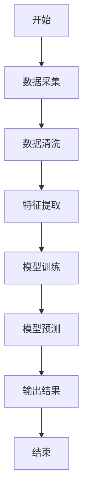
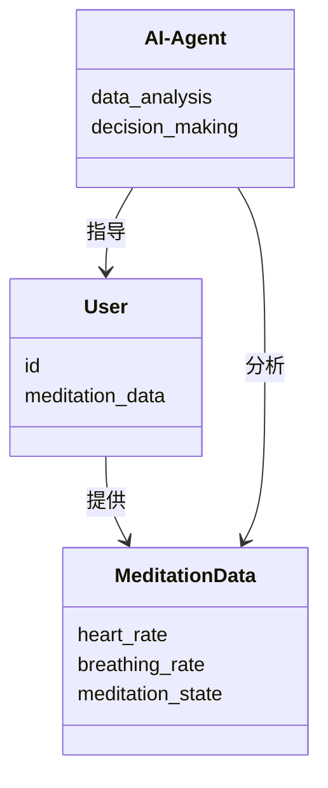
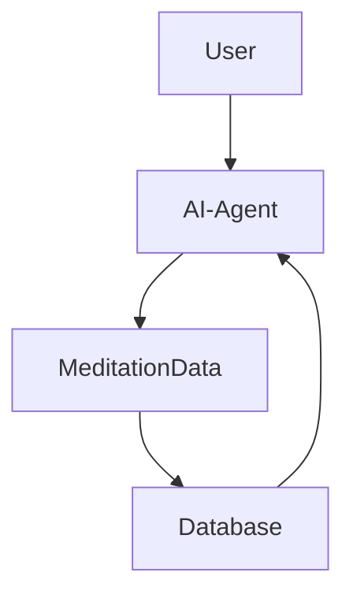
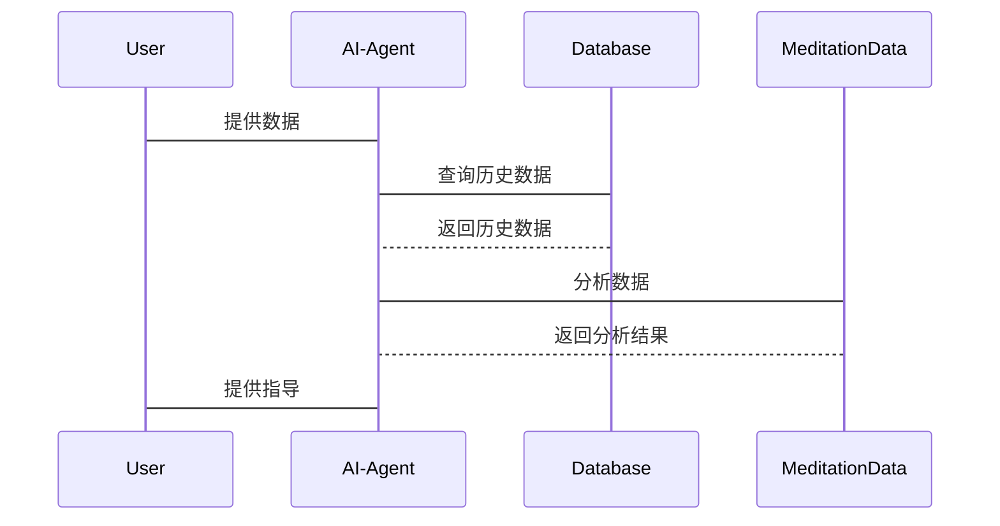

                 


# AI Agent在智能瑜伽垫中的冥想指导

> 关键词：AI Agent，智能瑜伽垫，冥想指导，算法原理，系统架构

> 摘要：本文探讨了AI Agent在智能瑜伽垫中的冥想指导应用，从背景、原理、技术实现到系统架构和项目实战，详细解析了如何利用AI技术提升冥想指导的科学性和个性化。

---

## 第一部分: AI Agent与智能瑜伽垫的背景与概念

### 第1章: AI Agent与智能瑜伽垫的背景与概念

#### 1.1 问题背景与问题描述

现代人面临日益增长的工作压力和生活压力，冥想作为一种有效的放松和情绪管理方式，逐渐受到重视。传统冥想指导依赖于冥想导师的经验和技巧，存在以下问题：

- **个性化不足**：传统冥想指导难以根据个体差异提供定制化的指导方案。
- **缺乏实时反馈**：用户在冥想过程中无法实时获得反馈，难以及时调整状态。
- **可及性有限**：专业冥想导师的资源有限，难以覆盖广泛需求。

通过结合AI Agent和智能瑜伽垫，可以实现个性化的实时冥想指导，突破传统冥想指导的局限性。

#### 1.2 AI Agent与智能瑜伽垫的定义

- **AI Agent**：AI Agent（人工智能代理）是一种能够感知环境、执行任务并提供决策支持的智能系统。它通过数据采集、分析和学习，能够理解用户需求并提供个性化服务。
- **智能瑜伽垫**：智能瑜伽垫是一种集成多种传感器和智能计算单元的高科技瑜伽垫，能够实时采集用户的生理数据和动作数据，并通过AI Agent提供个性化的冥想指导。

#### 1.3 问题解决与边界定义

AI Agent在冥想指导中的具体作用包括：

- **数据采集与分析**：通过智能瑜伽垫采集用户的心率、呼吸频率等生理数据。
- **行为分析与预测**：基于机器学习算法分析用户的冥想状态，预测可能的情绪波动。
- **个性化指导**：根据用户的生理数据和行为模式，提供实时的冥想指导和调整建议。

智能瑜伽垫的功能边界包括：

- 数据采集：心率、呼吸频率、体位姿势等。
- 数据传输：通过无线通信技术将数据传输到AI Agent。
- 用户反馈：通过震动或语音反馈指导用户调整冥想状态。

#### 1.4 核心概念与组成要素

- **AI Agent的核心要素**：
  - 数据采集模块：采集用户数据。
  - 数据分析模块：分析数据并生成指导建议。
  - 决策模块：根据分析结果提供个性化指导。
  
- **智能瑜伽垫的核心要素**：
  - 传感器：采集用户的生理数据。
  - 控制模块：接收并处理来自AI Agent的指令。
  - 用户界面：显示指导信息和反馈。

---

## 第二部分: AI Agent的核心原理与功能

### 第2章: AI Agent的核心原理与功能

#### 2.1 AI Agent的基本原理

- **机器学习与自然语言处理**：AI Agent通过机器学习算法分析用户的生理数据和行为数据，结合自然语言处理技术生成个性化的冥想指导语。
- **数据采集与分析**：AI Agent实时采集用户的数据，包括心率、呼吸频率、体位姿势等，通过数据分析预测用户的冥想状态。
- **决策机制与反馈机制**：AI Agent根据分析结果生成指导建议，并通过反馈机制不断优化指导方案。

#### 2.2 AI Agent的功能模块

- **数据采集与处理**：
  - 通过智能瑜伽垫采集用户的心率、呼吸频率等数据。
  - 数据清洗与特征提取，确保数据的准确性和可用性。
  
- **行为分析与预测**：
  - 利用机器学习算法分析用户的冥想状态。
  - 预测用户的情绪波动，提前调整指导方案。
  
- **冥想指导与个性化推荐**：
  - 根据用户的生理数据和行为模式，提供个性化的冥想指导。
  - 通过实时反馈优化指导方案，提升用户的冥想效果。

#### 2.3 AI Agent与智能瑜伽垫的交互模式

- **用户输入与系统反馈**：
  - 用户通过智能瑜伽垫输入生理数据和行为数据。
  - AI Agent根据数据生成指导建议并反馈给用户。
  
- **实时数据的处理与响应**：
  - AI Agent实时处理用户数据，提供即时反馈。
  - 用户根据反馈调整冥想姿势和呼吸节奏。
  
- **个性化指导的实现**：
  - AI Agent根据用户的历史数据和当前状态，提供个性化的指导方案。
  - 通过不断学习优化指导策略，提升用户体验。

---

## 第三部分: 智能瑜伽垫的技术实现

### 第3章: 智能瑜伽垫的技术实现

#### 3.1 智能瑜伽垫的核心技术

- **传感器技术与数据采集**：
  - 使用心率传感器、呼吸传感器等采集用户的生理数据。
  - 传感器数据的采集和传输需要高精度和低延迟。
  
- **无线通信技术**：
  - 通过蓝牙或Wi-Fi将数据传输到AI Agent。
  - 确保数据传输的实时性和稳定性。
  
- **电源管理与功耗优化**：
  - 优化电池管理，延长智能瑜伽垫的续航时间。
  - 在低功耗模式下仍然保证数据采集和传输的正常运行。

#### 3.2 智能瑜伽垫的功能模块

- **数据采集模块**：
  - 包括心率传感器、呼吸传感器等硬件设备。
  - 负责采集用户的生理数据并传输到控制模块。
  
- **控制与显示模块**：
  - 控制模块接收数据并进行初步处理。
  - 显示模块向用户反馈指导信息和状态。

- **与AI Agent的接口模块**：
  - 提供与AI Agent的通信接口。
  - 负责数据的交互和指令的执行。

#### 3.3 智能瑜伽垫的系统架构

- **硬件架构设计**：
  - 包括传感器、控制芯片、无线通信模块等。
  - 各硬件模块协同工作，完成数据采集和传输。
  
- **软件架构设计**：
  - 包括数据采集软件、通信软件和用户界面软件。
  - 软件负责数据的处理、传输和显示。
  
- **系统集成与测试**：
  - 对硬件和软件进行集成测试，确保系统的稳定性和可靠性。
  - 进行性能测试，优化系统的响应速度和数据处理能力。

---

## 第四部分: AI Agent的算法原理

### 第4章: AI Agent的算法原理

#### 4.1 数据采集与预处理

- **数据采集**：
  - 通过智能瑜伽垫采集用户的心率、呼吸频率等数据。
  - 数据采集需要高精度和低延迟。
  
- **数据清洗与特征提取**：
  - 清洗数据中的噪声和异常值。
  - 提取心率变异性和呼吸频率等特征，用于后续分析。

#### 4.2 算法选择与实现

- **机器学习算法的选择**：
  - 使用支持向量回归（SVR）或随机森林（Random Forest）进行预测。
  - 根据数据量和复杂度选择合适的算法。

- **深度学习模型的构建**：
  - 使用LSTM网络进行时间序列预测。
  - 输入特征包括心率、呼吸频率等，输出冥想状态的预测值。

- **算法训练与优化**：
  - 划分训练集和测试集，进行交叉验证。
  - 调参优化，提升模型的准确性和鲁棒性。

#### 4.3 算法流程图



#### 4.4 代码实现

- **数据预处理代码**：

```python
import pandas as pd
import numpy as np

# 读取数据
data = pd.read_csv('meditation_data.csv')

# 数据清洗
data = data.dropna()
data = data[~data['heart_rate'].isinf()]

# 特征提取
features = data[['heart_rate', 'breathing_rate']]
labels = data['meditation_state']
```

- **模型训练代码**：

```python
from sklearn.model_selection import train_test_split
from sklearn.ensemble import RandomForestRegressor

# 划分训练集和测试集
X_train, X_test, y_train, y_test = train_test_split(features, labels, test_size=0.2)

# 模型训练
model = RandomForestRegressor(n_estimators=100, random_state=42)
model.fit(X_train, y_train)
```

- **模型预测代码**：

```python
# 预测结果
y_pred = model.predict(X_test)
```

#### 4.5 数学模型与公式

- **支持向量回归（SVR）**：

  $$ y = w \cdot x + b $$

  其中，$w$ 是权重向量，$x$ 是输入特征，$b$ 是偏置项。

- **随机森林回归**：

  随机森林通过集成多个决策树模型，降低模型的方差，提升预测的准确性。

---

## 第五部分: 系统分析与架构设计

### 第5章: 系统分析与架构设计

#### 5.1 项目场景介绍

- 系统场景：用户在使用智能瑜伽垫进行冥想时，AI Agent实时采集并分析用户的生理数据，提供个性化的冥想指导。

#### 5.2 系统功能设计

- **领域模型类图**：



#### 5.3 系统架构设计

- **系统架构图**：



- **接口设计**：
  - 用户端：通过智能瑜伽垫与AI Agent交互。
  - 数据端：与数据库交互，存储和检索用户数据。

- **系统交互序列图**：



---

## 第六部分: 项目实战

### 第6章: 项目实战

#### 6.1 环境安装

- **Python环境**：
  - 安装Python 3.8及以上版本。
  - 安装必要的库：`pandas`, `numpy`, `scikit-learn`, `mermaid`, `matplotlib`。

- **智能瑜伽垫**：
  - 确保智能瑜伽垫与计算机的蓝牙或Wi-Fi连接正常。
  - 安装配套的驱动和软件。

#### 6.2 核心代码实现

- **数据预处理**：

```python
import pandas as pd
import numpy as np

# 读取数据
data = pd.read_csv('meditation_data.csv')

# 数据清洗
data = data.dropna()
data = data[~data['heart_rate'].isinf()]

# 特征提取
features = data[['heart_rate', 'breathing_rate']]
labels = data['meditation_state']
```

- **模型训练**：

```python
from sklearn.model_selection import train_test_split
from sklearn.ensemble import RandomForestRegressor

# 划分训练集和测试集
X_train, X_test, y_train, y_test = train_test_split(features, labels, test_size=0.2)

# 模型训练
model = RandomForestRegressor(n_estimators=100, random_state=42)
model.fit(X_train, y_train)
```

- **模型预测**：

```python
# 预测结果
y_pred = model.predict(X_test)

# 评估模型
from sklearn.metrics import mean_squared_error, r2_score

print(f"均方误差：{mean_squared_error(y_test, y_pred)}")
print(f"R²系数：{r2_score(y_test, y_pred)}")
```

#### 6.3 实际案例分析

- **案例分析**：

假设用户A在冥想过程中心率偏高，呼吸频率不稳定。AI Agent分析数据后，建议用户调整呼吸节奏，并通过震动和语音提示帮助用户放松。经过几次调整，用户的冥想状态显著提升，压力水平降低。

#### 6.4 项目小结

通过项目实战，我们验证了AI Agent在智能瑜伽垫中的冥想指导功能的有效性。AI Agent能够实时分析用户数据，提供个性化的指导方案，显著提升用户的冥想效果。

---

## 第七部分: 最佳实践

### 第7章: 最佳实践

#### 7.1 小结

- AI Agent在智能瑜伽垫中的应用，通过实时数据分析和个性化指导，显著提升了冥想指导的效果。
- 未来可以进一步优化算法，引入更多的生理数据和行为数据，提升指导的精准度和个性化。

#### 7.2 注意事项

- 数据隐私保护：确保用户的生理数据不会被泄露。
- 系统稳定性：确保AI Agent和智能瑜伽垫的稳定运行，避免数据丢失或系统崩溃。
- 用户体验：优化用户界面和反馈机制，提升用户体验。

#### 7.3 拓展阅读

- **相关技术**：了解更多的机器学习算法和传感器技术。
- **应用领域**：探索AI Agent在其他健康领域的应用，如睡眠监测、运动指导等。
- **前沿研究**：关注AI Agent和智能设备结合的最新研究成果。

---

## 作者

**作者：AI天才研究院/AI Genius Institute & 禅与计算机程序设计艺术 /Zen And The Art of Computer Programming**

---

通过以上内容，我们详细分析了AI Agent在智能瑜伽垫中的冥想指导应用，从理论到实践，从算法到系统设计，为读者提供了全面的指导和参考。希望本文能为相关领域的研究和实践提供有价值的参考。

