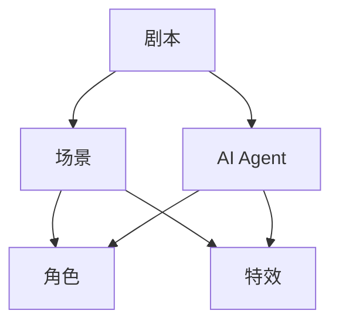
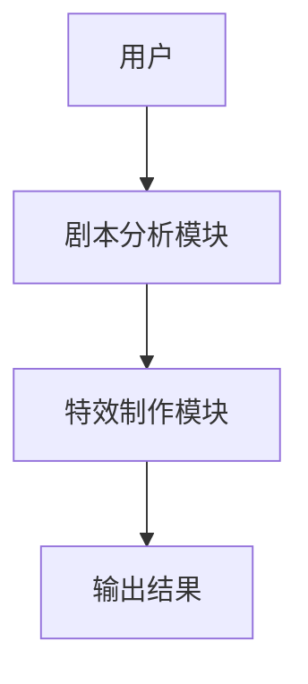

                 


# AI Agent在电影制作中的应用：剧本分析与特效辅助

**关键词**：AI Agent，电影制作，剧本分析，特效辅助，人工智能，计算机视觉，自然语言处理

**摘要**：本文探讨了AI Agent在电影制作中的应用，特别是在剧本分析和特效辅助领域。通过结合自然语言处理（NLP）和计算机视觉技术，AI Agent能够帮助电影制作团队提高创作效率，优化特效质量，降低制作成本。本文详细分析了AI Agent的工作原理、算法模型、系统架构，并通过实际案例展示了其在电影制作中的潜力和优势。

---

## 第1章 AI Agent与电影制作的结合

### 1.1 AI Agent的基本概念

#### 1.1.1 什么是AI Agent
AI Agent（人工智能代理）是一种智能系统，能够感知环境、自主决策并执行任务。它结合了自然语言处理（NLP）、计算机视觉（CV）和机器学习（ML）等多种技术，能够理解、分析和生成内容，从而辅助人类完成复杂任务。

#### 1.1.2 AI Agent的核心特征
- **自主性**：能够自主决策，无需人工干预。
- **反应性**：能够实时感知环境并做出反应。
- **学习能力**：通过数据不断优化自身性能。
- **协作性**：能够与其他系统或人类协同工作。

#### 1.1.3 AI Agent与传统电影制作的结合
传统电影制作流程复杂，涉及编剧、导演、特效师等多个环节。AI Agent能够通过自动化技术简化流程，例如自动分析剧本、生成特效建议等，从而提高效率并降低成本。

---

### 1.2 AI Agent在电影制作中的应用背景

#### 1.2.1 电影制作的复杂性与挑战
电影制作涉及多个环节，包括剧本创作、拍摄、后期制作等，每个环节都需要大量的人力和时间。随着电影产业的快速发展，制作周期和成本的压力越来越大。

#### 1.2.2 AI技术在电影制作中的潜力
AI技术在电影制作中的潜力主要体现在以下两个方面：
- **剧本分析**：通过NLP技术分析剧本的情感、结构和角色关系，帮助编剧优化剧本。
- **特效制作**：通过计算机视觉技术生成和优化特效场景，提高特效质量。

#### 1.2.3 当前行业对AI Agent的需求
随着电影产业对效率和质量要求的不断提高，传统制作方式已无法满足需求。AI Agent的引入能够显著提高制作效率，降低成本，并为电影创作带来更多可能性。

---

## 第2章 AI Agent在电影制作中的核心概念与联系

### 2.1 AI Agent的核心原理

#### 2.1.1 AI Agent的基本原理
AI Agent通过感知环境、分析数据并做出决策来完成任务。在电影制作中，AI Agent可以用于剧本分析和特效辅助，具体包括以下步骤：
1. **数据输入**：获取剧本文本或视频素材。
2. **数据处理**：通过NLP或CV技术分析数据。
3. **决策与输出**：生成分析结果或优化建议。

#### 2.1.2 AI Agent在电影制作中的具体应用
- **剧本分析**：通过NLP技术分析剧本的情感、结构和角色关系，帮助编剧优化剧本。
- **特效制作**：通过计算机视觉技术生成和优化特效场景。

#### 2.1.3 AI Agent与其他技术的协同作用
AI Agent在电影制作中需要与其他技术协同工作，例如：
- **NLP技术**：用于剧本分析。
- **CV技术**：用于特效制作。
- **机器学习**：用于数据建模和优化。

### 2.2 核心概念对比表

#### 2.2.1 AI Agent与传统电影制作工具的对比
| **特性**       | **AI Agent**         | **传统工具**       |
|----------------|----------------------|--------------------|
| 自动化程度     | 高                   | 低                 |
| 决策能力       | 强                   | 无                 |
| 学习能力       | 有                   | 无                 |
| 效率           | 高                   | 低                 |

#### 2.2.2 不同AI技术在电影制作中的作用对比
| **技术**       | **NLP**             | **CV**             |
|----------------|----------------------|--------------------|
| 主要应用       | 剧本分析             | 特效制作           |
| 核心能力       | 文本理解             | 图像处理           |
| 示例场景       | 情感分析             | 特效优化           |

#### 2.2.3 AI Agent在剧本分析与特效制作中的对比
| **环节**       | **剧本分析**         | **特效制作**       |
|----------------|----------------------|--------------------|
| 主要任务       | 分析剧本内容         | 生成和优化特效     |
| 技术支持       | NLP技术             | CV技术             |
| 输出结果       | 分析报告             | 特效场景           |

### 2.3 ER实体关系图

#### 2.3.1 电影制作流程中的实体关系
- **实体**：剧本、角色、场景、特效。
- **关系**：剧本包含多个场景，每个场景包含多个角色和特效。

#### 2.3.2 AI Agent在实体关系中的位置
AI Agent作为辅助工具，能够分析剧本、角色和场景之间的关系，并生成优化建议。

#### 2.3.3 实体关系图的Mermaid流程图


---

## 第3章 剧本分析中的AI Agent算法

### 3.1 剧本分析的算法原理

#### 3.1.1 基于NLP的剧本分析
自然语言处理（NLP）技术用于分析剧本的情感、结构和角色关系。具体步骤如下：
1. **文本预处理**：去除停用词、分词。
2. **情感分析**：分析剧本的情感倾向。
3. **结构分析**：识别剧本的结构，例如幕、场次等。

#### 3.1.2 基于深度学习的剧本情感分析
使用深度学习模型（如LSTM）进行剧本情感分析。模型通过学习剧本文本，预测情感倾向。

#### 3.1.3 剧本结构分析的算法流程
1. **输入剧本文本**。
2. **分段处理**，识别幕、场次等结构。
3. **输出分析结果**。

### 3.2 剧本分析的数学模型

#### 3.2.1 基于概率论的剧本情感分析模型
概率模型通过计算情感词的概率，预测剧本的情感倾向。公式如下：
$$ P(\text{情感} | \text{文本}) = \frac{\text{情感词频率}}{\text{总词数}} $$

#### 3.2.2 基于深度学习的剧本结构分析模型
使用LSTM网络进行剧本结构分析。模型结构如下：
$$ \text{LSTM}(x) \rightarrow \text{输出} $$

---

## 第4章 特效制作中的AI Agent算法

### 4.1 特效制作的算法原理

#### 4.1.1 基于计算机视觉的特效生成
计算机视觉技术用于生成特效场景。具体步骤如下：
1. **图像分割**：识别图像中的目标。
2. **图像合成**：将目标与背景结合，生成特效场景。

#### 4.1.2 基于深度学习的特效优化
使用GAN（生成对抗网络）优化特效质量。模型通过对抗训练，生成高质量的特效场景。

#### 4.1.3 特效制作的算法流程
1. **输入视频素材**。
2. **图像处理**，生成特效场景。
3. **输出优化结果**。

### 4.2 特效制作的数学模型

#### 4.2.1 基于图像处理的特效生成模型
图像处理模型通过滤波器生成特效。公式如下：
$$ f(x) = \sum_{k=1}^{n} w_k x_k $$

#### 4.2.2 基于优化算法的特效优化模型
使用优化算法（如Adam）调整特效参数，优化特效质量。公式如下：
$$ \theta_{t+1} = \theta_t - \eta \nabla L(\theta_t) $$

---

## 第5章 电影制作系统的架构设计

### 5.1 系统功能设计

#### 5.1.1 系统模块划分
- **剧本分析模块**：负责剧本分析。
- **特效制作模块**：负责特效生成和优化。

#### 5.1.2 系统功能流程
1. **输入剧本文本**。
2. **剧本分析模块**处理文本，生成分析报告。
3. **特效制作模块**根据分析报告生成特效场景。
4. **输出结果**。

### 5.2 系统架构设计

#### 5.2.1 系统架构图


#### 5.2.2 系统接口设计
- **输入接口**：接收剧本文本。
- **输出接口**：输出分析报告和特效场景。

### 5.3 系统交互设计

#### 5.3.1 系统交互流程
1. **用户输入剧本文本**。
2. **剧本分析模块**处理文本，生成分析报告。
3. **特效制作模块**根据分析报告生成特效场景。
4. **输出结果**。

#### 5.3.2 交互流程图


---

## 第6章 项目实战

### 6.1 环境配置

#### 6.1.1 系统环境
- 操作系统：Windows 10或更高版本。
- 开发工具：Python 3.8及以上，PyTorch 1.9及以上。

#### 6.1.2 依赖安装
安装必要的Python库：
```bash
pip install numpy torch matplotlib
```

### 6.2 系统核心实现源代码

#### 6.2.1 剧本分析模块代码
```python
import torch
import torch.nn as nn

class ScriptAnalyzer(nn.Module):
    def __init__(self, input_size, hidden_size, output_size):
        super(ScriptAnalyzer, self).__init__()
        self.lstm = nn.LSTM(input_size, hidden_size, batch_first=True)
        self.fc = nn.Linear(hidden_size, output_size)

    def forward(self, x):
        out, _ = self.lstm(x)
        out = self.fc(out[:, -1, :])
        return out

# 初始化模型
input_size = 100
hidden_size = 128
output_size = 2
model = ScriptAnalyzer(input_size, hidden_size, output_size)
```

#### 6.2.2 特效制作模块代码
```python
import cv2
import numpy as np

def generate特效场景(input_image):
    # 图像分割
    segmented_image = cv2.kmeans(input_image, 3, ...)[1]
    # 图像合成
    background = np.random.randint(0, 255, (256, 256, 3))
    result = cv2.addWeighted(segmented_image, 0.5, background, 0.5, 0)
    return result

input_image = np.random.randint(0, 255, (256, 256, 3))
output_image = generate特效场景(input_image)
cv2.imwrite('result.jpg', output_image)
```

### 6.3 案例分析与项目总结

#### 6.3.1 案例分析
通过实际案例分析，验证AI Agent在剧本分析和特效制作中的应用效果。例如，分析一部电影的剧本情感，并生成相应的特效场景。

#### 6.3.2 项目总结
总结项目实施过程中的经验教训，提出改进建议，并展望未来的发展方向。

---

## 第7章 最佳实践与注意事项

### 7.1 最佳实践

#### 7.1.1 数据质量
确保输入数据的质量，例如剧本文本和视频素材的清晰度。

#### 7.1.2 模型优化
通过数据增强和超参数调优，优化模型性能。

### 7.2 注意事项

#### 7.2.1 数据隐私
注意保护剧本和视频素材的隐私，避免数据泄露。

#### 7.2.2 技术局限
目前AI Agent在电影制作中的应用还存在一定的技术局限，例如特效生成的质量仍需提高。

### 7.3 小结

总结全书内容，强调AI Agent在电影制作中的重要性和未来的发展潜力。

---

## 作者

**作者：AI天才研究院/AI Genius Institute & 禅与计算机程序设计艺术 /Zen And The Art of Computer Programming**

---

本文详细探讨了AI Agent在电影制作中的应用，特别是在剧本分析和特效辅助领域。通过结合NLP和CV技术，AI Agent能够显著提高电影制作的效率和质量，为电影产业的未来发展提供了新的可能性。

