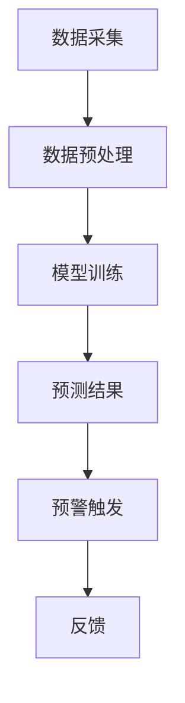
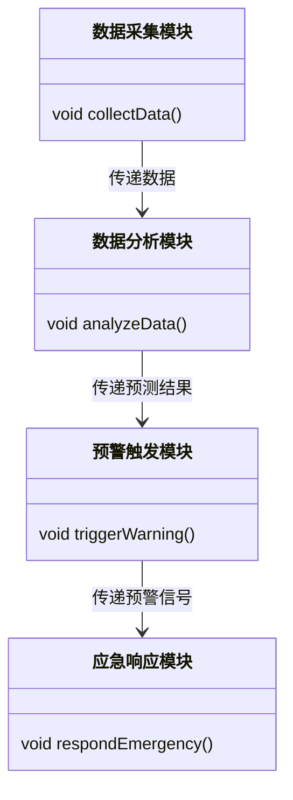
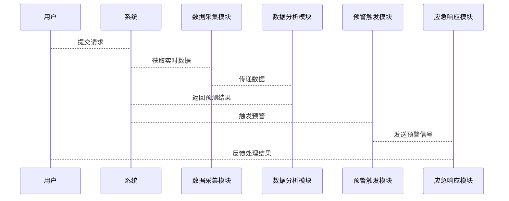

                 


# 价值投资中的智能城市公共安全预警系统分析

---

## 关键词：
- 价值投资
- 智能城市
- 公共安全
- 预警系统
- 人工智能
- 系统架构
- 数学模型

---

## 摘要：
本文深入分析了价值投资理念与智能城市公共安全预警系统的结合，探讨了如何利用价值投资的长期视角和公共安全预警系统的技术手段，共同构建一个高效、可靠的预警体系。文章从背景介绍、核心概念、算法原理、系统架构设计、项目实战等多个方面展开，结合实际案例和数学模型，详细阐述了智能城市公共安全预警系统的实现过程和投资价值。

---

## 正文：

### 第一部分：价值投资与智能城市公共安全预警系统背景

#### 第1章：价值投资与智能城市公共安全预警系统背景

##### 1.1 价值投资的基本概念
- **价值投资的定义**：价值投资是一种以低于资产内在价值的价格买入优质资产的投资策略，强调长期持有的理念。
- **价值投资的核心理念**：寻找市场低估的资产，关注企业的基本面，注重长期收益而非短期波动。
- **价值投资与现代金融的结合**：在现代金融体系中，价值投资通过技术手段（如大数据分析）优化投资决策，提升收益稳定性。

##### 1.2 智能城市的发展现状
- **智能城市的定义与特征**：智能城市是通过信息技术和数据驱动，优化城市运行效率，提升居民生活质量的城市形态。
- **智能城市的核心技术**：包括物联网、大数据、人工智能、云计算等技术。
- **智能城市的发展趋势**：向智能化、绿色化、数字化方向发展，注重可持续性和居民福祉。

##### 1.3 公共安全预警系统的重要性
- **公共安全预警系统的定义**：通过实时监测和数据分析，提前预测并预警可能的安全风险，减少灾害损失。
- **公共安全预警系统的功能**：实时监测、数据分析、风险评估、预警触发、应急响应。
- **公共安全预警系统的社会价值**：保护人民生命财产安全，降低社会损失，提升城市安全管理水平。

##### 1.4 价值投资与智能城市公共安全预警系统的结合
- **价值投资在智能城市中的应用**：通过价值投资理念，选择具有长期发展潜力的智能城市项目进行投资。
- **公共安全预警系统的投资价值**：作为智能城市的重要组成部分，公共安全预警系统具有稳定的市场需求和长期收益潜力。
- **价值投资与公共安全预警系统的协同效应**：通过价值投资优化资源配置，推动公共安全预警系统的技术创新和应用推广。

##### 1.5 本章小结
本章通过介绍价值投资和智能城市的基本概念，分析了公共安全预警系统的重要性，并探讨了三者之间的协同关系，为后续的技术分析奠定了基础。

---

### 第二部分：智能城市公共安全预警系统的核心概念

#### 第2章：智能城市公共安全预警系统的核心概念

##### 2.1 价值投资模型
- **价值投资模型的构成**：包括资产质量、估值、管理团队等多维度评估体系。
- **价值投资模型的属性特征对比表**：

| 属性         | 特征1：低估资产 | 特征2：优质企业 | 特征3：长期稳定 |
|--------------|----------------|----------------|----------------|
| 适用场景     | 股票投资       | 企业价值评估   | 长期战略投资   |
| 核心指标     | 市盈率、市净率   | 净利润率、ROE   | 股东回报率     |
| 优势         | 抗风险能力强   | 投资回报稳定   | 长期收益显著   |

- **价值投资模型的ER实体关系图**：

```mermaid
erDiagram
    customer[投资者]
    stock[股票]
    valuation[估值指标]
    transaction[交易]
    customer -o> transaction: 进行交易
    stock -o> valuation: 提供估值数据
    customer -o> stock: 持有股票
```

##### 2.2 智能城市公共安全预警系统的原理
- **数据采集与处理**：通过传感器、摄像头等设备实时采集城市安全数据，并进行清洗和预处理。
- **数据分析与预测**：利用机器学习算法对数据进行建模，预测潜在的安全风险。
- **预警触发与反馈**：当预测结果达到预警阈值时，触发预警机制，并反馈给相关部门进行应急处理。

##### 2.3 价值投资与公共安全预警系统的关联
- **价值投资在预警系统中的作用**：通过价值投资理念优化预警系统的资源配置，提升系统的可靠性和经济性。
- **预警系统对投资决策的影响**：预警系统的数据和分析结果为价值投资提供实时市场信息，辅助投资决策。
- **价值投资与预警系统的协同机制**：通过预警系统的实时数据分析，价值投资可以更精准地评估资产风险，优化投资组合。

##### 2.4 本章小结
本章通过详细分析价值投资模型和公共安全预警系统的原理，揭示了两者之间的内在联系，并为后续的算法设计奠定了基础。

---

### 第三部分：智能城市公共安全预警系统的算法原理

#### 第3章：智能城市公共安全预警系统的算法原理

##### 3.1 数据采集与预处理
- **数据采集方法**：利用物联网设备（如传感器、摄像头）实时采集城市安全数据。
- **数据清洗与预处理**：去除噪声数据，填补缺失值，标准化数据格式。
- **数据特征提取**：提取关键特征（如时间、地点、事件类型）用于后续分析。

##### 3.2 预警模型的构建
- **时间序列分析**：使用ARIMA模型对历史数据进行建模，预测未来趋势。
- **机器学习算法的选择**：根据数据特征选择合适的算法（如随机森林、XGBoost）进行分类或回归预测。
- **模型训练与优化**：通过交叉验证优化模型参数，提升预测准确性。

##### 3.3 预警系统的实现
- **系统输入与输出**：输入实时数据，输出预警信号和风险评估结果。
- **系统流程图**：



- **代码示例**：
  ```python
  import pandas as pd
  from sklearn.ensemble import RandomForestClassifier

  # 数据预处理
  data = pd.read_csv('safety_data.csv')
  data = data.dropna()
  
  # 特征提取
  features = data[['time', 'location', 'event_type']]
  target = data['risk_level']
  
  # 模型训练
  model = RandomForestClassifier()
  model.fit(features, target)
  
  # 预测
  new_data = pd.read_csv('new_safety_data.csv')
  new_features = new_data[['time', 'location', 'event_type']]
  predictions = model.predict(new_features)
  
  # 预警触发
  for prediction in predictions:
      if prediction > 0.7:
          print("触发预警！")
  ```

##### 3.4 本章小结
本章详细介绍了智能城市公共安全预警系统的算法原理，包括数据处理、模型构建和系统实现，为后续的系统设计提供了技术支持。

---

### 第四部分：智能城市公共安全预警系统的系统架构设计

#### 第4章：智能城市公共安全预警系统的系统架构设计

##### 4.1 问题场景介绍
- **应用场景**：城市公共安全预警，如火灾、交通拥堵、恐怖袭击等。
- **核心需求**：实时监测、快速响应、精准预测。

##### 4.2 系统功能设计
- **功能模块**：
  - 数据采集模块：实时采集城市安全数据。
  - 数据分析模块：对数据进行建模和预测。
  - 预警触发模块：根据预测结果触发预警。
  - 应急响应模块：协调相关部门进行应急处理。

- **领域模型类图**：



##### 4.3 系统架构设计
- **系统架构图**：


##### 4.4 系统接口设计
- **数据接口**：定义数据格式和传输协议。
- **预警接口**：定义预警触发条件和反馈机制。

##### 4.5 系统交互设计
- **用户与系统的交互流程**：



##### 4.6 本章小结
本章通过系统架构设计，明确了智能城市公共安全预警系统的各个模块及其交互关系，为系统的实际开发提供了指导。

---

### 第五部分：智能城市公共安全预警系统的项目实战

#### 第5章：智能城市公共安全预警系统的项目实战

##### 5.1 环境安装
- **安装Python**：确保安装最新版本的Python。
- **安装依赖库**：如pandas、scikit-learn、mermaid等。

##### 5.2 核心代码实现
- **数据处理代码**：

  ```python
  import pandas as pd
  import numpy as np

  # 数据加载
  data = pd.read_csv('safety_data.csv')
  data = data.dropna()

  # 特征提取
  features = data[['time', 'location', 'event_type']]
  target = data['risk_level']

  # 数据标准化
  from sklearn.preprocessing import StandardScaler
  scaler = StandardScaler()
  scaled_features = scaler.fit_transform(features)
  ```

- **模型训练代码**：

  ```python
  from sklearn.ensemble import RandomForestClassifier

  model = RandomForestClassifier()
  model.fit(scaled_features, target)
  ```

- **预测与预警触发**：

  ```python
  new_data = pd.read_csv('new_safety_data.csv')
  new_features = new_data[['time', 'location', 'event_type']]
  scaled_new_features = scaler.transform(new_features)
  predictions = model.predict(scaled_new_features)

  # 预警触发逻辑
  threshold = 0.7
  for pred in predictions:
      if pred > threshold:
          print("触发预警！")
  ```

##### 5.3 代码解读与分析
- **数据处理代码**：展示了如何清洗和预处理数据，确保模型输入的质量。
- **模型训练代码**：使用随机森林算法进行分类模型的训练，提升预测准确性。
- **预测与预警触发**：根据模型预测结果，判断是否触发预警信号，并输出相应指令。

##### 5.4 实际案例分析
- **案例背景**：假设某城市发生多次火灾，系统需要预测下次火灾的可能性。
- **数据分析**：通过历史数据分析，识别火灾高发区域和时间，优化预警模型。
- **结果解读**：预测结果显示某区域火灾风险较高，触发预警并协调消防部门进行预防。

##### 5.5 项目小结
本章通过实际案例分析，展示了智能城市公共安全预警系统的具体应用，验证了系统的有效性和实用性。

---

### 第六部分：智能城市公共安全预警系统的最佳实践

#### 第6章：智能城市公共安全预警系统的最佳实践

##### 6.1 小结
- 总结全文的核心内容和主要结论，强调价值投资与智能城市公共安全预警系统的结合的重要性。

##### 6.2 注意事项
- **数据隐私保护**：在数据采集和处理过程中，需严格遵守隐私保护法规。
- **系统稳定性**：确保系统在高并发和极端情况下的稳定运行。
- **模型优化**：定期更新模型参数，提升预测准确率。

##### 6.3 扩展阅读
- 推荐相关书籍和资源，如《智能城市：大数据与城市的未来》、《价值投资实战指南》等。

##### 6.4 本章小结
本章通过总结和建议，为读者提供了实用的指导，帮助他们在实际应用中更好地实施智能城市公共安全预警系统。

---

## 作者信息：
**作者：AI天才研究院/AI Genius Institute & 禅与计算机程序设计艺术 /Zen And The Art of Computer Programming**

---

以上是《价值投资中的智能城市公共安全预警系统分析》的完整目录大纲，涵盖了从背景介绍到实际应用的各个方面，结合了技术分析和投资策略，为读者提供了全面的知识体系和实践指导。

