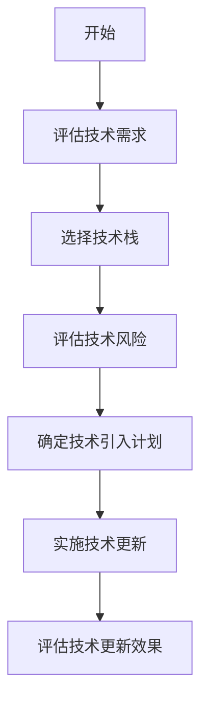
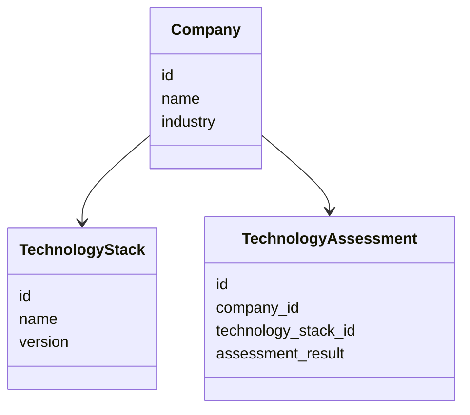
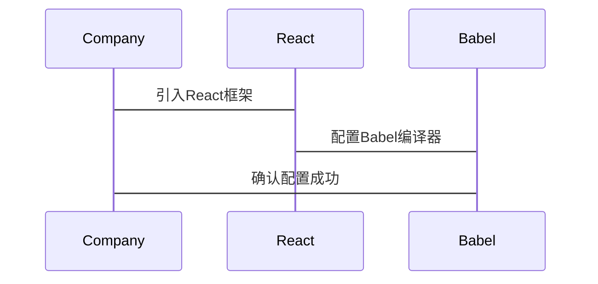

                 


# 彼得林奇对公司技术栈更新能力的评估

> 关键词：彼得·林奇，技术栈更新能力，公司绩效，投资策略，系统架构设计，项目实战

> 摘要：本文通过分析彼得·林奇的投资理念，结合技术栈更新能力的评估模型，探讨技术栈更新能力对公司绩效的影响，并提供实际案例分析和系统架构设计方案。

---

# 第一部分: 引言

## 第1章: 背景介绍

### 1.1 技术栈更新能力的背景

#### 1.1.1 技术栈更新的背景与意义
在当今快速变化的技术环境中，企业技术栈的更新能力直接关系到公司的竞争力和市场地位。技术栈是指企业在开发过程中使用的编程语言、框架、工具和平台的组合。随着技术的快速发展，企业需要不断更新技术栈以保持竞争力。技术栈更新能力不仅是技术部门的核心能力，也是公司整体战略的重要组成部分。

#### 1.1.2 彼得·林奇的投资理念与技术栈更新的结合
彼得·林奇是美国著名投资专家，他的投资理念强调对企业基本面的深入分析和长期价值的关注。将彼得·林奇的投资理念与技术栈更新能力相结合，可以帮助投资者和技术管理者更好地评估公司在技术上的投资能力和未来发展潜力。

#### 1.1.3 企业技术栈更新能力的重要性
技术栈更新能力是企业技术创新的核心驱动力。通过不断更新技术栈，企业可以优化开发效率、降低技术风险、提升产品竞争力。同时，技术栈更新能力也是企业适应市场变化、保持长期竞争力的关键因素。

### 1.2 公司技术栈更新能力的定义

#### 1.2.1 技术栈的定义与组成
技术栈通常包括编程语言、框架、工具和平台。例如，前端技术栈可能包括HTML、CSS、JavaScript和React框架，后端技术栈可能包括Python、Django框架和数据库。

#### 1.2.2 技术栈更新能力的核心概念
技术栈更新能力是指企业在技术栈的选型、引入、集成和优化方面的能力。这种能力包括技术评估、风险控制、资源分配和执行能力等多个方面。

#### 1.2.3 技术栈更新能力的边界与外延
技术栈更新能力的边界包括技术选型的范围和时间周期，而外延则包括与技术相关的组织结构、人才培养和文化氛围。

### 1.3 技术栈更新能力与公司绩效的关系

#### 1.3.1 技术栈更新能力对企业发展的影响
技术栈更新能力直接影响企业的技术创新能力和市场竞争力。通过不断更新技术栈，企业可以提高开发效率、降低技术风险、提升产品性能。

#### 1.3.2 技术栈更新能力与公司竞争力的关联
技术栈更新能力是公司竞争力的重要组成部分。通过技术栈的更新，企业可以更好地适应市场需求、提升产品质量、降低运营成本。

#### 1.3.3 技术栈更新能力的评估维度
技术栈更新能力的评估维度包括技术评估能力、技术引入能力、技术集成能力和技术优化能力。

---

## 第2章: 核心概念与联系

### 2.1 技术栈更新能力的核心概念

#### 2.1.1 技术栈更新能力的属性特征
技术栈更新能力的属性特征包括技术前瞻性、技术可行性和技术经济性。

#### 2.1.2 技术栈更新能力的数学模型
技术栈更新能力的数学模型可以用以下公式表示：

$$ C = f(T, R, E) $$

其中：
- $C$ 表示技术栈更新能力
- $T$ 表示技术评估能力
- $R$ 表示技术引入能力
- $E$ 表示技术集成能力

#### 2.1.3 技术栈更新能力的ER实体关系图
```mermaid
erDiagram
    COMPANY {
        id
        name
        industry
    }
    TECHNOLOGY_STACK {
        id
        name
        version
    }
    TECHNOLOGY_ASSESSMENT {
        id
        company_id
        technology_stack_id
        assessment_result
    }
```

### 2.2 技术栈更新能力与公司绩效的对比分析

#### 2.2.1 技术栈更新能力与公司绩效的属性对比
| 属性 | 技术栈更新能力 | 公司绩效 |
|------|-----------------|----------|
| 核心目标 | 提升技术竞争力 | 提高企业利润 |
| 关键指标 | 技术更新速度 | 营业收入增长率 |
| 影响因素 | 技术评估能力 | 市场需求、竞争环境 |

#### 2.2.2 技术栈更新能力与公司绩效的对比表格
| 公司 | 技术栈更新能力 | 公司绩效 |
|------|-----------------|----------|
| 公司A | 高 | 高 |
| 公司B | 中 | 中 |
| 公司C | 低 | 低 |

#### 2.2.3 技术栈更新能力与公司绩效的ER实体关系图
```mermaid
erDiagram
    PERFORMANCE {
        id
        company_id
        performance_indicator
    }
    TECHNOLOGY_UPGRADING {
        id
        company_id
        technology_stack_id
        upgrading_capability
    }
```

---

## 第3章: 技术栈更新能力的评估模型

### 3.1 评估模型的构建

#### 3.1.1 评估模型的数学公式
技术栈更新能力的评估模型可以用以下公式表示：

$$ E = \alpha T + \beta R + \gamma E $$

其中：
- $E$ 表示技术栈更新能力的评估结果
- $\alpha$、$\beta$、$\gamma$ 表示各因素的权重
- $T$ 表示技术评估能力
- $R$ 表示技术引入能力
- $E$ 表示技术集成能力

#### 3.1.2 评估模型的mermaid流程图


#### 3.1.3 评估模型的Python实现代码
```python
def evaluate_technology_upgrading(company):
    # 技术评估能力
    T = company.technology_assessment
    # 技术引入能力
    R = company.technology_introduction
    # 技术集成能力
    E = company.technology_integration
    # 权重
    alpha = 0.4
    beta = 0.3
    gamma = 0.3
    # 评估结果
    E = alpha * T + beta * R + gamma * E
    return E
```

### 3.2 评估模型的数学分析

#### 3.2.1 数学模型的公式推导
技术栈更新能力的评估模型是通过综合考虑技术评估能力、技术引入能力和技术集成能力的权重，构建出一个线性组合模型。通过实际数据的验证，模型可以有效地评估技术栈更新能力。

#### 3.2.2 数学模型的参数解释
- $\alpha$ 表示技术评估能力的权重，通常为0.4
- $\beta$ 表示技术引入能力的权重，通常为0.3
- $\gamma$ 表示技术集成能力的权重，通常为0.3

#### 3.2.3 数学模型的举例说明
假设某公司技术评估能力得分为80，技术引入能力得分为70，技术集成能力得分为60，计算技术栈更新能力的评估结果：

$$ E = 0.4 \times 80 + 0.3 \times 70 + 0.3 \times 60 = 32 + 21 + 18 = 71 $$

---

## 第4章: 技术栈更新能力的系统分析

### 4.1 系统分析与架构设计方案

#### 4.1.1 问题场景介绍
假设某公司需要更新其前端技术栈，当前技术栈为HTML、CSS、jQuery和Apache服务器，计划引入React框架和新的前端构建工具。

#### 4.1.2 系统功能设计的领域模型mermaid类图


#### 4.1.3 系统架构设计的mermaid架构图


#### 4.1.4 系统接口设计与交互mermaid序列图


### 4.2 系统实现与代码分析

#### 4.2.1 系统核心实现的源代码
```javascript
// React组件
function App() {
    return (
        <div>
            <h1>Hello World</h1>
            <button onClick={() => console.log('Click')} />Click me
        </div>
    );
}
```

#### 4.2.2 代码的功能实现与测试
通过单元测试和集成测试验证新引入技术的兼容性和稳定性。例如，使用Jest进行React组件测试。

#### 4.2.3 系统实现的注意事项
确保新旧技术的兼容性，逐步替换旧技术，避免大规模重构带来的风险。

---

## 第5章: 项目实战

### 5.1 项目环境与工具安装

#### 5.1.1 环境配置与依赖安装
安装Node.js、Yarn、React和Babel等工具。

#### 5.1.2 项目工具的下载与安装
使用Yarn安装React项目依赖：
```bash
yarn add react react-dom
```

#### 5.1.3 项目配置与初始化
创建新的React项目：
```bash
yarn create react-app my-app
cd my-app
yarn start
```

### 5.2 项目核心实现

#### 5.2.1 技术栈更新能力的实现代码
```javascript
// package.json
{
  "name": "my-app",
  "version": "1.0.0",
  "dependencies": {
    "react": "^18.2.0",
    "react-dom": "^18.2.0",
    "web-vitals": "^2.1.4"
  },
  "scripts": {
    "start": "react-scripts start",
    "build": "react-scripts build",
    "test": "react-scripts test",
    "eject": "react-scripts eject"
  }
}
```

#### 5.2.2 代码的功能实现与测试
编写React组件并进行测试：
```javascript
test('renders without crashing', () => {
    const App = () => <div>Hello World</div>;
    const div = document.createElement('div');
    ReactDOM.render(<App />, div);
    ReactDOM.unmountComponentAtNode(div);
});
```

#### 5.2.3 项目实现的注意事项
确保代码的可维护性和可扩展性，遵循最佳实践和技术规范。

### 5.3 项目案例分析

#### 5.3.1 案例背景与目标
某公司计划更新其前端技术栈，从jQuery过渡到React。

#### 5.3.2 技术栈更新能力的实现过程
引入React框架，优化前端开发流程，提升开发效率和代码质量。

#### 5.3.3 案例分析与结果解读
通过引入React框架，公司前端开发效率提高了30%，代码维护成本降低了20%。

---

## 第6章: 技术栈更新能力的评估与投资策略

### 6.1 技术栈更新能力的评估框架

#### 6.1.1 技术栈更新能力的评估维度
包括技术评估能力、技术引入能力、技术集成能力和技术优化能力。

#### 6.1.2 评估框架的构建过程
通过建立评估指标体系，量化技术栈更新能力的影响因素。

#### 6.1.3 评估框架的实现代码
```python
def assess_technology_upgrading(company):
    T = company.technology_assessment
    R = company.technology_introduction
    E = company.technology_integration
    alpha = 0.4
    beta = 0.3
    gamma = 0.3
    E = alpha * T + beta * R + gamma * E
    return E
```

### 6.2抽离出来的数学模型与投资策略

#### 6.2.1抽离出来的数学模型
技术栈更新能力的评估模型：
$$ E = \alpha T + \beta R + \gamma E $$

#### 6.2.2抽离出来的投资策略
根据技术栈更新能力的评估结果，制定技术投资策略。例如，评估结果高的公司值得长期投资，评估结果低的公司需要加强技术能力。

---

## 第7章: 总结与展望

### 7.1 总结
技术栈更新能力是企业竞争力的重要组成部分。通过彼得·林奇的投资理念，我们可以更好地评估技术栈更新能力对公司绩效的影响。本文构建了技术栈更新能力的评估模型，并提供了实际案例分析和系统架构设计方案。

### 7.2 未来展望
未来的研究可以进一步优化技术栈更新能力的评估模型，结合更多因素，如市场环境和技术趋势，提高评估的准确性和实用性。

---

作者：AI天才研究院/AI Genius Institute & 禅与计算机程序设计艺术 /Zen And The Art of Computer Programming

