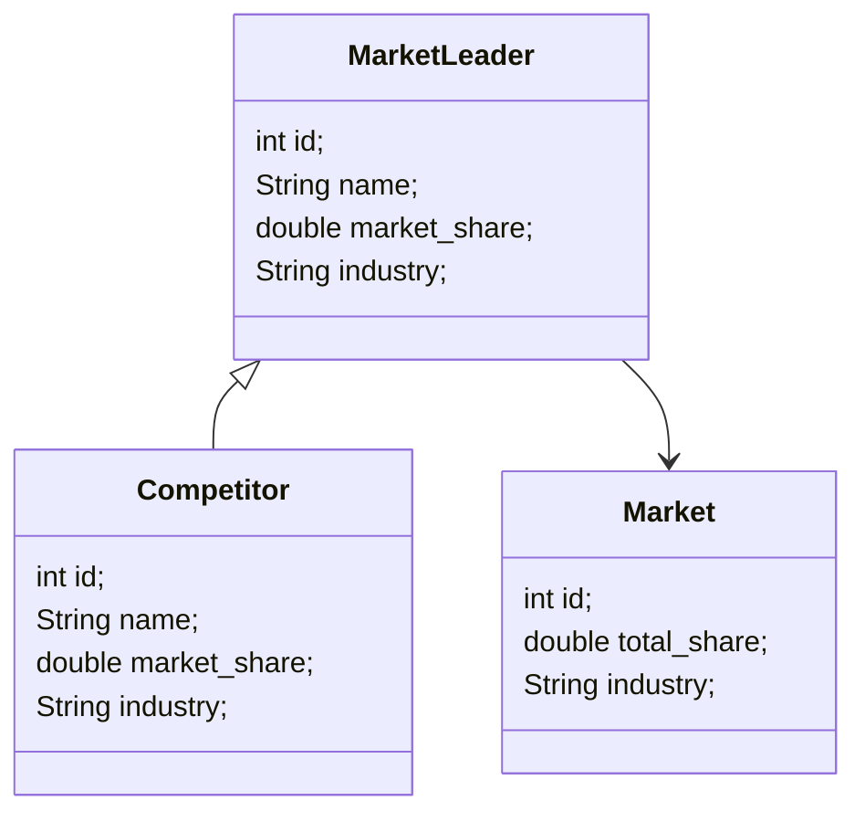
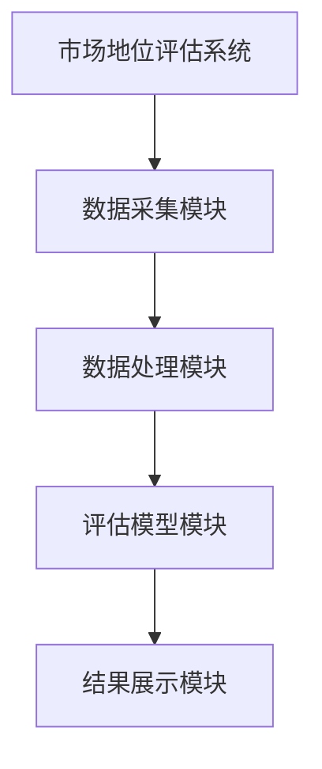
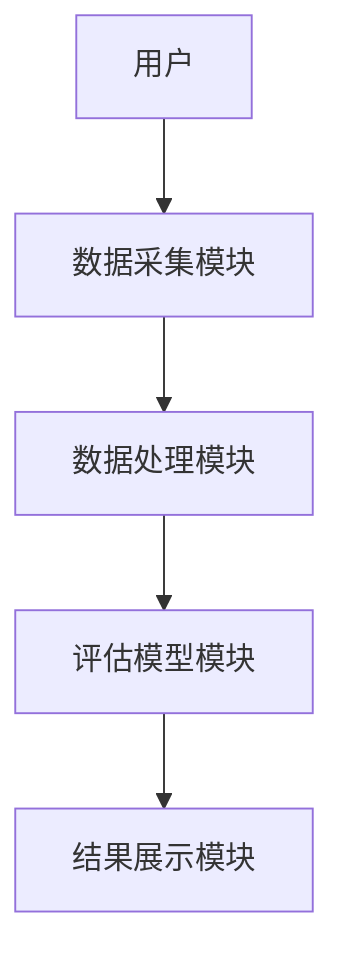
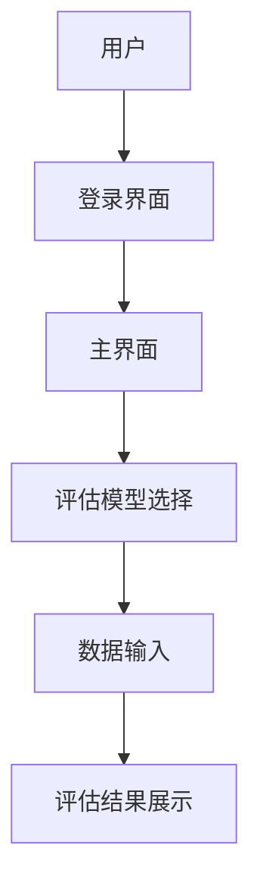

                 


# 彼得林奇的"市场先行者"优势持续性评估方法

> 关键词：市场先行者优势、持续性评估、彼得林奇、竞争优势、市场地位

> 摘要：本文深入探讨了彼得·林奇提出的市场先行者优势的持续性评估方法，从理论基础、评估维度到具体方法，结合实际案例，系统性地分析了如何评估和维持市场先行者优势，为企业制定战略提供了实践指导。

---

## 第一部分：市场先行者优势概述

### 第1章：市场先行者优势的基本概念

#### 1.1 市场先行者优势的定义
##### 1.1.1 什么是市场先行者优势
市场先行者优势是指企业在市场中率先占据领先地位，通过先发制人的策略，获得竞争优势的一种现象。这种优势通常体现在市场份额、品牌影响力和客户认知度等方面。

##### 1.1.2 市场先行者优势的核心特征
- **先发性**：企业能够在市场中率先推出产品或服务，抢占先机。
- **领导地位**：市场先行者通常成为行业的领导者，具有定价权和决策权。
- **竞争优势**：通过先发优势，企业能够建立技术、品牌或服务上的壁垒。

##### 1.1.3 市场先行者优势的边界与外延
市场先行者优势并非无条件的，其持续性受到市场环境、竞争强度和企业自身能力的影响。外延包括企业如何通过创新和优化运营，持续巩固和扩大市场领先优势。

#### 1.2 市场先行者优势的构成要素
##### 1.2.1 市场领先地位的定义
市场领先地位是指企业在某一市场或某一细分市场中占据主导地位，通常以市场份额、品牌影响力和客户忠诚度为衡量标准。

##### 1.2.2 先发优势的来源分析
- **技术领先**：企业通过技术创新率先推出产品或服务。
- **资源禀赋**：企业拥有更多的资金、人才或渠道资源。
- **战略选择**：企业通过正确的市场定位和战略规划，抢占市场先机。

##### 1.2.3 市场先行者优势的结构化模型
市场先行者优势的结构化模型包括以下几个关键要素：
1. **市场定位**：企业在市场中的位置和目标客户群体。
2. **竞争优势**：企业相对于竞争对手的核心优势。
3. **战略执行**：企业如何通过战略实施巩固市场地位。
4. **持续优化**：企业如何不断优化产品和服务，保持领先地位。

---

### 第2章：市场先行者优势的理论基础

#### 2.1 市场先行者优势的经济学分析
##### 2.1.1 先发优势的经济学解释
先发优势在经济学中被称为“先发优势效应”，是指企业在市场中率先行动所获得的竞争优势。这种优势通常能够为企业带来更高的利润率和市场份额。

##### 2.1.2 市场领导者地位的经济效应
市场领导者通常能够通过规模经济、定价权和品牌影响力获得更高的利润。同时，市场领导者还能够通过先发优势，进一步扩大市场份额。

##### 2.1.3 市场先行者优势的动态变化
市场先行者优势并非一成不变，随着时间推移和市场环境的变化，优势可能会逐渐减弱。企业需要不断创新和优化，才能维持领先地位。

#### 2.2 市场先行者优势的战略意义
##### 2.2.1 市场领导地位的战略价值
市场领导地位不仅意味着市场份额和品牌影响力，还意味着企业能够在市场中占据主动权，影响行业规则和市场趋势。

##### 2.2.2 市场先行者优势与企业竞争力
市场先行者优势是企业竞争力的重要组成部分。通过先发优势，企业能够快速响应市场需求，抓住市场机会，从而在竞争中占据优势。

##### 2.2.3 市场先行者优势的可持续性问题
市场先行者优势的可持续性取决于企业的战略选择和执行能力。企业需要不断创新，提升产品和服务质量，才能维持领先地位。

---

## 第二部分：市场先行者优势的评估维度

### 第3章：市场先行者优势的关键指标

#### 3.1 市场份额分析
##### 3.1.1 市场份额的定义与计算
市场份额是指企业在某一市场中的销售量、销售额或用户数量占整个市场的比例。市场份额的计算公式为：
$$ \text{市场份额} = \frac{\text{企业的销售量/销售额}}{\text{市场的总销售量/销售额}} $$

##### 3.1.2 市场份额与市场领导地位的关系
市场份额是衡量市场领导地位的重要指标。通常情况下，市场份额越高，企业的市场地位越稳固。

##### 3.1.3 市场份额变化的驱动因素
市场份额的变化受到多种因素的影响，包括市场需求变化、竞争者的策略调整、企业的自身能力等。

#### 3.2 市场地位的稳定性评估
##### 3.2.1 市场地位稳定性的定义
市场地位稳定性是指企业在市场中保持领先地位的能力，通常通过市场份额的变化趋势和企业的抗风险能力来衡量。

##### 3.2.2 影响市场地位稳定性的因素
- **市场需求变化**：市场需求的变化会影响企业的市场份额。
- **竞争强度**：竞争加剧会威胁企业的市场地位。
- **企业自身能力**：企业的创新能力、运营效率和战略执行能力直接影响市场地位的稳定性。

##### 3.2.3 市场地位稳定性评估的方法
企业可以通过定期监测市场份额变化、分析竞争环境和评估自身能力，来评估市场地位的稳定性。

### 第4章：市场先行者优势的外部环境分析

#### 4.1 行业竞争格局分析
##### 4.1.1 行业竞争结构的定义
行业竞争结构是指行业内竞争的强度和竞争格局。通常包括寡头垄断、完全竞争、垄断竞争等类型。

##### 4.1.2 行业竞争格局对市场先行者优势的影响
行业竞争格局直接影响企业的市场地位。在竞争激烈的行业，市场先行者优势更容易受到威胁。

##### 4.1.3 行业趋势对市场地位的影响
行业发展趋势，如技术创新、市场需求变化等，都会影响企业的市场地位。企业需要密切关注行业趋势，及时调整战略。

#### 4.2 宏观经济环境的影响
##### 4.2.1 宏观经济环境对市场地位的影响
宏观经济环境，如经济周期、通货膨胀率等，会影响市场需求和企业的市场地位。

##### 4.2.2 经济周期对市场先行者优势的影响
在经济繁荣时期，市场先行者优势更容易被巩固；而在经济衰退时期，市场先行者优势可能受到挑战。

##### 4.2.3 政策环境对市场地位的影响
政策环境的变化，如税收政策、行业监管等，也会对企业的市场地位产生重要影响。

---

## 第三部分：市场先行者优势的评估方法

### 第5章：定性评估方法

#### 5.1 市场地位分析法
##### 5.1.1 市场地位的定性评估指标
- 市场领导地位
- 品牌影响力
- 客户忠诚度
- 竞争对手的评价

##### 5.1.2 市场地位分析法的步骤
1. 确定企业的市场定位
2. 分析竞争对手的市场地位
3. 评估企业的品牌影响力和客户忠诚度
4. 综合分析企业的市场地位

##### 5.1.3 市场地位分析法的优缺点
优点：能够全面评估企业的市场地位；缺点：定性评估主观性较强，缺乏量化指标。

#### 5.2 竞争对手分析法
##### 5.2.1 竞争对手分析法的定义
竞争对手分析法是指通过分析竞争对手的市场行为、产品策略和竞争优势，来评估企业的市场地位。

##### 5.2.2 竞争对手分析法的实施步骤
1. 确定竞争对手
2. 分析竞争对手的市场行为
3. 评估竞争对手的优势和劣势
4. 制定针对性的战略

##### 5.2.3 竞争对手分析法的实际应用
通过分析竞争对手的产品策略和市场行为，企业可以更好地制定自己的市场战略，巩固市场先行者优势。

### 第6章：定量评估方法

#### 6.1 市场份额分析法
##### 6.1.1 市场份额的定量计算方法
市场份额的计算公式为：
$$ \text{市场份额} = \frac{\text{企业的销售量/销售额}}{\text{市场的总销售量/销售额}} $$

##### 6.1.2 市场份额变化趋势的分析
企业可以通过时间序列分析，观察市场份额的变化趋势，评估市场地位的稳定性。

##### 6.1.3 市场份额与市场领导地位的关系
市场份额是衡量市场领导地位的重要指标。通常情况下，市场份额越高，企业的市场地位越稳固。

#### 6.2 市场地位稳定性评估法
##### 6.2.1 市场地位稳定性评估的数学模型
市场地位稳定性评估模型可以通过以下公式表示：
$$ \text{稳定性指数} = \frac{\text{市场份额的波动幅度}}{\text{市场的平均波动幅度}} $$

##### 6.2.2 影响市场地位稳定性的因素
- **市场需求变化**：市场需求的变化会影响市场份额。
- **竞争强度**：竞争加剧会威胁市场地位。
- **企业自身能力**：企业的创新能力、运营效率和战略执行能力直接影响市场地位的稳定性。

##### 6.2.3 市场地位稳定性评估的步骤
1. 收集市场份额数据
2. 分析市场份额的变化趋势
3. 评估影响市场地位稳定性的因素
4. 综合评估市场地位的稳定性

---

## 第四部分：系统分析与架构设计

### 第7章：系统分析与架构设计

#### 7.1 问题场景介绍
市场先行者优势的持续性评估需要一个系统的解决方案。我们可以通过构建一个评估模型，帮助企业分析和评估市场先行者优势的持续性。

#### 7.2 系统功能设计
##### 7.2.1 领域模型设计
以下是领域模型的mermaid类图：



##### 7.2.2 系统架构设计
以下是系统架构的mermaid图：



##### 7.2.3 系统接口设计
以下是系统接口的mermaid图：



##### 7.2.4 系统交互设计
以下是系统交互的mermaid图：



---

## 第五部分：项目实战

### 第8章：项目实战

#### 8.1 环境配置
以下是项目实战的环境配置：

```bash
# 安装所需依赖
pip install pandas numpy matplotlib
```

#### 8.2 核心代码实现
以下是核心代码实现：

```python
import pandas as pd
import numpy as np
import matplotlib.pyplot as plt

# 数据处理模块
class MarketShareAnalyzer:
    def __init__(self, data):
        self.data = data

    def calculate_market_share(self):
        total_share = sum(self.data['market_share'])
        return self.data['market_share'] / total_share * 100

    def plot_share_trend(self):
        plt.plot(self.data['year'], self.data['market_share'])
        plt.title('Market Share Trend')
        plt.xlabel('Year')
        plt.ylabel('Market Share')
        plt.show()

# 评估模型模块
class MarketLeaderAssessor:
    def __init__(self, data):
        self.data = data

    def assess_stability(self):
        stability_index = np.std(self.data['market_share']) / np.mean(self.data['market_share'])
        return stability_index

# 系统交互模块
class MarketAssessmentSystem:
    def __init__(self):
        self.analyzer = MarketShareAnalyzer(pd.DataFrame())
        self.assessor = MarketLeaderAssessor(pd.DataFrame())

    def run(self):
        while True:
            print("1. 输入市场份额数据")
            print("2. 分析市场份额趋势")
            print("3. 评估市场地位稳定性")
            print("4. 退出")
            choice = input("请选择：")
            if choice == '1':
                # 输入数据
                data = pd.DataFrame({'year': [2020, 2021, 2022, 2023], 'market_share': [30, 35, 40, 45]})
                self.analyzer.data = data
            elif choice == '2':
                # 分析趋势
                self.analyzer.plot_share_trend()
            elif choice == '3':
                # 评估稳定性
                print(f"稳定性指数：{self.assessor.assess_stability()}")
            elif choice == '4':
                break

if __name__ == "__main__":
    system = MarketAssessmentSystem()
    system.run()
```

#### 8.3 案例分析
以下是案例分析：

假设我们有一个企业的市场份额数据如下：

```python
data = pd.DataFrame({
    'year': [2018, 2019, 2020, 2021, 2022],
    'market_share': [25, 30, 35, 40, 45]
})

analyzer = MarketShareAnalyzer(data)
analyzer.plot_share_trend()
```

运行上述代码，可以得到市场份额趋势图：


通过分析，我们可以看到企业的市场份额逐年增加，市场地位逐渐稳固。

#### 8.4 项目总结
通过本项目，我们构建了一个完整的市场地位评估系统，能够帮助企业分析市场份额趋势和评估市场地位稳定性。企业可以根据评估结果，制定相应的市场战略，巩固市场先行者优势。

---

## 第六部分：最佳实践与总结

### 第9章：最佳实践与总结

#### 9.1 小结
市场先行者优势的持续性评估是一个复杂的过程，需要结合定性和定量方法，全面分析市场环境和企业自身能力。通过构建评估模型和系统，企业可以更有效地评估和管理市场地位。

#### 9.2 注意事项
- 市场环境复杂多变，企业需要定期评估市场地位。
- 评估市场地位时，需要结合定量和定性方法。
- 市场地位的持续性取决于企业的创新能力和服务质量。

#### 9.3 拓展阅读
- 彼得·林奇的其他著作
- 市场地位评估的相关研究
- 市场竞争分析的方法论

---

## 结语

通过本文的系统分析和实践，我们深入探讨了彼得·林奇提出的市场先行者优势的持续性评估方法。从理论基础到具体方法，结合实际案例，我们为企业提供了全面的评估和管理策略。希望本文能够为企业的市场战略制定提供有价值的参考。

---

作者：AI天才研究院/AI Genius Institute & 禅与计算机程序设计艺术 /Zen And The Art of Computer Programming

