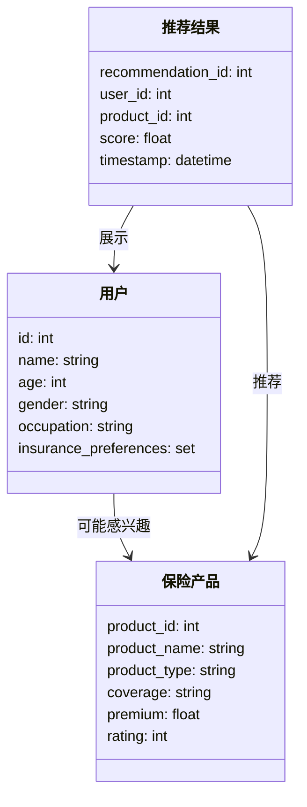
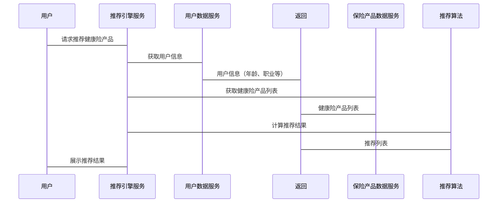

                 


# 智能保险产品个性化推荐引擎

> **关键词**：智能保险推荐引擎，个性化推荐，协同过滤算法，保险产品推荐，用户画像，保险数字化转型

> **摘要**：本文详细探讨智能保险产品个性化推荐引擎的核心原理、算法实现、系统架构及实际应用。从保险行业的数字化转型背景出发，分析推荐引擎在保险产品推荐中的重要作用。通过协同过滤、聚类分析等算法，结合用户画像和保险产品特征，构建高效的个性化推荐系统。文章还结合实际案例，详细阐述推荐引擎的系统设计、实现过程及优化策略，为保险行业的智能化发展提供理论支持与实践指导。

---

## 第1章: 智能保险产品个性化推荐引擎的背景与意义

### 1.1 保险行业的数字化转型

#### 1.1.1 传统保险行业的痛点与挑战
传统保险行业在销售模式上以人工推荐为主，存在以下痛点：
- **效率低下**：保险产品的种类繁多，人工推荐难以覆盖所有潜在客户。
- **精准度不足**：传统推荐方式难以满足用户的个性化需求。
- **成本高昂**：人工推荐模式需要大量销售团队，运营成本较高。

#### 1.1.2 数字化转型的必要性
随着互联网技术的快速发展，保险行业正经历从传统模式向数字化模式的转变。数字化转型能够帮助保险公司：
- 提高客户触达效率。
- 降低运营成本。
- 提升客户满意度和忠诚度。

#### 1.1.3 个性化推荐在保险行业中的价值
个性化推荐能够根据用户的需求和行为，精准匹配合适的保险产品，从而提升销售转化率和客户满意度。通过大数据和人工智能技术，个性化推荐引擎能够实现以下目标：
- 提供差异化的产品推荐。
- 提高客户购买决策的效率。
- 增强客户对保险品牌的信任感。

### 1.2 智能推荐引擎的核心概念

#### 1.2.1 个性化推荐的定义与特点
个性化推荐是指根据用户的行为、偏好和需求，智能匹配合适的产品或服务。其特点包括：
- **实时性**：基于实时数据进行推荐。
- **个性化**：针对不同用户的需求提供差异化推荐。
- **动态性**：根据用户行为和市场变化动态调整推荐策略。

#### 1.2.2 智能保险推荐引擎的背景与目标
智能保险推荐引擎是基于人工智能技术的推荐系统，旨在通过分析用户数据和保险产品特征，实现精准的保险产品推荐。其目标是：
- 提高保险产品的销售转化率。
- 提升用户体验和客户满意度。
- 帮助保险公司实现数字化转型。

#### 1.2.3 保险推荐引擎的边界与外延
保险推荐引擎的边界包括：
- 用户数据的采集与处理。
- 保险产品的特征提取与分类。
- 推荐结果的生成与展示。

其外延包括：
- 用户画像构建。
- 保险产品知识图谱的构建。
- 推荐结果的实时更新与优化。

### 1.3 本章小结
本章介绍了保险行业数字化转型的背景，阐述了个性化推荐在保险行业中的重要性，并详细描述了智能保险推荐引擎的核心概念和边界。通过本章内容，读者可以理解智能保险推荐引擎的基本框架和目标。

---

## 第2章: 保险产品推荐引擎的核心要素

### 2.1 用户画像与行为分析

#### 2.1.1 用户画像的构建与特征提取
用户画像是通过收集和分析用户的行为数据、人口统计数据等，构建出的用户立体画像。特征提取是用户画像构建的关键步骤，主要包括：
- **基本特征**：年龄、性别、职业等。
- **行为特征**：浏览记录、购买记录等。
- **偏好特征**：对保险产品的偏好程度。

#### 2.1.2 用户行为数据的采集与分析
用户行为数据的采集可以通过以下渠道：
- **网站/APP日志**：记录用户的浏览、点击、购买行为。
- **问卷调查**：通过问卷收集用户的保险需求和偏好。
- **社交媒体数据**：分析用户在社交媒体上的行为和评论。

用户行为分析可以通过以下步骤进行：
1. 数据清洗：去除噪声数据。
2. 数据建模：使用机器学习模型分析用户行为。
3. 数据可视化：通过图表展示用户行为特征。

#### 2.1.3 用户需求与偏好的预测模型
用户需求与偏好的预测可以通过以下方法实现：
- **基于统计的模型**：如关联规则挖掘。
- **基于机器学习的模型**：如逻辑回归、随机森林等。
- **基于深度学习的模型**：如神经网络模型。

### 2.2 保险产品的特征与分类

#### 2.2.1 保险产品的基本特征
保险产品的基本特征包括：
- **产品类型**：如寿险、健康险、车险等。
- **保障范围**：如保障疾病、意外、寿险等。
- **保费与保额**：如保费高低、保额大小。

#### 2.2.2 保险产品的分类与属性对比
保险产品的分类可以通过以下方式进行：
- **按险种分类**：如寿险、健康险、财产险等。
- **按保障期限分类**：如一年期、长期险等。
- **按保费支付方式分类**：如趸缴、分期缴等。

#### 2.2.3 保险产品推荐的核心要素
保险产品推荐的核心要素包括：
- **产品的市场表现**：如销量、用户评价等。
- **产品的适合度**：如是否符合用户的需求。
- **产品的竞争优势**：如价格、保障范围等。

### 2.3 推荐系统中的关联规则

#### 2.3.1 用户-产品关联关系
用户-产品关联关系可以通过以下方式表示：
- **用户对产品的评分**：如五星评分。
- **用户的点击与购买行为**：如点击次数、购买记录。

#### 2.3.2 产品-产品关联关系
产品-产品关联关系可以通过以下方式表示：
- **基于协同过滤的相似度计算**：如余弦相似度。
- **基于知识图谱的语义相似度**：如保险产品的属性相似度。

#### 2.3.3 用户-用户关联关系
用户-用户关联关系可以通过以下方式表示：
- **基于协同过滤的相似度计算**：如余弦相似度。
- **基于聚类算法的用户分群**：如K-means聚类。

### 2.4 本章小结
本章详细介绍了保险产品推荐引擎的核心要素，包括用户画像、保险产品特征、推荐系统的关联规则等。通过这些核心要素，可以构建出高效的保险产品推荐系统。

---

## 第3章: 协同过滤算法

### 3.1 协同过滤的基本原理

#### 3.1.1 基于用户的协同过滤
基于用户的协同过滤（User-based Collaborative Filtering）是通过寻找与目标用户相似的其他用户，推荐这些用户喜欢的产品。其实现步骤如下：
1. 计算用户之间的相似度。
2. 找到与目标用户相似的用户。
3. 根据这些用户的评分，预测目标用户对产品的评分。
4. 根据评分高低，推荐产品。

#### 3.1.2 基于物品的协同过滤
基于物品的协同过滤（Item-based Collaborative Filtering）是通过寻找与目标产品相似的其他产品，推荐这些产品给用户。其实现步骤如下：
1. 计算产品之间的相似度。
2. 找到与目标产品相似的产品。
3. 根据用户对相似产品的评分，预测用户对目标产品的评分。
4. 根据评分高低，推荐产品。

#### 3.1.3 混合协同过滤的优缺点
混合协同过滤结合了基于用户和基于物品的协同过滤的优点，能够提高推荐的准确性和多样性。其优点包括：
- 能够同时考虑用户和产品的特征。
- 能够提高推荐的准确性和多样性。
其缺点包括：
- 实现复杂，计算量大。

### 3.2 协同过滤的实现步骤

#### 3.2.1 数据预处理
数据预处理是协同过滤的第一步，主要包括：
- **数据清洗**：去除噪声数据。
- **数据归一化**：将评分数据归一化处理。
- **数据分割**：将数据划分为训练集和测试集。

#### 3.2.2 相似度计算
相似度计算是协同过滤的核心步骤，常用的相似度计算方法包括：
- **余弦相似度**：$$ sim(u, v) = \frac{\sum_{i} (r_{u,i} - \bar{r}_u)(r_{v,i} - \bar{r}_v)}{\sqrt{\sum_{i} (r_{u,i} - \bar{r}_u)^2} \cdot \sqrt{\sum_{i} (r_{v,i} - \bar{r}_v)^2}} $$
- **皮尔逊相关系数**：$$ sim(u, v) = \frac{\sum_{i} (r_{u,i} - \bar{r}_u)(r_{v,i} - \bar{r}_v)}{\sqrt{\sum_{i} (r_{u,i} - \bar{r}_u)^2} \cdot \sqrt{\sum_{i} (r_{v,i} - \bar{r}_v)^2}} $$

#### 3.2.3 推荐结果生成
推荐结果生成是协同过滤的最后一步，主要包括：
- 根据相似度计算结果，预测目标用户对产品的评分。
- 根据评分高低，生成推荐列表。

### 3.3 协同过滤的数学模型

#### 3.3.1 相似度计算公式
$$ sim(u, v) = \frac{\sum_{i} (r_{u,i} - \bar{r}_u)(r_{v,i} - \bar{r}_v)}{\sqrt{\sum_{i} (r_{u,i} - \bar{r}_u)^2} \cdot \sqrt{\sum_{i} (r_{v,i} - \bar{r}_v)^2}} $$

#### 3.3.2 推荐评分预测公式
$$ \hat{r}_{u,i} = \bar{r}_u + \sum_{v} (sim(u, v) \cdot (r_{v,i} - \bar{r}_v)) $$

### 3.4 协同过滤的优缺点分析

#### 3.4.1 优点：个性化与实时性
协同过滤的优点包括：
- 能够实现个性化推荐。
- 推荐结果具有较高的实时性。

#### 3.4.2 缺点：数据稀疏性与计算复杂度
协同过滤的缺点包括：
- 数据稀疏性问题：用户数量多，数据稀疏，计算复杂。
- 计算复杂度高：需要计算大量相似度，计算量大。

### 3.5 本章小结
本章详细介绍了协同过滤算法的基本原理、实现步骤和数学模型，并分析了其优缺点。通过本章内容，读者可以理解协同过滤算法在保险产品推荐中的应用。

---

## 第4章: 基于聚类的推荐算法

### 4.1 聚类算法的基本原理

#### 4.1.1 K-means聚类算法
K-means聚类算法是一种常用的聚类算法，其步骤如下：
1. 初始化：随机选择K个聚类中心。
2. 赋值：将每个样本分配到最近的聚类中心。
3. 更新：计算新的聚类中心。
4. 重复步骤2和3，直到聚类中心不再变化。

#### 4.1.2 层次聚类算法
层次聚类算法是一种基于层次结构的聚类算法，其步骤如下：
1. 初始化：将每个样本作为一个聚类。
2. 合并：根据相似度，逐步合并最相似的两个聚类。
3. 重复步骤2，直到所有样本合并成一个聚类。

#### 4.1.3 聚类算法的优缺点
聚类算法的优点包括：
- 能够发现数据中的潜在结构。
- 适用于数据量较大的场景。
其缺点包括：
- 聚类结果可能不稳定。
- 需要人工干预确定聚类数。

### 4.2 聚类算法在保险推荐中的应用

#### 4.2.1 用户聚类
用户聚类可以通过以下步骤实现：
1. 收集用户数据。
2. 数据预处理：归一化、降维等。
3. 选择聚类算法：如K-means、层次聚类等。
4. 进行用户聚类。
5. 根据聚类结果，进行个性化推荐。

#### 4.2.2 产品聚类
产品聚类可以通过以下步骤实现：
1. 收集产品数据。
2. 数据预处理：归一化、降维等。
3. 选择聚类算法：如K-means、层次聚类等。
4. 进行产品聚类。
5. 根据聚类结果，优化推荐策略。

#### 4.2.3 聚类结果与推荐策略
聚类结果可以用于优化推荐策略，例如：
- 对于特定聚类的用户，推荐特定聚类的产品。
- 根据聚类结果，动态调整推荐策略。

### 4.3 本章小结
本章详细介绍了聚类算法的基本原理及其在保险推荐中的应用。通过聚类算法，可以实现用户和产品的自动分类，从而优化推荐策略。

---

## 第5章: 保险推荐引擎的系统架构设计

### 5.1 问题场景介绍
保险推荐引擎需要解决的问题包括：
- 如何高效地处理海量用户数据和保险产品数据。
- 如何实现精准的个性化推荐。

### 5.2 项目介绍

#### 5.2.1 项目目标
项目目标是构建一个高效、精准的保险产品推荐引擎，能够根据用户的需求和行为，推荐合适的保险产品。

#### 5.2.2 项目范围
项目范围包括：
- 用户数据的采集与处理。
- 保险产品的特征提取与分类。
- 推荐算法的实现与优化。
- 推荐结果的展示与反馈。

### 5.3 系统功能设计

#### 5.3.1 领域模型
领域模型是一个概念性的模型，用于描述系统的功能和数据关系。以下是领域模型的类图：



#### 5.3.2 系统架构设计
系统架构设计是一个关键的步骤，以下是系统架构的架构图：

```mermaid
archi
    顶层架构
        包含 推荐引擎服务、用户数据服务、保险产品数据服务
    中间层
        包含 推荐引擎服务、用户数据服务、保险产品数据服务
    底层
        包含 数据库、缓存
```

### 5.4 系统接口设计

#### 5.4.1 API接口设计
以下是推荐引擎的API接口设计：

```http
POST /recommend
Content-Type: application/json

{
    "user_id": 123,
    "product_category": "健康险"
}
```

#### 5.4.2 API响应格式
以下是API的响应格式：

```json
{
    "recommendations": [
        {
            "product_id": 456,
            "score": 0.95,
            "reason": "健康险产品A，保费低，保障范围广"
        },
        {
            "product_id": 789,
            "score": 0.85,
            "reason": "健康险产品B，保障期限长"
        }
    ]
}
```

### 5.5 系统交互设计

#### 5.5.1 用户与推荐引擎的交互流程
以下是用户与推荐引擎的交互流程：



### 5.6 本章小结
本章详细介绍了保险推荐引擎的系统架构设计，包括领域模型、系统架构、API接口设计和系统交互设计。通过本章内容，读者可以理解推荐引擎的实现过程。

---

## 第6章: 保险推荐引擎的项目实战

### 6.1 环境安装

#### 6.1.1 开发环境
推荐引擎的开发环境包括：
- **编程语言**：Python 3.8+
- **框架**：Flask、Django
- **数据库**：MySQL、MongoDB
- **机器学习库**：scikit-learn、TensorFlow

#### 6.1.2 安装依赖
以下是推荐引擎的依赖安装命令：

```bash
pip install flask scikit-learn numpy pandas
```

### 6.2 系统核心实现源代码

#### 6.2.1 数据预处理代码
以下是数据预处理的代码示例：

```python
import pandas as pd
from sklearn.preprocessing import StandardScaler

# 读取数据
data = pd.read_csv('insurance.csv')

# 数据清洗
data.dropna(inplace=True)

# 数据归一化
scaler = StandardScaler()
scaled_data = scaler.fit_transform(data[['age', 'income', '保费']])

# 数据分割
train_data = scaled_data[:700]
test_data = scaled_data[700:]
```

#### 6.2.2 协同过滤算法实现代码
以下是协同过滤算法的实现代码示例：

```python
from sklearn.metrics.pairwise import cosine_similarity

def collaborative_filtering(train_data, test_data):
    # 计算相似度
    similarity = cosine_similarity(train_data)
    
    # 推荐结果
    recommendations = []
    for i in range(len(test_data)):
        similar_indices = [j for j in range(len(similarity[i])) if similarity[i][j] > 0.5]
        recommendations.append(similar_indices)
    
    return recommendations

# 调用函数
recommendations = collaborative_filtering(train_data, test_data)
```

#### 6.2.3 聚类算法实现代码
以下是聚类算法的实现代码示例：

```python
from sklearn.cluster import KMeans

def cluster_recommendation(train_data, num_clusters=3):
    # 初始化K-means模型
    kmeans = KMeans(n_clusters=num_clusters)
    
    # 进行聚类
    kmeans.fit(train_data)
    
    # 获取聚类结果
    clusters = kmeans.predict(train_data)
    
    return clusters

# 调用函数
clusters = cluster_recommendation(train_data)
```

### 6.3 代码应用解读与分析

#### 6.3.1 数据预处理
数据预处理是推荐引擎的核心步骤，主要包括：
- **数据清洗**：去除缺失值和异常值。
- **数据归一化**：将数据标准化，便于后续算法处理。
- **数据分割**：将数据划分为训练集和测试集。

#### 6.3.2 协同过滤算法实现
协同过滤算法的实现步骤包括：
- **相似度计算**：计算用户或产品之间的相似度。
- **推荐结果生成**：根据相似度计算结果，生成推荐列表。

#### 6.3.3 聚类算法实现
聚类算法的实现步骤包括：
- **数据预处理**：归一化、降维等。
- **选择聚类算法**：如K-means、层次聚类等。
- **进行聚类**：将数据划分为不同的聚类。
- **优化聚类结果**：根据业务需求，优化聚类结果。

### 6.4 实际案例分析

#### 6.4.1 案例背景
假设我们有一个保险产品的数据集，包含以下信息：
- 用户ID
- 用户年龄
- 用户职业
- 保险产品ID
- 保险产品类型
- 保险产品保费

#### 6.4.2 数据分析与建模
通过数据分析与建模，我们可以得出以下结论：
- 不同年龄段的用户对保险产品的偏好不同。
- 不同职业的用户对保险产品的偏好也不同。
- 保险产品的保费和保障范围是用户选择的重要因素。

#### 6.4.3 模型优化与部署
模型优化与部署包括：
- 根据实际效果，调整模型参数。
- 将推荐引擎部署到生产环境。
- 监控推荐结果，根据反馈优化推荐策略。

### 6.5 本章小结
本章通过实际案例，详细介绍了推荐引擎的实现过程，包括数据预处理、算法实现、模型优化与部署。通过本章内容，读者可以掌握推荐引擎的实际应用方法。

---

## 第7章: 总结与展望

### 7.1 本章总结
本文详细探讨了智能保险产品个性化推荐引擎的核心原理、算法实现、系统架构及实际应用。通过协同过滤和聚类分析等算法，结合用户画像和保险产品特征，构建了高效的个性化推荐系统。本文还结合实际案例，详细阐述了推荐引擎的系统设计、实现过程及优化策略。

### 7.2 未来展望
未来，随着人工智能技术的不断发展，智能保险推荐引擎将更加智能化和个性化。以下是未来的发展方向：
- **深度学习技术的应用**：如神经网络模型在推荐系统中的应用。
- **知识图谱的构建与应用**：通过知识图谱，实现更精准的推荐。
- **实时推荐的实现**：通过实时数据处理技术，实现实时推荐。
- **多模态推荐**：结合文本、图像等多种数据源，实现多模态推荐。

### 7.3 最佳实践 tips
在实际应用中，需要注意以下几点：
- **数据质量**：确保数据的准确性和完整性。
- **模型优化**：根据实际效果，动态调整模型参数。
- **用户体验**：推荐结果需要符合用户的实际需求。
- **系统性能**：确保推荐系统的高效性和稳定性。

### 7.4 本章小结
本章总结了全文内容，并展望了未来的发展方向。通过本章内容，读者可以对智能保险推荐引擎有一个全面的认识。

---

## 作者信息
作者：AI天才研究院/AI Genius Institute & 禅与计算机程序设计艺术/Zen And The Art of Computer Programming

---

通过以上思考过程，我们可以系统地撰写一篇结构清晰、内容详实的《智能保险产品个性化推荐引擎》技术博客文章。

