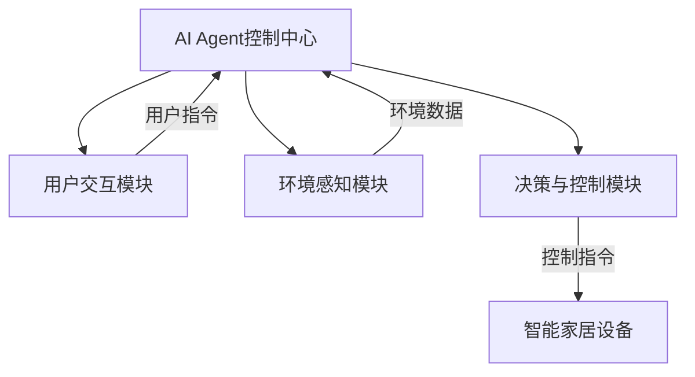
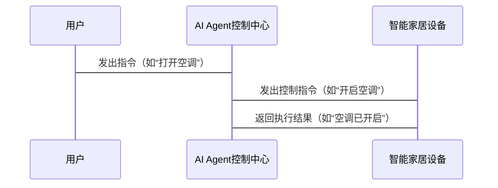

                 


# 智能家居中的AI Agent控制中心

> 关键词：AI Agent，智能家居，控制中心，物联网，人工智能

> 摘要：本文详细探讨了智能家居中的AI Agent控制中心的设计与实现。从AI Agent的基本概念到其在智能家居中的具体应用，从系统架构设计到实际项目实战，全面分析了AI Agent如何通过感知、决策和执行机制实现智能家居的智能化控制。本文还通过实际案例展示了AI Agent控制中心在智能家居中的核心作用，并提出了未来的发展方向。

---

# 第1章: AI Agent与智能家居的基本概念

## 1.1 AI Agent的基本概念

### 1.1.1 AI Agent的定义

AI Agent（人工智能代理）是一种能够感知环境、做出决策并执行任务的智能实体。它可以是一个软件程序，也可以是一个物理设备，其核心目标是通过与环境交互来实现特定目标。

### 1.1.2 AI Agent的核心属性

- **自主性**：AI Agent能够自主决策，无需外部干预。
- **反应性**：能够实时感知环境并做出反应。
- **主动性**：能够主动采取行动以实现目标。
- **社会性**：能够与其他AI Agent或人类进行交互与协作。

### 1.1.3 AI Agent与传统家居控制系统的区别

传统的家居控制系统通常是基于规则的，例如通过预设的条件（如温度达到某个值时开启空调）来执行操作。而AI Agent则能够通过学习和适应，根据实时数据做出更复杂的决策。

---

## 1.2 智能家居的基本概念

### 1.2.1 智能家居的定义

智能家居是指通过物联网（IoT）技术，将家中的设备（如灯光、空调、摄像头等）连接到一个中央控制系统，并通过人工智能技术实现智能化的管理和控制。

### 1.2.2 智能家居的核心特点

- **智能化**：通过AI技术实现设备的自动控制。
- **联网化**：设备之间通过物联网技术实现互联互通。
- **便捷性**：用户可以通过手机APP、语音助手等方式远程控制设备。

### 1.2.3 智能家居的发展历程

智能家居的概念可以追溯到20世纪90年代，但随着物联网和人工智能技术的发展，智能家居的实现方式变得更加智能化和便捷化。

---

## 1.3 AI Agent在智能家居中的作用

### 1.3.1 AI Agent作为智能家居的控制中心

AI Agent在智能家居中扮演着“大脑”的角色，负责接收用户的指令、感知环境的变化，并通过决策算法控制智能家居设备的运行。

### 1.3.2 AI Agent的核心功能

- **感知环境**：通过传感器获取室内外的温度、湿度、光照等数据。
- **用户交互**：通过语音助手、手机APP等方式与用户进行交互。
- **决策与执行**：根据感知数据和用户指令，通过决策算法控制智能家居设备的运行。

### 1.3.3 智能家居中的AI Agent控制中心的未来发展趋势

随着人工智能和物联网技术的不断进步，AI Agent控制中心将更加智能化、个性化，并能够实现更复杂的场景控制。

---

## 1.4 本章小结

本章从AI Agent的基本概念出发，介绍了智能家居的定义、特点及其发展历程，并详细阐述了AI Agent在智能家居中的核心作用。通过本章的学习，读者可以对AI Agent控制中心的基本概念和功能有一个清晰的理解。

---

# 第2章: 智能家居中的AI Agent控制中心的系统架构设计

## 2.1 系统架构概述

### 2.1.1 系统架构的定义

系统架构是指系统的整体结构和组成部分之间的关系。在智能家居中，AI Agent控制中心的系统架构设计是实现智能化控制的核心。

### 2.1.2 系统架构的设计原则

- **模块化设计**：将系统划分为多个功能模块，每个模块负责特定的功能。
- **可扩展性**：系统架构应具有良好的扩展性，能够适应未来功能的增加。
- **可靠性**：系统架构应确保系统的稳定性和可靠性。

---

## 2.2 系统功能模块设计

### 2.2.1 用户交互模块

- **功能描述**：用户可以通过手机APP、语音助手等方式与系统进行交互。
- **实现方式**：通过API与第三方语音助手（如Amazon Alexa、Google Assistant）对接。

### 2.2.2 环境感知模块

- **功能描述**：通过传感器获取室内外的环境数据（如温度、湿度、光照等）。
- **实现方式**：使用物联网传感器模块（如温湿度传感器、光照传感器）采集数据。

### 2.2.3 决策与控制模块

- **功能描述**：根据环境数据和用户指令，通过决策算法控制智能家居设备的运行。
- **实现方式**：使用机器学习算法（如决策树、随机森林）进行决策。

---

## 2.3 系统架构图



---

## 2.4 系统交互流程图



---

## 2.5 本章小结

本章详细介绍了AI Agent控制中心的系统架构设计，包括功能模块划分和系统架构图。通过本章的学习，读者可以清晰地理解AI Agent控制中心在智能家居中的整体结构和各模块之间的关系。

---

# 第3章: AI Agent在智能家居中的决策算法设计

## 3.1 决策算法的基本原理

### 3.1.1 基于规则的决策算法

- **定义**：通过预设的规则（如“如果温度低于20度，则开启空调”）进行决策。
- **优缺点**：
  - 优点：简单易实现，适用于规则明确的场景。
  - 缺点：无法应对复杂场景，缺乏灵活性。

### 3.1.2 基于机器学习的决策算法

- **定义**：通过机器学习算法（如决策树、随机森林）对历史数据进行学习，生成决策模型。
- **优缺点**：
  - 优点：能够处理复杂场景，具有较高的灵活性。
  - 缺点：需要大量的数据和计算资源。

---

## 3.2 决策算法的实现步骤

### 3.2.1 数据采集

- 通过环境感知模块采集室内外的环境数据（如温度、湿度、光照等）。
- 采集用户行为数据（如用户的指令、用户的偏好等）。

### 3.2.2 数据预处理

- 对采集到的数据进行清洗、归一化等预处理操作，确保数据的可用性。

### 3.2.3 模型训练

- 使用机器学习算法（如决策树、随机森林）对预处理后的数据进行训练，生成决策模型。

### 3.2.4 模型部署

- 将训练好的模型部署到AI Agent控制中心，用于实时决策。

---

## 3.3 决策算法的优化

### 3.3.1 基于反馈的优化

- 通过用户反馈（如用户的满意度评分）对决策模型进行优化。
- 使用强化学习算法（如Q-learning）对模型进行优化。

### 3.3.2 基于数据的优化

- 定期更新模型，确保模型能够适应环境的变化和用户需求的变化。

---

## 3.4 本章小结

本章详细介绍了AI Agent在智能家居中的决策算法设计，包括基于规则的决策算法和基于机器学习的决策算法的实现步骤和优化方法。通过本章的学习，读者可以了解AI Agent如何通过决策算法实现智能化控制。

---

# 第4章: 智能家居中的AI Agent控制中心的项目实战

## 4.1 项目背景

### 4.1.1 项目目标

- 实现一个基于AI Agent的智能家居控制系统。
- 实现设备的远程控制、环境感知和自动化控制功能。

### 4.1.2 项目需求

- 用户可以通过手机APP或语音助手远程控制智能家居设备。
- 系统能够根据环境数据和用户指令自动控制设备的运行。

---

## 4.2 环境搭建

### 4.2.1 系统环境

- 操作系统：Linux（推荐Ubuntu 20.04）
- 开发工具：PyCharm、Jupyter Notebook
- 依赖库：Python（3.8及以上）、TensorFlow（2.0及以上）、Flask、 mqtt库

### 4.2.2 硬件设备

- 智能家居设备（如智能灯泡、智能空调、智能摄像头）
- 物联网传感器（如温湿度传感器、光照传感器）
- 通信模块（如mqtt broker）

---

## 4.3 核心代码实现

### 4.3.1 AI Agent控制中心的核心代码

```python
import mqtt
import json
import time

class AIAGENT:
    def __init__(self):
        self.mqtt_client = mqtt.Client()
        self.mqtt_client.connect("localhost", 1883, 60)
        self.mqtt_client.on_message = self.on_message
        self.mqtt_client.subscribe("user_command", 0)
        self.mqtt_client.subscribe("environment_data", 0)
        self.mqtt_client.loop_start()

    def on_message(self, client, userdata, msg):
        if msg.topic == "user_command":
            self.process_user_command(msg.payload.decode())
        elif msg.topic == "environment_data":
            self.process_environment_data(msg.payload.decode())

    def process_user_command(self, command):
        # 根据用户指令生成控制指令
        if command == "turn_on_light":
            self.mqtt_client.publish("light_command", "ON", 0, False)
        elif command == "turn_off_light":
            self.mqtt_client.publish("light_command", "OFF", 0, False)

    def process_environment_data(self, data):
        # 解析环境数据并生成控制指令
        data_dict = json.loads(data)
        if data_dict['temperature'] < 20:
            self.mqtt_client.publish("ac_command", "ON", 0, False)
        else:
            self.mqtt_client.publish("ac_command", "OFF", 0, False)

    def run(self):
        while True:
            time.sleep(1)
```

### 4.3.2 用户交互模块的实现

```python
from flask import Flask, request, jsonify
from flask_restful import Resource, Api

app = Flask(__name__)
api = Api(app)

class Control(Resource):
    def post(self):
        data = request.get_json()
        command = data['command']
        # 发送指令到AI Agent控制中心
        return jsonify({'status': 'success', 'message': f'Command {command} received'})

api.add_resource(Control, '/control')

if __name__ == '__main__':
    app.run(debug=True)
```

---

## 4.4 功能测试

### 4.4.1 测试环境感知功能

- 通过传感器采集室内外的环境数据，并验证数据是否能够正确传输到AI Agent控制中心。

### 4.4.2 测试用户交互功能

- 通过手机APP或语音助手发出指令，验证智能家居设备是否能够正确执行指令。

### 4.4.3 测试自动化控制功能

- 验证系统是否能够根据环境数据和用户指令自动控制智能家居设备的运行。

---

## 4.5 本章小结

本章通过一个实际的项目案例，详细介绍了AI Agent控制中心的环境搭建、核心代码实现和功能测试。通过本章的学习，读者可以掌握如何将理论知识应用于实际项目中。

---

# 第5章: 智能家居中的AI Agent控制中心的优化与扩展

## 5.1 系统优化

### 5.1.1 算法优化

- 使用更高效的机器学习算法（如XGBoost、LightGBM）对决策模型进行优化。
- 增加模型的泛化能力，确保模型能够适应不同的环境和用户需求。

### 5.1.2 系统性能优化

- 优化系统的响应速度，确保用户能够获得更流畅的使用体验。
- 优化系统的稳定性，确保系统能够长时间稳定运行。

---

## 5.2 功能扩展

### 5.2.1 多设备协同控制

- 实现多个智能家居设备的协同控制（如同时控制灯光、空调、窗帘等）。
- 通过场景模式（如“离家模式”、“回家模式”）实现设备的批量控制。

### 5.2.2 用户个性化需求

- 根据用户的偏好和习惯，个性化定制设备的控制策略。
- 支持多用户同时使用，确保每个用户能够获得个性化的使用体验。

---

## 5.3 本章小结

本章详细介绍了AI Agent控制中心的优化与扩展，包括算法优化、系统性能优化和功能扩展等内容。通过本章的学习，读者可以了解如何进一步提升系统的性能和功能。

---

# 第6章: 智能家居中的AI Agent控制中心的未来展望

## 6.1 人工智能技术的进一步发展

### 6.1.1 更加智能化的决策算法

- 使用深度学习算法（如Transformer、BERT）进行决策，提升系统的智能化水平。

### 6.1.2 更加个性化的用户需求满足

- 根据用户的实时需求和环境变化，动态调整设备的控制策略。

---

## 6.2 物联网技术的进一步发展

### 6.2.1 更加高效的设备连接方式

- 使用低功耗、高带宽的通信技术（如NB-IoT、5G）实现设备的高效连接。

### 6.2.2 更加智能化的设备管理

- 通过边缘计算技术实现设备的智能化管理，减少对云端的依赖。

---

## 6.3 本章小结

本章展望了AI Agent控制中心在智能家居中的未来发展方向，包括人工智能技术和物联网技术的进一步发展。通过本章的学习，读者可以了解AI Agent控制中心在未来的潜力和挑战。

---

# 作者：AI天才研究院/AI Genius Institute & 禅与计算机程序设计艺术 /Zen And The Art of Computer Programming

---

本文通过详细分析智能家居中的AI Agent控制中心的设计与实现，从基本概念到系统架构，从算法设计到项目实战，全面探讨了AI Agent在智能家居中的核心作用。通过本文的学习，读者可以掌握如何将人工智能技术应用于智能家居系统中，并为未来的智能化家居控制提供新的思路和方向。

