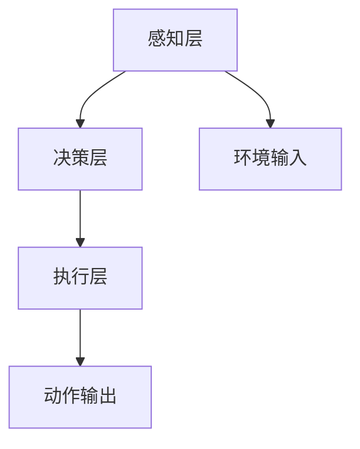
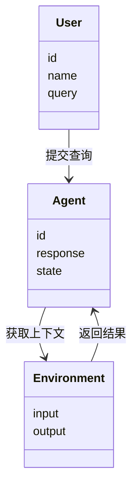
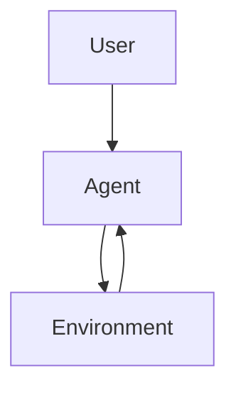
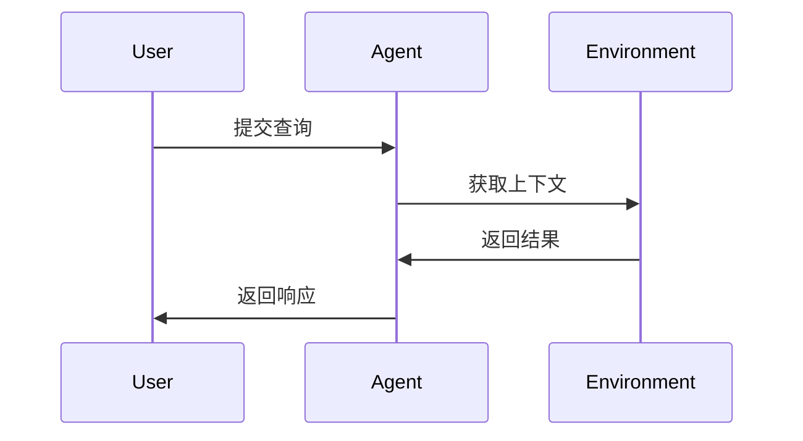

                 


# 《构建AI Agent的敏捷开发流程》

## 关键词：
- AI Agent
- 敏捷开发
- 系统架构
- 算法原理
- 项目实战

## 摘要：
本文系统地探讨了AI Agent的敏捷开发流程，从核心概念到算法原理，再到系统架构设计和项目实战，结合实际案例和最佳实践，深入剖析了构建高效AI Agent开发流程的关键步骤和方法。

---

# 第1章: AI Agent与敏捷开发概述

## 1.1 AI Agent的基本概念

### 1.1.1 AI Agent的定义与核心特征
AI Agent（人工智能代理）是指能够感知环境、做出决策并执行动作的智能实体。其核心特征包括：
- **自主性**：能够在没有外部干预的情况下运行。
- **反应性**：能够实时感知环境并做出反应。
- **目标导向性**：基于目标驱动行为。
- **学习能力**：通过数据和经验不断优化性能。

### 1.1.2 AI Agent的分类与应用场景
AI Agent可以根据功能和应用场景分为以下几类：
- **简单反射型Agent**：基于即时输入做出反应，适用于实时控制场景。
- **基于模型的反射型Agent**：结合内部状态和外部环境信息进行决策。
- **目标驱动型Agent**：基于明确的目标制定行动计划。
- **效用驱动型Agent**：通过最大化效用函数实现目标。

应用场景包括智能客服、自动驾驶、机器人控制、推荐系统等。

### 1.1.3 敏捷开发的定义与特点
敏捷开发是一种以迭代、增量的方式开发软件的方法论，强调快速交付、持续反馈和团队协作。其特点包括：
- **迭代开发**：将项目分解为多个小周期（迭代），每个迭代交付可用的增量。
- **持续反馈**：通过用户反馈和团队协作快速调整开发方向。
- **灵活性**：能够根据需求变化快速调整开发计划。

---

## 1.2 AI Agent与敏捷开发的结合

### 1.2.1 敏捷开发在AI Agent中的优势
敏捷开发在AI Agent开发中的优势体现在以下方面：
- **快速迭代**：能够快速验证AI Agent的行为，及时发现和修正问题。
- **持续反馈**：通过用户反馈优化AI Agent的性能和用户体验。
- **团队协作**：通过敏捷方法提升团队的协作效率和开发质量。

### 1.2.2 AI Agent开发中的敏捷方法
在AI Agent开发中，敏捷方法通常包括以下步骤：
1. **需求分析**：明确AI Agent的功能需求和目标。
2. **原型开发**：快速开发AI Agent的最小可行产品（MVP）。
3. **测试与反馈**：通过测试验证AI Agent的行为，并根据反馈进行优化。
4. **迭代开发**：根据反馈不断优化AI Agent的功能和性能。

### 1.2.3 传统开发与敏捷开发的对比
| 对比维度 | 传统开发 | 敏捷开发 |
|----------|----------|----------|
| 开发方式 | 线性、串行 | 迭代、并行 |
| 反馈周期 | 长 | 短 |
| 灵活性   | 低 | 高 |

---

## 1.3 当前AI Agent开发的挑战与机遇

### 1.3.1 AI Agent开发的主要挑战
- **复杂性**：AI Agent的开发涉及感知、决策和执行等多个环节，技术复杂性高。
- **数据依赖性**：AI Agent的性能高度依赖于数据质量和数量。
- **安全性**：AI Agent的决策可能对用户或系统造成重大影响，安全性问题不容忽视。

### 1.3.2 敏捷开发如何应对这些挑战
- **快速迭代**：通过快速验证和优化，降低技术复杂性带来的风险。
- **数据驱动**：通过敏捷方法快速验证数据的有效性，优化数据采集和处理流程。
- **持续测试**：通过持续测试确保AI Agent的安全性和可靠性。

### 1.3.3 未来的AI Agent发展趋势
- **边缘计算**：AI Agent将更多地运行在边缘设备上，减少对云端的依赖。
- **多模态交互**：支持更丰富的交互方式，如视觉、语音和触觉等。
- **自适应学习**：AI Agent将具备更强的自适应学习能力，能够根据环境变化动态调整行为。

---

## 1.4 本章小结
本章介绍了AI Agent的基本概念、分类和应用场景，分析了敏捷开发在AI Agent开发中的优势，并对比了传统开发与敏捷开发的差异。最后，探讨了AI Agent开发面临的挑战与未来发展趋势。

---

# 第2章: AI Agent的核心概念与系统架构

## 2.1 AI Agent的核心概念

### 2.1.1 感知层：如何理解环境输入
感知层是AI Agent与外部环境交互的第一步，负责接收和处理环境输入。常见的感知方式包括：
- **传感器输入**：如摄像头、麦克风等设备获取的原始数据。
- **数据预处理**：对原始数据进行清洗、归一化等处理，提取有用的特征。

### 2.1.2 决策层：基于策略的选择
决策层是AI Agent的核心，负责根据感知到的环境信息制定行动计划。常见的决策方法包括：
- **规则驱动**：基于预定义的规则进行决策。
- **基于模型的决策**：利用预训练的模型生成决策。
- **强化学习**：通过与环境的交互，学习最优策略。

### 2.1.3 执行层：如何实现动作
执行层负责将决策层生成的行动计划转化为具体的操作。常见的执行方式包括：
- **直接操作**：如发送指令、调整参数等。
- **通过中间件执行**：通过中间件（如API）调用外部服务。

---

## 2.2 AI Agent的系统架构设计

### 2.2.1 分层架构的优缺点
分层架构是AI Agent开发中常用的一种架构设计方法，其优点是结构清晰、易于扩展，缺点是可能增加跨层通信的复杂性。

### 2.2.2 微服务架构的应用
微服务架构将AI Agent的功能模块化为多个独立的服务，每个服务负责特定的功能，如感知、决策和执行。这种架构的优点是灵活性高、易于维护。

### 2.2.3 混合架构的可行性
混合架构结合了分层架构和微服务架构的优点，适用于复杂场景下的AI Agent开发。通过混合架构，可以实现模块间的高效协作和灵活扩展。

---

## 2.3 核心概念对比分析

### 2.3.1 不同架构的对比表格
| 架构类型 | 分层架构 | 微服务架构 | 混合架构 |
|----------|----------|------------|----------|
| 优点     | 结构清晰 | 灵活性高    | 综合性高  |
| 缺点     | 跨层复杂 | 资源消耗高  | 复杂性高  |

### 2.3.2 ER实体关系图的Mermaid流程图


---

## 2.4 本章小结
本章详细探讨了AI Agent的核心概念，包括感知层、决策层和执行层，并分析了不同架构设计的优缺点，提出了混合架构的可行性。

---

# 第3章: AI Agent开发中的算法原理

## 3.1 强化学习算法

### 3.1.1 Q-learning算法的原理
Q-learning是一种基于值函数的强化学习算法，通过更新Q值表来学习最优策略。Q值表的更新公式为：
$$ Q(s, a) = Q(s, a) + \alpha \cdot [r + \gamma \cdot \max Q(s', a) - Q(s, a)] $$
其中，$\alpha$是学习率，$\gamma$是折扣因子。

### 3.1.2 DQN

DQN（Deep Q-Network）是基于深度学习的强化学习算法，通过神经网络近似Q值函数。DQN的核心思想是通过经验回放和目标网络来稳定训练过程。

---

## 3.2 算法实现的Python代码示例

### 3.2.1 Q-learning算法的实现
```python
import numpy as np

class QLearning:
    def __init__(self, state_space, action_space, alpha=0.1, gamma=0.9):
        self.state_space = state_space
        self.action_space = action_space
        self.alpha = alpha
        self.gamma = gamma
        self.q_table = np.zeros((state_space, action_space))
    
    def choose_action(self, state, epsilon=0.1):
        if np.random.random() < epsilon:
            return np.random.randint(self.action_space)
        else:
            return np.argmax(self.q_table[state])
    
    def update(self, state, action, reward, next_state):
        self.q_table[state, action] += self.alpha * (reward + self.gamma * np.max(self.q_table[next_state]) - self.q_table[state, action])
```

### 3.2.2 DQN算法的实现
```python
import torch
import torch.nn as nn

class DQN(nn.Module):
    def __init__(self, input_dim, output_dim):
        super(DQN, self).__init__()
        self.fc1 = nn.Linear(input_dim, 64)
        self.fc2 = nn.Linear(64, output_dim)
    
    def forward(self, x):
        x = torch.relu(self.fc1(x))
        x = self.fc2(x)
        return x
```

---

## 3.3 算法优化与实际应用

### 3.3.1 算法优化
- **经验回放**：通过存储历史经验，减少样本之间的相关性，提高算法的稳定性。
- **目标网络**：通过更新目标网络，减少Q值函数的近似误差。

### 3.3.2 实际应用
AI Agent的决策层可以基于强化学习算法（如Q-learning或DQN）进行优化，通过与环境的交互，不断更新Q值表或神经网络参数，实现最优决策。

---

## 3.4 本章小结
本章详细探讨了强化学习算法（Q-learning和DQN）的原理和实现方法，并通过Python代码示例展示了算法的具体实现。同时，分析了算法优化和实际应用中的注意事项。

---

# 第4章: 系统分析与架构设计

## 4.1 问题场景介绍
以智能客服AI Agent为例，设计一个基于自然语言处理（NLP）的客服系统，能够自动理解和回答用户的问题。

---

## 4.2 系统功能设计

### 4.2.1 领域模型设计


### 4.2.2 系统架构设计


### 4.2.3 系统交互流程


---

## 4.3 系统实现与优化

### 4.3.1 环境接口设计
- **输入接口**：接收用户的查询请求。
- **输出接口**：返回AI Agent的响应。

### 4.3.2 系统优化策略
- **缓存机制**：通过缓存频繁查询的问题，减少重复计算。
- **负载均衡**：通过负载均衡技术，提高系统的处理能力。

---

## 4.4 本章小结
本章通过智能客服的案例，详细探讨了系统分析与架构设计的关键步骤，包括领域模型设计、系统架构设计和系统交互流程。

---

# 第5章: 项目实战

## 5.1 环境搭建

### 5.1.1 安装开发环境
- **安装Python**：确保Python版本在3.6以上。
- **安装依赖库**：安装必要的库，如TensorFlow、PyTorch、numpy等。

### 5.1.2 安装运行环境
- **安装虚拟环境**：通过虚拟环境管理项目依赖。
- **配置运行环境**：配置环境变量，确保所有依赖库可用。

---

## 5.2 系统核心实现

### 5.2.1 感知层实现
```python
import torch
import torch.nn as nn

class PerceptionLayer(nn.Module):
    def __init__(self, input_dim, hidden_dim):
        super(PerceptionLayer, self).__init__()
        self.fc = nn.Linear(input_dim, hidden_dim)
    
    def forward(self, x):
        x = torch.relu(self.fc(x))
        return x
```

### 5.2.2 决策层实现
```python
class DecisionLayer(nn.Module):
    def __init__(self, hidden_dim, output_dim):
        super(DecisionLayer, self).__init__()
        self.fc = nn.Linear(hidden_dim, output_dim)
    
    def forward(self, x):
        x = torch.softmax(self.fc(x), dim=1)
        return x
```

### 5.2.3 执行层实现
```python
class ExecutionLayer:
    def execute(self, action):
        # 根据动作执行具体操作
        pass
```

---

## 5.3 代码应用解读与分析

### 5.3.1 感知层的解读
感知层通过神经网络将原始输入数据转换为有用的特征表示，为决策层提供输入。

### 5.3.2 决策层的解读
决策层通过 softmax 函数生成概率分布，选择最优的动作。

### 5.3.3 执行层的解读
执行层根据决策层生成的动作，调用相应的服务或接口，完成具体的执行操作。

---

## 5.4 实际案例分析

### 5.4.1 案例分析
以智能客服为例，分析AI Agent在实际应用中的表现，包括响应时间、准确率、用户满意度等。

### 5.4.2 总结与优化
根据测试结果，优化AI Agent的性能，如提高模型的准确率、减少响应时间等。

---

## 5.5 本章小结
本章通过实际案例，详细探讨了AI Agent的环境搭建、系统实现和代码解读，最后通过案例分析和优化，验证了敏捷开发流程的有效性。

---

# 第6章: 最佳实践与总结

## 6.1 最佳实践

### 6.1.1 开发规范
- **代码规范**：遵循行业代码规范，如PEP 8。
- **文档规范**：编写清晰的文档，便于团队协作和后期维护。

### 6.1.2 测试方法
- **单元测试**：对每个模块进行单元测试，确保功能正常。
- **集成测试**：对系统整体进行集成测试，确保各模块协同工作。

### 6.1.3 部署策略
- **容器化部署**：通过Docker等容器化技术，实现快速部署和扩展。
- **持续集成**：通过CI/CD工具，实现持续集成和持续部署。

### 6.1.4 持续优化
- **监控与日志**：通过监控和日志分析，及时发现和解决问题。
- **模型优化**：通过模型优化技术，提高AI Agent的性能和效率。

---

## 6.2 本章小结
本章总结了AI Agent敏捷开发的最佳实践，包括开发规范、测试方法、部署策略和持续优化等方面。

---

## 6.3 注意事项

- **数据安全**：在开发和部署过程中，确保数据的安全性和隐私性。
- **模型解释性**：提高模型的可解释性，便于调试和优化。
- **用户体验**：关注用户体验，优化交互流程，提升用户满意度。

---

## 6.4 拓展阅读
- **推荐书籍**：《Deep Learning》（Ian Goodfellow等著）
- **推荐博客**：Towards Data Science（Medium平台上的数据科学博客）
- **推荐工具**：TensorFlow、PyTorch等深度学习框架。

---

# 作者信息
作者：AI天才研究院/AI Genius Institute  
联系方式：https://github.com/AI-Genius-Institute  
更多信息请访问：https://zen-and-art-of-coding.com/

--- 

这篇文章详细探讨了AI Agent的敏捷开发流程，从理论到实践，结合实际案例和最佳实践，为读者提供了全面的指导。

