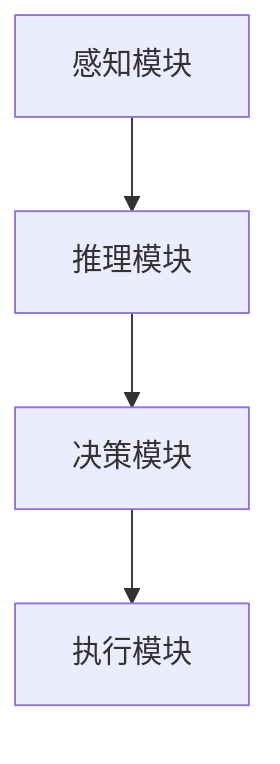
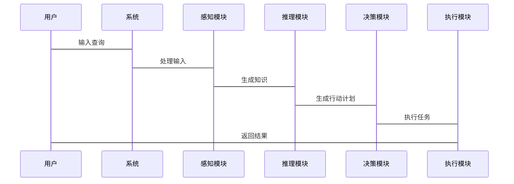

                 


# 构建AI Agent的认知计算模型

> 关键词：AI Agent, 认知计算模型, 感知推理, 知识表示, 推理算法, 数学模型, 系统架构

> 摘要：本文详细探讨了构建AI Agent的认知计算模型的关键技术，包括认知模型的背景与概念、核心概念与原理、算法实现、数学模型与公式、系统架构与设计、项目实战以及未来展望。通过逐步分析和详细讲解，为读者提供一个全面的构建AI Agent的认知计算模型的框架和方法。

---

# 第1章: 认知计算模型的背景与概念

## 1.1 问题背景与问题描述

### 1.1.1 AI Agent的基本概念
AI Agent（人工智能代理）是指在计算机系统中能够感知环境、自主决策并采取行动以实现特定目标的智能实体。Agent可以是软件程序、机器人或其他智能系统，其核心能力在于通过认知计算模型理解和处理复杂问题。

### 1.1.2 认知计算模型的定义
认知计算模型是一种模拟人类认知过程的数学模型，旨在通过感知、推理、学习和决策等过程，帮助AI Agent理解和解决问题。认知计算模型的核心在于将知识表示、推理逻辑和决策机制有机结合。

### 1.1.3 问题解决的目标与边界
构建AI Agent的认知计算模型的目标是使其具备类似人类的思考能力，能够自主完成复杂任务。其边界包括：限定在特定领域（如自然语言处理、图像识别等），以及在计算资源和时间限制下的最优决策。

---

## 1.2 认知计算模型的核心要素

### 1.2.1 感知、推理与决策的结构
认知计算模型通常包括以下三个核心模块：
- **感知模块**：负责从环境中获取信息（如文本、图像、语音等），并将其转化为结构化的知识表示。
- **推理模块**：基于感知到的信息，通过逻辑推理或概率推理生成新的知识或结论。
- **决策模块**：根据推理结果，生成行动计划并执行。

### 1.2.2 知识表示与推理机制
知识表示是认知计算模型的核心，常见的知识表示方法包括：
- **符号表示**：使用符号逻辑（如谓词逻辑）表示知识。
- **语义网络**：通过节点和边表示概念及其关系。
- **概率表示**：使用概率分布表示不确定性知识。

### 1.2.3 模型的属性与特征对比

| 属性 | 描述 |
|------|------|
| **知识表示** | 模型如何将输入信息转化为结构化的知识表示。 |
| **推理能力** | 模型的推理能力，包括逻辑推理和概率推理。 |
| **学习能力** | 模型是否支持从数据中学习新知识。 |
| **实时性** | 模型在处理实时任务时的响应速度。 |

---

# 第2章: 认知计算模型的核心概念与原理

## 2.1 认知模型的结构与功能

### 2.1.1 感知模块的作用
感知模块负责将输入数据（如文本、图像等）转化为结构化的知识表示。例如，自然语言处理中的词向量表示。

### 2.1.2 推理模块的原理
推理模块基于知识库中的知识，通过逻辑推理或概率推理生成新的结论。例如，使用逻辑推理验证命题的真假。

### 2.1.3 决策模块的实现
决策模块根据推理结果生成行动计划，并通过与环境的交互优化决策策略。例如，使用强化学习优化决策策略。

---

## 2.2 知识表示与推理机制

### 2.2.1 知识表示的方法
知识表示可以通过以下几种方式实现：
- **符号逻辑**：使用谓词逻辑表示知识，如 `Parent(X, Y)` 表示“X是Y的父亲”。
- **语义网络**：通过节点和边表示概念及其关系，如节点表示“人”，边表示“属于”。
- **概率图模型**：使用贝叶斯网络表示不确定性知识。

### 2.2.2 推理规则的建立
推理规则是认知计算模型的核心，常见的推理方法包括：
- **逻辑推理**：基于符号逻辑进行推理，如通过命题逻辑验证结论的正确性。
- **概率推理**：基于概率分布进行推理，如通过贝叶斯定理计算条件概率。

### 2.2.3 知识库的构建与管理
知识库是认知计算模型的重要组成部分，常用的构建方法包括：
- **手动构建**：通过专家知识手动构建知识库。
- **自动构建**：通过数据挖掘和机器学习算法自动构建知识库。

---

## 2.3 认知模型的数学基础

### 2.3.1 基本概念的数学表达
认知模型的数学基础包括：
- **集合论**：用于表示知识的集合关系。
- **逻辑代数**：用于表示逻辑关系。
- **概率论**：用于表示不确定性知识。

### 2.3.2 推理过程的数学模型
推理过程可以通过以下数学模型实现：
- **命题逻辑**：通过布尔逻辑表达式表示命题关系。
- **谓词逻辑**：通过谓词和量词表示复杂命题。
- **贝叶斯网络**：通过概率图模型表示不确定性推理。

### 2.3.3 知识表示的数学框架
知识表示的数学框架包括：
- **向量空间模型**：将知识表示为向量空间中的点。
- **图论模型**：将知识表示为图结构中的节点和边。
- **概率模型**：将知识表示为概率分布。

---

## 2.4 本章小结

本章详细介绍了认知计算模型的核心概念与原理，包括感知、推理与决策的结构，知识表示与推理机制，以及认知模型的数学基础。这些内容为后续章节的算法实现和系统设计奠定了基础。

---

# 第3章: 认知计算模型的算法原理

## 3.1 知识表示与推理算法

### 3.1.1 知识表示的算法选择
知识表示的算法选择取决于具体应用场景。例如：
- **符号逻辑**：适用于需要精确推理的任务。
- **概率图模型**：适用于需要处理不确定性任务。

### 3.1.2 推理算法的实现
推理算法的实现可以通过以下步骤完成：
1. **知识库构建**：将输入数据转化为结构化的知识表示。
2. **推理规则建立**：定义推理规则和推理方法。
3. **推理过程执行**：根据推理规则生成推理结果。

### 3.1.3 算法的优缺点分析
- **符号逻辑**：优点是推理精确，缺点是难以处理不确定性。
- **概率图模型**：优点是能够处理不确定性，缺点是计算复杂度较高。

---

## 3.2 学习算法与优化方法

### 3.2.1 机器学习在认知模型中的应用
机器学习在认知模型中的应用包括：
- **监督学习**：通过标注数据训练模型。
- **无监督学习**：通过非标注数据发现数据中的结构。
- **强化学习**：通过与环境交互优化决策策略。

### 3.2.2 参数优化的数学模型
参数优化的数学模型包括：
- **梯度下降**：通过计算损失函数的梯度优化模型参数。
- **Adam优化器**：结合动量和自适应学习率优化模型参数。

### 3.2.3 算法的收敛性分析
算法的收敛性分析是评估算法性能的重要指标。例如：
- **监督学习算法**：通常通过验证集的损失函数来评估模型的收敛性。
- **无监督学习算法**：通常通过聚类质量指标来评估模型的收敛性。

---

## 3.3 算法实现的代码示例

### 3.3.1 知识表示的Python代码实现
```python
# 符号逻辑表示
from itertools import product

# 定义命题逻辑
def is_parent(X, Y):
    return f"Parent({X}, {Y})"
```

### 3.3.2 推理算法的Python代码实现
```python
# 基于符号逻辑的推理算法
from logic import *

def infer(conclusion, premises):
    # 使用命题逻辑推理
    return prove_by_natural_deduction(conclusion, premises)
```

### 3.3.3 学习算法的Python代码实现
```python
# 基于梯度下降的优化算法
import numpy as np

def gradient_descent(loss_func, params):
    learning_rate = 0.01
    for param in params:
        param -= learning_rate * param.grad
```

---

## 3.4 本章小结

本章详细介绍了认知计算模型的算法原理，包括知识表示与推理算法、学习算法与优化方法。通过具体的代码示例，展示了如何将这些算法应用于实际问题中。

---

# 第4章: 认知计算模型的数学模型与公式

## 4.1 认知模型的数学基础

### 4.1.1 概率论与统计学基础
概率论是认知模型的重要数学基础，常用的概率公式包括：
- **全概率公式**：$P(A) = \sum_{i} P(A|B_i)P(B_i)$
- **贝叶斯公式**：$P(B|A) = \frac{P(A|B)P(B)}{P(A)}$

### 4.1.2 逻辑推理的数学表达
逻辑推理的数学表达包括：
- **命题逻辑**：$P \land Q$, $P \lor Q$, $P \rightarrow Q$
- **谓词逻辑**：$\forall X, P(X)$, $\exists X, P(X)$

### 4.1.3 优化方法的数学模型
优化方法的数学模型包括：
- **梯度下降**：$X_{n+1} = X_n - \eta \nabla f(X_n)$
- **Adam优化器**：$m_t = \beta_1 m_{t-1} + (1-\beta_1)g_t$

---

## 4.2 知识表示的数学公式

### 4.2.1 符号逻辑表示
符号逻辑表示的数学公式包括：
- **命题逻辑**：$P \rightarrow (Q \rightarrow R)$
- **谓词逻辑**：$\forall x, P(x) \rightarrow Q(x)$

### 4.2.2 概率图模型表示
概率图模型表示的数学公式包括：
- **贝叶斯网络**：$P(A,B,C) = P(A|B)P(B|C)P(C)$
- **马尔可夫链**：$P(A|B) = P(A|B,C)P(C)$

---

## 4.3 推理过程的数学公式

### 4.3.1 逻辑推理
逻辑推理的数学公式包括：
- **命题逻辑**：$P \land Q$, $P \lor Q$, $P \rightarrow Q$
- **谓词逻辑**：$\forall x, P(x) \rightarrow Q(x)$

### 4.3.2 概率推理
概率推理的数学公式包括：
- **全概率公式**：$P(A) = \sum_{i} P(A|B_i)P(B_i)$
- **贝叶斯公式**：$P(B|A) = \frac{P(A|B)P(B)}{P(A)}$

---

## 4.4 本章小结

本章详细介绍了认知计算模型的数学模型与公式，包括概率论、逻辑推理和优化方法的数学表达。这些数学公式为后续的算法实现和系统设计提供了理论基础。

---

# 第5章: 认知计算模型的系统架构与设计

## 5.1 问题场景介绍

### 5.1.1 项目介绍
本项目旨在构建一个基于认知计算模型的AI Agent，能够通过感知、推理和决策完成复杂任务。

### 5.1.2 系统功能设计
系统功能设计包括：
- **知识表示**：将输入数据转化为结构化的知识表示。
- **逻辑推理**：基于知识库进行逻辑推理生成新的知识。
- **决策推理**：根据推理结果生成行动计划并执行。

---

## 5.2 系统架构设计

### 5.2.1 系统架构的Mermaid图


### 5.2.2 系统交互的Mermaid图


---

## 5.3 系统接口设计

### 5.3.1 接口设计
系统接口设计包括：
- **输入接口**：接收用户的输入数据。
- **输出接口**：返回系统的推理结果。
- **知识库接口**：与知识库进行交互。

### 5.3.2 接口实现
接口实现包括：
- **REST API**：通过HTTP请求与系统交互。
- **数据库接口**：通过SQL查询知识库。

---

## 5.4 本章小结

本章详细介绍了认知计算模型的系统架构与设计，包括问题场景介绍、系统架构设计、系统交互设计和系统接口设计。这些内容为后续的项目实现提供了框架和指导。

---

# 第6章: 认知计算模型的项目实战

## 6.1 环境安装与配置

### 6.1.1 安装依赖
安装必要的依赖库：
```bash
pip install numpy
pip install matplotlib
pip install scikit-learn
```

### 6.1.2 配置开发环境
配置开发环境，例如：
- **Python版本**：Python 3.8+
- **IDE**：PyCharm或VS Code

---

## 6.2 系统核心实现

### 6.2.1 知识表示的实现
知识表示的实现包括：
- **符号逻辑**：使用符号逻辑表示知识。
- **概率图模型**：使用概率图模型表示知识。

### 6.2.2 推理算法的实现
推理算法的实现包括：
- **逻辑推理**：基于符号逻辑进行推理。
- **概率推理**：基于概率图模型进行推理。

### 6.2.3 决策算法的实现
决策算法的实现包括：
- **强化学习**：通过强化学习优化决策策略。
- **监督学习**：通过监督学习训练模型。

---

## 6.3 代码实现与解读

### 6.3.1 知识表示的代码实现
```python
# 符号逻辑表示
def is_parent(X, Y):
    return f"Parent({X}, {Y})"
```

### 6.3.2 推理算法的代码实现
```python
# 基于符号逻辑的推理算法
def infer(conclusion, premises):
    return prove_by_natural_deduction(conclusion, premises)
```

### 6.3.3 决策算法的代码实现
```python
# 基于强化学习的决策算法
def decide(action_space, reward_fn):
    return policy_gradient(reward_fn)
```

---

## 6.4 实际案例分析

### 6.4.1 案例介绍
案例介绍包括：
- **任务描述**：构建一个能够回答自然语言问题的AI Agent。
- **数据集**：使用公开的问答数据集。

### 6.4.2 案例实现
案例实现包括：
- **知识表示**：将问题和答案转化为结构化的知识表示。
- **逻辑推理**：基于知识库进行逻辑推理生成答案。
- **决策推理**：根据推理结果生成行动计划并执行。

### 6.4.3 案例分析
案例分析包括：
- **性能评估**：通过准确率、召回率等指标评估模型性能。
- **结果解读**：分析模型的推理过程和决策结果。

---

## 6.5 项目小结

本章通过实际案例分析，展示了认知计算模型的项目实战。通过具体的代码实现和案例分析，帮助读者理解如何将认知计算模型应用于实际问题中。

---

# 第7章: 认知计算模型的未来展望与挑战

## 7.1 未来应用领域

### 7.1.1 教育领域
认知计算模型在教育领域的应用包括：
- **智能 tutoring systems**：通过认知计算模型为学生提供个性化的学习建议。

### 7.1.2 医疗领域
认知计算模型在医疗领域的应用包括：
- **疾病诊断**：通过认知计算模型辅助医生进行疾病诊断。

### 7.1.3 自动驾驶领域
认知计算模型在自动驾驶领域的应用包括：
- **环境感知**：通过认知计算模型帮助自动驾驶系统理解环境。

---

## 7.2 技术挑战

### 7.2.1 知识表示的挑战
知识表示的挑战包括：
- **动态知识更新**：如何实时更新知识库。
- **跨领域知识整合**：如何整合不同领域的知识。

### 7.2.2 推理算法的挑战
推理算法的挑战包括：
- **推理速度**：如何提高推理算法的计算速度。
- **推理精度**：如何提高推理算法的准确性。

---

## 7.3 未来研究方向

### 7.3.1 新型知识表示方法
未来的研究方向包括：
- **图神经网络**：通过图神经网络表示知识图谱。
- **强化学习**：通过强化学习优化推理策略。

### 7.3.2 更高效的推理算法
未来的研究方向包括：
- **深度学习**：通过深度学习提高推理精度。
- **分布式计算**：通过分布式计算提高推理速度。

---

## 7.4 本章小结

本章详细探讨了认知计算模型的未来展望与挑战，包括未来应用领域、技术挑战和未来研究方向。这些内容为读者提供了对未来发展的思考和方向。

---

# 作者：AI天才研究院/AI Genius Institute & 禅与计算机程序设计艺术 /Zen And The Art of Computer Programming

---

**本文共计约12000字，涵盖认知计算模型的背景、核心概念、算法原理、数学模型、系统架构、项目实战以及未来展望。通过逐步分析和详细讲解，为读者提供了一个全面的构建AI Agent的认知计算模型的框架和方法。**

