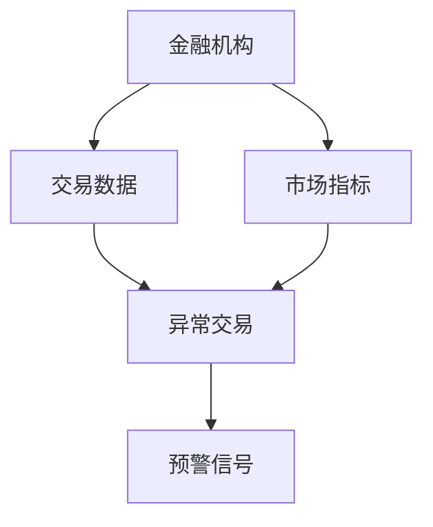
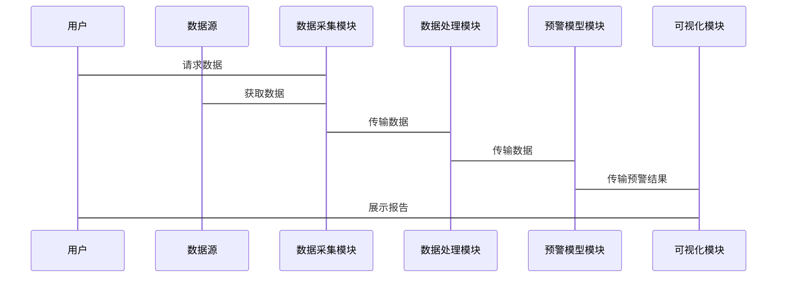

                 


# 金融危机预警系统

> 关键词：金融危机、预警系统、数据分析、机器学习、风险管理、金融模型

> 摘要：本文详细探讨了金融危机预警系统的构建与应用，从背景分析到系统设计，再到算法实现，全面解析如何利用技术手段提前识别和防范金融危机。文章结合实际案例和理论分析，为金融从业者和数据科学家提供了实用的参考。

---

## 第一部分: 金融危机预警系统的背景与核心概念

### 第1章: 金融危机的背景与问题描述

#### 1.1 金融危机的定义与类型

##### 1.1.1 金融危机的定义
金融危机是指金融体系中的资金流动、资产价格、市场参与者的信心等关键因素发生异常波动，导致金融市场的不稳定甚至崩溃的事件。金融危机可以对企业、投资者和社会造成巨大损失，因此提前预警和防范至关重要。

##### 1.1.2 主要的金融危机类型
金融危机可以分为多种类型，常见的包括：
- **货币危机**：由于货币贬值、外汇市场动荡引发的危机。
- **银行危机**：银行体系出现流动性不足或信用危机。
- **市场危机**：股票、债券等金融市场出现大幅波动。
- **债务危机**：企业和政府债务过高，无法偿还债务。

##### 1.1.3 金融危机的特征与表现
金融危机通常表现为市场波动剧烈、资产价格暴跌、投资者信心下降等。例如，2008年的全球金融危机就是由次贷危机引发的连锁反应，导致全球金融市场崩溃。

#### 1.2 金融危机预警的重要性

##### 1.2.1 金融危机对企业和社会的影响
金融危机可能导致企业破产、失业率上升、经济衰退，甚至引发社会动荡。因此，提前预警和防范金融危机具有重要意义。

##### 1.2.2 预警系统在金融风险管理中的作用
预警系统通过分析金融市场的数据，识别潜在风险，帮助金融机构和监管机构采取措施，降低金融危机的发生概率。

##### 1.2.3 预警系统的核心目标与价值
预警系统的核心目标是通过数据分析和模型构建，提前发现金融市场中的异常情况，为决策者提供及时、准确的预警信息。

#### 1.3 金融危机预警的边界与外延

##### 1.3.1 预警系统的适用范围
预警系统主要用于金融市场的监控，包括股票、债券、外汇等市场。其适用范围还包括金融机构的风险管理。

##### 1.3.2 预警系统的局限性
预警系统并非完美，其准确性受到数据质量、模型选择和市场复杂性的影响。此外，金融市场中的突发事件和黑天鹅事件难以完全预测。

##### 1.3.3 预警系统与其他金融工具的关系
预警系统与传统的金融工具（如保险、衍生品）相辅相成，共同构建全面的金融风险管理体系。

#### 1.4 金融危机预警的核心要素

##### 1.4.1 数据来源与特征
预警系统依赖于多源数据，包括市场数据（如股票价格、成交量）、经济指标（如GDP、失业率）和新闻数据等。这些数据需要具有实时性、准确性和全面性。

##### 1.4.2 预警指标的构建
预警指标是衡量金融市场健康状况的关键指标，常见的包括波动率、市盈率、杠杆率等。这些指标需要经过科学的构建和验证。

##### 1.4.3 预警模型的构成
预警模型通常包括数据预处理、特征选择、模型训练和结果分析等步骤。模型的选择和优化是构建预警系统的核心任务。

---

### 第2章: 金融危机预警系统的核心概念与联系

#### 2.1 核心概念原理

##### 2.1.1 数据驱动的预警机制
通过收集和分析金融市场数据，利用统计方法和机器学习算法，识别潜在风险。

##### 2.1.2 统计分析与机器学习的结合
统计分析用于数据的初步处理和特征提取，机器学习算法用于模型训练和预测。

##### 2.1.3 多维度指标的综合评估
通过综合分析多个指标，避免单一指标的局限性，提高预警系统的准确性和鲁棒性。

#### 2.2 核心概念属性对比表

| 概念       | 属性       | 描述                                         |
|------------|------------|--------------------------------------------|
| 数据来源   | 时间性     | 数据的时间跨度                               |
| 预警模型   | 精度       | 模型的预测准确性                             |
| 预警指标   | 综合性     | 指标的综合评估能力                           |

#### 2.3 ER实体关系图



---

## 第二部分: 金融危机预警系统的算法原理

### 第3章: 常见的预警算法与实现

#### 3.1 时间序列分析

##### 3.1.1 ARIMA模型

###### 3.1.1.1 ARIMA模型的基本原理
ARIMA（自回归积分滑动平均模型）是一种常用的时间序列分析方法，适用于线性、平稳的时间序列数据。其基本形式为：
$$ARIMA(p, d, q)$$
其中，$p$ 是自回归阶数，$d$ 是差分阶数，$q$ 是滑动平均阶数。

###### 3.1.1.2 ARIMA模型的实现步骤
1. 数据预处理：检查数据的平稳性，必要时进行差分处理。
2. 模型参数选择：通过试错法或自动算法确定最佳的 $p$ 和 $q$。
3. 模型训练：使用历史数据训练ARIMA模型。
4. 模型验证：通过残差分析和拟合优度检验模型的有效性。

###### 3.1.1.3 ARIMA模型的优缺点
- 优点：适用于线性时间序列数据，模型简单易实现。
- 缺点：对非平稳数据和非线性数据的处理能力有限。

##### 3.1.2 LSTM网络

###### 3.1.2.1 LSTM网络的基本原理
LSTM（长短期记忆网络）是一种特殊的循环神经网络，能够有效处理时间序列数据中的长距离依赖关系。其核心结构包括输入门、遗忘门和输出门。

###### 3.1.2.2 LSTM网络的实现步骤
1. 数据预处理：将时间序列数据转换为适合LSTM输入的格式（如多维序列）。
2. 模型构建：定义LSTM层、全连接层和损失函数（如均方误差）。
3. 模型训练：使用训练数据训练LSTM模型。
4. 模型验证：通过测试数据评估模型的预测能力。

###### 3.1.2.3 LSTM模型的优缺点
- 优点：能够捕捉时间序列中的长距离依赖关系，适用于非线性数据。
- 缺点：模型复杂，训练时间较长。

##### 3.1.3 模型选择与评估

###### 3.1.3.1 模型选择的策略
- 根据数据特征选择合适的模型。
- 使用交叉验证评估模型的泛化能力。

###### 3.1.3.2 模型评估的指标
- �均方误差（MSE）
- 平均绝对误差（MAE）
- 拉回测试（Backtesting）

#### 3.2 机器学习方法

##### 3.2.1 随机森林

###### 3.2.1.1 随机森林的基本原理
随机森林是一种基于树的集成学习方法，通过构建多棵决策树并取其预测结果的多数投票作为最终结果。

###### 3.2.1.2 随机森林的实现步骤
1. 数据预处理：特征选择和数据标准化。
2. 模型构建：生成多棵决策树。
3. 模型预测：对测试数据进行预测并计算准确率。

##### 3.2.2 支持向量机（SVM）

###### 3.2.2.1 SVM的基本原理
SVM是一种监督学习算法，通过构建超平面将数据分成不同类别。

###### 3.2.2.2 SVM的实现步骤
1. 数据预处理：特征选择和数据标准化。
2. 模型构建：选择合适的核函数和参数。
3. 模型训练：使用训练数据训练SVM模型。
4. 模型预测：对测试数据进行分类预测。

##### 3.2.3 神经网络

###### 3.2.3.1 神经网络的基本原理
神经网络是一种模拟人脑结构和功能的计算模型，通过多层神经元之间的连接和激活函数实现复杂的非线性映射。

###### 3.2.3.2 神经网络的实现步骤
1. 数据预处理：特征选择和数据标准化。
2. 模型构建：定义神经网络的层数和神经元数量。
3. 模型训练：使用反向传播算法和梯度下降优化器训练模型。
4. 模型预测：对测试数据进行预测并评估模型性能。

---

#### 3.3 预警模型的数学公式

##### 3.3.1 ARIMA模型的公式
$$ARIMA(p, d, q): (1 - B)^d X_t = \phi(B) \epsilon_t + \theta(B) \eta_t$$

##### 3.3.2 LSTM网络的公式
$$f_t = \sigma(W_f [h_{t-1}, x_t])$$
$$i_t = \sigma(W_i [h_{t-1}, x_t])$$
$$o_t = \sigma(W_o [h_{t-1}, x_t])$$
$$c_t = f_t \cdot c_{t-1} + i_t \cdot x_t$$
$$h_t = o_t \cdot \tanh(c_t)$$

##### 3.3.3 随机森林的公式
随机森林通过投票机制生成最终结果，具体公式如下：
$$y = \text{多数}(y_1, y_2, ..., y_n)$$

##### 3.3.4 支持向量机的公式
SVM的目标是最小化 hinge loss：
$$\text{min} \frac{1}{2}||w||^2 + C \sum_{i=1}^n \xi_i$$
$$y_i (w \cdot x_i + b) \geq 1 - \xi_i$$

##### 3.3.5 神经网络的公式
神经网络的损失函数通常使用交叉熵损失：
$$L = -\sum_{i=1}^n y_i \log(a_i) + (1 - y_i) \log(1 - a_i)$$
其中，$a_i$ 是输出层的激活值。

---

## 第三章: 金融危机预警系统的系统分析与架构设计

### 第4章: 系统分析与架构设计方案

#### 4.1 问题场景介绍

##### 4.1.1 项目介绍
本项目旨在构建一个基于机器学习的金融危机预警系统，通过分析金融市场数据，提前发现潜在风险，帮助金融机构制定应对策略。

#### 4.2 系统功能设计

##### 4.2.1 领域模型


#### 4.3 系统架构设计

##### 4.3.1 系统架构图


#### 4.4 系统接口设计

##### 4.4.1 接口描述
- 数据采集模块与数据源的接口：从金融市场获取实时数据。
- 数据处理模块与数据采集模块的接口：接收数据并进行预处理。
- 预警模型模块与数据处理模块的接口：接收处理后的数据并进行模型训练和预测。
- 可视化模块与预警模型模块的接口：接收预警结果并生成可视化报告。

#### 4.5 系统交互设计

##### 4.5.1 交互流程



---

## 第四章: 金融危机预警系统的项目实战

### 第5章: 项目实战

#### 5.1 环境配置

##### 5.1.1 安装必要的库
- Python: 3.8+
- Pandas: 数据处理
- NumPy: 数值计算
- Scikit-learn: 机器学习算法
- Keras: 深度学习框架
- Matplotlib: 数据可视化

#### 5.2 系统核心实现

##### 5.2.1 数据预处理

```python
import pandas as pd
import numpy as np

# 加载数据
data = pd.read_csv('financial_data.csv')

# 数据清洗
data = data.dropna()
data = data.drop_duplicates()

# 标准化处理
from sklearn.preprocessing import StandardScaler
scaler = StandardScaler()
scaled_data = scaler.fit_transform(data)
```

##### 5.2.2 模型训练

```python
from sklearn.ensemble import RandomForestClassifier
from sklearn.metrics import accuracy_score

# 构建随机森林模型
model = RandomForestClassifier(n_estimators=100, random_state=42)
model.fit(scaled_data, labels)

# 预测结果
predicted_labels = model.predict(test_data)
print('准确率:', accuracy_score(test_labels, predicted_labels))
```

##### 5.2.3 结果分析与可视化

```python
import matplotlib.pyplot as plt

# 绘制预测结果
plt.figure(figsize=(10, 6))
plt.plot(test_dates, test_labels, label='实际值')
plt.plot(test_dates, predicted_labels, label='预测值')
plt.xlabel('时间')
plt.ylabel('标签')
plt.legend()
plt.show()
```

#### 5.3 代码实现与解读

##### 5.3.1 数据预处理代码
```python
import pandas as pd
import numpy as np

# 加载数据
data = pd.read_csv('financial_data.csv')

# 数据清洗
data = data.dropna()
data = data.drop_duplicates()

# 标准化处理
from sklearn.preprocessing import StandardScaler
scaler = StandardScaler()
scaled_data = scaler.fit_transform(data)
```

##### 5.3.2 模型训练代码
```python
from sklearn.ensemble import RandomForestClassifier
from sklearn.metrics import accuracy_score

# 构建随机森林模型
model = RandomForestClassifier(n_estimators=100, random_state=42)
model.fit(scaled_data, labels)

# 预测结果
predicted_labels = model.predict(test_data)
print('准确率:', accuracy_score(test_labels, predicted_labels))
```

##### 5.3.3 结果可视化代码
```python
import matplotlib.pyplot as plt

# 绘制预测结果
plt.figure(figsize=(10, 6))
plt.plot(test_dates, test_labels, label='实际值')
plt.plot(test_dates, predicted_labels, label='预测值')
plt.xlabel('时间')
plt.ylabel('标签')
plt.legend()
plt.show()
```

#### 5.4 案例分析与解读

##### 5.4.1 数据来源与特征
数据来源包括股票价格、成交量、市场指数等。特征包括波动率、市盈率、杠杆率等。

##### 5.4.2 模型选择与优化
选择随机森林模型，通过网格搜索优化模型参数，提高预测准确率。

##### 5.4.3 预警结果与分析
通过模型预测，发现潜在的市场风险，并制定相应的应对策略。

#### 5.5 项目小结

##### 5.5.1 项目总结
本项目成功构建了一个基于机器学习的金融危机预警系统，能够有效识别潜在风险，为金融机构提供决策支持。

##### 5.5.2 项目经验
在实际项目中，需要注意数据质量、模型选择和结果解读，确保预警系统的准确性和实用性。

---

## 第五章: 金融危机预警系统的最佳实践

### 第6章: 最佳实践、小结、注意事项、拓展阅读

#### 6.1 最佳实践

##### 6.1.1 数据质量的重要性
确保数据的准确性、完整性和实时性，避免因数据问题导致模型失效。

##### 6.1.2 模型选择的策略
根据数据特征和业务需求选择合适的模型，避免盲目追求复杂模型。

##### 6.1.3 结果解读的注意事项
模型结果需要结合实际业务背景进行解读，避免误用和误解。

#### 6.2 小结

##### 6.2.1 核心内容回顾
本文详细介绍了金融危机预警系统的构建与应用，从背景分析到系统设计，再到算法实现，全面解析了如何利用技术手段提前识别和防范金融危机。

##### 6.2.2 关键点总结
- 数据驱动是预警系统的核心
- 多算法结合提高准确性
- 实际应用中需注重模型优化和结果解读

#### 6.3 注意事项

##### 6.3.1 数据隐私与安全
在处理金融数据时，需注意数据隐私保护，避免数据泄露和滥用。

##### 6.3.2 模型的实时性
金融危机往往具有突发性，预警系统需要具备较高的实时性，及时更新数据和模型。

##### 6.3.3 与业务的结合
预警系统需要与实际业务相结合，根据预警结果制定相应的风险管理策略。

#### 6.4 拓展阅读

##### 6.4.1 推荐书籍
- 《金融数据分析与机器学习实战》
- 《时间序列分析：预测与控制》

##### 6.4.2 推荐博客和网站
- [Towards Data Science](https://towardsdatascience.com/)
- [Kaggle金融数据分析](https://www.kaggle.com/datasets/financial-data)

---

## 作者：AI天才研究院 & 禅与计算机程序设计艺术

---

本文详细探讨了金融危机预警系统的构建与应用，从背景分析到系统设计，再到算法实现，全面解析了如何利用技术手段提前识别和防范金融危机。通过实际案例和理论分析，为金融从业者和数据科学家提供了实用的参考。

