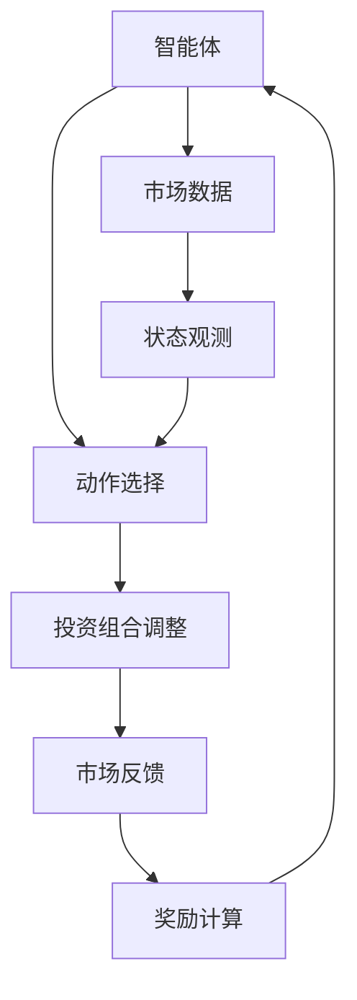
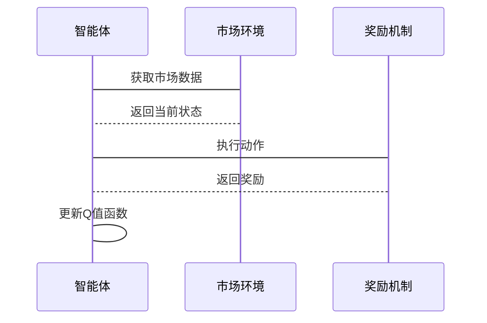

                 


# 《金融领域强化学习在资产组合再平衡中的应用》

> **关键词**：强化学习，资产组合，再平衡，Q-Learning，Deep Q-Learning，金融投资

> **摘要**：本文深入探讨了强化学习在金融资产组合再平衡中的应用。首先，我们介绍了强化学习的基本概念及其在金融领域的应用背景。接着，详细分析了强化学习的核心概念与数学模型，并通过对比分析展示了强化学习相较于传统方法的优势。随后，我们讲解了Q-Learning和Deep Q-Learning算法的原理与实现，并通过Mermaid流程图和Python代码示例进行了直观展示。在系统架构部分，我们设计了一个基于强化学习的资产再平衡系统，并通过实际案例分析验证了其有效性。最后，我们总结了项目中的经验和教训，并提出了进一步优化的方向。

---

# 第一部分：强化学习与资产组合再平衡的背景介绍

## 第1章：强化学习与资产组合再平衡概述

### 1.1 强化学习的基本概念

#### 1.1.1 强化学习的定义
强化学习（Reinforcement Learning，RL）是一种机器学习范式，其中智能体通过与环境交互来学习如何做出决策。智能体通过执行动作来获得奖励或惩罚，从而优化其策略以最大化累计奖励。

#### 1.1.2 强化学习的核心要素
- **状态（State）**：环境在某一时刻的观测。
- **动作（Action）**：智能体在某一状态下采取的行为。
- **奖励（Reward）**：智能体执行动作后获得的反馈，用于指导学习。
- **策略（Policy）**：描述智能体在给定状态下选择动作的概率分布。
- **价值函数（Value Function）**：衡量某状态下采取某种策略的期望回报。

#### 1.1.3 强化学习与监督学习的区别
| 对比维度 | 强化学习 | 监督学习 |
|----------|----------|----------|
| 数据来源 | 环境反馈 | 标签数据 |
| 决策方式 | 探索与利用 | 确定性输出 |
| 适用场景 | 动态环境 | 静态数据 |

### 1.2 资产组合管理与再平衡的背景

#### 1.2.1 资产组合管理的基本概念
资产组合管理是指通过合理配置不同资产（如股票、债券等）以实现投资目标的过程。其核心在于分散投资风险并最大化收益。

#### 1.2.2 资产组合再平衡的定义与意义
资产再平衡是指根据市场变化和投资目标，定期调整资产配置比例以维持最优组合的过程。再平衡有助于应对市场波动，优化风险收益比。

#### 1.2.3 资产组合再平衡的传统方法
- **恒定比例法**：保持固定资产配置比例。
- **趋势跟踪法**：根据市场趋势动态调整比例。
- **指数化法**：跟踪市场指数进行被动再平衡。

### 1.3 强化学习在金融领域的应用现状

#### 1.3.1 强化学习在金融中的主要应用领域
- 股票交易策略优化。
- 风险管理与控制。
- 资产配置与组合管理。

#### 1.3.2 强化学习在资产组合管理中的优势
- 能够处理非线性关系。
- 适用于动态变化的市场环境。
- 可以优化复杂决策过程。

#### 1.3.3 当前应用中的挑战与不足
- 数据依赖性强。
- 计算资源消耗大。
- 策略的可解释性较弱。

### 1.4 为什么选择强化学习进行资产组合再平衡

#### 1.4.1 强化学习的灵活性与适应性
强化学习能够根据市场反馈动态调整策略，适应复杂多变的金融市场环境。

#### 1.4.2 复杂金融市场中的决策优化
通过强化学习，可以在多资产类别中找到最优配置，实现风险收益的帕累托最优。

#### 1.4.3 强化学习在动态再平衡中的潜力
强化学习能够实时捕捉市场信号，及时调整资产配置，提高投资收益。

---

## 第2章：强化学习的核心概念与数学模型

### 2.1 强化学习的核心概念

#### 2.1.1 状态空间与动作空间
- **状态空间**：所有可能的状态集合。
- **动作空间**：智能体在某一状态下可以执行的所有动作。

#### 2.1.2 奖励机制与价值函数
- **奖励机制**：定义智能体行为的优劣。
- **价值函数**：衡量某状态下采取某种策略的期望回报。

#### 2.1.3 策略与策略优化
- **策略**：描述智能体在给定状态下选择动作的概率分布。
- **策略优化**：通过最大化累积奖励来优化策略。

### 2.2 强化学习的数学模型

#### 2.2.1 状态转移概率
$$ P(s'|s,a) $$
表示从状态 $s$ 执行动作 $a$ 后转移到状态 $s'$ 的概率。

#### 2.2.2 Q值函数的定义
$$ Q(s,a) = \max_{a'} Q(s',a') + r(s,a) $$
Q值表示在状态 $s$ 执行动作 $a$ 后的期望回报。

#### 2.2.3 动作选择策略
$$ \pi(a|s) $$
表示在状态 $s$ 下选择动作 $a$ 的概率。

### 2.3 强化学习与马尔可夫决策过程的关系

#### 2.3.1 马尔可夫决策过程的定义
马尔可夫决策过程（MDP）由五元组 $(S, A, P, R, \gamma)$ 组成，其中：
- $S$：状态空间。
- $A$：动作空间。
- $P$：状态转移概率。
- $R$：奖励函数。
- $\gamma$：折扣因子。

#### 2.3.2 强化学习如何解决MDP问题
通过与环境交互，智能体学习最优策略以最大化累积奖励。

#### 2.3.3 MDP在资产组合再平衡中的应用
MDP模型适用于动态资产配置问题，其中状态为市场状态，动作为空头配置调整。

---

## 第3章：强化学习算法的原理与实现

### 3.1 Q-Learning算法

#### 3.1.1 Q-Learning的基本原理
Q-Learning通过更新Q值函数来学习最优策略，适用于离散动作空间。

#### 3.1.2 Q-Learning的更新公式
$$ Q(s,a) = (1-\alpha)Q(s,a) + \alpha (r + \gamma \max Q(s',a')) $$
其中，$\alpha$为学习率，$\gamma$为折扣因子。

#### 3.1.3 Q-Learning的收敛性分析
在离散动作空间下，Q-Learning在无限步数下收敛于最优策略。

### 3.2 Deep Q-Learning算法

#### 3.2.1 神经网络在Q-Learning中的应用
使用深度神经网络近似Q值函数，适用于高维状态空间。

#### 3.2.2 DQN算法的工作流程
1. 接收当前状态 $s$。
2. 根据当前策略选择动作 $a$。
3. 执行动作，观察新状态 $s'$ 和奖励 $r$。
4. 更新Q值函数：$$ Q(s,a) = r + \gamma \max Q(s',a') $$

#### 3.2.3 DQN在资产组合再平衡中的应用
通过神经网络近似Q值函数，优化资产配置比例。

### 3.3 算法实现的Python代码示例

#### 3.3.1 Q-Learning算法实现
```python
import numpy as np

class QLearning:
    def __init__(self, state_space, action_space, alpha=0.1, gamma=0.9):
        self.q_table = np.zeros((state_space, action_space))
        self.alpha = alpha
        self.gamma = gamma

    def choose_action(self, state, epsilon=0.1):
        if np.random.random() < epsilon:
            return np.random.randint(0, self.q_table.shape[1])
        else:
            return np.argmax(self.q_table[state])

    def update_q_table(self, state, action, reward, next_state):
        self.q_table[state, action] = self.q_table[state, action] * (1 - self.alpha) + self.alpha * (reward + self.gamma * np.max(self.q_table[next_state]))
```

#### 3.3.2 Deep Q-Learning算法实现
```python
import torch
import torch.nn as nn
import torch.optim as optim

class DQN:
    def __init__(self, input_dim, output_dim, hidden_dim=32, lr=0.01):
        self.model = nn.Sequential(
            nn.Linear(input_dim, hidden_dim),
            nn.ReLU(),
            nn.Linear(hidden_dim, output_dim)
        )
        self.optimizer = optim.Adam(self.model.parameters(), lr=lr)
        self.loss_fn = nn.MSELoss()

    def forward(self, x):
        return self.model(x)
```

---

## 第4章：系统分析与架构设计

### 4.1 问题场景介绍
我们设计了一个基于强化学习的资产再平衡系统，旨在动态优化资产配置以应对市场波动。

### 4.2 系统功能设计
- **状态观测**：获取市场数据。
- **动作选择**：根据当前状态选择最优动作。
- **奖励机制**：计算投资回报。

### 4.3 系统架构设计
使用Mermaid绘制系统架构图：



### 4.4 接口设计与交互流程
使用Mermaid绘制交互序列图：



---

## 第5章：项目实战

### 5.1 环境安装与配置
```bash
pip install numpy
pip install torch
```

### 5.2 核心代码实现

#### 5.2.1 Q-Learning实现
```python
import numpy as np

class QLearning:
    def __init__(self, state_space, action_space, alpha=0.1, gamma=0.9):
        self.q_table = np.zeros((state_space, action_space))
        self.alpha = alpha
        self.gamma = gamma

    def choose_action(self, state, epsilon=0.1):
        if np.random.random() < epsilon:
            return np.random.randint(0, self.q_table.shape[1])
        else:
            return np.argmax(self.q_table[state])

    def update_q_table(self, state, action, reward, next_state):
        self.q_table[state, action] = self.q_table[state, action] * (1 - self.alpha) + self.alpha * (reward + self.gamma * np.max(self.q_table[next_state]))
```

#### 5.2.2 Deep Q-Learning实现
```python
import torch
import torch.nn as nn
import torch.optim as optim

class DQN:
    def __init__(self, input_dim, output_dim, hidden_dim=32, lr=0.01):
        self.model = nn.Sequential(
            nn.Linear(input_dim, hidden_dim),
            nn.ReLU(),
            nn.Linear(hidden_dim, output_dim)
        )
        self.optimizer = optim.Adam(self.model.parameters(), lr=lr)
        self.loss_fn = nn.MSELoss()

    def forward(self, x):
        return self.model(x)

    def update(self, inputs, targets):
        outputs = self.forward(inputs)
        loss = self.loss_fn(outputs, targets)
        self.optimizer.zero_grad()
        loss.backward()
        self.optimizer.step()
```

### 5.3 实际案例分析
假设我们有三个资产（股票、债券、现金），通过强化学习算法进行动态再平衡。通过训练，智能体能够根据市场状态调整资产配置比例，从而在不同市场条件下实现最优回报。

---

## 第6章：最佳实践与小结

### 6.1 最佳实践
- **数据质量**：确保市场数据的准确性和及时性。
- **模型选择**：根据问题规模选择Q-Learning或Deep Q-Learning。
- **超参数调优**：合理设置学习率、折扣因子等参数。

### 6.2 小结
本文详细探讨了强化学习在金融资产再平衡中的应用，通过理论分析、算法实现和实际案例，展示了强化学习在优化资产配置中的巨大潜力。

### 6.3 注意事项
- 强化学习模型对计算资源要求较高。
- 模型的可解释性可能较弱，需谨慎应用于实际投资。

### 6.4 拓展阅读
建议进一步阅读《Deep Reinforcement Learning》和《Reinforcement Learning in Financial Market》等书籍，深入理解强化学习在金融中的应用。

---

# 作者：AI天才研究院/AI Genius Institute & 禅与计算机程序设计艺术 /Zen And The Art of Computer Programming

