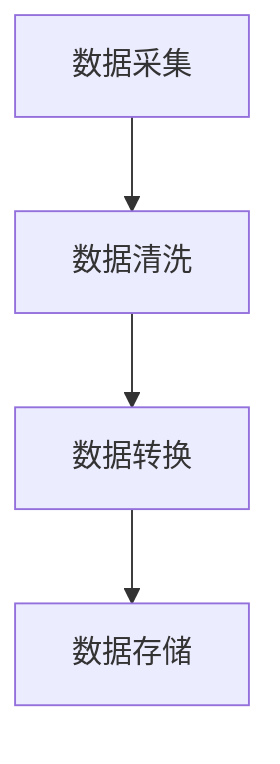
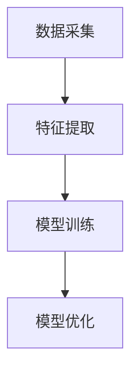
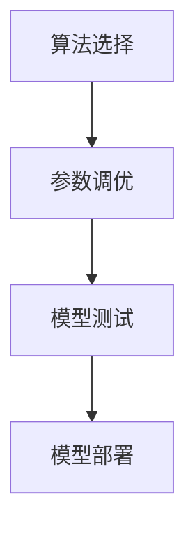
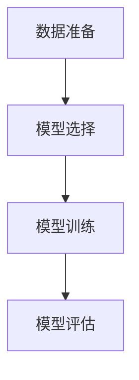
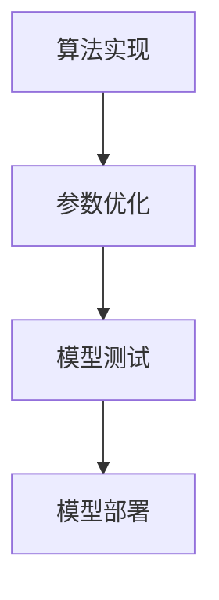
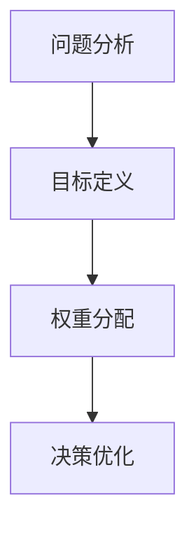
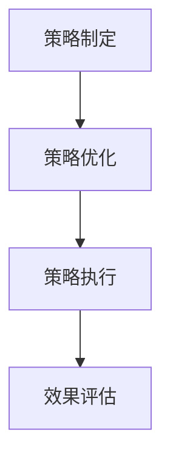
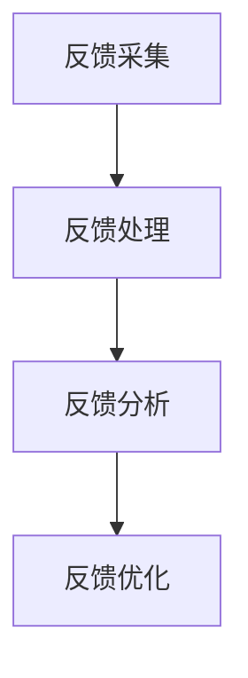
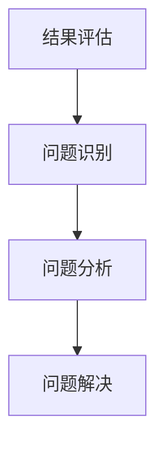
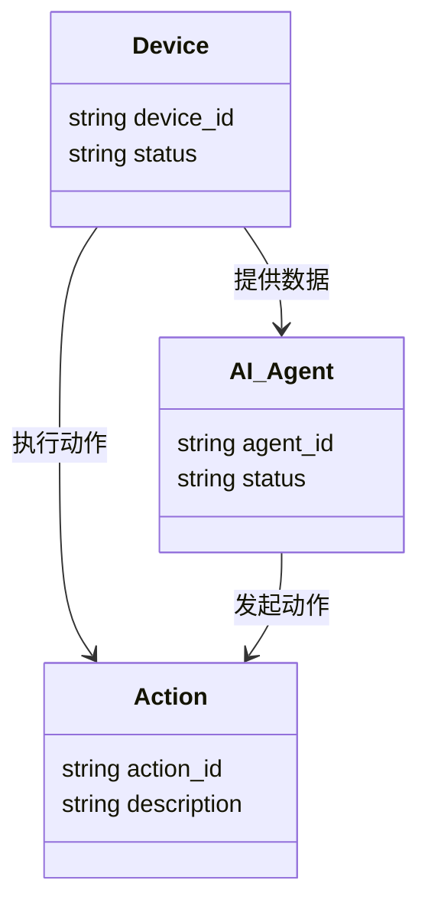

                 


# AI Agent在企业智能工厂管理中的全面应用

> **关键词**：AI Agent, 智能工厂, 工业4.0, 自动化管理, 人工智能

> **摘要**：本文全面探讨AI Agent在企业智能工厂管理中的应用，涵盖核心概念、算法原理、系统架构设计、项目实战等，旨在为技术从业者提供深入的技术分析和实践指导。文章通过详细分析AI Agent的感知、决策、执行机制，结合实际案例，展示其在智能工厂中的广泛应用和价值。

---

# 第一部分: AI Agent在企业智能工厂管理中的背景与概述

## 第1章: AI Agent与企业智能工厂管理概述

### 1.1 AI Agent的基本概念

#### 1.1.1 AI Agent的定义与特点
AI Agent（人工智能代理）是一种能够感知环境、自主决策并执行任务的智能实体。它具备以下特点：
- **自主性**：能够自主决策，无需人工干预。
- **反应性**：能够实时感知环境变化并做出反应。
- **目标导向**：以实现特定目标为导向，优化决策过程。
- **可扩展性**：能够处理复杂任务，并通过学习不断优化性能。

#### 1.1.2 AI Agent的核心要素与属性
AI Agent的核心要素包括：
- **感知能力**：通过传感器、摄像头等设备感知环境数据。
- **决策能力**：基于感知数据，利用算法做出决策。
- **执行能力**：通过执行机构（如机器人、自动化设备）完成任务。
- **学习能力**：通过机器学习算法不断优化自身性能。

#### 1.1.3 AI Agent与传统自动化系统的区别
AI Agent与传统自动化系统的主要区别在于：
- **自主性**：AI Agent具备自主决策能力，而传统自动化系统依赖预设程序。
- **学习能力**：AI Agent能够通过学习优化性能，而传统系统无法自主优化。
- **灵活性**：AI Agent能够适应复杂多变的环境，而传统系统在环境变化时需要人工调整。

### 1.2 企业智能工厂管理的背景与挑战

#### 1.2.1 智能工厂的定义与发展现状
智能工厂是指利用物联网、大数据、人工智能等技术，实现生产过程的智能化、自动化和高效化。当前，全球范围内，智能工厂正在快速发展，特别是在制造业领域。

#### 1.2.2 传统工厂管理中的问题与痛点
传统工厂管理中存在的主要问题包括：
- **效率低下**：人工操作效率低，容易出错。
- **缺乏实时性**：无法实时监控生产过程，难以及时发现和解决问题。
- **资源浪费**：设备利用率低，能源浪费严重。
- **决策滞后**：依赖人工分析，决策过程缓慢。

#### 1.2.3 智能工厂管理的核心目标与价值
智能工厂管理的核心目标是实现生产过程的智能化、自动化和高效化。其主要价值体现在：
- **提高生产效率**：通过自动化和智能化手段，大幅提高生产效率。
- **降低成本**：通过优化资源配置，降低生产成本。
- **提高产品质量**：通过精确控制生产过程，确保产品质量。
- **增强灵活性**：能够快速适应市场变化，灵活调整生产计划。

### 1.3 AI Agent在智能工厂管理中的应用前景

#### 1.3.1 AI Agent在智能工厂中的潜在应用场景
AI Agent在智能工厂中的潜在应用场景包括：
- **设备监控与维护**：实时监控设备运行状态，预测设备故障，安排维护。
- **生产优化**：优化生产流程，提高设备利用率。
- **质量控制**：实时监控产品质量，发现异常及时处理。
- **供应链管理**：优化供应链流程，提高供应链效率。

#### 1.3.2 企业采用AI Agent的优势与挑战
企业采用AI Agent的优势包括：
- **提高效率**：通过自动化和智能化手段，提高生产效率。
- **降低成本**：通过优化资源配置，降低生产成本。
- **提高灵活性**：能够快速适应市场变化，灵活调整生产计划。

企业采用AI Agent的挑战包括：
- **技术门槛高**：需要具备较高的技术能力。
- **数据依赖性**：需要大量数据支持，数据采集和处理成本高。
- **安全风险**：AI Agent的决策可能带来安全隐患。

#### 1.3.3 AI Agent在智能工厂中的发展趋势
AI Agent在智能工厂中的发展趋势包括：
- **智能化**：通过深度学习和强化学习，提高AI Agent的智能化水平。
- **集成化**：将AI Agent与物联网、大数据等技术集成，实现更高效的管理。
- **人机协作**：AI Agent与人类工人协作，共同完成生产任务。

## 第2章: AI Agent在企业智能工厂管理中的核心概念与联系

### 2.1 AI Agent的核心原理

#### 2.1.1 AI Agent的基本工作原理
AI Agent的基本工作原理包括感知、决策和执行三个阶段：
1. **感知阶段**：AI Agent通过传感器等设备感知环境数据。
2. **决策阶段**：基于感知数据，利用算法做出决策。
3. **执行阶段**：通过执行机构完成任务。

#### 2.1.2 AI Agent的感知与决策机制
AI Agent的感知机制包括：
- **数据采集**：通过传感器、摄像头等设备采集环境数据。
- **数据处理**：对采集的数据进行预处理、特征提取等操作。
- **数据存储**：将处理后的数据存储在数据库中。

AI Agent的决策机制包括：
- **模型训练**：利用机器学习算法训练决策模型。
- **决策推理**：基于模型和环境数据，推理出最优决策。
- **决策优化**：通过反馈不断优化决策模型。

#### 2.1.3 AI Agent的执行与反馈机制
AI Agent的执行机制包括：
- **任务执行**：通过执行机构完成任务。
- **反馈收集**：收集执行结果的反馈数据。

### 2.2 AI Agent与相关技术的对比分析

#### 2.2.1 AI Agent与传统自动化系统的对比
AI Agent与传统自动化系统的对比如下：

| **对比维度** | **AI Agent** | **传统自动化系统** |
|--------------|---------------|---------------------|
| **自主性**   | 高            | 低                  |
| **学习能力** | 高            | 无                  |
| **灵活性**   | 高            | 低                  |
| **决策能力** | 强            | 弱                  |

#### 2.2.2 AI Agent与工业4.0的关系
AI Agent是工业4.0的重要组成部分，通过实现设备、产品和人的全面连接，推动生产过程的智能化和自动化。

#### 2.2.3 AI Agent与物联网（IoT）的区别与联系
AI Agent与物联网的区别在于，物联网主要负责数据的采集和传输，而AI Agent负责数据的分析和决策。AI Agent可以与物联网结合，形成更强大的智能化系统。

### 2.3 AI Agent的实体关系与架构设计

#### 2.3.1 AI Agent的ER实体关系图
以下是AI Agent的ER实体关系图：

```mermaid
erDiagram
    actor User {
        string username
        string password
    }
    agent AI_Agent {
        string agent_id
        string status
    }
    device Device {
        string device_id
        string type
    }
    action Action {
        string action_id
        string description
    }
    AI_Agent o- action : "执行的动作"
    User o- action : "用户发起的动作"
    Device o- action : "设备执行的动作"
```

#### 2.3.2 AI Agent的系统架构图
以下是AI Agent的系统架构图：


#### 2.3.3 AI Agent的交互流程图
以下是AI Agent的交互流程图：

```mermaid
sequenceDiagram
    actor User
    agent AI_Agent
    device Device

    User -> AI_Agent: 发起请求
    AI_Agent -> Device: 获取数据
    Device --> AI_Agent: 返回数据
    AI_Agent -> AI_Agent: 进行决策
    AI_Agent -> Device: 执行动作
    Device --> User: 返回结果
```

---

# 第二部分: AI Agent的算法原理与数学模型

## 第3章: AI Agent的核心算法原理

### 3.1 AI Agent的感知算法

#### 3.1.1 数据采集与预处理
数据采集与预处理是感知算法的重要步骤。以下是数据预处理的流程：



#### 3.1.2 感知模型的构建与训练
感知模型的构建与训练过程如下：



#### 3.1.3 感知算法的实现与优化
感知算法的实现与优化过程如下：



### 3.2 AI Agent的决策算法

#### 3.2.1 决策模型的构建与训练
决策模型的构建与训练过程如下：



#### 3.2.2 决策算法的实现与优化
决策算法的实现与优化过程如下：



#### 3.2.3 多目标决策问题的解决方法
多目标决策问题的解决方法如下：



### 3.3 AI Agent的执行与反馈算法

#### 3.3.1 执行策略的制定与优化
执行策略的制定与优化过程如下：



#### 3.3.2 反馈机制的设计与实现
反馈机制的设计与实现过程如下：



#### 3.3.3 执行结果的评估与改进
执行结果的评估与改进过程如下：



## 第4章: AI Agent的数学模型与公式

### 4.1 感知模型的数学表达
感知模型的数学表达如下：

$$
y = f(x) = \theta_0 + \theta_1 x_1 + \theta_2 x_2 + \cdots + \theta_n x_n
$$

其中，$y$ 是输出，$x_i$ 是输入特征，$\theta_i$ 是模型参数。

### 4.2 决策模型的数学表达
决策模型的数学表达如下：

$$
p(y|x) = \frac{e^{y\cdot w \cdot x}}{1 + e^{y\cdot w \cdot x}}
$$

其中，$w$ 是模型权重，$x$ 是输入特征，$y$ 是输出标签。

### 4.3 执行模型的数学表达
执行模型的数学表达如下：

$$
\text{Action} = \arg\max_{a} Q(s, a)
$$

其中，$s$ 是当前状态，$a$ 是动作，$Q$ 是Q值函数。

---

# 第三部分: AI Agent的系统架构设计与项目实战

## 第4章: AI Agent的系统架构设计

### 4.1 问题场景介绍
本章将通过一个智能工厂设备监控与维护的案例，展示AI Agent的系统架构设计。

### 4.2 系统功能设计

#### 4.2.1 领域模型设计
以下是领域模型设计图：



#### 4.2.2 系统架构设计
以下是系统架构设计图：


#### 4.2.3 系统接口设计
以下是系统接口设计图：

```mermaid
sequenceDiagram
    actor User
    agent AI_Agent
    device Device

    User -> AI_Agent: 请求设备状态
    AI_Agent -> Device: 获取设备状态
    Device --> AI_Agent: 返回设备状态
    AI_Agent -> User: 发送设备状态
```

#### 4.2.4 系统交互设计
以下是系统交互设计图：

```mermaid
sequenceDiagram
    actor User
    agent AI_Agent
    device Device

    User -> AI_Agent: 请求设备维护
    AI_Agent -> Device: 执行维护操作
    Device --> AI_Agent: 返回维护结果
    AI_Agent -> User: 发送维护结果
```

## 第5章: AI Agent的项目实战

### 5.1 环境安装与配置

#### 5.1.1 系统环境要求
- 操作系统：Linux/Windows/MacOS
- Python版本：3.6+
- 依赖库：numpy、pandas、scikit-learn、tensorflow

#### 5.1.2 环境配置步骤
1. 安装Python和必要的依赖库：
   ```bash
   pip install numpy pandas scikit-learn tensorflow
   ```
2. 下载AI Agent源代码：
   ```bash
   git clone https://github.com/ai-agent/factory-management.git
   cd factory-management
   ```

### 5.2 系统核心实现源代码

#### 5.2.1 数据处理模块
```python
import numpy as np
import pandas as pd

def preprocess_data(data):
    # 数据清洗
    data = data.dropna()
    # 数据标准化
    data = (data - data.mean()) / data.std()
    return data
```

#### 5.2.2 感知模型实现
```python
from sklearn.linear_model import LinearRegression

def train_perception_model(X, y):
    model = LinearRegression()
    model.fit(X, y)
    return model
```

#### 5.2.3 决策模型实现
```python
from sklearn.tree import DecisionTreeClassifier

def train_decision_model(X, y):
    model = DecisionTreeClassifier()
    model.fit(X, y)
    return model
```

#### 5.2.4 执行模块实现
```python
def execute_action(action):
    print(f"执行动作：{action}")
    return f"动作{action}执行成功"
```

### 5.3 代码应用解读与分析
1. **数据处理模块**：用于对采集的数据进行清洗和标准化处理。
2. **感知模型实现**：使用线性回归算法训练感知模型。
3. **决策模型实现**：使用决策树算法训练决策模型。
4. **执行模块实现**：根据决策结果执行具体动作。

### 5.4 实际案例分析与详细讲解剖析
通过上述代码实现，我们可以完成智能工厂设备监控与维护的整个流程。具体步骤如下：
1. **数据采集**：通过传感器采集设备运行状态数据。
2. **数据预处理**：对数据进行清洗和标准化处理。
3. **模型训练**：训练感知模型和决策模型。
4. **模型推理**：根据当前设备状态，利用感知模型和决策模型做出决策。
5. **任务执行**：根据决策结果，执行具体动作。

### 5.5 项目小结
本项目通过AI Agent实现了智能工厂设备监控与维护的完整流程，展示了AI Agent在实际应用中的强大能力。

---

# 第四部分: AI Agent的最佳实践、小结与注意事项

## 第6章: AI Agent的最佳实践与小结

### 6.1 最佳实践
1. **数据质量管理**：确保数据的准确性和完整性，避免数据偏差。
2. **模型优化**：通过不断优化模型参数和结构，提高模型性能。
3. **系统安全性**：确保系统的安全性，防止数据泄露和网络攻击。

### 6.2 小结
本文全面探讨了AI Agent在企业智能工厂管理中的应用，从背景介绍到系统架构设计，再到项目实战，详细展示了AI Agent的核心技术和实际应用价值。通过本文的学习，读者可以掌握AI Agent在智能工厂管理中的核心概念和实现方法。

## 第7章: 注意事项与扩展阅读

### 7.1 注意事项
1. **数据隐私**：在处理数据时，需要注意数据隐私问题，确保数据安全。
2. **系统稳定性**：确保系统的稳定性和可靠性，避免系统故障。
3. **模型可解释性**：提高模型的可解释性，便于问题排查和优化。

### 7.2 扩展阅读
1. **《机器学习实战》**：作者：周志华。
2. **《深度学习》**：作者：Ian Goodfellow 等。
3. **《工业4.0白皮书》**：德国工业4.0工作组发布。

---

# 作者：AI天才研究院/AI Genius Institute & 禅与计算机程序设计艺术 /Zen And The Art of Computer Programming

---

以上是《AI Agent在企业智能工厂管理中的全面应用》的完整目录和内容框架。接下来，我会根据上述框架，逐步撰写每一部分的具体内容。

