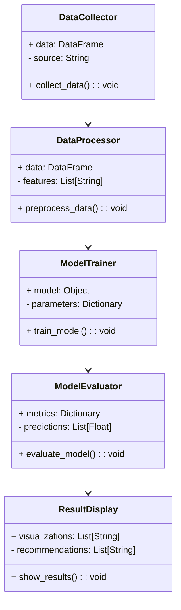

                 


# AI辅助的房地产投资分析

> 关键词：AI，房地产投资，机器学习，数据分析，深度学习，投资预测

> 摘要：本文探讨了AI在房地产投资分析中的应用，从基础概念到高级算法，再到系统架构设计和实际项目实战，全面解析如何利用AI技术提升房地产投资决策的准确性和效率。

---

# 第一部分: AI辅助的房地产投资分析基础

## 第1章: 房地产投资分析的AI化背景

### 1.1 房地产投资分析的现状与挑战

#### 1.1.1 房地产投资分析的传统方法

房地产投资分析的传统方法主要包括基本面分析、技术分析和市场情绪分析。基本面分析关注房地产市场的经济指标（如GDP增长率、利率水平、就业率等）和物业本身的属性（如位置、面积、房龄等）；技术分析则主要通过历史价格数据来预测未来的价格走势；市场情绪分析则关注投资者的心理预期和市场参与度。

然而，这些传统方法存在以下局限性：

1. 数据量有限：传统方法依赖于少量的历史数据和经验判断，难以捕捉市场中的复杂规律。
2. 主观性较强：分析结果受到分析师个人经验和判断的影响，存在较大的主观性。
3. 预测精度低：由于市场的复杂性和不确定性，传统方法的预测精度有限，难以满足投资者对高精度预测的需求。

#### 1.1.2 传统方法的局限性

传统房地产投资分析方法的局限性主要体现在以下几个方面：

1. 数据维度不足：传统方法通常只考虑少量的经济指标和物业属性，难以全面捕捉影响房地产市场的多种因素。
2. 计算能力限制：传统方法依赖于人工分析，计算能力有限，难以处理大规模数据。
3. 预测精度低：由于市场复杂性和数据不足，传统方法的预测精度较低，难以满足投资者对高精度预测的需求。

#### 1.1.3 AI技术如何解决这些问题

AI技术通过引入机器学习、深度学习等先进算法，可以显著提升房地产投资分析的效率和精度。AI技术的优势包括：

1. 大数据分析能力：AI能够处理海量数据，包括经济指标、物业属性、市场情绪等多种数据源。
2. 自动化分析：AI可以自动提取数据中的特征，并通过训练模型来预测价格走势和投资回报率。
3. 实时更新：AI模型可以根据最新的数据实时更新预测结果，帮助投资者做出及时的决策。

---

### 1.2 AI在房地产投资中的应用前景

#### 1.2.1 AI在房地产数据分析中的优势

AI在房地产数据分析中的优势主要体现在以下几个方面：

1. 数据处理能力：AI能够处理大规模、多维度的数据，包括文本、图像、数值等多种数据类型。
2. 自动特征提取：AI可以自动从数据中提取有用的特征，减少人工干预。
3. 高精度预测：通过训练深度学习模型，AI可以实现高精度的价格预测和投资回报率预测。

#### 1.2.2 全球AI辅助房地产投资的现状

目前，全球范围内AI在房地产投资中的应用已经取得了一定的进展。例如，一些房地产公司和科技公司已经开始利用AI技术进行市场分析、价格预测和投资组合优化。然而，AI技术的应用还处于初级阶段，许多潜在的应用场景尚未被开发。

#### 1.2.3 未来发展趋势与潜力

未来，AI在房地产投资中的应用将更加广泛和深入。随着技术的进步，AI将能够处理更多类型的数据，模型的预测精度也将进一步提高。此外，AI还可能与其他技术（如区块链、物联网）结合，进一步提升房地产投资分析的效率和准确性。

---

### 1.3 本书的核心目标与内容框架

#### 1.3.1 本书的核心目标

本书的核心目标是介绍AI在房地产投资分析中的应用，从基础概念到高级算法，再到系统架构设计和实际项目实战，全面解析如何利用AI技术提升房地产投资决策的准确性和效率。

#### 1.3.2 本书的主要内容框架

本书的主要内容框架如下：

1. 第一部分：AI辅助的房地产投资分析基础。
2. 第二部分：AI辅助房地产投资的核心概念。
3. 第三部分：房地产投资分析的数学模型与算法。
4. 第四部分：AI辅助房地产投资的系统架构设计。
5. 第五部分：AI辅助房地产投资的项目实战。
6. 第六部分：AI辅助房地产投资的高级应用与最佳实践。

#### 1.3.3 本书的适用读者

本书适用于以下读者：

1. 房地产投资者：希望利用AI技术提升投资决策的准确性。
2. 数据科学家：希望了解AI在房地产投资中的具体应用。
3. 软件架构师：希望设计AI辅助房地产投资的系统架构。
4. 计算机编程人员：希望学习如何利用AI技术进行房地产投资分析。

---

## 第2章: AI辅助房地产投资的核心概念

### 2.1 数据驱动的房地产投资分析

#### 2.1.1 数据在房地产投资中的重要性

数据是AI辅助房地产投资分析的基础。通过收集和分析大量的数据，AI可以帮助投资者更好地理解市场趋势和物业价值。常见的数据类型包括：

1. 经济数据：GDP增长率、利率、就业率等。
2. 物业数据：位置、面积、房龄、租金等。
3. 市场数据：房价指数、交易量、供需关系等。
4. 其他数据：政策变化、社会事件等。

#### 2.1.2 数据的类型与来源

房地产投资分析中涉及的数据类型和来源包括：

1. 经济数据：来源于政府统计部门、金融机构等。
2. 物业数据：来源于房地产交易平台、物业公司等。
3. 市场数据：来源于房地产经纪公司、市场研究机构等。
4. 其他数据：来源于新闻媒体、政策文件等。

#### 2.1.3 数据预处理与特征提取

数据预处理是AI辅助房地产投资分析的重要步骤。主要包括：

1. 数据清洗：处理缺失值、异常值等。
2. 数据转换：将数据转换为适合模型输入的格式。
3. 特征提取：从数据中提取有用的特征，例如通过主成分分析（PCA）减少特征维度。

---

#### 2.1.4 数据预处理与特征提取的具体步骤

1. 数据清洗：
   - 处理缺失值：可以使用均值、中位数或插值法填充缺失值。
   - 处理异常值：可以通过统计方法（如Z-score）或机器学习方法（如Isolation Forest）识别并处理异常值。

2. 数据转换：
   - 标准化：将数据标准化到相同的范围，例如使用Z-score标准化。
   - 编码：将分类变量编码为数值，例如使用独热编码（One-Hot Encoding）。

3. 特征提取：
   - 主成分分析（PCA）：通过线性组合将高维数据降维。
   - 流形学习（t-SNE）：通过非线性降维技术提取特征。

---

### 2.2 AI模型在房地产投资中的应用

#### 2.2.1 机器学习模型的基本原理

机器学习模型的基本原理包括：

1. 监督学习：通过训练数据预测目标变量。
2. 无监督学习：通过聚类分析发现数据中的结构。
3. 强化学习：通过与环境交互学习最优策略。

#### 2.2.2 常见的房地产投资预测模型

常见的房地产投资预测模型包括：

1. 线性回归模型：用于预测房价的趋势。
2. 支持向量机（SVM）：用于分类和回归任务。
3. 随机森林：用于分类和回归任务，具有高精度和鲁棒性。
4. 神经网络：用于复杂模式的识别。

#### 2.2.3 模型的评估与优化

模型的评估与优化包括：

1. 评估指标：准确率、精确率、召回率、F1分数等。
2. 超参数调优：通过网格搜索或随机搜索优化模型参数。
3. 模型融合：通过集成学习（如投票法、加权法）提升模型性能。

---

### 2.3 房地产投资分析的流程与框架

#### 2.3.1 投资分析的基本流程

房地产投资分析的基本流程包括：

1. 数据收集：收集经济数据、物业数据、市场数据等。
2. 数据预处理：清洗、转换、特征提取。
3. 模型训练：选择合适的算法训练模型。
4. 模型评估：评估模型的性能并进行优化。
5. 结果解释：解释模型的预测结果并制定投资策略。

#### 2.3.2 AI辅助的分析框架

AI辅助的房地产投资分析框架包括：

1. 数据驱动：利用AI技术处理和分析数据。
2. 模型驱动：通过训练模型预测房价和投资回报率。
3. 结果驱动：根据模型预测结果制定投资策略。

#### 2.3.3 框架的优缺点与适用场景

框架的优缺点：

1. 优点：提高分析效率和精度，发现数据中的隐藏规律。
2. 缺点：模型的复杂性和数据依赖性较高，需要大量的数据支持。

适用场景：

1. 大规模数据分析：适用于数据量大、维度高的场景。
2. 高精度预测：适用于需要高精度预测的场景。

---

## 第3章: 房地产投资分析的数学模型与算法

### 3.1 线性回归模型

#### 3.1.1 线性回归的基本原理

线性回归是一种简单且常用的回归模型，其基本原理是通过最小化预测值与实际值之间的平方差之和来拟合一条直线。

数学公式：

$$
y = \beta_0 + \beta_1 x + \epsilon
$$

其中，$y$ 是目标变量，$x$ 是自变量，$\beta_0$ 和 $\beta_1$ 是回归系数，$\epsilon$ 是误差项。

#### 3.1.2 线性回归的数学公式

线性回归的数学公式可以表示为：

$$
\hat{y} = \theta_0 + \theta_1 x
$$

其中，$\hat{y}$ 是预测值，$\theta_0$ 和 $\theta_1$ 是回归系数。

#### 3.1.3 线性回归的应用实例

假设我们有以下数据：

| 年份 | 房价（万元） |
|------|-------------|
| 2018 | 100         |
| 2019 | 120         |
| 2020 | 140         |
| 2021 | 160         |

我们可以使用线性回归模型预测2022年的房价。假设回归系数 $\theta_0 = 80$，$\theta_1 = 20$，则预测结果为：

$$
\hat{y} = 80 + 20 \times 4 = 160
$$

---

### 3.2 支持向量机（SVM）

#### 3.2.1 SVM的基本原理

支持向量机（SVM）是一种监督学习算法，主要用于分类和回归任务。其基本原理是通过找到一个超平面，使得支持向量与非支持向量之间的距离最大化。

数学公式：

$$
y = \text{sign}(w \cdot x + b)
$$

其中，$w$ 是权重向量，$x$ 是输入向量，$b$ 是偏置项。

#### 3.2.2 SVM的数学公式

SVM的数学公式可以表示为：

$$
y = \text{sign}(\theta_0 + \theta_1 x)
$$

其中，$\theta_0$ 是偏置项，$\theta_1$ 是权重系数。

#### 3.2.3 SVM在房地产投资中的应用

SVM可以用于房价分类任务，例如将房价分为高、中、低三个类别。假设我们有以下数据：

| 房价（万元） | 类别 |
|--------------|------|
| 100          | 低   |
| 150          | 中   |
| 200          | 高   |

我们可以使用SVM模型对房价进行分类，预测未来房价的类别。

---

### 3.3 随机森林与梯度提升树

#### 3.3.1 随机森林的基本原理

随机森林是一种基于决策树的集成学习算法，通过组合多个决策树的结果来提高模型的准确性和稳定性。

数学公式：

$$
\hat{y} = \frac{1}{n} \sum_{i=1}^{n} y_i
$$

其中，$n$ 是决策树的数量，$y_i$ 是第 $i$ 棵决策树的预测结果。

#### 3.3.2 梯度提升树的基本原理

梯度提升树是一种基于树的集成学习算法，通过逐步优化模型的损失函数来提高预测精度。

数学公式：

$$
\hat{y} = \sum_{i=1}^{m} \theta_i x_i
$$

其中，$m$ 是树的数量，$\theta_i$ 是第 $i$ 棵树的权重，$x_i$ 是输入特征。

#### 3.3.3 两种算法的比较与应用

随机森林和梯度提升树的比较：

1. 随机森林：适合小数据集，计算速度快，模型解释性好。
2. 梯度提升树：适合大数据集，计算速度慢，模型解释性差。

应用实例：

随机森林可以用于房价预测任务，例如：

| 面积（平方米） | 房价（万元） |
|----------------|-------------|
| 100            | 100         |
| 200            | 200         |
| 300            | 300         |

我们可以使用随机森林模型预测400平方米的房价。

---

### 3.4 神经网络与深度学习

#### 3.4.1 神经网络的基本原理

神经网络是一种模拟人脑神经元结构的模型，通过多层神经元的组合来实现复杂的函数逼近。

数学公式：

$$
\hat{y} = \sigma(w x + b)
$$

其中，$\sigma$ 是激活函数，$w$ 是权重系数，$b$ 是偏置项。

#### 3.4.2 深度学习的基本原理

深度学习是一种基于神经网络的机器学习算法，通过多层神经网络来学习数据的高层次特征。

数学公式：

$$
\hat{y} = \sigma(W_1 x + b_1) \cdot \sigma(W_2 h + b_2)
$$

其中，$h$ 是隐藏层的输出，$W_1$ 和 $W_2$ 是权重矩阵，$b_1$ 和 $b_2$ 是偏置项。

#### 3.4.3 深度学习在房地产投资中的应用

深度学习可以用于房价预测任务，例如：

| 面积（平方米） | 房龄（年） | 房价（万元） |
|----------------|------------|-------------|
| 100            | 10         | 100         |
| 200            | 20         | 200         |
| 300            | 30         | 300         |

我们可以使用深度学习模型预测400平方米的房价。

---

## 第4章: AI辅助房地产投资的系统架构设计

### 4.1 系统架构概述

#### 4.1.1 系统的整体架构

AI辅助房地产投资的系统架构包括以下几个模块：

1. 数据采集模块：负责收集经济数据、物业数据、市场数据等。
2. 数据处理模块：负责数据清洗、转换和特征提取。
3. 模型训练模块：负责选择合适的算法训练模型。
4. 模型评估模块：负责评估模型的性能并进行优化。
5. 结果展示模块：负责展示模型的预测结果并制定投资策略。

#### 4.1.2 系统的功能模块划分

系统功能模块划分如下：

1. 数据采集模块：数据接口、数据存储。
2. 数据处理模块：数据清洗、特征提取。
3. 模型训练模块：算法选择、模型训练。
4. 模型评估模块：性能评估、超参数调优。
5. 结果展示模块：结果可视化、投资建议。

#### 4.1.3 系统的输入输出流程

系统的输入输出流程如下：

1. 输入：经济数据、物业数据、市场数据。
2. 数据处理：清洗、转换、特征提取。
3. 模型训练：选择算法、训练模型。
4. 模型评估：评估性能、优化参数。
5. 输出：预测结果、投资建议。

---

### 4.2 数据处理与特征工程

#### 4.2.1 数据的采集与清洗

数据的采集与清洗包括以下几个步骤：

1. 数据采集：通过API、数据库等方式获取数据。
2. 数据清洗：处理缺失值、异常值、重复值。
3. 数据转换：将数据转换为适合模型输入的格式。

#### 4.2.2 特征工程的实现

特征工程的实现包括以下几个步骤：

1. 特征选择：选择对目标变量影响较大的特征。
2. 特征提取：通过主成分分析（PCA）等方法提取特征。
3. 特征转换：将分类变量编码为数值，例如独热编码。

#### 4.2.3 数据预处理的代码实现

以下是数据预处理的Python代码示例：

```python
import pandas as pd
from sklearn.preprocessing import StandardScaler, OneHotEncoder

# 数据清洗
df = pd.read_csv('real_estate.csv')
df.drop_duplicates(inplace=True)
df.dropna(inplace=True)

# 数据转换
scaler = StandardScaler()
scaled_features = scaler.fit_transform(df[['area', 'age']])

# 特征提取
from sklearn.decomposition import PCA
pca = PCA(n_components=2)
pca_features = pca.fit_transform(scaled_features)

# 特征转换
encoder = OneHotEncoder()
onehot_features = encoder.fit_transform(df[['location']])
```

---

### 4.3 系统功能设计

#### 4.3.1 系统的功能模块设计

系统功能模块设计如下：

1. 数据采集模块：负责数据的获取和存储。
2. 数据处理模块：负责数据的清洗、转换和特征提取。
3. 模型训练模块：负责模型的训练和优化。
4. 模型评估模块：负责模型的评估和结果展示。
5. 结果展示模块：负责结果的可视化和投资建议。

#### 4.3.2 系统的类图设计

以下是系统的类图设计：



---

### 4.4 系统的架构设计

#### 4.4.1 系统的架构设计

系统的架构设计如下：

1. 数据层：包括数据采集、数据存储。
2. 处理层：包括数据预处理、特征提取。
3. 模型层：包括模型训练、模型评估。
4. 展示层：包括结果可视化、投资建议。

#### 4.4.2 系统的架构图

以下是系统的架构图：


---

### 4.5 系统接口设计

#### 4.5.1 系统的接口设计

系统的接口设计包括以下几个步骤：

1. 数据接口：定义数据输入和输出的格式。
2. 模型接口：定义模型训练和预测的接口。
3. 结果接口：定义结果展示的格式。

#### 4.5.2 系统的交互流程

系统的交互流程如下：

1. 用户输入数据。
2. 系统处理数据。
3. 系统训练模型。
4. 系统评估模型。
5. 系统展示结果。

---

## 第5章: AI辅助房地产投资的项目实战

### 5.1 项目介绍

#### 5.1.1 项目背景

本项目旨在利用AI技术进行房地产投资分析，帮助投资者制定科学的投资策略。

#### 5.1.2 项目目标

项目的

