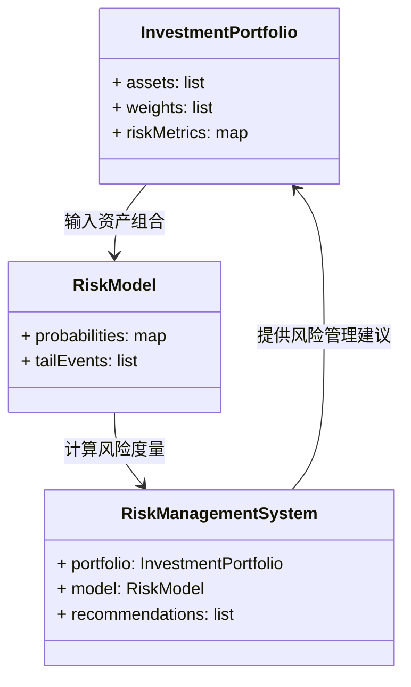
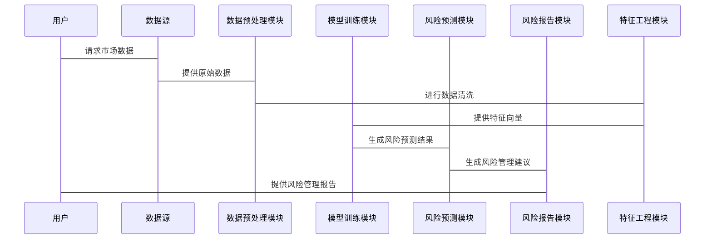

                 


# AI辅助的投资组合尾部风险度量

> 关键词：AI技术，投资组合，尾部风险，风险管理，深度学习

> 摘要：本文详细探讨了如何利用人工智能技术辅助投资组合的尾部风险度量。首先介绍了传统风险度量方法的局限性，随后阐述了尾部风险的定义和特征，接着分析了AI在金融风险管理中的作用。在算法部分，重点讲解了基于概率模型和深度学习的尾部风险预测方法，并通过实际案例展示了AI技术在投资组合风险管理中的应用。最后，总结了AI辅助投资组合尾部风险度量的优势和未来发展方向。

---

## 第1章: 投资组合风险度量概述

### 1.1 传统投资组合风险度量方法

#### 1.1.1 风险的定义与分类
风险在投资领域通常指投资组合可能遭受的损失。根据损失的严重程度和发生概率，风险可以分为尾部风险（Tail Risk）和非尾部风险。尾部风险是指在资产价格出现极端波动时，投资组合可能遭受的重大损失，通常对应于概率分布的尾部区域。

#### 1.1.2 传统风险度量模型（如VaR、CVaR）
- **VaR（Value at Risk）**：VaR是在给定置信水平下，投资组合可能遭受的最大损失。例如，95%置信水平下的VaR表示在95%的概率下，投资组合的最大损失不会超过VaR值。
- **CVaR（Conditional Value at Risk）**：CVaR是在超过VaR的情况下的平均损失，也被称为尾部风险度量。

#### 1.1.3 传统方法的局限性
传统方法依赖于历史数据和统计假设，难以捕捉极端事件的特征。例如，正态分布假设下，尾部事件的发生概率远低于实际市场中的情况。

### 1.2 尾部风险的定义与特征

#### 1.2.1 尾部风险的定义
尾部风险是指投资组合在极端市场条件下可能遭受的重大损失，通常对应于概率分布的尾部区域。尾部事件可能是由市场崩盘、突发事件或黑天鹅事件引起的。

#### 1.2.2 尾部风险的特征
- **低概率**：尾部事件的发生概率较低，但一旦发生，损失可能非常严重。
- **极端性**：尾部事件往往伴随着资产价格的大幅波动，可能导致投资组合的价值急剧下降。
- **不可预测性**：尾部事件通常难以用传统的统计方法预测，因为它们往往偏离历史数据的分布模式。

#### 1.2.3 尾部风险与整体风险的关系
尾部风险是整体风险的一部分，但其影响更为显著。有效的风险管理需要对尾部风险进行特别关注，以避免投资组合在极端情况下的重大损失。

### 1.3 AI技术在金融领域的应用前景

#### 1.3.1 AI在金融风险管理中的作用
AI技术可以通过分析大量数据，识别潜在的尾部风险信号，帮助投资者更好地管理投资组合的风险。

#### 1.3.2 AI辅助投资组合管理的优势
- **数据驱动**：AI可以通过分析历史数据和市场行为，识别尾部风险的潜在模式。
- **实时监控**：AI可以实时监控市场动态，及时发现潜在的极端事件。
- **个性化风险评估**：AI可以根据投资者的风险承受能力和投资目标，提供个性化的风险评估和建议。

#### 1.3.3 尾部风险度量的AI解决方案
通过深度学习模型，AI可以对市场数据进行特征提取和模式识别，从而更准确地预测尾部风险。

---

## 第2章: AI辅助投资组合尾部风险度量的核心概念

### 2.1 尾部风险度量的数学模型

#### 2.1.1 概率分布模型
- **正态分布**：假设资产回报服从正态分布，尾部事件的发生概率较低。
- **厚尾分布**：如幂律分布，尾部事件的发生概率较高，适用于描述金融市场中的极端事件。

#### 2.1.2 极值理论（EVT）
极值理论用于分析和建模极端事件。通过 EVT，可以估计资产回报的尾部概率分布。

#### 2.1.3 风险度量函数
- **VaR**：在给定置信水平下的最大损失。
- **CVaR**：超过VaR情况下的平均损失。

### 2.2 AI在尾部风险度量中的作用

#### 2.2.1 数据驱动的风险建模
AI通过分析大量数据，识别尾部风险的潜在模式和特征。

#### 2.2.2 深度学习在尾部事件预测中的应用
- **神经网络模型**：通过多层感知机（MLP）和长短期记忆网络（LSTM）等模型，预测尾部事件的发生概率。
- **特征提取**：AI可以从市场数据中自动提取特征，捕捉尾部风险的相关信息。

#### 2.2.3 迁移学习与领域适应
通过迁移学习，AI可以从其他领域的数据中获取知识，辅助尾部风险的预测。

### 2.3 核心概念与联系

#### 2.3.1 尾部风险与AI模型的关系
AI模型可以帮助识别和预测尾部风险，但需要结合市场数据和风险管理目标进行优化。

#### 2.3.2 数据特征与风险预测的关联
尾部风险的预测依赖于数据特征的识别和提取，AI可以通过特征工程提高预测的准确性。

#### 2.3.3 模型选择与风险度量的优化
选择合适的AI模型和风险度量函数，可以有效优化尾部风险的度量和管理。

---

## 第3章: 基于概率模型的尾部风险预测

### 3.1 概率密度函数与累积分布函数

#### 3.1.1 正态分布与尾部风险
正态分布假设资产回报服从钟形曲线，尾部事件的发生概率较低。

#### 3.1.2 厚尾分布（如幂律分布）与尾部事件
厚尾分布假设尾部事件的发生概率较高，适用于描述金融市场中的极端事件。

#### 3.1.3 混合分布模型
混合分布模型结合了不同分布的特点，可以更准确地描述资产回报的分布。

### 3.2 基于深度学习的尾部风险预测

#### 3.2.1 神经网络模型的输入特征设计
- **市场数据**：包括资产价格、成交量等。
- **技术指标**：如移动平均线、相对强弱指数等。

#### 3.2.2 深度学习模型的训练与优化
- **模型训练**：使用历史数据训练深度学习模型，提取尾部风险的特征。
- **模型优化**：通过调整超参数和优化算法，提高模型的预测精度。

#### 3.2.3 模型的解释性与可解释性
通过解释模型的决策过程，可以更好地理解AI预测尾部风险的机制。

### 3.3 深度学习模型的数学原理

#### 3.3.1 神经网络的数学表达
神经网络由输入层、隐藏层和输出层组成，通过激活函数和权重参数进行非线性变换。

#### 3.3.2 损失函数与优化算法
- **损失函数**：衡量预测值与真实值之间的差异，如均方误差（MSE）。
- **优化算法**：如随机梯度下降（SGD）和Adam优化器，用于最小化损失函数。

#### 3.3.3 模型训练的数学推导
通过反向传播算法，计算损失函数的梯度，并更新模型参数以最小化损失。

---

## 第4章: 基于统计学习的尾部风险度量

### 4.1 基于回归分析的尾部风险建模

#### 4.1.1 线性回归与非线性回归
- **线性回归**：适用于线性关系，但难以捕捉复杂的数据模式。
- **非线性回归**：通过多项式回归和核方法，可以捕捉非线性关系。

#### 4.1.2 回归模型的评估与优化
通过交叉验证和网格搜索，选择最优模型参数和评估模型性能。

#### 4.1.3 回归模型在尾部风险预测中的应用
回归模型可以预测尾部事件的发生概率，并估计其对投资组合的影响。

### 4.2 基于聚类分析的尾部风险识别

#### 4.2.1 聚类分析的基本原理
聚类分析将相似的资产或市场状态分组，识别具有相似风险特征的投资组合。

#### 4.2.2 尾部风险事件的聚类方法
通过聚类分析，识别具有相似特征的尾部风险事件，分析其共同特征和潜在模式。

#### 4.2.3 聚类模型在尾部风险识别中的应用
聚类分析可以帮助投资者识别具有相似风险特征的投资组合，并制定相应的风险管理策略。

### 4.3 统计学习方法的优缺点

#### 4.3.1 统计学习方法的优势
- **解释性**：统计学习方法通常具有较高的解释性，可以帮助投资者理解风险预测的机制。
- **计算效率**：统计学习方法计算效率较高，适用于实时风险管理。

#### 4.3.2 统计学习方法的局限性
- **假设依赖**：统计学习方法依赖于特定的分布假设，难以捕捉复杂的市场动态。
- **数据依赖**：统计学习方法的性能依赖于数据的质量和数量，可能难以捕捉极端事件。

---

## 第5章: 系统分析与架构设计

### 5.1 问题场景介绍

#### 5.1.1 投资组合风险管理的挑战
- **极端事件的难以预测**：传统方法难以捕捉尾部风险。
- **数据复杂性**：金融市场数据具有高度复杂性和不确定性。
- **实时监控需求**：投资者需要实时监控市场动态，及时应对潜在风险。

#### 5.1.2 问题描述
设计一个基于AI的系统，实时监控投资组合的风险，识别尾部风险，并提供风险管理建议。

### 5.2 系统功能设计

#### 5.2.1 领域模型（Mermaid类图）


#### 5.2.2 系统架构设计（Mermaid架构图）


#### 5.2.3 系统接口设计
- **输入接口**：接收投资组合的资产数据和市场数据。
- **输出接口**：生成尾部风险预测结果和风险管理建议。

#### 5.2.4 系统交互（Mermaid序列图）


---

## 第6章: 项目实战

### 6.1 环境安装与配置

#### 6.1.1 安装Python环境
使用Anaconda安装Python 3.8及以上版本。

#### 6.1.2 安装必要的库
安装以下库：
- `numpy`
- `pandas`
- `scikit-learn`
- `keras`
- `tensorflow`

#### 6.1.3 数据源获取
从金融数据提供商获取历史资产价格数据。

### 6.2 系统核心实现源代码

#### 6.2.1 数据预处理
```python
import numpy as np
import pandas as pd

# 加载数据
data = pd.read_csv('market_data.csv')

# 数据清洗
data = data.dropna()
data = data.iloc[:, [0, 1, 2]]  # 选择相关特征
```

#### 6.2.2 特征工程
```python
from sklearn.preprocessing import StandardScaler

# 标准化数据
scaler = StandardScaler()
X_scaled = scaler.fit_transform(data.drop(columns=['return']))
```

#### 6.2.3 模型训练
```python
from keras.models import Sequential
from keras.layers import Dense

# 构建神经网络模型
model = Sequential()
model.add(Dense(64, activation='relu', input_dim=X_scaled.shape[1]))
model.add(Dense(32, activation='relu'))
model.add(Dense(1, activation='sigmoid'))

# 编译模型
model.compile(optimizer='adam', loss='binary_crossentropy', metrics=['accuracy'])

# 训练模型
model.fit(X_scaled, y, epochs=100, batch_size=32)
```

#### 6.2.4 风险预测
```python
# 使用训练好的模型进行预测
y_pred = model.predict(X_test_scaled)
```

#### 6.2.5 风险报告
```python
# 生成风险管理报告
report = pd.DataFrame({'predicted_prob': y_pred.flatten()})
report.to_csv('risk_report.csv', index=False)
```

### 6.3 代码应用解读与分析

#### 6.3.1 数据预处理
数据预处理包括数据清洗和特征选择，确保输入数据的质量和适用性。

#### 6.3.2 模型训练
通过神经网络模型，训练数据特征和尾部风险标签的关系，提高预测的准确性。

#### 6.3.3 风险预测
利用训练好的模型，对新的数据进行尾部风险预测，生成风险管理建议。

#### 6.3.4 案例分析
通过具体案例，展示AI技术在投资组合尾部风险度量中的实际应用。

---

## 第7章: 总结与最佳实践

### 7.1 总结
本文详细探讨了AI辅助投资组合尾部风险度量的核心概念和实现方法。通过结合概率模型和深度学习技术，可以更准确地预测和管理尾部风险，为投资者提供更有效的风险管理工具。

### 7.2 最佳实践

#### 7.2.1 数据质量
确保数据的完整性和准确性，选择合适的特征进行建模。

#### 7.2.2 模型选择
根据具体问题选择合适的模型，并进行充分的验证和测试。

#### 7.2.3 模型解释性
通过解释模型的决策过程，提高风险管理的透明度和可信度。

#### 7.2.4 实时监控
建立实时监控机制，及时发现和应对潜在的尾部风险。

### 7.3 小结
AI技术为投资组合尾部风险度量提供了新的可能性，通过结合传统方法和现代技术，可以更有效地管理投资风险。

### 7.4 注意事项
- **模型局限性**：AI模型依赖于历史数据和假设，可能存在预测偏差。
- **数据隐私**：在处理金融数据时，需要注意数据隐私和安全问题。
- **模型更新**：需要定期更新模型，以适应市场变化和新的数据。

### 7.5 拓展阅读
- **深度学习与风险管理**：进一步研究深度学习在金融风险管理中的应用。
- **时间序列分析**：学习时间序列分析方法，提高尾部风险预测的准确性。
- **风险对冲策略**：探讨如何利用AI技术制定有效的风险对冲策略。

---

## 作者：AI天才研究院/AI Genius Institute & 禅与计算机程序设计艺术/Zen And The Art of Computer Programming

---

以上是《AI辅助的投资组合尾部风险度量》的完整内容，希望对您有所帮助！

