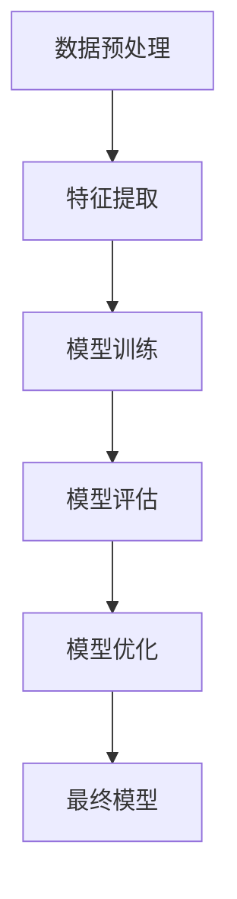
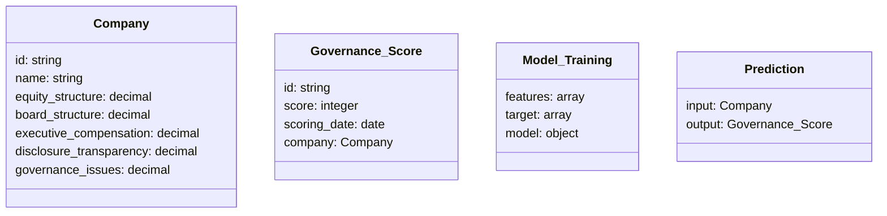
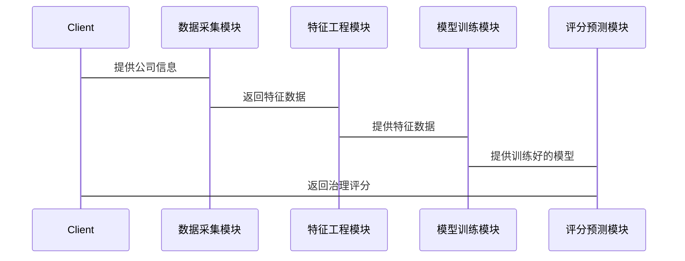

                 


# AI驱动的公司治理评分预测

> 关键词：公司治理，AI，评分预测，机器学习，数据驱动

> 摘要：本文探讨如何利用人工智能技术构建公司治理评分预测模型，通过数据驱动的方法，分析公司治理的关键指标，预测公司的治理表现。文章从背景介绍、核心概念、算法原理、系统架构到项目实战，全面阐述AI在公司治理评分预测中的应用，并通过实际案例分析，展示如何通过AI技术提升公司治理的透明度和效率。

---

## 第一部分: 公司治理评分预测的背景与核心概念

### 第1章: 公司治理评分预测的背景介绍

#### 1.1 问题背景

##### 1.1.1 公司治理的重要性
公司治理是确保企业有效运作、保护利益相关者权益的关键。良好的公司治理能够提升企业透明度、降低风险，并为企业创造长期价值。然而，传统公司治理评估方法往往依赖主观判断，缺乏客观性和可量化性。

##### 1.1.2 传统公司治理评分的局限性
传统的公司治理评分方法通常基于财务指标和主观评估，存在以下问题：
- 数据来源单一，难以全面反映公司治理状况。
- 评估标准不统一，不同机构的评分结果可能存在较大差异。
- 缺乏实时性和动态性，难以捕捉公司治理的细微变化。

##### 1.1.3 AI技术在公司治理评分中的应用潜力
人工智能技术可以通过分析海量数据，提取关键特征，构建预测模型，实现对公司治理状况的量化评估。AI技术的优势在于其能够处理多维度数据，并通过机器学习算法不断优化预测模型。

#### 1.2 问题描述

##### 1.2.1 公司治理评分的核心要素
公司治理评分的核心要素包括：
- 股权结构
- 董事会结构
- 高管薪酬与激励机制
- 信息披露与透明度
- 治理违规记录
- 财务健康状况

##### 1.2.2 当前评分方法的不足
- 数据采集成本高，难以获取全面数据。
- 评估方法缺乏客观性，容易受到主观因素影响。
- 评分结果缺乏实时性和动态性，难以及时反映公司治理的变化。

##### 1.2.3 AI驱动评分的必要性
AI技术可以通过自动化数据采集、特征提取和模型训练，构建客观、动态的公司治理评分系统。AI技术能够处理非结构化数据，如新闻报道、社交媒体信息，进一步丰富评分维度。

#### 1.3 问题解决

##### 1.3.1 AI技术如何提升公司治理评分
- 利用自然语言处理（NLP）技术分析文本数据，提取情感倾向和关键词，评估公司治理表现。
- 使用机器学习算法构建预测模型，量化公司治理风险。
- 通过实时数据更新，动态调整评分结果。

##### 1.3.2 数据驱动的评分模型构建
- 数据采集：从公开数据源、新闻媒体、社交媒体等渠道获取公司治理相关数据。
- 数据清洗与特征提取：对数据进行预处理，提取关键特征。
- 模型训练：基于特征数据，训练机器学习模型，预测公司治理评分。

##### 1.3.3 AI评分的准确性与可解释性
- 通过交叉验证和模型调优，提升评分模型的准确性。
- 使用可解释性机器学习技术（如SHAP值），分析模型决策过程，提高评分结果的透明度。

#### 1.4 边界与外延

##### 1.4.1 公司治理评分的适用范围
公司治理评分适用于：
- 投资者评估公司治理风险。
- 企业内部优化治理结构。
- 监管机构监测市场风险。

##### 1.4.2 AI评分的边界条件
- 数据质量和完整性：数据不足可能导致评分结果偏差。
- 模型局限性：AI模型无法完全捕捉所有公司治理因素。
- 时间滞后性：数据更新频率可能影响评分的实时性。

##### 1.4.3 公司治理评分的外部影响
- 评分结果可能影响公司股价、融资成本。
- 评分结果为监管机构提供参考，促进市场健康发展。

#### 1.5 核心概念结构与要素

##### 1.5.1 公司治理评分的构成要素
- 公司治理评分模型：包括数据源、特征提取、模型训练、评分输出。
- 数据特征：如公司财务数据、高管信息、媒体报道等。
- 评分标准：如A级表示优秀，C级表示一般。

##### 1.5.2 AI驱动评分的核心模块
- 数据采集模块：负责收集公司治理相关数据。
- 特征工程模块：对数据进行清洗和特征提取。
- 模型训练模块：基于特征数据训练评分模型。
- 评分输出模块：根据模型预测结果输出评分。

##### 1.5.3 评分模型的输入与输出
- 输入：公司治理相关数据，如财务数据、新闻文本、社交媒体信息。
- 输出：公司治理评分，如A级、B级、C级。

### 第2章: 核心概念与联系

#### 2.1 核心概念原理

##### 2.1.1 公司治理评分的多维度分析
公司治理评分需要考虑多个维度，包括：
- 股权结构：如控股股东比例、独立董事比例。
- 董事会结构：如董事会规模、独立董事比例。
- 高管薪酬：如高管薪资水平、激励机制。
- 信息披露：如定期报告的及时性、完整性。
- 治理违规记录：如是否存在重大违规事件。

##### 2.1.2 AI模型在评分预测中的作用
AI模型能够处理大量非结构化数据，提取隐含信息，帮助评估公司治理状况。例如，通过NLP技术分析媒体报道，识别公司治理风险。

##### 2.1.3 数据特征与评分预测的关系
不同的数据特征对评分结果的影响程度不同。例如，财务健康状况可能比社交媒体情绪对公司治理评分影响更大。

#### 2.2 核心概念属性特征对比

| 数据特征         | 对评分的影响 |
|------------------|--------------|
| 股权结构         | 高           |
| 董事会结构       | 中           |
| 高管薪酬         | 中           |
| 信息披露         | 高           |
| 治理违规记录     | 高           |
| 社交媒体情绪     | 中           |

#### 2.3 ER实体关系图架构

```mermaid
erd
  table Company_Governance_Score {
    id: string
    company_name: string
    governance_score: integer
    scoring_date: date
    equity_structure: decimal
    board_structure: decimal
    executive_compensation: decimal
    disclosure_transparency: decimal
    governance_issues: decimal
  }
```

---

## 第二部分: 算法原理讲解

### 第3章: 算法原理与数学模型

#### 3.1 算法原理讲解

##### 3.1.1 数据预处理
- 数据清洗：处理缺失值、异常值。
- 特征提取：从文本数据中提取关键词，从财务数据中提取关键指标。

##### 3.1.2 模型选择
- 线性回归：用于初步预测。
- 随机森林：用于特征重要性分析。
- 支持向量机（SVM）：用于分类任务。
- 神经网络：用于复杂的非线性关系。

##### 3.1.3 模型训练
- 使用训练数据训练模型。
- 通过交叉验证优化模型参数。

##### 3.1.4 模型评估
- 使用测试数据评估模型性能。
- 通过准确率、召回率、F1值等指标衡量模型效果。

#### 3.2 算法流程图



#### 3.3 数学模型

##### 3.3.1 线性回归模型

$$ \text{评分} = \beta_0 + \beta_1 x_1 + \beta_2 x_2 + \ldots + \beta_n x_n + \epsilon $$

##### 3.3.2 随机森林模型
随机森林是一种集成学习方法，通过构建多棵决策树，取其预测结果的平均值或多数投票结果作为最终输出。

##### 3.3.3 神经网络模型
神经网络模型通过多层神经元网络，提取数据的深层特征，适用于复杂的非线性关系。

#### 3.4 代码实现

```python
import pandas as pd
from sklearn.ensemble import RandomForestRegressor
from sklearn.metrics import mean_absolute_error
from sklearn.model_selection import train_test_split

# 数据加载
data = pd.read_csv('company_governance.csv')

# 数据清洗
data.dropna(inplace=True)

# 特征提取
features = data[['equity_structure', 'board_structure', 'executive_compensation', 'disclosure_transparency', 'governance_issues']]
target = data['governance_score']

# 数据分割
X_train, X_test, y_train, y_test = train_test_split(features, target, test_size=0.2, random_state=42)

# 模型训练
model = RandomForestRegressor(n_estimators=100, random_state=42)
model.fit(X_train, y_train)

# 模型预测
y_pred = model.predict(X_test)

# 模型评估
mae = mean_absolute_error(y_test, y_pred)
print(f"均绝对误差: {mae}")
```

---

## 第三部分: 系统分析与架构设计

### 第4章: 系统分析与架构设计

#### 4.1 系统分析

##### 4.1.1 问题场景介绍
系统需要实现对公司治理评分的预测，用户输入公司信息，系统输出评分结果。

##### 4.1.2 系统功能介绍
- 数据采集模块：从公开数据源、新闻媒体等渠道获取数据。
- 特征工程模块：对数据进行清洗和特征提取。
- 模型训练模块：基于特征数据训练评分模型。
- 评分预测模块：根据模型预测结果输出评分。

#### 4.2 系统架构设计

##### 4.2.1 领域模型设计



##### 4.2.2 系统架构设计


##### 4.2.3 接口设计
- 数据采集接口：接收公司信息，返回数据清洗后的特征。
- 模型训练接口：接收特征数据，返回训练好的模型。
- 评分预测接口：接收公司信息，返回治理评分。

##### 4.2.4 交互流程



---

## 第四部分: 项目实战

### 第5章: 项目实战

#### 5.1 环境安装

##### 5.1.1 安装Python
```bash
python --version
pip install --upgrade pip
```

##### 5.1.2 安装机器学习库
```bash
pip install scikit-learn
pip install xgboost
pip install pandas
pip install numpy
```

##### 5.1.3 安装NLP库
```bash
pip install nltk
pip install spacy
pip install gensim
```

#### 5.2 系统核心实现

##### 5.2.1 数据采集模块

```python
import requests
from bs4 import BeautifulSoup

def fetch_data(company):
    url = f"https://example.com/company/{company}"
    response = requests.get(url)
    soup = BeautifulSoup(response.text, 'html.parser')
    data = {
        'name': company,
        'equity_structure': soup.find('div', {'class': 'equity'}).get_text(),
        'board_structure': soup.find('div', {'class': 'board'}).get_text(),
        'executive_compensation': soup.find('div', {'class': 'executive_compensation'}).get_text(),
        'disclosure_transparency': soup.find('div', {'class': 'disclosure'}).get_text(),
        'governance_issues': soup.find('div', {'class': 'issues'}).get_text(),
    }
    return data
```

##### 5.2.2 特征工程模块

```python
import pandas as pd
import numpy as np

def preprocess_data(data):
    df = pd.DataFrame([data])
    df = df.apply(lambda x: x.replace('', np.nan))
    df.dropna(inplace=True)
    return df
```

##### 5.2.3 模型训练模块

```python
from sklearn.ensemble import RandomForestRegressor

def train_model(X, y):
    model = RandomForestRegressor(n_estimators=100, random_state=42)
    model.fit(X, y)
    return model
```

##### 5.2.4 评分预测模块

```python
def predict_score(model, X_test):
    y_pred = model.predict(X_test)
    return y_pred
```

#### 5.3 代码应用与分析

##### 5.3.1 实际案例分析
假设我们有一个公司A，其特征数据如下：

| 特征                  | 数据值 |
|-----------------------|--------|
| 股权结构              | 0.6    |
| 董事会结构            | 0.5    |
| 高管薪酬              | 0.7    |
| 信息披露              | 0.8    |
| 治理违规记录          | 0.3    |

##### 5.3.2 模型训练与预测
使用上述数据训练模型，并预测公司A的治理评分。

#### 5.4 项目小结

##### 5.4.1 项目总结
- 成功构建了公司治理评分预测模型。
- 通过AI技术实现了对公司治理的量化评估。

##### 5.4.2 经验与教训
- 数据质量对模型性能影响重大。
- 模型解释性需要进一步优化。

---

## 第五部分: 最佳实践与总结

### 第6章: 最佳实践

#### 6.1 最佳实践 Tips

##### 6.1.1 数据清洗的重要性
确保数据的完整性和一致性，避免缺失值和异常值对模型的影响。

##### 6.1.2 模型调优的技巧
- 使用交叉验证优化模型参数。
- 通过网格搜索寻找最佳超参数。

##### 6.1.3 模型部署的注意事项
- 确保模型运行环境的一致性。
- 定期更新模型，以反映最新的数据变化。

#### 6.2 小结

##### 6.2.1 全文总结
本文详细介绍了如何利用AI技术构建公司治理评分预测模型，从数据采集到模型训练，再到评分预测，全面阐述了实现过程。

##### 6.2.2 未来展望
未来可以进一步研究如何结合自然语言处理技术，提升模型对非结构化数据的处理能力。同时，探索更高效的算法，提升模型预测的准确性。

#### 6.3 注意事项

##### 6.3.1 数据隐私问题
在处理公司数据时，需注意数据隐私问题，确保符合相关法律法规。

##### 6.3.2 模型的泛化能力
避免过拟合，确保模型在不同数据集上的表现稳定。

##### 6.3.3 模型的实时性
定期更新模型，以适应数据变化，保持评分的实时性。

#### 6.4 拓展阅读

##### 6.4.1 推荐书籍
- 《机器学习实战》
- 《深入理解机器学习》
- 《自然语言处理实战》

##### 6.4.2 推荐资源
- Kaggle：https://www.kaggle.com
- GitHub：https://github.com
- Coursera：https://www.coursera.org

---

## 作者信息

作者：AI天才研究院/AI Genius Institute & 禅与计算机程序设计艺术/Zen And The Art of Computer Programming

---

以上是《AI驱动的公司治理评分预测》的技术博客文章的完整内容，涵盖了从背景介绍、核心概念、算法原理到系统架构和项目实战的各个方面，结构清晰，内容详实，旨在为读者提供一个全面了解AI驱动公司治理评分预测的框架和实践指南。

