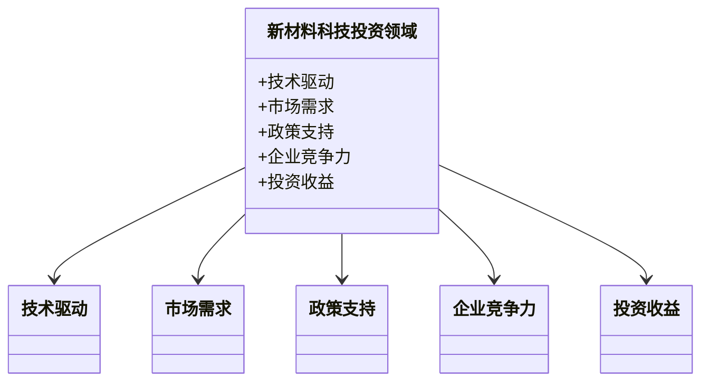
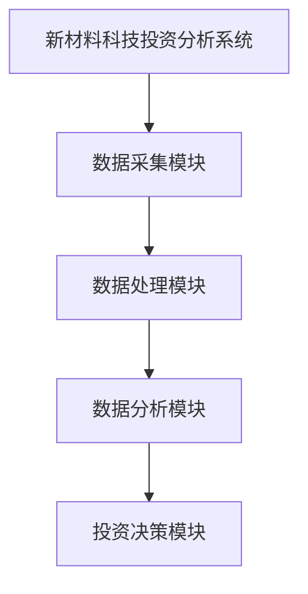

                 


# 价值投资中的新材料科技前景

> 关键词：价值投资、新材料科技、投资分析、市场趋势、风险控制

> 摘要：本文从价值投资的角度，深入分析新材料科技领域的投资前景。通过背景介绍、核心概念、算法原理、系统架构、项目实战等多维度展开，结合实际案例分析，探讨新材料科技投资中的机会与挑战，提供切实可行的投资策略和风险管理建议。

---

## 第一部分：新材料科技与价值投资的背景与趋势

### 第1章：新材料科技的基本概念与投资背景

#### 1.1 新材料科技的基本概念

##### 1.1.1 新材料的定义与分类
新材料是指具有高附加值、高性能、高技术含量的材料，主要包括以下几类：
- **先进陶瓷材料**：用于电子、航天等领域。
- **高性能复合材料**：如碳纤维复合材料，广泛应用于航空航天和高端制造业。
- **新型金属材料**：如高温合金、轻质合金，适用于高性能制造。
- **纳米材料**：具有独特的纳米尺度效应，应用于传感器、药物递送等领域。
- **生物材料**：用于医疗、生物技术等领域。

##### 1.1.2 新材料科技的发展历程
新材料科技的发展可以分为以下几个阶段：
1. **传统材料阶段**：20世纪初，以金属、陶瓷等基础材料为主。
2. **功能材料阶段**：20世纪中叶，发展出半导体材料、磁性材料等。
3. **纳米材料阶段**：21世纪初，纳米技术的应用推动了材料科学的革命。
4. **智能材料阶段**：近年来，智能材料（如形状记忆合金、自修复材料）逐渐成为研究热点。

##### 1.1.3 新材料科技对社会经济的影响
新材料科技的快速发展推动了多个行业的技术革新，例如：
- **新能源领域**：新型电池材料（如锂离子电池）推动了电动汽车的发展。
- **半导体领域**：高性能半导体材料（如氮化镓、碳化硅）是电子器件升级的核心。
- **医疗领域**：生物材料的应用推动了精准医疗和再生医学的发展。

#### 1.2 价值投资的基本原理

##### 1.2.1 价值投资的核心理念
价值投资的核心理念是寻找市场价格低于其内在价值的标的物。具体来说：
- **内在价值**：资产的真实价值，与市场情绪无关。
- **安全边际**：市场价格与内在价值的差距，提供投资的安全性。

##### 1.2.2 价值投资与成长投资的区别
| 对比维度 | 价值投资 | 成长投资 |
|----------|----------|----------|
| 投资目标 | 寻找价格低于价值的资产 | 寻找具有高增长潜力的公司 |
| 投资期限 | 长期持有，等待价值回归 | 短期收益为主，关注增长速度 |
| 风险偏好 | 低风险偏好，注重安全边际 | 高风险偏好，容忍波动 |

##### 1.2.3 新材料科技领域的价值投资适用性
新材料科技领域适合价值投资的原因：
- **技术驱动型增长**：新材料企业的发展往往依赖于技术创新。
- **高壁垒行业**：新材料的研发和生产具有较高的技术门槛，竞争较少。
- **长期增长潜力**：新材料在多个行业的广泛应用决定了其长期增长性。

---

## 第二部分：价值投资中的新材料科技分析框架

### 第2章：新材料科技企业的核心竞争力分析

#### 2.1 技术创新能力分析

##### 2.1.1 技术研发团队的构成
一个强大的研发团队是新材料企业成功的关键。团队构成包括：
- **核心科学家**：主导技术研发方向。
- **工程师团队**：负责技术的产业化和优化。
- **支持团队**：包括实验员、数据分析师等。

##### 2.1.2 技术储备与专利布局
企业的技术储备可以通过专利数量和质量来衡量。专利布局包括：
- **基础专利**：覆盖核心技术的各个方面。
- **应用专利**：针对具体应用场景的专利。

##### 2.1.3 技术的商业化潜力
技术的商业化潜力取决于：
- **市场需求**：技术是否满足当前市场需求。
- **成本结构**：技术是否具备规模化生产的成本优势。
- **竞争环境**：技术是否具备竞争优势。

#### 2.2 成本与供应链优势分析

##### 2.2.1 生产成本的构成与优化
生产成本包括原材料、人工、设备折旧等。优化措施包括：
- **原材料采购优化**：通过供应链管理降低成本。
- **工艺改进**：通过技术创新降低生产成本。

##### 2.2.2 供应链的稳定性和弹性
供应链管理包括：
- **供应商多元化**：避免单一供应商的风险。
- **库存管理**：通过 JIT（准时制）减少库存成本。
- **物流优化**：通过高效物流降低运输成本。

##### 2.2.3 规模效应与成本优势的关系
规模效应是新材料企业降低成本的重要途径：
- ** economies of scale**：随着产量增加，单位成本下降。
- **边际成本递减**：初期成本高，随着产量增加，边际成本逐渐降低。

### 第3章：新材料科技行业的市场分析与竞争格局

#### 3.1 行业市场规模与增长潜力

##### 3.1.1 全球市场规模分析
全球新材料市场规模近年来持续增长，预计到2030年将达到数万亿美元。主要驱动因素包括：
- **技术进步**：新材料的性能不断提升。
- **政策支持**：政府对新材料研发的资助增加。
- **市场需求**：多个行业对新材料的需求激增。

##### 3.1.2 中国市场规模分析
中国是全球最大的新材料市场之一，市场规模占比超过30%。主要原因包括：
- **制造业大国**：中国是全球最大的制造业国家，对新材料的需求旺盛。
- **政策支持**：中国政府将新材料列为战略新兴产业之一。
- **成本优势**：中国的劳动力和生产成本较低，吸引了很多新材料企业。

##### 3.1.3 行业增长驱动因素
新材料行业的增长主要由以下几个因素驱动：
- **技术创新**：新材料的性能不断提升，应用范围扩大。
- **政策支持**：政府对新材料研发和应用的资助增加。
- **市场需求**：多个行业对新材料的需求激增。

#### 3.2 行业竞争格局分析

##### 3.2.1 主要竞争对手分析
新材料行业的竞争格局较为分散，主要竞争对手包括：
- **国际巨头**：如陶氏化学、杜邦等。
- **国内龙头企业**：如中材科技、宝武集团等。
- **新兴企业**：一些初创企业专注于特定领域的新材料研发。

##### 3.2.2 市场集中度分析
新材料行业的市场集中度较低，主要原因是：
- **技术门槛高**：新材料的研发和生产需要大量投入，小型企业难以进入。
- **应用领域广**：新材料的应用范围广泛，不同领域的需求差异大，导致市场分散。
- **政策支持**：政府对新材料产业的政策支持，吸引了大量企业进入，导致市场竞争加剧。

---

## 第三部分：价值投资中的新材料科技投资策略与组合构建

### 第4章：投资策略与组合构建

#### 4.1 投资策略

##### 4.1.1 长期持有策略
长期持有是价值投资的核心策略。通过持有优质资产，等待其内在价值的实现。长期持有策略的优势在于：
- **复利效应**：长期持有可以享受复利增长。
- **价值回归**：市场价格最终会回归其内在价值。

##### 4.1.2 行业配置策略
行业配置是新材料科技投资的重要策略。通过合理配置不同行业的资产，可以降低投资风险。行业配置策略包括：
- **分散投资**：将资金分配到不同的行业，降低行业风险。
- **重点配置**：集中投资于增长潜力大的行业，如新能源材料、半导体材料等。

#### 4.2 风险控制与退出策略

##### 4.2.1 风险管理
新材料科技投资的风险主要包括：
- **技术风险**：技术失败或被替代的风险。
- **市场风险**：市场需求不足或价格波动的风险。
- **政策风险**：政策变化对行业的影响。

风险管理措施包括：
- **分散投资**：通过投资多个项目降低风险。
- **定期评估**：定期评估投资项目的风险，及时调整投资组合。
- **风险对冲**：通过金融衍生工具对冲部分风险。

##### 4.2.2 退出策略
退出策略是实现投资收益的重要环节。常见的退出策略包括：
- **公开市场退出**：通过IPO或股票出售退出。
- **并购退出**：通过被其他公司并购退出。
- **清算退出**：在企业清算时退出。

---

## 第四部分：新材料科技投资的案例分析与系统设计

### 第5章：案例分析

#### 5.1 新能源材料的投资机会

##### 5.1.1 锂离子电池材料
锂离子电池是新能源汽车的核心部件，其关键材料包括：
- **正极材料**：如钴酸锂、锰酸锂等。
- **负极材料**：如石墨、硅基材料等。
- **电解液**：由电解质和溶剂组成。

##### 5.1.2 投资机会与风险
投资锂离子电池材料的风险包括：
- **技术风险**：新材料的开发周期长，失败风险高。
- **市场风险**：市场需求波动大，价格波动剧烈。
- **政策风险**：政府政策的变化可能影响行业发展。

#### 5.2 半导体材料的投资机会

##### 5.2.1 半导体材料的种类
半导体材料主要包括：
- **硅基材料**：如单晶硅、多晶硅。
- **化合物半导体**：如氮化镓、碳化硅。

##### 5.2.2 投资机会与风险
半导体材料的投资机会主要在于其广泛的应用领域，如电子设备、通信设备等。风险包括：
- **技术风险**：新材料的研发难度大，周期长。
- **市场风险**：市场需求受宏观经济影响较大。
- **政策风险**：国际贸易摩擦可能影响半导体行业的发展。

---

## 第五部分：系统分析与架构设计

### 第6章：系统分析与架构设计

#### 6.1 系统功能设计

##### 6.1.1 领域模型
领域模型是系统分析的重要工具。以下是新材料科技投资领域的模型：



#### 6.2 系统架构设计

##### 6.2.1 系统架构
以下是新材料科技投资分析系统的架构图：



---

## 第六部分：项目实战与代码实现

### 第7章：项目实战

#### 7.1 环境安装

##### 7.1.1 安装Python
安装Python 3.8及以上版本，可以通过官网下载安装。

#### 7.2 代码实现

##### 7.2.1 数据分析代码
以下是Python代码示例：

```python
import pandas as pd
import numpy as np

# 模拟新材料科技企业的数据
data = {
    '公司名称': ['公司A', '公司B', '公司C'],
    '技术储备': [3, 2, 4],
    '市场需求': [4, 3, 2],
    '政策支持': [2, 3, 3],
    '投资收益': [5, 4, 6]
}

df = pd.DataFrame(data)
print(df)

# 计算综合得分
weights = [0.3, 0.3, 0.2, 0.2]
df['综合得分'] = np.dot(df[['技术储备', '市场需求', '政策支持', '投资收益']], weights)
print(df)
```

---

## 第七部分：风险管理与退出策略

### 第8章：风险管理与退出策略

#### 8.1 风险管理

##### 8.1.1 技术风险
技术风险是新材料科技投资的主要风险之一。应对措施包括：
- **加强技术研发**：通过持续的研发投入，降低技术失败的风险。
- **技术转移**：通过技术合作或技术转移，降低技术依赖风险。

##### 8.1.2 市场风险
市场需求的波动可能导致投资失败。应对措施包括：
- **市场调研**：通过深入的市场调研，了解市场需求的变化。
- **灵活调整**：根据市场需求变化，及时调整投资策略。

##### 8.1.3 政策风险
政策变化可能对新材料行业产生重大影响。应对措施包括：
- **政策跟踪**：密切关注政策变化，及时调整投资策略。
- **政策应对**：通过行业协会或政策咨询，降低政策风险。

#### 8.2 退出策略

##### 8.2.1 公开市场退出
公开市场退出是实现投资收益的重要方式。具体步骤包括：
1. **上市准备**：包括财务审计、法律合规等。
2. **上市申请**：向交易所提交上市申请。
3. **公开发行**：通过公开发行股票，实现退出。

##### 8.2.2 并购退出
并购退出是另一种重要的退出方式。具体步骤包括：
1. **寻找并购目标**：通过行业网络或中介寻找潜在的并购目标。
2. **尽职调查**：对目标公司进行详细调查，评估其价值。
3. **并购谈判**：与目标公司进行谈判，达成并购协议。

##### 8.2.3 清算退出
清算退出是最后的选择。具体步骤包括：
1. **资产评估**：对资产进行评估，确定其价值。
2. **清算程序**：按照法律程序进行清算，分配资产。

---

## 第八部分：未来展望与投资机会

### 第9章：未来展望

#### 9.1 新材料科技的未来趋势
新材料科技的未来发展趋势包括：
- **智能化材料**：如智能传感器、智能纺织品等。
- **绿色材料**：如可降解材料、环保材料。
- **多功能材料**：如同时具备多种功能的材料，如自清洁材料。

#### 9.2 价值投资的新机遇
价值投资在新材料科技领域将面临新的机遇，包括：
- **技术创新**：新材料的不断创新将带来新的投资机会。
- **市场扩展**：新材料的应用领域不断扩展，市场需求持续增长。
- **政策支持**：政府对新材料产业的政策支持将继续增加。

---

## 作者：AI天才研究院 & 禅与计算机程序设计艺术

---

以上是《价值投资中的新材料科技前景》的技术博客文章，涵盖了从背景分析到系统设计的各个方面，结合实际案例和代码实现，为读者提供了全面的视角和深入的分析。

