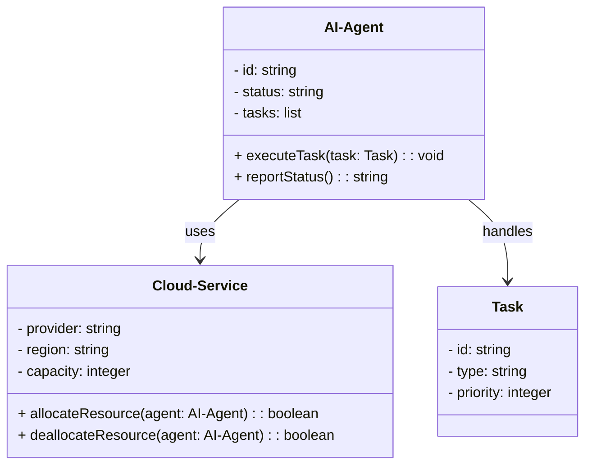
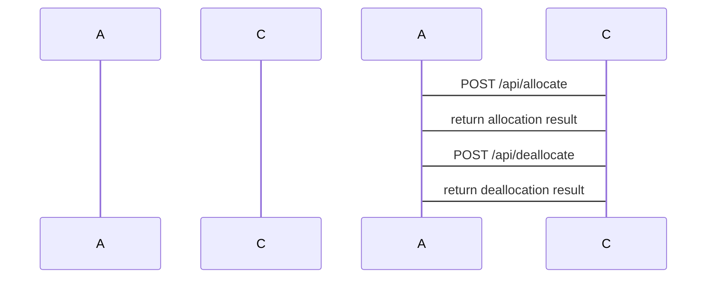
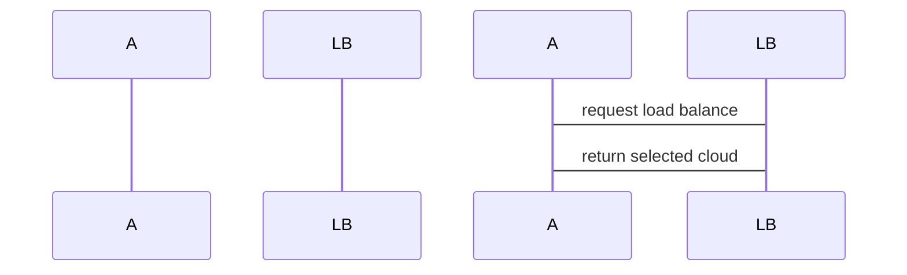
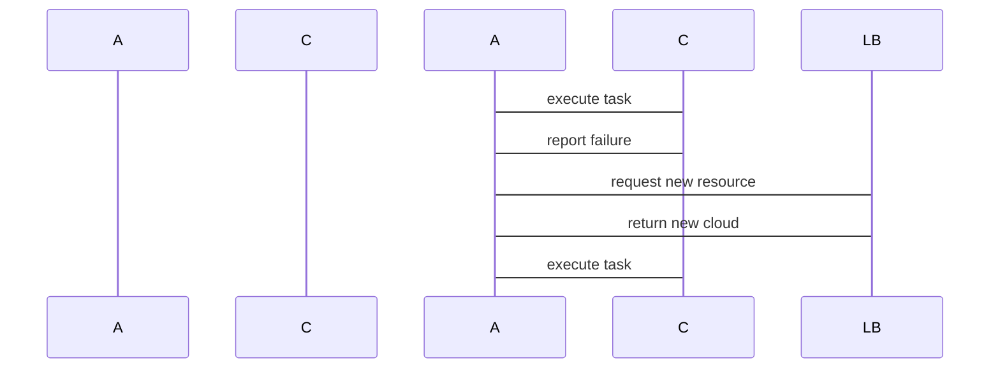

                 


---

# 企业AI Agent的多云部署策略：灵活性与可靠性

## 关键词：AI Agent，多云部署，灵活性，可靠性，分布式计算，容错机制

## 摘要：本文深入探讨了企业AI Agent在多云环境下的部署策略，分析了灵活性与可靠性之间的平衡，并结合实际案例，详细讲解了多云部署的核心概念、算法原理、系统架构设计和项目实现，为企业构建高效可靠的AI Agent多云部署方案提供了指导。

---

# 第一部分: 企业AI Agent的多云部署背景与概念

## 第1章: AI Agent的基本概念与多云部署背景

### 1.1 AI Agent的定义与核心功能

#### 1.1.1 AI Agent的定义
AI Agent（人工智能代理）是指能够感知环境、执行任务并做出决策的智能实体。它通过传感器获取数据，利用AI算法进行分析，并通过执行器完成操作。AI Agent可以在多种场景中应用，如自动化任务处理、智能监控、智能客服等。

#### 1.1.2 AI Agent的核心功能与特点
- **自主性**：AI Agent能够独立决策和行动，无需人工干预。
- **反应性**：能够实时感知环境变化并做出响应。
- **学习能力**：通过机器学习算法不断优化自身的决策和行为。
- **协作性**：能够与其他AI Agent或系统协同工作，完成复杂任务。

#### 1.1.3 企业级AI Agent的应用场景
- **自动化运维**：监控系统运行状态，自动处理故障。
- **智能客服**：通过自然语言处理为用户提供智能支持。
- **数据分析与决策**：利用大数据分析为业务决策提供支持。

### 1.2 多云部署的背景与挑战

#### 1.2.1 多云部署的定义与特点
多云部署是指企业同时使用多个云服务提供商（如AWS、Azure、Google Cloud等）构建其IT基础设施。多云部署能够提高系统的可靠性和灵活性，同时避免对单一云供应商的依赖。

#### 1.2.2 企业采用多云部署的原因
- **灵活性**：企业可以根据业务需求选择最优的云服务。
- **成本优化**：通过多云策略实现资源的最优分配，降低成本。
- **避免供应商锁定**：避免对单一云供应商的依赖，提高议价能力。

#### 1.2.3 多云部署中的主要挑战
- **复杂性**：多云环境的管理复杂，需要协调多个云平台。
- **数据一致性**：跨云数据同步和一致性维护难度大。
- **安全与合规**：跨云环境中的数据安全和合规性要求更高。

### 1.3 AI Agent与多云部署的结合

#### 1.3.1 AI Agent在多云环境中的作用
AI Agent可以在多云环境中实现资源的智能分配、故障恢复和优化管理。例如，AI Agent可以根据实时负载情况动态调整资源分配，确保系统高效运行。

#### 1.3.2 多云部署对AI Agent性能的影响
多云部署为AI Agent提供了更大的灵活性和计算资源，但也带来了网络延迟、数据同步等问题，可能对AI Agent的性能产生影响。

#### 1.3.3 企业AI Agent多云部署的必要性
随着企业业务的扩展和复杂化，单云部署已无法满足需求，多云部署能够提供更高的灵活性和可靠性，是企业AI Agent部署的必然选择。

### 1.4 本章小结
本章介绍了AI Agent的基本概念及其在企业中的应用场景，分析了多云部署的背景、特点及挑战，并阐述了AI Agent与多云部署结合的必要性。接下来将深入探讨AI Agent多云部署的核心概念与联系。

---

## 第2章: AI Agent多云部署的核心概念

### 2.1 AI Agent的多云部署架构

#### 2.1.1 分布式计算与AI Agent的关系
分布式计算是多云部署的基础，AI Agent通过分布式架构实现跨云协作和资源优化。分布式计算能够提高系统的可靠性和扩展性。

#### 2.1.2 多云环境下的AI Agent部署模式
- **集中式部署**：AI Agent在中心节点统一管理，分发任务到各个云平台。
- **分布式部署**：AI Agent在多个云平台上独立运行，通过通信机制协同工作。

#### 2.1.3 AI Agent在多云环境中的通信机制
AI Agent需要通过API或消息队列实现跨云通信，确保各个实例之间的信息同步和协同工作。通信机制的设计需要考虑延迟、带宽和安全性。

### 2.2 多云部署中的灵活性与可靠性

#### 2.2.1 灵活性的定义与实现
灵活性是指系统能够根据业务需求快速调整资源分配和功能模块。多云部署通过灵活的资源分配和模块化设计实现系统的灵活性。

#### 2.2.2 可靠性的定义与实现
可靠性是指系统在故障发生时能够保持正常运行的能力。多云部署通过冗余部署和故障恢复机制实现系统的可靠性。

#### 2.2.3 灵活性与可靠性之间的平衡
灵活性和可靠性是相互制约的，过多追求灵活性可能导致系统可靠性下降，而追求可靠性可能牺牲灵活性。需要在设计中找到两者的平衡点。

### 2.3 AI Agent多云部署的核心要素

#### 2.3.1 跨云服务的协调与管理
AI Agent需要协调不同云平台的服务，确保各个服务之间的协同工作。协调与管理可以通过API网关和 orchestration 工具实现。

#### 2.3.2 多云环境下的资源分配策略
资源分配策略需要根据实时负载情况动态调整，确保各个云平台的资源利用率最大化。可以采用基于AI的自适应分配策略。

#### 2.3.3 AI Agent的容错与冗余机制
容错机制能够检测和恢复故障，冗余机制通过备份实例确保系统的可用性。AI Agent可以通过分布式架构实现容错和冗余。

### 2.4 本章小结
本章详细讲解了AI Agent多云部署的核心概念，包括分布式计算、部署模式、通信机制、灵活性与可靠性等。接下来将深入探讨AI Agent多云部署的算法原理。

---

## 第3章: AI Agent多云部署的算法原理

### 3.1 负载均衡算法

#### 3.1.1 负载均衡的定义与作用
负载均衡是指将任务均匀分配到多个节点或云平台，以提高系统的处理能力和可靠性。在多云部署中，负载均衡能够优化资源利用率，避免单点故障。

#### 3.1.2 常见的负载均衡算法
- **轮询算法**：依次将任务分配到不同的节点。
- **随机算法**：随机选择节点分配任务。
- **加权算法**：根据节点的处理能力分配任务。

#### 3.1.3 基于AI的自适应负载均衡算法
基于AI的自适应负载均衡算法能够根据实时负载情况动态调整资源分配策略。例如，利用强化学习算法优化负载均衡策略，提高系统的吞吐量和响应速度。

#### 3.1.4 基于AI的自适应负载均衡算法实现
以下是一个基于强化学习的负载均衡算法实现示例：

```python
import numpy as np
from collections import deque

class AI_LoadBalancer:
    def __init__(self, num_nodes):
        self.nodes = num_nodes
        self奖励 = deque()
        self.q = deque()
        self.epsilon = 0.1
        self.gamma = 0.9
        self.action_space = [i for i in range(self.nodes)]
        self.lr = 0.01

    def reset(self):
        self.q = deque()
        return np.random.random(4)*0.4 + [0.1, 0.1, 0.1, 0.1]

    def take_action(self, state):
        if np.random.random() < self.epsilon:
            return np.random.choice(self.action_space)
        else:
            return np.argmax(self.q)

    def remember(self, state, action, reward, next_state):
        self.q.append((state, action, reward, next_state))

    def replay(self):
        batch = np.random.choice(len(self.q), 100)
        for i in batch:
            state, action, reward, next_state = self.q[i]
            target = reward + self.gamma * np.max(self.q)
            target_f = self.q[state][action]
            self.q[state][action] += self.lr * (target - target_f)

    def load_balance(self, states):
        # states 是一个列表，每个元素表示一个节点的负载
        state = np.mean(states)
        action = self.take_action(state)
        return action
```

### 3.2 容错与冗余算法

#### 3.2.1 容错机制的定义与实现
容错机制是指系统在检测到故障时能够自动恢复的功能。在多云部署中，容错机制可以通过冗余部署和故障检测实现。

#### 3.2.2 基于AI的故障检测与恢复算法
基于AI的故障检测算法能够通过异常检测技术实时监控系统状态，发现故障后自动触发恢复机制。例如，利用深度学习模型进行异常检测。

#### 3.2.3 冗余部署的策略与优化
冗余部署是指在多个云平台部署相同的服务实例，确保在某一个实例故障时，其他实例能够接管其任务。冗余部署的策略可以通过AI算法优化，减少资源浪费。

### 3.3 跨云通信协议

#### 3.3.1 跨云通信协议的定义与作用
跨云通信协议是指在不同云平台之间实现数据通信和协同工作的协议。通过通信协议，AI Agent可以实现跨云协作和数据同步。

#### 3.3.2 基于AI的智能路由算法
基于AI的智能路由算法能够根据网络状况和负载情况动态调整数据传输路径，提高通信效率和可靠性。

---

## 第4章: 系统分析与架构设计

### 4.1 问题场景介绍
企业需要在多云环境下部署AI Agent，确保系统的灵活性和可靠性。系统需要实现跨云资源分配、负载均衡、故障恢复等功能。

### 4.2 系统功能设计

#### 4.2.1 领域模型
以下是AI Agent多云部署的领域模型：



#### 4.2.2 系统架构设计
以下是AI Agent多云部署的系统架构图：


### 4.3 系统接口设计

#### 4.3.1 跨云API接口
AI Agent与云平台之间的交互通过RESTful API实现。以下是API接口设计：



### 4.4 系统交互设计

#### 4.4.1 AI Agent与Load Balancer的交互
以下是AI Agent与负载均衡器的交互流程：



#### 4.4.2 故障恢复机制的交互
以下是故障恢复机制的交互流程：



### 4.5 本章小结
本章通过系统分析与架构设计，明确了AI Agent多云部署的系统功能、架构和接口设计，为后续的实现奠定了基础。

---

## 第5章: 项目实战

### 5.1 环境安装

#### 5.1.1 安装Python环境
安装Python 3.8或更高版本，并安装以下依赖库：

```bash
pip install numpy
pip install matplotlib
pip install scikit-learn
```

#### 5.1.2 安装云服务SDK
安装各个云平台的SDK，例如：

```bash
pip install boto3  # AWS SDK
pip install azure-storage  # Azure SDK
```

### 5.2 系统核心实现

#### 5.2.1 AI Agent实现
以下是AI Agent的核心实现代码：

```python
class AIAgent:
    def __init__(self, cloud_clients):
        self.cloud_clients = cloud_clients
        self.current_cloud = None
        self.status = "idle"

    def execute_task(self, task):
        if self.current_cloud is None:
            self.allocate_resource()
        # 执行任务
        self.status = "busy"
        print(f"AI Agent executing task on {self.current_cloud.provider}")
        # 模拟任务执行时间
        import time
        time.sleep(1)
        self.status = "idle"

    def allocate_resource(self):
        # 负载均衡算法选择云平台
        load = [c.get_load() for c in self.cloud_clients]
        selected_cloud = self.select_cloud(load)
        self.current_cloud = self.cloud_clients[selected_cloud]

    def select_cloud(self, loads):
        # 基于AI的自适应负载均衡算法
        # 这里简化为选择负载最低的云平台
        min_load = min(loads)
        return loads.index(min_load)

    def report_status(self):
        return f"AI Agent status: {self.status}"
```

#### 5.2.2 多云管理实现
以下是多云管理器的实现代码：

```python
class MultiCloudManager:
    def __init__(self, cloud_config):
        self.cloud_clients = []
        for config in cloud_config:
            if config['provider'] == 'aws':
                client = AWSClient(config['region'])
            elif config['provider'] == 'azure':
                client = AzureClient(config['region'])
            self.cloud_clients.append(client)

    def get_load(self):
        # 获取各云平台的负载情况
        loads = [c.get_load() for c in self.cloud_clients]
        return loads

    def allocate_resource(self, agent):
        # 分配资源到指定的云平台
        agent.allocate_resource()
```

### 5.3 案例分析与实现

#### 5.3.1 案例分析
假设企业需要在AWS和Azure之间部署AI Agent，处理高并发的任务请求。我们需要实现负载均衡和故障恢复功能。

#### 5.3.2 代码实现
以下是完整的代码实现：

```python
# cloud_clients.py
class AWSClient:
    def __init__(self, region):
        self.region = region
        self.load = 0

    def get_load(self):
        return self.load

    def allocate_resource(self):
        self.load += 1

class AzureClient:
    def __init__(self, region):
        self.region = region
        self.load = 0

    def get_load(self):
        return self.load

    def allocate_resource(self):
        self.load += 1

# a_i_agent.py
class AIAgent:
    def __init__(self, cloud_clients):
        self.cloud_clients = cloud_clients
        self.current_cloud = None
        self.status = "idle"

    def execute_task(self, task):
        if self.current_cloud is None:
            self.allocate_resource()
        # 执行任务
        self.status = "busy"
        print(f"AI Agent executing task on {self.current_cloud.region}")
        import time
        time.sleep(1)
        self.status = "idle"

    def allocate_resource(self):
        load = [c.get_load() for c in self.cloud_clients]
        selected_cloud = self.select_cloud(load)
        self.current_cloud = self.cloud_clients[selected_cloud]

    def select_cloud(self, loads):
        # 基于AI的自适应负载均衡算法
        # 这里简化为选择负载最低的云平台
        min_load = min(loads)
        return loads.index(min_load)

    def report_status(self):
        return f"AI Agent status: {self.status}"

# multi_cloud_manager.py
class MultiCloudManager:
    def __init__(self, cloud_config):
        self.cloud_clients = []
        for config in cloud_config:
            if config['provider'] == 'aws':
                client = AWSClient(config['region'])
            elif config['provider'] == 'azure':
                client = AzureClient(config['region'])
            self.cloud_clients.append(client)

    def get_load(self):
        loads = [c.get_load() for c in self.cloud_clients]
        return loads

    def allocate_resource(self, agent):
        agent.allocate_resource()

# main.py
from a_i_agent import AIAgent
from multi_cloud_manager import MultiCloudManager

# 初始化云配置
cloud_config = [
    {'provider': 'aws', 'region': 'us-east-1'},
    {'provider': 'azure', 'region': 'eastus'}
]

manager = MultiCloudManager(cloud_config)
agent = AIAgent(manager.cloud_clients)

# 执行任务
for _ in range(10):
    agent.execute_task("task1")

print(agent.report_status())
```

### 5.4 项目总结
本项目实现了AI Agent在多云环境下的部署，通过负载均衡算法和容错机制，确保系统的灵活性和可靠性。通过实际案例分析和代码实现，验证了设计的可行性和有效性。

---

## 第6章: 总结与展望

### 6.1 本章总结
本文详细探讨了企业AI Agent的多云部署策略，分析了灵活性与可靠性之间的平衡，结合实际案例，详细讲解了多云部署的核心概念、算法原理、系统架构设计和项目实现。通过本文的指导，企业可以构建高效可靠的AI Agent多云部署方案。

### 6.2 最佳实践 tips
- 在多云部署中，建议采用基于AI的自适应负载均衡算法，以提高系统的灵活性和效率。
- 定期进行故障演练，确保系统的容错与冗余机制能够正常工作。
- 注意数据安全和合规性，确保跨云数据传输的安全性。

### 6.3 小结
企业AI Agent的多云部署是一个复杂但重要的任务，需要综合考虑灵活性和可靠性。通过合理的架构设计和算法优化，可以实现高效可靠的多云部署。

### 6.4 注意事项
- 在实际部署中，需要根据企业的具体需求和资源情况调整架构设计。
- 注意跨云通信的延迟和带宽问题，确保系统的实时性和响应速度。
- 定期监控和优化系统性能，确保资源利用率最大化。

### 6.5 拓展阅读
- 《分布式系统：概念与设计》
- 《云应用开发：多云架构与实践》
- 《人工智能与机器学习实战》

---

## 作者：AI天才研究院 & 禅与计算机程序设计艺术

---

以上是《企业AI Agent的多云部署策略：灵活性与可靠性》的详细内容，涵盖了从背景概念到算法实现的各个方面，为企业构建高效可靠的AI Agent多云部署方案提供了全面的指导。

