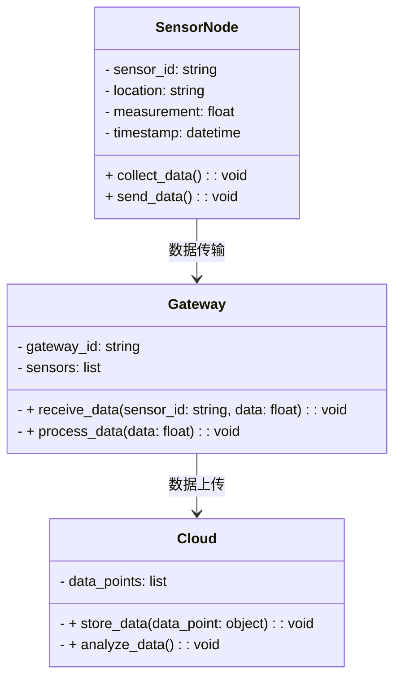
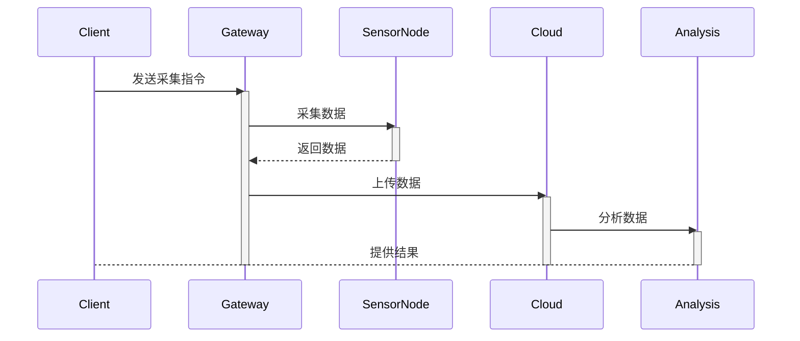

                 


# 巴菲特-芒格的量子传感网络投资：物联网的量子飞跃

## 关键词：巴菲特，芒格，量子传感网络，物联网，投资策略，技术应用

## 摘要：本文深入探讨了巴菲特和芒格的投资理念与量子传感网络技术的结合，分析了量子传感网络在物联网中的应用潜力，详细阐述了相关技术原理、系统架构设计、项目实战案例以及未来投资机会，为读者提供了全面的技术与投资视角。

---

## 第一部分：巴菲特-芒格投资理念与量子传感网络概述

### 第1章：巴菲特-芒格投资理念与量子传感网络概述

#### 1.1 巴菲特-芒格投资理念的核心思想

##### 1.1.1 巴菲特的价值投资理论
- **长期主义**：巴菲特强调长期投资，寻找具有持续竞争优势的企业。
- **安全边际**：投资时留出安全边际，避免过度承担风险。
- **价值投资**：关注企业的内在价值，而非市场波动。

##### 1.1.2 芒格的多元思维模型
- 芒格提倡建立跨学科的思维模型，以更好地理解复杂问题。
- 强调“反人性”的思考方式，避免从众和贪婪。

##### 1.1.3 投资中的长期主义与风险管理
- 长期投资需要对行业趋势和技术演变有深刻理解。
- 风险管理是投资成功的关键，需在决策中充分考虑潜在风险。

#### 1.2 量子传感网络的基本概念

##### 1.2.1 量子传感的定义与特点
- **量子传感**：利用量子力学原理进行测量的技术。
- **特点**：高灵敏度、高精度、抗干扰能力强。

##### 1.2.2 物联网的定义与架构
- **物联网**：通过互联网连接物理设备，实现数据的采集、传输和处理。
- **架构**：感知层、网络层、应用层。

##### 1.2.3 量子传感网络与物联网的结合
- **结合点**：量子传感提供更精确的数据采集能力，物联网提供数据传输和处理能力。

#### 1.3 巴菲特-芒格投资理念与量子传感网络的结合
- **技术趋势分析**：关注量子传感技术的市场潜力和行业趋势。
- **投资价值评估**：分析量子传感网络企业的财务状况和竞争优势。

#### 1.4 本章小结
本章介绍了巴菲特和芒格的投资理念，以及量子传感网络和物联网的基本概念，为后续分析奠定了基础。

---

## 第二部分：量子传感网络的技术基础

### 第2章：量子传感网络的技术基础

#### 2.1 量子传感的基本原理

##### 2.1.1 量子力学基础
- **波函数**：描述量子系统的状态。
- **测不准原理**：无法同时精确测量粒子的位置和动量。

##### 2.1.2 量子传感的物理机制
- **纠缠态**：用于量子通信和传感。
- **量子干涉**：用于提高测量精度。

##### 2.1.3 量子传感的关键技术
- **量子位（qubit）**：量子计算的基本单位。
- **量子传感器**：基于量子效应的传感器。

#### 2.2 物联网的架构与关键技术

##### 2.2.1 物联网的分层架构
- **感知层**：传感器采集数据。
- **网络层**：数据传输。
- **应用层**：数据处理和应用。

##### 2.2.2 传感器网络的构建
- **传感器节点**：包含传感器、数据处理单元和通信模块。
- **网络拓扑**：星型、树型、网状结构。

##### 2.2.3 数据传输与处理技术
- **通信协议**：MQTT、HTTP、CoAP。
- **数据处理**：边缘计算和云计算。

#### 2.3 量子传感网络与物联网的融合

##### 2.3.1 量子传感在物联网中的应用
- **智慧城市**：环境监测、交通管理。
- **医疗**：远程监测、精准诊断。

##### 2.3.2 量子传感网络的优势与挑战
- **优势**：高精度、抗干扰。
- **挑战**：技术复杂性、成本高。

##### 2.3.3 量子传感网络的未来发展趋势
- **技术突破**：提高测量精度和稳定性。
- **成本下降**：规模化生产降低价格。

#### 2.4 本章小结
本章详细讲解了量子传感网络的技术基础，分析了其在物联网中的应用潜力。

---

## 第三部分：巴菲特-芒格投资策略与量子传感网络分析

### 第3章：巴菲特-芒格投资策略与量子传感网络分析

#### 3.1 巴菲特-芒格投资策略的核心要素

##### 3.1.1 企业护城河的识别
- **技术壁垒**：量子传感技术的专利和研发能力。
- **市场占有率**：企业在市场中的地位。

##### 3.1.2 企业的财务健康状况
- **盈利能力**：ROE、净利润率。
- **资产负债表**：资产质量、负债结构。

##### 3.1.3 行业的长期发展趋势
- **技术进步**：量子传感技术的演进。
- **市场需求**：物联网应用的扩张。

#### 3.2 量子传感网络的投资价值分析

##### 3.2.1 量子传感网络的市场潜力
- **市场规模**：预计年增长率。
- **应用场景**：智慧城市、医疗、工业。

##### 3.2.2 量子传感网络的技术壁垒
- **专利数量**：企业拥有的技术专利。
- **研发投入**：企业的研发支出。

##### 3.2.3 量子传感网络的商业模式
- **硬件销售**：传感器设备销售。
- **服务模式**：提供数据处理和分析服务。

#### 3.3 巴菲特-芒格投资策略在量子传感网络中的应用

##### 3.3.1 长期价值投资的实践
- **选择具有长期增长潜力的企业**。
- **关注企业的技术壁垒和市场地位**。

##### 3.3.2 风险管理与安全边际的构建
- **评估企业的财务健康状况**。
- **留出安全边际，避免过度投资**。

##### 3.3.3 多元思维模型的运用
- **跨学科分析**：结合技术、市场、财务等多个维度。
- **避免从众心理**：独立思考，寻找低估的投资机会。

#### 3.4 本章小结
本章分析了巴菲特和芒格的投资策略，并探讨了其在量子传感网络投资中的应用。

---

## 第四部分：量子传感网络在物联网中的应用案例

### 第4章：量子传感网络在物联网中的应用案例

#### 4.1 智慧城市中的量子传感网络应用

##### 4.1.1 智慧交通中的量子传感技术
- **实时监测**：交通流量、车辆位置。
- **优化信号灯控制**：提高交通效率。

##### 4.1.2 环境监测中的量子传感应用
- **空气质量检测**：PM2.5、NO2等污染物的监测。
- **气候变化研究**：长期数据采集与分析。

##### 4.1.3 城市安全中的量子传感网络
- **地震监测**：实时监测地壳活动。
- **火灾预警**：通过传感器快速检测火源。

#### 4.2 医疗健康中的量子传感网络应用

##### 4.2.1 远程医疗中的量子传感技术
- **患者监测**：心率、血压、体温的实时监测。
- **远程诊断**：医生通过数据进行诊断。

##### 4.2.2 精准医疗中的量子传感应用
- **基因检测**：高精度的基因测序。
- **疾病预测**：基于数据的疾病风险评估。

#### 4.3 工业应用中的量子传感网络

##### 4.3.1 智能制造中的量子传感技术
- **设备状态监测**：预测设备故障，减少停机时间。
- **质量控制**：实时监测生产过程中的参数。

##### 4.3.2 能源管理中的量子传感应用
- **能源消耗监测**：实时监测企业能源使用情况。
- **优化能源分配**：通过数据优化能源使用效率。

#### 4.4 本章小结
本章通过具体案例展示了量子传感网络在物联网中的广泛应用，突出了其在智慧城市、医疗和工业领域的潜力。

---

## 第五部分：系统分析与架构设计方案

### 第5章：量子传感网络系统的分析与架构设计

#### 5.1 项目介绍

##### 5.1.1 项目背景
- **目标**：构建一个基于量子传感技术的物联网系统。
- **应用场景**：智慧城市中的环境监测。

#### 5.2 系统功能设计

##### 5.2.1 领域模型（Mermaid 类图）


#### 5.3 系统架构设计

##### 5.3.1 系统架构图（Mermaid 架构图）


#### 5.4 系统接口设计

##### 5.4.1 接口描述
- **传感器节点接口**：采集数据并发送到网关。
- **网关接口**：接收传感器数据，处理后上传到云端。
- **云端接口**：存储数据，提供分析结果。

#### 5.5 系统交互流程（Mermaid 序列图）


#### 5.6 本章小结
本章详细设计了量子传感网络系统的架构，并展示了系统的交互流程。

---

## 第六部分：项目实战

### 第6章：量子传感网络项目的实战

#### 6.1 环境安装

##### 6.1.1 系统需求
- **硬件**：量子传感器、网关、云端服务器。
- **软件**：Python编程语言，MQTT协议支持。

##### 6.1.2 安装步骤
1. 安装Python和必要的库（如paho-mqtt）。
2. 配置MQTT代理（如Mosquitto）。
3. 部署云平台（如AWS IoT Core）。

#### 6.2 核心代码实现

##### 6.2.1 传感器节点代码（Python）
```python
import paho.mqtt.client as mqtt

def on_connect(client, userdata, rc):
    print("连接到MQTT代理")

def on_publish(client, userdata, mid):
    print("数据已发布")

client = mqtt.Client()
client.on_connect = on_connect
client.on_publish = on_publish

client.connect("localhost", 1883, 60)
client.publish("sensor/data", "temperature=25.5", 0)
client.loop_forever()
```

##### 6.2.2 网关代码（Python）
```python
import paho.mqtt.client as mqtt

def on_message(client, userdata, msg):
    print("接收数据：", msg.payload.decode())
    # 处理数据后上传到云端

client = mqtt.Client()
client.on_message = on_message
client.connect("localhost", 1883, 60)
client.subscribe("sensor/data", 0)
client.loop_forever()
```

##### 6.2.3 云端代码（Python）
```python
import paho.mqtt.client as mqtt
import json

def on_message(client, userdata, msg):
    data = json.loads(msg.payload.decode())
    print("云端接收数据：", data)
    # 数据存储与分析

client = mqtt.Client()
client.on_message = on_message
client.connect("localhost", 1883, 60)
client.subscribe("gateway/data", 0)
client.loop_forever()
```

#### 6.3 代码应用解读与分析

##### 6.3.1 传感器节点
- **功能**：采集数据并通过MQTT协议发送。
- **实现细节**：使用paho-mqtt库连接代理，发布测量数据。

##### 6.3.2 网关节点
- **功能**：接收传感器数据，处理后上传到云端。
- **实现细节**：订阅传感器主题，处理数据后发布到云端主题。

##### 6.3.3 云端节点
- **功能**：接收网关数据，进行存储和分析。
- **实现细节**：使用JSON格式存储数据，进行数据分析。

#### 6.4 实际案例分析

##### 6.4.1 案例背景
- **目标**：监测城市空气质量。
- **传感器**：部署在多个地点的空气质量传感器。

##### 6.4.2 数据分析
- **处理步骤**：数据清洗、特征提取、模型训练。
- **结果展示**：生成空气质量报告，提供给相关部门。

#### 6.5 本章小结
本章通过实战项目展示了量子传感网络的实现过程，包括环境安装、代码实现和案例分析。

---

## 第七部分：总结与展望

### 第7章：总结与展望

#### 7.1 量子传感网络的未来发展趋势

##### 7.1.1 技术突破
- **量子传感器的灵敏度和稳定性提升**。
- **量子通信技术的发展**。

##### 7.1.2 市场应用
- **智慧城市**：更广泛的应用。
- **医疗健康**：更精准的诊断。

##### 7.1.3 投资机会
- **技术创新型企业**：具有长期增长潜力。
- **跨界合作**：技术与资本的结合。

#### 7.2 巴菲特-芒格投资理念的启示

##### 7.2.1 长期主义的重要性
- **技术进步需要时间**，需耐心等待。
- **投资需注重企业的长期价值**。

##### 7.2.2 风险管理的必要性
- **技术失败的风险**：需评估企业的技术实力。
- **市场需求的不确定性**：需关注行业趋势。

#### 7.3 投资与技术的结合

##### 7.3.1 多元思维模型的应用
- **技术分析**：量子传感网络的技术可行性。
- **市场分析**：物联网市场的规模和增长潜力。
- **财务分析**：企业的盈利能力和财务健康状况。

##### 7.3.2 投资中的风险管理
- **分散投资**：降低单一项目的风险。
- **持续学习**：保持对技术和市场的敏感性。

#### 7.4 本章小结
本章总结了量子传感网络的投资机会，并提出了未来的发展方向。

---

## 作者：AI天才研究院 & 禅与计算机程序设计艺术

---

以上是《巴菲特-芒格的量子传感网络投资：物联网的量子飞跃》的技术博客文章的完整目录和内容框架，涵盖了从投资理念、技术基础、系统设计到项目实战的各个方面，旨在为读者提供一个全面的视角，帮助他们理解量子传感网络的投资价值和技术应用。

