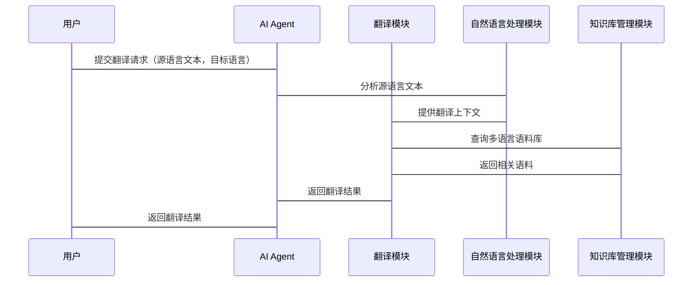

                 


# 开发具有多语言翻译能力的AI Agent

## 关键词：AI Agent，多语言翻译，自然语言处理，神经机器翻译，深度学习

## 摘要：本文详细探讨了开发具有多语言翻译能力的AI Agent的核心概念、技术原理和系统架构。从多语言翻译的挑战到AI Agent的设计与实现，文章通过理论分析和实践案例，系统性地介绍了如何构建一个高效、准确的多语言翻译AI Agent。内容涵盖神经机器翻译模型、多语言模型训练方法、系统架构设计以及项目实战，帮助读者全面理解并掌握相关技术。

---

# 第1章: 多语言翻译AI Agent概述

## 1.1 多语言翻译的挑战与需求

### 1.1.1 多语言翻译的核心问题
多语言翻译的目标是将一种语言的文本准确地转化为另一种语言，同时保持原文的意思和语境。核心挑战包括：
- **语义理解**：不同语言之间的语义可能不同，尤其是在文化差异较大的情况下。
- **语法结构**：不同语言的语法结构差异可能导致翻译后的文本不符合目标语言的表达习惯。
- **上下文理解**：翻译需要考虑上下文，例如俚语、隐喻等。

### 1.1.2 全球化背景下多语言翻译的重要性
随着全球化的发展，跨国交流越来越频繁。在商业、教育、医疗等领域，多语言翻译的需求日益增长。AI Agent可以通过自动化翻译技术，提高交流效率，减少误解。

### 1.1.3 AI Agent在多语言翻译中的优势
AI Agent可以实时处理多语言翻译请求，具有以下优势：
- **高效性**：AI Agent可以在短时间内处理大量的翻译请求。
- **准确性**：通过深度学习模型，AI Agent可以提高翻译的准确性。
- **智能化**：AI Agent可以根据上下文进行智能调整，提供更准确的翻译结果。

## 1.2 AI Agent的基本概念与特点

### 1.2.1 AI Agent的定义与分类
AI Agent是一种智能代理，能够感知环境并采取行动以实现目标。根据功能，AI Agent可以分为：
- **反应式AI Agent**：根据当前输入做出反应。
- **基于模型的AI Agent**：基于内部模型进行推理和决策。

### 1.2.2 AI Agent的核心能力
AI Agent的核心能力包括：
- **感知能力**：通过传感器或数据输入感知环境。
- **推理能力**：基于感知的信息进行推理和决策。
- **学习能力**：通过机器学习算法不断优化自身的性能。

### 1.2.3 多语言翻译AI Agent的独特性
多语言翻译AI Agent结合了自然语言处理和机器翻译技术，能够实现多种语言之间的实时翻译。其独特性体现在：
- **多语言支持**：支持多种语言的翻译。
- **上下文理解**：能够根据上下文进行智能翻译。
- **实时性**：能够在短时间内完成翻译任务。

## 1.3 多语言翻译AI Agent的应用场景

### 1.3.1 跨语言沟通与协作
在跨国团队协作中，AI Agent可以帮助团队成员进行实时翻译，促进沟通与协作。

### 1.3.2 全球化内容生成与管理
在内容生成和管理方面，AI Agent可以自动将内容翻译成多种语言，帮助内容分发到不同地区的用户。

### 1.3.3 实时多语言交互支持
在实时交互中，AI Agent可以为用户提供实时翻译服务，例如在视频会议中实时翻译对话内容。

## 1.4 本章小结
本章介绍了多语言翻译AI Agent的背景、挑战、优势及其应用场景。通过这些内容，读者可以理解为什么开发一个多语言翻译AI Agent是必要且重要的。

---

# 第2章: 多语言翻译AI Agent的核心概念与技术原理

## 2.1 多语言翻译的实现原理

### 2.1.1 语言模型的基本原理
语言模型用于预测文本中的下一个词，常见的语言模型包括n-gram模型和基于神经网络的语言模型（如BERT）。

### 2.1.2 翻译模型的工作机制
翻译模型将源语言的文本转换为目标语言的文本。常见的翻译模型包括基于规则的翻译模型和神经机器翻译模型。

### 2.1.3 多语言模型的训练策略
多语言模型的训练策略包括：
- **多任务学习**：在多个任务上同时训练模型，共享参数。
- **跨语言迁移学习**：利用一种语言的模型参数，迁移学习到其他语言。
- **多语言词表与句法分析**：使用共享的词表和句法分析器处理多种语言。

## 2.2 AI Agent的智能决策机制

### 2.2.1 知识表示与推理
知识表示是将知识以某种形式存储，推理是基于知识进行逻辑推理。

### 2.2.2 意图识别与理解
意图识别是通过分析用户的输入，识别用户的意图。例如，用户输入“我需要翻译一份文档”，意图是“请求翻译”。

### 2.2.3 自然语言生成
自然语言生成是将结构化的信息转换为自然语言文本。

## 2.3 多语言翻译与AI Agent的结合

### 2.3.1 翻译准确性与上下文理解
通过上下文理解，AI Agent可以更好地处理翻译中的歧义。

### 2.3.2 多语言语料库的构建
多语言语料库是训练翻译模型的基础，包含多种语言的平行文本。

### 2.3.3 AI Agent的自适应能力
AI Agent可以通过在线学习不断优化翻译质量，适应不同用户的需求。

## 2.4 本章小结
本章详细介绍了多语言翻译的实现原理和AI Agent的智能决策机制，探讨了如何将多语言翻译与AI Agent结合起来，提高翻译的准确性和智能性。

---

# 第3章: 多语言翻译AI Agent的算法原理

## 3.1 神经机器翻译模型

### 3.1.1 神经机器翻译的基本结构
神经机器翻译模型通常包括编码器和解码器两部分，编码器将源语言文本编码为向量，解码器将向量解码为目标语言文本。

### 3.1.2 序列到序列模型
序列到序列模型是一种常用的神经机器翻译模型，包括编码器和解码器，通常使用循环神经网络（RNN）或变换器（Transformer）实现。

### 3.1.3 注意力机制的引入
注意力机制通过计算源语言文本中每个词对目标语言词的重要性，提高翻译的准确性。

## 3.2 多语言模型的训练方法

### 3.2.1 多任务学习
多任务学习通过在多个任务上同时训练模型，共享参数，提高模型的泛化能力。

### 3.2.2 跨语言迁移学习
跨语言迁移学习通过利用一种语言的模型参数，迁移学习到其他语言，减少数据需求。

### 3.2.3 多语言词表与句法分析
多语言词表和句法分析器可以同时处理多种语言，提高模型的多语言处理能力。

## 3.3 AI Agent的决策算法

### 3.3.1 基于规则的决策树
基于规则的决策树通过预定义的规则进行决策，适用于规则明确的场景。

### 3.3.2 基于概率的马尔可夫链
基于概率的马尔可夫链通过计算状态转移概率进行决策。

### 3.3.3 基于深度学习的端到端决策
端到端决策通过深度学习模型直接从输入到输出，无需预定义规则。

## 3.4 算法实现的数学模型

### 3.4.1 神经网络的数学表示
神经网络的数学表示通常包括权重矩阵、激活函数和损失函数。

### 3.4.2 注意力机制的公式推导
注意力机制的公式通常包括查询、键和值的计算，以及注意力权重的计算。

### 3.4.3 损失函数与优化算法
常用的损失函数包括交叉熵损失函数，优化算法包括随机梯度下降（SGD）和Adam优化器。

## 3.5 本章小结
本章详细介绍了神经机器翻译模型、多语言模型的训练方法和AI Agent的决策算法，探讨了如何通过数学模型和算法优化提高翻译的准确性和智能性。

---

# 第4章: 多语言翻译AI Agent的系统架构设计

## 4.1 系统功能模块划分

### 4.1.1 自然语言处理模块
自然语言处理模块负责理解和生成自然语言文本，包括分词、句法分析和语义理解。

### 4.1.2 翻译模块
翻译模块负责将源语言文本翻译为目标语言文本，包括语言模型和翻译模型。

### 4.1.3 知识库管理模块
知识库管理模块负责管理和更新知识库，包括多语言语料库和领域知识库。

## 4.2 系统架构设计

### 4.2.1 分层架构设计
分层架构将系统划分为数据层、业务逻辑层和表现层，每层之间通过接口通信。

### 4.2.2 微服务架构设计
微服务架构将系统功能模块化为多个独立的服务，每个服务负责特定的功能，通过API进行通信。

### 4.2.3 系统交互设计
系统交互设计通过用户界面或API与用户进行交互，接收输入并返回翻译结果。

## 4.3 系统接口设计

### 4.3.1 输入接口
输入接口负责接收源语言文本和目标语言，例如通过HTTP API接收请求。

### 4.3.2 输出接口
输出接口负责返回翻译结果，例如通过HTTP响应返回翻译后的文本。

## 4.4 系统交互mermaid序列图



## 4.5 本章小结
本章详细介绍了多语言翻译AI Agent的系统功能模块划分、架构设计和接口设计，探讨了如何通过合理的系统架构设计提高翻译的准确性和效率。

---

# 第5章: 多语言翻译AI Agent的项目实战

## 5.1 环境配置

### 5.1.1 安装Python和深度学习框架
安装Python和TensorFlow或PyTorch等深度学习框架。

### 5.1.2 安装NLP库
安装分词库如jieba，句法分析库如spaCy，翻译库如transformers。

### 5.1.3 下载多语言语料库
下载多语言平行文本，如WMT数据集。

## 5.2 核心实现代码

### 5.2.1 模型训练代码
```python
import tensorflow as tf
from tensorflow.keras import layers

# 定义编码器
def encoder(input_shape, vocab_size, embedding_dim, hidden_dim):
    encoder_input = layers.Input(shape=input_shape)
    encoder_embedding = layers.Embedding(vocab_size, embedding_dim)(encoder_input)
    encoder_output, state = layers.LSTM(hidden_dim, return_state=True)(encoder_embedding)
    return encoder_output, state

# 定义解码器
def decoder(output_shape, vocab_size, embedding_dim, hidden_dim):
    decoder_input = layers.Input(shape=output_shape)
    decoder_embedding = layers.Embedding(vocab_size, embedding_dim)(decoder_input)
    decoder_output, state = layers.LSTM(hidden_dim, return_state=True)(decoder_embedding)
    decoder Dense = layers.Dense(vocab_size, activation='softmax')(decoder_output)
    return decoder_output, state

# 定义整个模型
def create_model(source_vocab_size, target_vocab_size, source_max_length, target_max_length):
    encoder_output, encoder_state = encoder((source_max_length, ), source_vocab_size, embedding_dim, hidden_dim)
    decoder_output, _ = decoder((target_max_length, ), target_vocab_size, embedding_dim, hidden_dim)
    model = Model(inputs=encoder_input, outputs=decoder_output)
    return model
```

### 5.2.2 翻译函数
```python
def translate(model, source_text, source_tokenizer, target_tokenizer, max_length):
    source_sequence = source_tokenizer.texts_to_sequences(source_text)
    source_sequence = tf.keras.preprocessing.sequence.pad_sequences(source_sequence, maxlen=max_length, padding='post')
    prediction = model.predict(source_sequence)
    target_sequence = np.argmax(prediction, axis=-1)
    target_text = target_tokenizer.sequences_to_texts(target_sequence)
    return target_text
```

## 5.3 代码解读与分析

### 5.3.1 模型训练代码解读
- **编码器**：将源语言文本编码为向量，使用LSTM层处理序列数据。
- **解码器**：将编码向量解码为目标语言文本，使用LSTM层和 Dense层输出概率分布。

### 5.3.2 翻译函数解读
- **源语言文本转换**：将源语言文本转换为序列，并填充到固定长度。
- **模型预测**：使用训练好的模型进行预测，得到目标语言的词分布。
- **目标语言生成**：根据预测结果生成目标语言文本。

## 5.4 实际案例分析

### 5.4.1 案例背景
假设我们有一个中英翻译任务，需要将中文文本“你好，今天天气怎么样？”翻译成英文。

### 5.4.2 案例实现
```python
source_text = "你好，今天天气怎么样？"
source_tokenizer = ...
target_tokenizer = ...
max_length = 10
translated = translate(model, source_text, source_tokenizer, target_tokenizer, max_length)
print(translated)
```

### 5.4.3 预期结果
```python
预期输出：Hello, how is the weather today?
```

## 5.5 测试与优化

### 5.5.1 模型测试
测试模型的翻译准确率和速度，例如计算BLEU分数。

### 5.5.2 模型优化
优化模型参数，例如调整隐藏层维度、优化学习率等。

## 5.6 本章小结
本章通过实际案例，详细介绍了多语言翻译AI Agent的环境配置、核心实现代码、代码解读与分析，以及测试与优化过程，帮助读者掌握如何实现一个多语言翻译AI Agent。

---

# 第6章: 总结与展望

## 6.1 总结
本文详细介绍了多语言翻译AI Agent的开发背景、核心概念、技术原理和系统架构设计，并通过实际案例展示了如何实现一个多语言翻译AI Agent。通过本文，读者可以全面理解多语言翻译AI Agent的开发过程。

## 6.2 未来展望
未来，多语言翻译AI Agent可以在以下几个方面进行优化和扩展：
- **模型优化**：通过引入更先进的深度学习模型，如更大规模的预训练模型，提高翻译的准确性。
- **多模态翻译**：结合视觉信息，实现多模态翻译，例如将图像描述翻译成多种语言。
- **实时性优化**：通过优化算法和硬件配置，提高翻译的实时性。

## 6.3 最佳实践 Tips

### 6.3.1 数据质量
确保训练数据的质量，包括数据的多样性和代表性。

### 6.3.2 模型优化
通过交叉验证和超参数调优，优化模型性能。

### 6.3.3 系统维护
定期更新模型和语料库，保持系统的准确性和实用性。

## 6.4 本章小结
本章总结了本文的主要内容，并展望了未来的发展方向，同时提供了一些最佳实践的建议。

---

# 作者：AI天才研究院/AI Genius Institute & 禅与计算机程序设计艺术 /Zen And The Art of Computer Programming

---

**注意**：以上内容是根据用户提供的需求逐步思考和撰写的结果，可能需要根据实际情况进行调整和补充。

