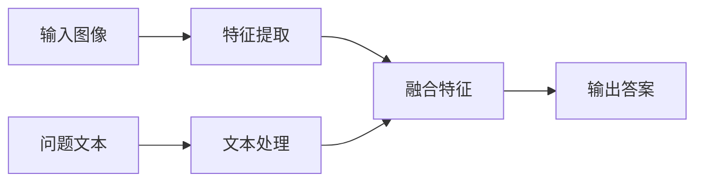
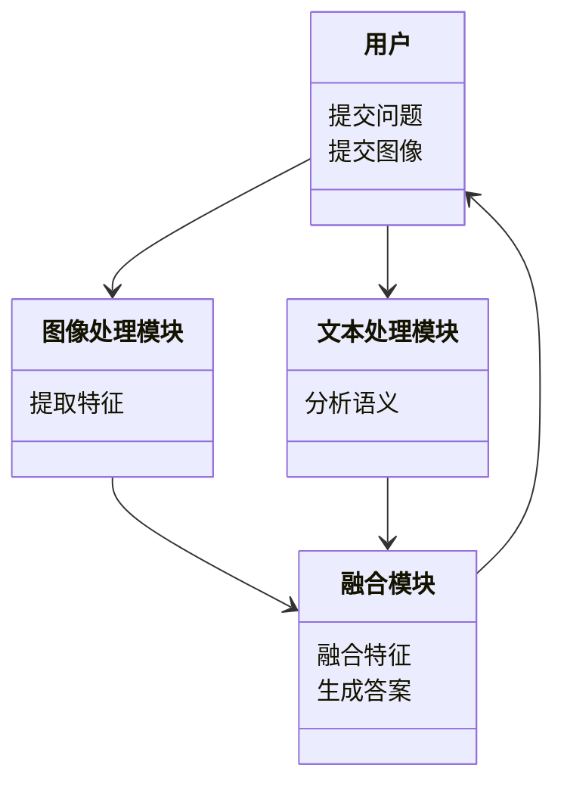
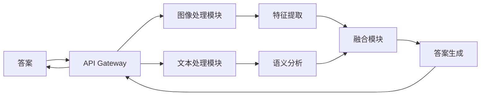
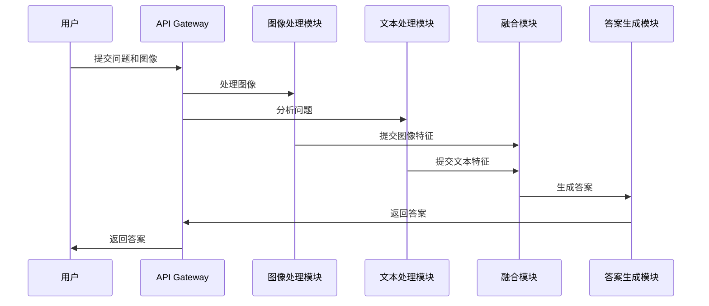

                 


# 开发具有视觉问答能力的AI Agent

## 关键词：视觉问答、AI Agent、多模态数据、知识图谱、深度学习、模型训练

## 摘要：本文详细探讨了开发具有视觉问答能力的AI Agent的技术细节。从背景介绍、核心概念、算法原理到系统架构设计，再到项目实战和总结，系统性地分析了视觉问答AI Agent的开发全过程。文章通过丰富的图表和代码示例，深入浅出地讲解了多模态数据处理、知识图谱构建、模型训练等关键环节，并结合实际案例，为读者提供了全面的技术指导。

---

## 第一部分: 开发具有视觉问答能力的AI Agent基础

### 第1章: 视觉问答AI Agent的背景与概念

#### 1.1 问题背景与描述
##### 1.1.1 视觉问答的定义
视觉问答（Visual Question Answering, VQA）是一种结合了计算机视觉和自然语言处理的新兴技术，旨在通过图像和问题的输入，生成与图像内容相关的答案。其核心在于理解图像中的视觉信息，并结合问题的语义进行推理和回答。

##### 1.1.2 视觉问答的实际应用场景
视觉问答技术广泛应用于多个领域，例如：
- 智能助手：通过图像识别和问题理解，提供与图像相关的实时信息。
- 教育辅助：帮助学生通过图像和问题进行学习和解答。
- 智慧医疗：分析医学图像并回答相关问题，辅助医生诊断。

##### 1.1.3 视觉问答与传统问答系统的区别
与传统问答系统相比，视觉问答的独特之处在于其结合了视觉数据和文本数据，能够处理更加复杂的问题，提供更精准的答案。

#### 1.2 问题解决与边界
##### 1.2.1 视觉问答的核心问题
视觉问答的核心问题在于如何有效地融合图像信息和文本信息，进行准确的理解和推理。

##### 1.2.2 视觉问答的边界与外延
视觉问答的边界在于其处理能力的限制，例如图像分辨率、问题复杂度等。外延则包括与其他技术的结合，如增强学习、知识图谱等。

##### 1.2.3 视觉问答系统的组成要素
视觉问答系统主要由以下部分组成：
1. 图像输入模块
2. 文本输入模块
3. 数据处理模块
4. 模型训练模块
5. 推理与回答模块

#### 1.3 概念结构与核心要素
##### 1.3.1 系统功能模块划分
视觉问答系统可以划分为以下几个功能模块：
- 图像处理模块：负责图像的预处理和特征提取。
- 文本处理模块：负责问题的解析和语义理解。
- 融合模块：将图像特征和文本信息进行融合，生成答案。

##### 1.3.2 核心要素的定义与关系
- **图像数据**：视觉问答的基础输入，包含丰富的空间和语义信息。
- **问题数据**：文本形式的问题，引导系统的推理过程。
- **知识库**：包含领域相关知识，用于辅助回答生成。

##### 1.3.3 系统架构的初步设想
初步架构设想包括：
1. 数据预处理模块
2. 模型训练模块
3. 推理与回答模块

#### 1.4 本章小结
本章主要介绍了视觉问答AI Agent的背景、核心问题、系统组成和初步架构设计，为后续章节的深入分析奠定了基础。

---

## 第二部分: 视觉问答AI Agent的核心概念与联系

### 第2章: 视觉问答AI Agent的核心概念

#### 2.1 核心概念原理
##### 2.1.1 视觉问答的基本原理
视觉问答的基本原理是通过深度学习模型，将图像特征和文本信息进行融合，生成与问题相关的答案。

##### 2.1.2 多模态数据处理的关键技术
多模态数据处理的关键技术包括：
- **图像特征提取**：使用CNN等技术提取图像的视觉特征。
- **文本特征提取**：使用BERT等模型提取文本语义特征。
- **特征融合**：将图像和文本特征进行融合，生成最终的表示。

##### 2.1.3 知识图谱的作用与构建方法
知识图谱在视觉问答中的作用是提供领域知识，帮助模型更好地理解问题和生成答案。构建方法包括：
1. 数据抽取：从图像和文本中提取结构化数据。
2. 实体识别：识别图像中的关键实体。
3. 关系抽取：提取实体之间的关系。

#### 2.2 概念属性特征对比
##### 2.2.1 不同模型的特征对比
以下表格对比了几种典型的视觉问答模型：

| 模型名称 | 特征提取方式 | 文本处理方式 | 融合方式 |
|---------|--------------|-------------|----------|
| VGG     | 纯粹图像特征 | 纯粹文本特征 | 直接拼接 |
| BERT     | 图像特征提取 | 文本语义分析 | 多模态融合 |

##### 2.2.2 模型性能的评估指标
视觉问答模型的性能评估指标包括：
1. 精确度（Precision）
2. 召回率（Recall）
3. F1分数

##### 2.2.3 模型适用场景的对比分析
不同的视觉问答模型适用于不同的场景，例如：
- VGG适用于简单的图像识别任务。
- BERT适用于复杂的语义理解任务。

#### 2.3 ER实体关系图架构
```mermaid
graph LR
A[用户] --> B[问题]
C[图像] --> B
D[知识库] --> B
E[答案] <-- B
```

#### 2.4 本章小结
本章详细讲解了视觉问答的核心概念，包括基本原理、多模态数据处理技术以及知识图谱的作用，为后续章节的算法实现提供了理论基础。

---

## 第三部分: 视觉问答AI Agent的算法原理

### 第3章: 视觉问答AI Agent的算法原理

#### 3.1 模型输入与输出
##### 3.1.1 输入数据的格式与预处理
视觉问答模型的输入包括图像和文本，预处理步骤包括：
1. 图像 resize：将图像调整为统一尺寸。
2. 文本 tokenize：将问题分解为词汇单位。

##### 3.1.2 输出结果的结构化表示
模型的输出通常是一个概率分布，表示每个可能答案的概率。

##### 3.1.3 数据流的可视化流程


#### 3.2 模型训练过程
##### 3.2.1 数据集的构建与标注
数据集的构建需要收集图像和对应的问题及答案，标注过程需要确保数据的准确性和多样性。

##### 3.2.2 损失函数的定义
视觉问答模型通常使用交叉熵损失函数：
$$
\text{Loss} = -\sum_{i=1}^{n} y_i \log p_i
$$
其中，$y_i$ 是真实标签，$p_i$ 是模型预测的概率。

##### 3.2.3 训练过程的详细步骤
1. 初始化模型参数。
2. 进行前向传播，计算输出。
3. 计算损失，进行反向传播，更新参数。

#### 3.3 模型推理与回答
##### 3.3.1 推理过程的详细步骤
1. 对输入图像进行特征提取。
2. 对问题进行文本处理。
3. 融合图像和文本特征，生成答案。

##### 3.3.2 推理结果的解释与分析
推理结果需要通过阈值设置等方式进行优化，以提高准确率和召回率。

#### 3.4 本章小结
本章详细讲解了视觉问答模型的输入输出、训练过程和推理过程，为读者提供了算法实现的详细指导。

---

## 第四部分: 视觉问答AI Agent的系统架构设计

### 第4章: 视觉问答AI Agent的系统架构设计

#### 4.1 问题场景介绍
##### 4.1.1 系统功能需求
系统需要实现的功能包括：
- 接收图像和问题输入。
- 处理输入数据，生成答案。
- 提供友好的用户界面。

##### 4.1.2 系统性能需求
系统需要满足以下性能指标：
- 响应时间小于1秒。
- 支持高并发请求。

#### 4.2 系统功能设计
##### 4.2.1 领域模型设计


##### 4.2.2 系统架构设计


##### 4.2.3 系统接口设计
系统接口设计包括：
- 图像上传接口
- 问题提交接口
- 结果返回接口

##### 4.2.4 系统交互流程


#### 4.3 本章小结
本章详细描述了视觉问答AI Agent的系统架构设计，包括功能需求、模块划分和系统交互流程，为实际开发提供了指导。

---

## 第五部分: 视觉问答AI Agent的项目实战

### 第5章: 视觉问答AI Agent的项目实战

#### 5.1 环境安装与配置
##### 5.1.1 开发环境要求
- Python 3.8及以上版本
- PyTorch 1.9及以上版本
- BERT预训练模型

##### 5.1.2 依赖库的安装
安装必要的依赖库：
```bash
pip install torch transformers
```

#### 5.2 系统核心实现源代码
##### 5.2.1 图像处理模块
```python
import torch
from torchvision import transforms

def process_image(image_path):
    transform = transforms.Compose([
        transforms.Resize((224, 224)),
        transforms.ToTensor()
    ])
    image = transform(image_path)
    return image
```

##### 5.2.2 文本处理模块
```python
from transformers import BertTokenizer, BertModel

def process_text(question):
    tokenizer = BertTokenizer.from_pretrained('bert-base-uncased')
    inputs = tokenizer(question, return_tensors='pt')
    return inputs
```

##### 5.2.3 融合模块
```python
class FusionModule(torch.nn.Module):
    def __init__(self, image_dim, text_dim):
        super(FusionModule, self).__init__()
        self.fc = torch.nn.Linear(image_dim + text_dim, 1)
    
    def forward(self, image_features, text_features):
        features = torch.cat([image_features, text_features], dim=-1)
        output = self.fc(features)
        return output
```

##### 5.2.4 训练模块
```python
def train(model, optimizer, criterion, train_loader):
    for epoch in range(num_epochs):
        for images, questions, labels in train_loader:
            outputs = model(images, questions)
            loss = criterion(outputs, labels)
            loss.backward()
            optimizer.step()
            optimizer.zero_grad()
```

#### 5.3 实际案例分析与详细解读
##### 5.3.1 案例分析
假设输入一张图片和一个问题，模型将通过图像处理模块和文本处理模块分别提取特征，然后通过融合模块生成最终的答案。

##### 5.3.2 代码实现的具体细节
详细解释了每部分代码的功能和实现细节，帮助读者更好地理解和实现。

#### 5.4 本章小结
本章通过实际案例和详细代码实现，展示了视觉问答AI Agent的开发过程，为读者提供了实践指导。

---

## 第六部分: 视觉问答AI Agent的总结与展望

### 第6章: 视觉问答AI Agent的总结与展望

#### 6.1 总结
##### 6.1.1 开发过程中的关键点
- 数据预处理的重要性
- 模型融合策略的选择
- 知识图谱的构建与应用

##### 6.1.2 系统设计中的注意事项
- 模块之间的协作与交互
- 系统性能的优化

#### 6.2 未来展望
##### 6.2.1 性能优化的方向
- 提升模型的推理速度
- 提高模型的准确率

##### 6.2.2 新的功能拓展
- 支持更多模态的数据输入
- 引入强化学习技术

#### 6.3 本章小结
本章总结了视觉问答AI Agent的开发过程，并展望了未来的发展方向，为读者提供了进一步研究的方向。

---

## 作者：AI天才研究院/AI Genius Institute & 禅与计算机程序设计艺术 /Zen And The Art of Computer Programming

---

### 附录
#### 附录A: 术语表
- **视觉问答（VQA）**：通过图像和问题生成答案的技术。
- **知识图谱**：结构化的知识表示形式。

#### 附录B: 工具安装与配置
- 安装PyTorch和Transformers库：
  ```bash
  pip install torch transformers
  ```

#### 附录C: 数据集信息
- 常用视觉问答数据集包括VQA v2和Visual Dialog等。

---

以上是《开发具有视觉问答能力的AI Agent》的技术博客文章的完整目录大纲和部分内容。

