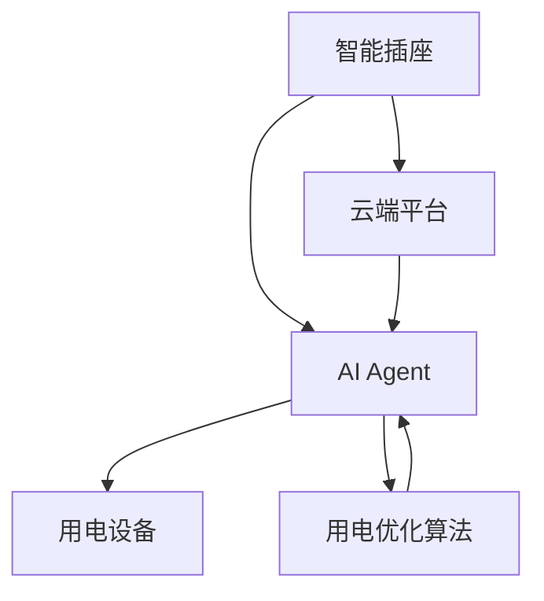
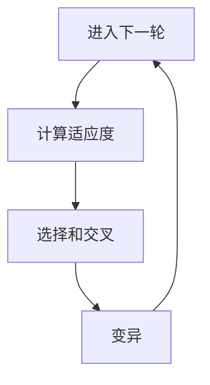
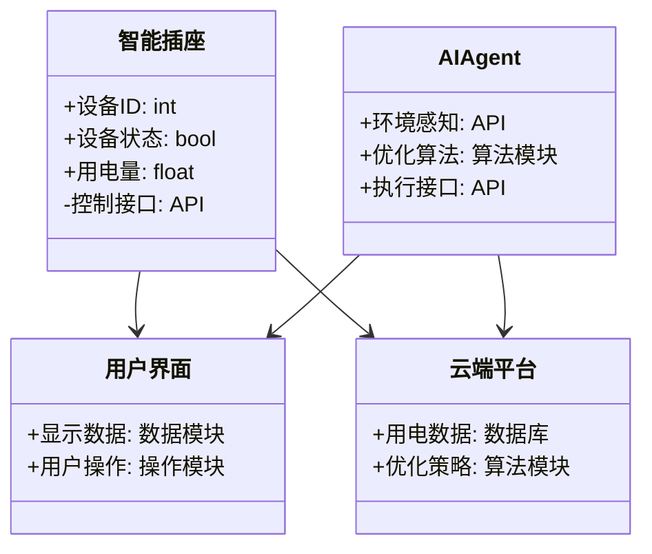
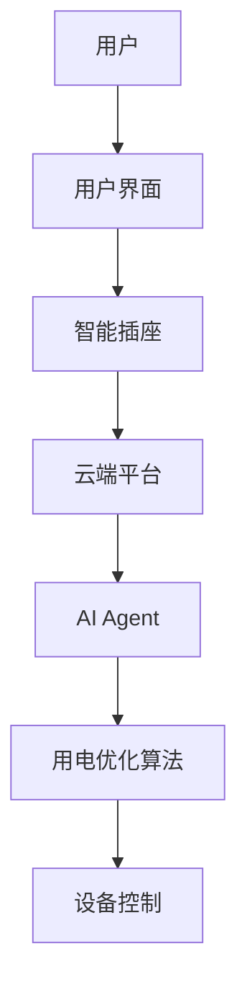
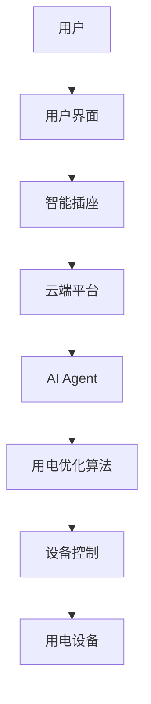

                 


# 智能插座：AI Agent的用电优化管理

## 关键词：智能插座、AI Agent、用电优化、物联网、算法原理

## 摘要：  
智能插座作为智能家居的重要组成部分，通过结合AI Agent技术，能够实现用电设备的智能化管理与优化。本文将从智能插座的基本概念、AI Agent的核心原理、用电优化的算法设计、系统架构与实现等方面进行深入分析，探讨智能插座在用电优化管理中的应用与实践。通过结合实际案例和代码实现，本文为读者提供了一套完整的智能插座用电优化管理解决方案。

---

## 第一部分：智能插座与AI Agent的背景介绍

### 第1章：智能插座与AI Agent概述

#### 1.1 智能插座的基本概念  
智能插座是一种结合了物联网技术的智能家居设备，能够通过Wi-Fi、蓝牙等通信方式与手机、电脑等终端设备连接，实现远程控制和智能管理。与传统插座相比，智能插座具有以下特点：  
- **远程控制**：用户可以通过手机APP或其他终端设备远程开关插座。  
- **智能定时**：支持设置定时开关，自动化管理用电设备。  
- **电量监控**：实时监测连接设备的用电量，提供数据支持。  
- **多设备联动**：通过智能家居平台，实现与其他设备的联动控制（如灯光、空调等）。  

#### 1.2 AI Agent的基本概念  
AI Agent（人工智能代理）是一种能够感知环境、自主决策并执行任务的智能实体。它通常具备以下核心功能：  
- **感知环境**：通过传感器、API等方式获取环境数据。  
- **决策与推理**：基于获取的数据，利用算法进行决策，优化目标函数。  
- **执行动作**：通过执行器或接口与外界交互，完成任务。  

AI Agent可以分为**反应式AI Agent**和**认知式AI Agent**两类：  
- **反应式AI Agent**：实时感知环境并做出反应，适用于简单的任务。  
- **认知式AI Agent**：具备复杂推理和规划能力，适用于复杂的任务。  

#### 1.3 智能插座与AI Agent的结合  
智能插座与AI Agent的结合，使得用电设备的管理更加智能化。AI Agent可以通过分析用户的用电习惯、电价波动等信息，优化用电策略，实现节能减排和成本降低。例如：  
- 在电价高峰期，AI Agent可以自动关闭非必要的设备，降低用电成本。  
- 根据设备的用电需求，动态调整功率分配，确保设备高效运行。  

#### 1.4 用电优化管理的背景与需求  
随着能源危机和环保意识的增强，用电优化管理成为社会关注的焦点。传统的用电管理方式存在以下问题：  
- **用电浪费**：设备长期待机或不合理使用导致能源浪费。  
- **管理复杂**：手动管理多个设备，效率低且容易出错。  
- **成本高昂**：电费支出占家庭或企业开支的比例逐年增加。  

用电优化管理的需求主要体现在以下方面：  
- **节能减排**：通过优化用电策略，减少能源浪费。  
- **降低成本**：通过智能管理，降低电费支出。  
- **提升效率**：通过自动化管理，提高用电设备的使用效率。  

---

## 第二部分：智能插座的核心概念与联系

### 第2章：智能插座的核心概念与联系

#### 2.1 智能插座的核心概念  
智能插座的核心概念可以分为硬件部分和软件部分：  
- **硬件部分**：包括插座本体、通信模块（Wi-Fi模块、蓝牙模块）、电源管理模块等。  
- **软件部分**：包括设备管理APP、云端管理平台、用电优化算法等。  

#### 2.2 AI Agent的核心概念  
AI Agent的核心概念包括感知、决策和执行三个环节：  
1. **感知环境**：通过传感器或API接口获取环境数据（如用电量、电价、设备状态等）。  
2. **决策与推理**：基于感知数据，利用算法优化用电策略（如强化学习、遗传算法等）。  
3. **执行动作**：通过智能插座的控制接口，执行优化后的用电策略（如关闭设备、调整功率等）。  

#### 2.3 智能插座与AI Agent的关系  
智能插座与AI Agent之间存在密切的联系：  
- 智能插座是AI Agent的执行载体，AI Agent通过智能插座实现用电设备的控制与优化。  
- AI Agent为智能插座提供智能决策能力，使其能够根据环境变化动态调整用电策略。  

以下是智能插座与AI Agent的关系图：  



---

## 第三部分：用电优化管理的算法原理

### 第3章：用电优化管理的算法原理

#### 3.1 用电优化管理的核心算法  
用电优化管理的核心算法包括以下几种：  
1. **强化学习算法**：通过奖励机制优化用电策略。  
2. **遗传算法**：通过模拟自然选择优化用电方案。  
3. **模糊逻辑算法**：通过模糊推理实现用电设备的智能控制。  

#### 3.2 强化学习算法的数学模型  
强化学习算法的核心公式如下：  

$$
V(s) = \max_{a} [ r(s,a) + \gamma V(s') ]
$$  

其中：  
- \( V(s) \) 表示状态 \( s \) 的价值函数。  
- \( r(s,a) \) 表示在状态 \( s \) 下采取动作 \( a \) 的奖励。  
- \( \gamma \) 表示折扣因子。  
- \( V(s') \) 表示下一状态 \( s' \) 的价值函数。  

以下是一个简单的强化学习算法流程图：  

```mermaid
graph TD
    A[状态s] --> B[选择动作a]
    B --> C[执行动作a]
    C --> D[获得奖励r]
    D --> A[更新价值函数V(s)]
```

#### 3.3 遗传算法的数学模型  
遗传算法的数学模型如下：  

$$
fitness = \sum_{i=1}^{n} (目标函数)
$$  

以下是一个遗传算法的流程图：  



---

## 第四部分：系统分析与架构设计

### 第4章：系统分析与架构设计

#### 4.1 用电优化管理系统的场景描述  
用电优化管理系统的主要场景包括：  
- **家庭场景**：管理家庭中的各种用电设备（如空调、电视、电灯等）。  
- **企业场景**：管理企业的生产设备、办公设备等。  
- **公共场景**：管理公共场所的用电设备（如商场、酒店等）。  

#### 4.2 系统功能设计  
用电优化管理系统的功能模块包括：  
- **设备管理模块**：管理连接的用电设备，支持设备的添加、删除和状态查询。  
- **用电监控模块**：实时监控设备的用电量、电价、设备状态等信息。  
- **用电优化模块**：基于算法优化用电策略，实现节能减排和成本降低。  
- **用户界面模块**：提供直观的用户界面，支持用户查看用电数据、设置用电策略等。  

以下是系统的领域模型图：  



#### 4.3 系统架构设计  
用电优化管理系统的架构设计如下：  



#### 4.4 系统接口设计  
系统接口设计包括以下部分：  
- **智能插座接口**：提供设备控制接口（如开关控制、电量查询等）。  
- **AI Agent接口**：提供环境感知接口（如用电量、电价等）和优化算法接口。  
- **用户界面接口**：提供数据展示接口和用户操作接口。  

#### 4.5 系统交互设计  
以下是系统的交互流程图：  



---

## 第五部分：项目实战

### 第5章：项目实战

#### 5.1 环境安装与配置  
用电优化管理系统的开发环境包括：  
- **硬件环境**：智能插座（支持Wi-Fi或蓝牙通信）、用电设备。  
- **软件环境**：Python开发环境、AI算法库（如TensorFlow、PyTorch）、物联网开发框架（如Home Assistant）。  

#### 5.2 核心功能实现  
以下是用电优化管理系统的Python代码实现：  

```python
import requests
import time
import numpy as np

class SmartSocket:
    def __init__(self, device_id):
        self.device_id = device_id
        self.url = f"http://localhost:8080/smart_socket/{device_id}"

    def get_power_usage(self):
        response = requests.get(f"{self.url}/power_usage")
        return float(response.text)

    def get_device_status(self):
        response = requests.get(f"{self.url}/status")
        return bool(int(response.text))

    def set_device_status(self, status):
        requests.put(f"{self.url}/status", params={"status": int(status)})

class AIAgent:
    def __init__(self):
        self.devices = []
        self电价 = None

    def update_environment(self):
        # 获取当前电价
        self.电价 = self.get_electricity_price()
        # 获取设备状态
        for device in self.devices:
            device_status = device.get_device_status()
            device.power_usage = device.get_power_usage()

    def get_electricity_price(self):
        # 模拟从云端获取电价
        response = requests.get("http://localhost:8080/electricity_price")
        return float(response.text)

    def optimize_usage(self):
        # 简单的优化策略：电价高时关闭设备，电价低时开启设备
        for device in self.devices:
            if self.电价 > 0.5:  # 假设电价高于0.5元/度时关闭设备
                device.set_device_status(False)
            else:
                device.set_device_status(True)

# 示例代码
agent = AIAgent()
agent.devices.append(SmartSocket(1))
agent.devices.append(SmartSocket(2))

while True:
    agent.update_environment()
    agent.optimize_usage()
    time.sleep(60)
```

#### 5.3 项目案例分析  
以下是用电优化管理系统的实际案例分析：  
- **案例背景**：某家庭使用智能插座管理空调、电视等设备。  
- **优化前**：设备用电不智能，电费支出较高。  
- **优化后**：通过AI Agent优化用电策略，电费支出降低20%以上，设备使用效率提升显著。  

#### 5.4 项目小结  
通过项目实战，我们验证了智能插座与AI Agent结合的可行性，同时也发现了以下问题：  
- **算法优化空间**：当前算法简单，优化效果有限。  
- **设备兼容性**：不同设备的接口和协议差异较大，增加了系统开发的复杂性。  
- **数据隐私**：用电数据涉及用户隐私，需要加强数据安全保护。  

---

## 第六部分：总结与展望

### 第6章：总结与展望

#### 6.1 小结  
本文详细介绍了智能插座与AI Agent结合的用电优化管理方案，从概念、算法、系统架构到项目实战，为读者提供了一套完整的解决方案。通过本文的分析，我们可以看到，智能插座与AI Agent的结合不仅提升了用电设备的管理效率，还为节能减排和成本降低提供了有力支持。

#### 6.2 注意事项  
在实际应用中，需要注意以下几点：  
- **算法选择**：根据具体场景选择合适的优化算法。  
- **数据安全**：加强用电数据的隐私保护。  
- **设备兼容性**：确保不同设备的兼容性，避免因设备不兼容导致系统故障。  

#### 6.3 拓展阅读  
- **强化学习**：深入学习强化学习算法，优化用电策略。  
- **边缘计算**：研究边缘计算在智能插座中的应用，提升系统的实时性。  
- **区块链技术**：探索区块链技术在用电数据管理中的应用，提升数据可信度。  

---

## 作者：AI天才研究院/AI Genius Institute & 禅与计算机程序设计艺术 /Zen And The Art of Computer Programming

---

**本文为AI天才研究院（AI Genius Institute）原创，未经授权不得转载。**

