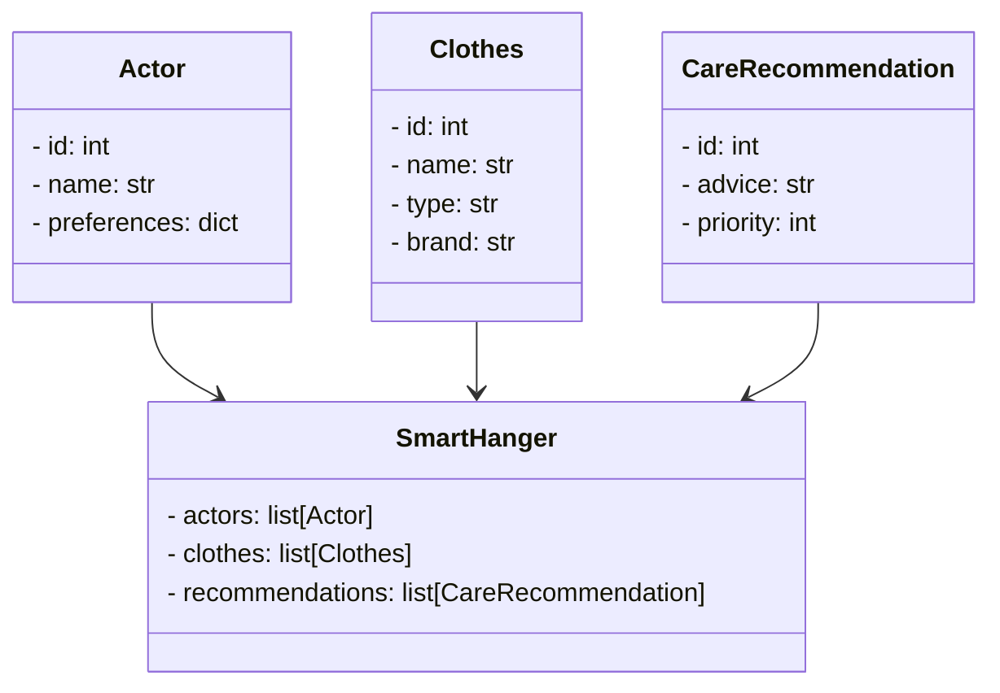
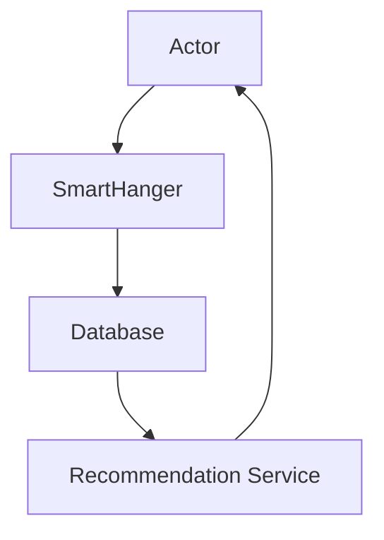

                 


# 《智能衣架：AI Agent的衣物护理建议》

## 关键词：AI Agent、衣物护理、智能衣架、图像识别、自然语言处理、系统架构

## 摘要：  
本文深入探讨AI Agent在衣物护理中的应用，详细分析智能衣架的系统架构、算法原理及其实现方法。通过理论与实践结合，为读者提供关于AI驱动的衣物护理解决方案的全面理解。

---

# 第一部分: 背景介绍

## 第1章: AI Agent与衣物护理的背景

### 1.1 问题背景
#### 1.1.1 衣物护理的痛点与挑战
- 衣物种类繁多，护理需求多样。
- 传统护理方法效率低，依赖人工经验。
- 现有解决方案缺乏智能化和个性化。

#### 1.1.2 AI技术在衣物护理中的应用潜力
- 图像识别和自然语言处理的进步为自动化护理提供了可能。
- AI Agent能够实时感知衣物状态，提供个性化建议。

#### 1.1.3 智能衣架的定义与目标
- 智能衣架是一种结合AI技术的衣物管理工具。
- 目标是通过AI Agent实现衣物的智能识别、护理建议和搭配推荐。

### 1.2 问题描述
#### 1.2.1 衣物护理的复杂性
- 不同材质的衣物需要不同的清洗和护理方法。
- 用户需求多样化，个性化建议需求高。

#### 1.2.2 用户需求与现有解决方案的差距
- 现有解决方案缺乏智能化和个性化。
- 用户希望获得实时、精准的护理建议。

#### 1.2.3 智能衣架的解决思路
- 利用AI技术实现衣物的自动识别和分类。
- 提供个性化的护理建议和搭配推荐。

### 1.3 问题解决
#### 1.3.1 AI Agent如何优化衣物护理流程
- 通过图像识别快速识别衣物材质和品牌。
- 利用自然语言处理分析用户需求，生成个性化建议。

#### 1.3.2 智能衣架的功能设计与实现
- 数据采集与处理：图像采集、数据存储。
- 算法实现：分类算法、推荐算法。
- 系统架构设计：模块划分、接口设计。

#### 1.3.3 用户体验的提升与技术实现
- 提供直观的用户界面。
- 实现快速响应和精准建议。

### 1.4 边界与外延
#### 1.4.1 智能衣架的功能边界
- 专注于衣物护理建议，不涉及实际清洗操作。
- 支持多种衣物类型，但需在特定范围内。

#### 1.4.2 与其他智能家居设备的协同
- 与洗衣机、干衣机等设备的数据互通。
- 实现衣物护理的全流程智能化。

#### 1.4.3 衣物护理的扩展应用场景
- 商业洗衣服务的智能化改造。
- 智能衣柜的集成与扩展。

### 1.5 概念结构与核心要素组成
#### 1.5.1 智能衣架的核心要素
- AI Agent：图像识别、自然语言处理。
- 数据库：衣物信息存储、用户偏好记录。
- 用户界面：交互设计、反馈机制。

#### 1.5.2 AI Agent的组成部分
- 感知模块：图像采集、数据解析。
- 决策模块：分类算法、推荐算法。
- 执行模块：建议生成、反馈输出。

#### 1.5.3 衣物护理的系统架构
- 数据采集：图像采集、传感器数据。
- 数据处理：特征提取、数据分类。
- 用户交互：建议展示、反馈收集。

---

# 第二部分: 核心概念与联系

## 第2章: AI Agent的核心原理

### 2.1 AI Agent的基本概念
#### 2.1.1 AI Agent的定义与特点
- AI Agent是一种能够感知环境、做出决策并执行动作的智能体。
- 具有自主性、反应性、目标导向性和学习能力。

#### 2.1.2 AI Agent的分类与应用场景
- 分类：基于任务型、学习型、反应型。
- 应用场景：智能家居、医疗、教育、客服等。

#### 2.1.3 AI Agent与传统自动化的区别
- 传统自动化：基于规则，被动执行。
- AI Agent：主动感知、学习和适应。

### 2.2 AI Agent的核心原理
#### 2.2.1 AI Agent的感知模块
- 感知环境：图像识别、语音识别。
- 数据采集：传感器数据、用户输入。

#### 2.2.2 AI Agent的决策模块
- 数据分析：特征提取、模式识别。
- 决策逻辑：基于规则、基于模型。

#### 2.2.3 AI Agent的执行模块
- 动作执行：输出建议、触发操作。
- 反馈机制：实时调整、持续优化。

### 2.3 AI Agent与衣物护理的结合
#### 2.3.1 衣物识别与分类的实现
- 图像识别技术：识别衣物材质、品牌、颜色。
- 数据分类：根据衣物属性进行分类。

#### 2.3.2 清洗建议的生成逻辑
- 基于衣物材质推荐清洗方法。
- 结合用户偏好提供个性化建议。

#### 2.3.3 衣物搭配建议的算法设计
- 基于风格推荐：搭配建议。
- 考虑场合：正式场合、休闲场合。

## 第3章: 核心概念对比与ER实体关系图

### 3.1 核心概念对比
#### 3.1.1 传统衣物护理与AI Agent护理的对比
| 特性        | 传统护理         | AI Agent护理       |
|-------------|------------------|--------------------|
| 识别方式     | 人工观察         | 图像识别、传感器数据 |
| 决策方式     | 经验判断         | 数据分析、算法决策  |
| 效率         | 低效             | 高效               |
| 个性化       | 有限             | 高度个性化         |

#### 3.1.2 AI Agent在衣物护理中的优势
- 高效性：快速识别和处理。
- 个性化：精准匹配用户需求。
- 可扩展性：支持多种衣物类型。

#### 3.1.3 AI Agent的局限性与改进方向
- 依赖数据质量：数据偏差影响结果。
- 算法黑箱：用户难以理解建议逻辑。
- 需要持续学习：适应新衣物类型。

### 3.2 ER实体关系图
```mermaid
er
  actor: 用户
  smart_hanger: 智能衣架
  clothes: 衣物
  care_recommendation: 护理建议

  用户 --> 衣物: 放置
  智能衣架 --> 衣物: 识别
  衣物 --> 护理建议: 生成
  用户 <---> 护理建议: 查看
```

---

# 第三部分: 算法原理讲解

## 第4章: 图像识别算法

### 4.1 图像识别流程
#### 4.1.1 数据预处理
- 图像采集：使用摄像头获取衣物图像。
- 数据增强：旋转、翻转、缩放以增加数据多样性。

#### 4.1.2 特征提取
- 使用卷积神经网络（CNN）提取图像特征。
- 提取的特征用于分类任务。

#### 4.1.3 分类器训练
- 使用预训练的模型（如ResNet、VGG）进行微调。
- 使用交叉熵损失函数优化分类任务。

### 4.2 图像识别的Python实现
```python
import cv2
import numpy as np
from tensorflow.keras.models import load_model

# 加载预训练模型
model = load_model('clothes_classifier.h5')

# 图像预处理
def preprocess_image(image):
    image = cv2.resize(image, (224, 224))
    image = image.astype(np.float32) / 255.0
    return image

# 图像识别
def recognize_clothes(image):
    processed_image = preprocess_image(image)
    prediction = model.predict(np.array([processed_image]))
    predicted_class = np.argmax(prediction[0])
    return predicted_class
```

---

## 第5章: 自然语言处理算法

### 5.1 自然语言处理流程
#### 5.1.1 数据预处理
- 分词：将文本分割成词语。
- 去停用词：去除无意义词汇。

#### 5.1.2 特征提取
- 使用词袋模型或TF-IDF提取关键词特征。
- 使用词嵌入模型（如Word2Vec）生成词向量。

#### 5.1.3 分类器训练
- 使用支持向量机（SVM）或随机森林进行文本分类。
- 使用交叉熵损失函数优化分类任务。

### 5.2 自然语言处理的Python实现
```python
from sklearn.feature_extraction.text import TfidfVectorizer
from sklearn.svm import SVC

# 数据预处理
def preprocess_text(text):
    words = text.split()
    return ' '.join(words)

# 特征提取与分类
vectorizer = TfidfVectorizer()
X = vectorizer.fit_transform(corpus)
model = SVC()
model.fit(X, labels)
```

---

# 第四部分: 系统分析与架构设计方案

## 第6章: 系统架构设计

### 6.1 项目介绍
- 智能衣架的目标：通过AI技术优化衣物护理流程。
- 系统组成：图像采集模块、数据处理模块、用户交互模块。

### 6.2 系统功能设计
#### 6.2.1 领域模型


#### 6.2.2 系统架构


---

## 第7章: 系统交互设计

### 7.1 系统接口设计
- 用户接口：HTTP API。
- 数据接口：数据库接口。

### 7.2 系统交互流程
```mermaid
sequenceDiagram
    actor --> smart_hanger: 放置衣物
    smart_hanger --> database: 识别衣物
    database --> recommendation_service: 生成建议
    recommendation_service --> actor: 返回建议
```

---

# 第五部分: 项目实战

## 第8章: 项目实战

### 8.1 环境搭建
- 安装Python、OpenCV、TensorFlow、Scikit-learn。
- 安装必要的依赖库。

### 8.2 核心代码实现
#### 8.2.1 图像识别
```python
import cv2
import numpy as np
from tensorflow.keras.models import load_model

def recognize_image(image_path):
    image = cv2.imread(image_path)
    processed_image = preprocess_image(image)
    prediction = model.predict(np.array([processed_image]))
    predicted_class = np.argmax(prediction[0])
    return predicted_class
```

#### 8.2.2 自然语言处理
```python
from sklearn.feature_extraction.text import TfidfVectorizer
from sklearn.svm import SVC

def process_text(text):
    processed_text = preprocess_text(text)
    X = vectorizer.transform([processed_text])
    return model.predict(X)[0]
```

### 8.3 代码解读与分析
- 图像识别代码：加载模型，预处理图像，进行分类预测。
- 自然语言处理代码：文本预处理，生成特征向量，进行分类预测。

### 8.4 实际案例分析
- 案例1：识别一件羊毛衫，生成清洗建议。
- 案例2：根据用户偏好推荐搭配方案。

---

# 第六部分: 最佳实践

## 第9章: 最佳实践

### 9.1 小结
- 智能衣架通过AI技术实现了衣物护理的智能化和个性化。
- 图像识别和自然语言处理是实现智能护理的核心技术。

### 9.2 注意事项
- 数据质量对模型性能影响重大。
- 需要考虑用户隐私和数据安全。
- 系统设计需兼顾用户体验和性能优化。

### 9.3 拓展阅读
- 《深度学习实战》：学习更多深度学习技术。
- 《自然语言处理入门》：深入了解NLP技术。
- 《系统架构设计》：提升系统设计能力。

---

# 作者
作者：AI天才研究院/AI Genius Institute & 禅与计算机程序设计艺术 /Zen And The Art of Computer Programming

