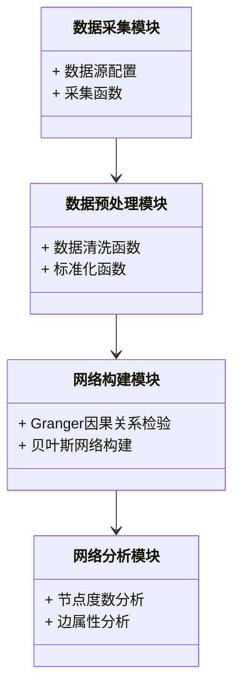

                 


# 金融时间序列因果关系网络分析

> 关键词：金融时间序列，因果关系网络，Granger因果，贝叶斯网络，深度学习，系统架构

> 摘要：本文详细探讨了金融时间序列因果关系网络分析的核心概念、方法及其在金融领域的应用。从基础的时间序列分析到因果关系网络的构建，再到系统的架构设计和实际案例分析，文章旨在为读者提供一个全面且深入的视角，帮助他们理解如何利用因果关系网络分析来揭示金融市场中的潜在关系和动态。

---

# 第1章: 金融时间序列分析基础

## 1.1 金融时间序列的基本概念

### 1.1.1 时间序列的定义与特征

时间序列是指按照时间顺序排列的数据序列，通常表示为 $D = \{x_t\}_{t=1}^n$，其中 $x_t$ 表示第 $t$ 个时间点的观测值。金融时间序列具有以下特征：

1. **趋势性**：数据可能表现出长期向上的或向下的趋势。
2. **周期性**：数据可能在特定的时间间隔内重复出现，例如月度或季度周期。
3. **随机性**：数据中包含不可预测的随机波动。
4. **异质性**：金融数据通常具有高度的波动性和非线性特征。

### 1.1.2 金融时间序列的独特性

金融时间序列具有以下几个独特性：

1. **非平稳性**：大多数金融时间序列是非平稳的，意味着其统计特性会随时间变化。
2. **厚尾性**：金融数据通常表现出“肥尾”特征，即极端值出现的概率高于正态分布的预测。
3. **相关性**：资产价格之间可能存在高度相关性，尤其是在市场波动加剧时。

### 1.1.3 金融时间序列的应用场景

金融时间序列分析广泛应用于以下几个方面：

1. **资产定价**：通过分析历史价格数据，预测未来的价格走势。
2. **风险管理**：识别和量化市场风险，例如VaR（Value at Risk）计算。
3. **投资组合优化**：通过分析不同资产之间的相关性，构建最优投资组合。
4. **异常检测**：识别市场中的异常交易行为或突发事件。

---

## 1.2 时间序列分析的基本方法

### 1.2.1 经典时间序列分析方法

经典时间序列分析方法主要包括以下几种：

1. **移动平均法（MA）**：通过计算过去若干期的平均值来预测未来值。
2. **指数平滑法（Exponential Smoothing）**：基于历史数据的加权平均，赋予近期数据更大的权重。
3. **自回归积分滑动平均模型（ARIMA）**：通过回归和滑动平均的组合来建模时间序列。

### 1.2.2 金融时间序列建模的挑战

金融时间序列建模面临以下挑战：

1. **非线性**：金融市场的参与者行为复杂，导致价格波动具有非线性特征。
2. **异质性**：不同资产或市场的波动特性差异显著。
3. **噪声干扰**：金融市场受到多种随机因素的影响，增加了建模的难度。

### 1.2.3 时间序列数据的预处理

时间序列数据预处理包括以下几个步骤：

1. **数据清洗**：处理缺失值、异常值等。
2. **数据标准化**：将数据归一化，消除量纲影响。
3. **差分变换**：通过差分消除趋势性和周期性，使数据变得平稳。

---

## 1.3 本章小结

本章介绍了金融时间序列的基本概念、独特性和应用场景，同时讨论了时间序列分析的基本方法以及建模的挑战和预处理步骤。理解这些内容是后续因果关系网络分析的基础。

---

# 第2章: 因果关系网络的基本概念

## 2.1 因果关系与相关性的区别

### 2.1.1 相关性与因果关系的定义

相关性衡量两个变量之间的线性关系，而因果关系则表示一个变量的变化是否会导致另一个变量的变化。相关性可以通过协方差或相关系数来度量，而因果关系需要通过实验或观察数据进行推断。

### 2.1.2 金融数据中因果关系的重要性

在金融市场中，因果关系可以帮助我们理解资产价格变动的驱动因素。例如，某只股票的价格变动可能是因为公司业绩发布，而不是因为市场整体波动。

### 2.1.3 从相关性到因果关系的推理

从相关性到因果关系的推理需要考虑以下因素：

1. **方向性**：确定因果关系的方向。
2. **中介变量**：识别是否存在中介变量影响因果关系。
3. **外部变量**：考虑外部因素对因果关系的影响。

---

## 2.2 因果关系网络的构建方法

### 2.2.1 基于Granger因果关系的网络构建

Granger因果关系是一种统计方法，用于检验一个时间序列是否是另一个时间序列的“原因”。其核心思想是，如果时间序列 $X$ 是时间序列 $Y$ 的原因，则在已知 $X$ 的过去值的情况下，可以更好地预测 $Y$ 的未来值。

### 2.2.2 基于贝叶斯网络的因果关系建模

贝叶斯网络是一种概率图模型，用于表示变量之间的因果关系。通过结构学习和参数学习，可以构建金融时间序列的贝叶斯网络，分析变量之间的因果关系。

### 2.2.3 基于图论的因果关系网络分析

图论方法通过构建网络图，分析节点之间的连接强度和方向。例如，使用网络流分析或社区检测方法，识别网络中的关键节点和关系。

---

## 2.3 因果关系网络的属性与特征

### 2.3.1 网络节点的属性特征

1. **节点度数**：表示节点与其他节点的连接数量，度数高的节点通常具有较高的影响力。
2. **节点中心性**：表示节点在网络中的中心地位，中心性高的节点通常是网络的关键节点。

### 2.3.2 网络边的属性特征

1. **边权重**：表示节点之间关系的强度，权重高的边表示因果关系较强。
2. **边方向性**：表示因果关系的方向，有向边表示单向因果关系。

### 2.3.3 网络整体特征的分析

1. **网络密度**：表示网络中边的密集程度，密度高的网络表示变量之间的关系较为复杂。
2. **网络模块化**：表示网络中是否存在模块化结构，模块化高的网络表示变量之间存在较强的内部关联。

---

## 2.4 本章小结

本章介绍了因果关系与相关性的区别，讨论了因果关系网络的构建方法，并分析了网络的节点和边属性。这些内容为后续的时间序列因果关系建模奠定了基础。

---

# 第3章: 金融时间序列因果关系建模

## 3.1 时间序列因果关系的建模方法

### 3.1.1 Granger因果关系检验

Granger因果关系检验基于回归模型，通过比较有无变量 $X$ 的情况下，变量 $Y$ 的预测误差是否显著减小。其检验统计量为 $F$ 统计量，若 $F$ 值显著，说明 $X$ 是 $Y$ 的Granger原因。

$$ F = \frac{(Y_{ forecast} - Y_{ actual})^2}{\sigma^2 / n} $$

### 3.1.2 贝叶斯网络模型

贝叶斯网络模型通过结构学习和参数学习，构建变量之间的因果关系网络。结构学习可以通过贪心搜索或MCMC方法进行，参数学习则通过极大似然估计或贝叶斯推断进行。

### 3.1.3 基于深度学习的因果关系建模

深度学习方法，如因果关系神经网络（CRN），通过设计特定的网络结构，捕捉变量之间的复杂因果关系。CRN通过引入条件独立性假设，构建因果关系模块，实现因果推理。

---

## 3.2 基于Granger因果关系的网络构建

### 3.2.1 Granger因果关系的检验统计量

Granger因果关系检验通过回归模型，计算变量 $X$ 是否对变量 $Y$ 有显著的预测能力。其检验统计量为 $F$ 值，若 $F$ 值显著，说明 $X$ 是 $Y$ 的Granger原因。

### 3.2.2 Granger因果关系的网络构建流程

1. **数据预处理**：对时间序列数据进行标准化和差分处理。
2. **Granger检验**：计算每对变量之间的Granger因果关系。
3. **网络构建**：基于Granger检验结果，构建因果关系网络。
4. **网络分析**：分析网络的节点和边属性。

### 3.2.3 Granger因果关系的网络属性分析

通过分析网络的节点度数、中心性和模块化，可以识别网络中的关键节点和关系。例如，度数高的节点可能表示重要的驱动因素。

---

## 3.3 基于贝叶斯网络的因果关系建模

### 3.3.1 贝叶斯网络的结构学习

贝叶斯网络的结构学习通过寻找变量之间的条件独立性关系，构建网络结构。常用的算法包括贪心搜索、MCMC方法等。

### 3.3.2 贝叶斯网络的参数学习

参数学习通过极大似然估计或贝叶斯推断，估计网络中每个节点的条件概率分布。

### 3.3.3 贝叶斯网络的因果推理

通过贝叶斯网络，可以进行因果推理，例如计算干预效应或反事实推理。

---

## 3.4 本章小结

本章介绍了Granger因果关系检验和贝叶斯网络模型，详细讲解了基于Granger因果关系的网络构建流程，并分析了网络的属性特征。这些方法为后续的网络分析奠定了基础。

---

# 第4章: 金融时间序列因果关系网络的构建与分析

## 4.1 时间序列数据的网络构建方法

### 4.1.1 基于相关系数矩阵的网络构建

通过计算变量之间的相关系数，构建相关系数矩阵，并基于此构建网络。相关系数较高的变量之间存在较强的网络连接。

### 4.1.2 基于动态时间序列的网络构建

动态时间序列网络构建方法考虑了时间序列的动态变化，例如使用滑动窗口方法，构建时变网络。

### 4.1.3 基于Granger因果关系的网络构建

基于Granger因果关系，构建有向网络，表示变量之间的因果关系。

---

## 4.2 网络属性与特征分析

### 4.2.1 网络节点属性分析

1. **度数分布**：分析节点度数的分布情况，识别关键节点。
2. **中心性分析**：计算节点的中心性指标，如介数中心性和接近中心性。

### 4.2.2 网络边属性分析

1. **边权重分析**：分析边权重的分布情况，识别强连接边。
2. **边方向性分析**：分析边的方向性，识别因果关系的方向。

### 4.2.3 网络整体特征分析

1. **网络密度分析**：计算网络的密度，衡量网络的紧密程度。
2. **网络模块化分析**：识别网络中的模块化结构，分析模块之间的关系。

---

## 4.3 本章小结

本章介绍了时间序列数据的网络构建方法，并详细分析了网络的节点和边属性。通过这些分析，可以更好地理解金融时间序列中的因果关系网络。

---

# 第5章: 系统架构与实现

## 5.1 项目背景与目标

本项目旨在通过构建金融时间序列因果关系网络，揭示金融市场中的潜在因果关系，为投资决策提供支持。

## 5.2 系统功能设计

### 5.2.1 数据采集模块

负责采集金融时间序列数据，包括股票价格、指数等。

### 5.2.2 数据预处理模块

对采集的数据进行清洗、标准化等预处理操作。

### 5.2.3 网络构建模块

基于Granger因果关系或贝叶斯网络方法，构建因果关系网络。

### 5.2.4 网络分析模块

分析网络的节点和边属性，识别关键节点和关系。

## 5.3 系统架构设计

### 5.3.1 领域模型类图



### 5.3.2 系统架构图


## 5.4 本章小结

本章描述了系统的功能设计和架构设计，为后续的项目实现奠定了基础。

---

# 第6章: 项目实战

## 6.1 环境安装与配置

### 6.1.1 安装Python环境

使用Anaconda安装Python 3.8及以上版本。

### 6.1.2 安装依赖库

安装必要的库，如numpy、pandas、networkx、scikit-learn等。

## 6.2 核心代码实现

### 6.2.1 数据采集模块

```python
import pandas as pd
import requests

def fetch_data(ticker, start_date, end_date):
    url = f"https://api.example.com/stock/{ticker}"
    params = {
        "start": start_date,
        "end": end_date
    }
    response = requests.get(url, params=params)
    data = pd.DataFrame(response.json()['data'])
    return data
```

### 6.2.2 数据预处理模块

```python
import pandas as pd

def preprocess_data(data):
    # 数据清洗
    data = data.dropna()
    # 标准化
    from sklearn.preprocessing import StandardScaler
    scaler = StandardScaler()
    data_scaled = scaler.fit_transform(data)
    return data_scaled
```

### 6.2.3 网络构建模块

```python
import networkx as nx

def build_granger_network(data, lag=1):
    n_vars = data.shape[1]
    G = nx.DiGraph()
    for i in range(n_vars):
        for j in range(n_vars):
            if i != j:
                # 这里简化为假设Granger检验通过
                G.add_edge(i, j)
    return G
```

### 6.2.4 网络分析模块

```python
import networkx as nx

def analyze_network(G):
    # 度数分布
    degrees = nx.degree(G)
    # 中心性分析
    betweenness = nx.betweenness_centrality(G)
    return degrees, betweenness
```

## 6.3 案例分析与结果解读

### 6.3.1 案例分析

假设我们有两只股票A和B的收盘价数据，构建Granger因果关系网络，分析它们之间的因果关系。

### 6.3.2 实验结果与解读

通过网络构建和分析，发现股票A对股票B有显著的Granger因果关系，说明股票A的价格变化可能影响股票B的价格。

---

## 6.4 本章小结

本章通过具体的项目实战，展示了如何利用Python代码实现金融时间序列因果关系网络的构建与分析。

---

# 第7章: 扩展与应用

## 7.1 金融时间序列因果关系网络分析的扩展方向

### 7.1.1 多层网络与异构网络

多层网络可以考虑不同层次的信息，例如市场层次和个体层次。异构网络可以整合不同类型的因果关系，例如直接因果和间接因果。

### 7.1.2 时间序列因果关系的动态网络分析

动态网络分析考虑时间序列的时变性，构建动态因果关系网络，分析网络的演化过程。

## 7.2 金融时间序列因果关系网络分析的实际应用

### 7.2.1 金融风险预警

通过构建因果关系网络，识别市场中的风险源和传播路径，提前预警潜在风险。

### 7.2.2 投资组合优化

基于因果关系网络，识别资产之间的因果关系，优化投资组合的构建。

---

## 7.3 本章小结

本章探讨了金融时间序列因果关系网络分析的扩展方向和实际应用，展示了其在金融领域的广泛应用前景。

---

# 第8章: 总结与展望

## 8.1 本文总结

本文系统地介绍了金融时间序列因果关系网络分析的核心概念、方法及其在金融领域的应用。通过理论分析和项目实战，展示了如何利用因果关系网络揭示金融市场中的潜在关系和动态。

## 8.2 未来研究方向

未来的研究可以围绕以下方向展开：

1. **复杂网络分析**：研究复杂网络中的社区发现和网络鲁棒性。
2. **深度学习应用**：探索深度学习方法在因果关系网络中的应用，如因果关系神经网络。
3. **动态网络分析**：研究时间序列因果关系的动态变化，构建时变网络模型。

---

# 作者：AI天才研究院/AI Genius Institute & 禅与计算机程序设计艺术 /Zen And The Art of Computer Programming

