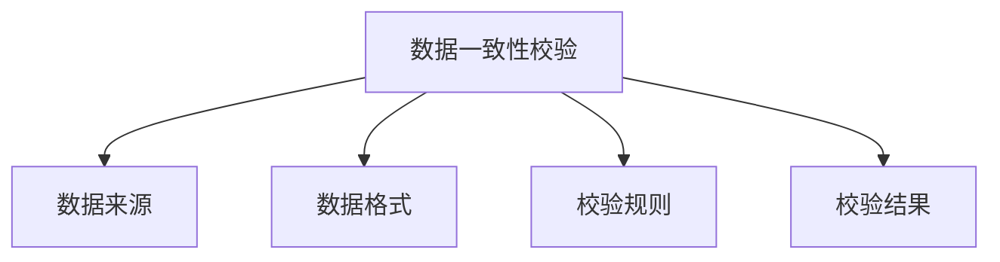
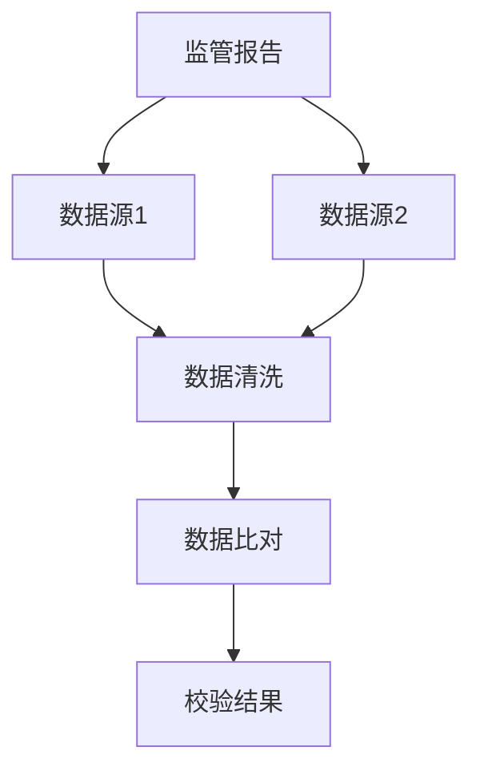
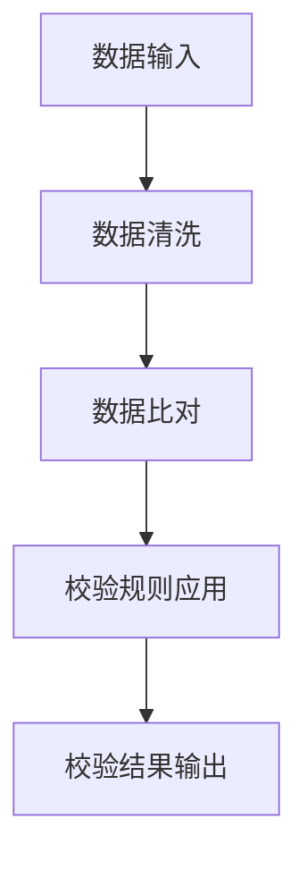
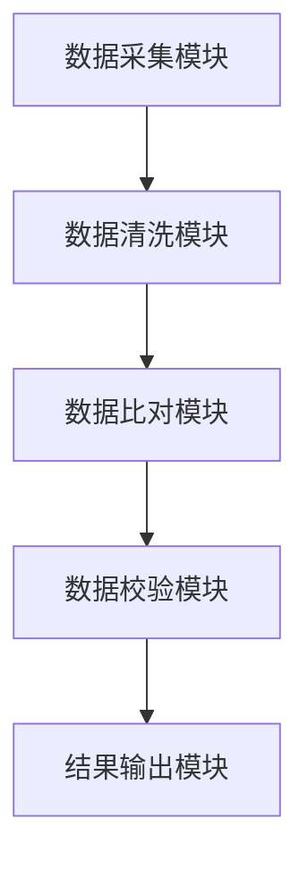
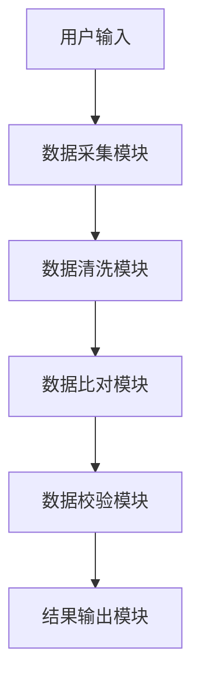

                 


# 《金融监管报告数据一致性自动校验》

> 关键词：数据一致性校验，金融监管，数据清洗，数据比对，自动化校验

> 摘要：本文详细探讨了金融监管报告数据一致性自动校验的关键技术与实现方法。从问题背景、核心概念、算法原理、系统架构设计到项目实战，全面解析了如何确保金融数据的准确性和一致性。通过实际案例分析和代码实现，展示了如何利用自动化技术提升金融监管效率和数据质量。

---

# 第一部分: 金融监管报告数据一致性校验概述

## 第1章: 数据一致性校验的背景与概念

### 1.1 数据一致性校验的背景介绍
在金融行业，数据的准确性和一致性是确保监管合规性和业务安全性的基础。随着金融业务的复杂化和数据来源的多样化，数据一致性校验的需求日益迫切。本文将从问题背景、核心概念和行业现状三个方面展开讨论。

#### 1.1.1 金融监管的重要性
金融监管是保障金融市场稳定运行的重要手段，其核心目标是确保金融机构的合规性、保护投资者利益以及维护金融系统的整体稳定。在这一过程中，数据的准确性和一致性是监管工作顺利开展的基础。

#### 1.1.2 数据一致性问题的提出
在实际业务中，由于数据来源多样、格式不统一以及传输过程中的干扰因素，金融监管数据往往存在不一致的问题。例如，同一笔交易可能在不同的系统中记录为不同的数值或格式，这不仅会导致监管结果的偏差，还可能引发合规性问题。

#### 1.1.3 自动化校验的必要性
传统的手动数据校验方式效率低下且容易出错，难以应对海量数据的监管需求。通过自动化校验技术，可以显著提高数据处理的效率和准确性，同时降低人工成本。

### 1.2 数据一致性校验的核心概念
数据一致性校验是指通过技术手段确保不同数据源中的数据在特定字段或记录上保持一致性的过程。本文将从定义、范围和关键特征三个方面展开讨论。

#### 1.2.1 数据一致性的定义
数据一致性是指在不同的数据源或系统中，同一事务或记录在特定字段上的值保持一致。例如，同一笔交易在银行系统和监管系统中的记录应保持一致。

#### 1.2.2 数据一致性校验的范围与边界
数据一致性校验的范围包括数据清洗、数据比对和数据校验三个主要环节。其边界主要涉及数据源的选择、校验规则的制定以及校验结果的反馈机制。

#### 1.2.3 核心要素与概念结构
数据一致性校验的核心要素包括数据来源、数据格式、校验规则和校验结果。概念结构如图1.1所示：



### 1.3 数据一致性校验的关键特征
数据一致性校验具有数据来源多样性、数据格式统一性和校验规则动态性三个关键特征。

#### 1.3.1 数据来源的多样性
金融数据来源广泛，包括银行系统、交易系统、客户管理系统等，不同系统的数据格式和字段定义可能不同，增加了数据一致性校验的复杂性。

#### 1.3.2 数据格式的统一性
为了确保数据一致性，需要将不同来源的数据转换为统一的格式，例如通过数据清洗和转换实现数据标准化。

#### 1.3.3 校验规则的动态性
校验规则可以根据具体的业务需求进行动态调整，例如根据新的监管要求更新校验规则。

### 1.4 数据一致性校验的行业现状
当前，金融行业在数据一致性校验方面面临以下问题：数据来源多样导致校验难度大、手工校验效率低且易出错、缺乏统一的校验标准等。自动化校验技术的应用将显著提升数据校验的效率和准确性，未来将成为行业趋势。

## 1.5 本章小结
本章从背景和概念两个方面详细介绍了数据一致性校验的重要性和核心要素，为后续的技术实现奠定了基础。

---

# 第二部分: 数据一致性校验的核心概念与联系

## 第2章: 数据一致性校验的核心概念与联系

### 2.1 数据一致性校验的原理
数据一致性校验的原理包括数据清洗与预处理、数据比对与校验算法以及校验结果的反馈机制。

#### 2.1.1 数据清洗与预处理
数据清洗是数据一致性校验的第一步，主要包括去除重复数据、处理缺失值、格式转换等操作。例如，将日期格式统一为ISO标准格式。

#### 2.1.2 数据比对与校验算法
数据比对是通过字段级比对和记录级比对等方法，识别数据中的差异。校验算法则基于这些差异生成校验结果。

#### 2.1.3 校验结果的反馈机制
校验结果需要反馈给相关系统或人员，以便进行数据修正或进一步处理。

### 2.2 核心概念的对比分析
数据一致性校验涉及多个相关概念，包括数据清洗、数据集成、数据比对和数据校验等。通过对比分析，可以更好地理解数据一致性校验的核心内容。

#### 2.2.1 数据清洗与数据集成
数据清洗主要关注数据的准确性，而数据集成则关注数据的整合。两者相辅相成，共同为数据一致性校验提供基础。

#### 2.2.2 数据比对与数据校验
数据比对是数据校验的前提，数据校验则是数据比对的结果。数据比对关注数据的表面差异，而数据校验关注差异的业务影响。

#### 2.2.3 数据一致性与数据完整性
数据一致性关注数据的统一性，数据完整性关注数据的全面性。两者共同保障数据的质量。

### 2.3 实体关系图与数据流分析
通过Mermaid图表可以清晰地展示数据一致性校验的实体关系和数据流。



### 2.4 本章小结
本章通过对比分析和图表展示，详细阐述了数据一致性校验的核心概念及其与其他概念的关系。

---

# 第三部分: 数据一致性校验算法原理

## 第3章: 数据一致性校验算法原理

### 3.1 数据比对算法
数据比对是数据一致性校验的关键步骤，主要包括字段级比对、记录级比对和联合比对。

#### 3.1.1 字段级比对
字段级比对是基于字段级别的数据比对，例如核对两个系统中的同一字段是否一致。

#### 3.1.2 记录级比对
记录级比对是基于记录级别的数据比对，例如核对两个系统中同一交易记录的多个字段是否一致。

#### 3.1.3 联合比对
联合比对是将多个字段组合起来进行比对，例如通过主键字段组合进行联合比对。

### 3.2 数据校验算法
数据校验算法是基于校验规则生成校验结果的过程，主要包括基于规则的校验、基于统计的校验和基于机器学习的校验。

#### 3.2.1 基于规则的校验
基于规则的校验是通过预定义的校验规则进行数据校验，例如检查金额是否符合业务规则。

#### 3.2.2 基于统计的校验
基于统计的校验是通过统计方法分析数据分布，识别异常值，例如使用均值和标准差进行异常检测。

#### 3.2.3 基于机器学习的校验
基于机器学习的校验是利用机器学习模型进行数据校验，例如使用聚类算法识别数据中的异常交易。

### 3.3 算法实现流程
数据一致性校验的算法实现流程如图3.1所示：



### 3.4 算法实现代码
以下是一个简单的数据比对算法实现代码示例：

```python
def data_cleaning(data):
    # 数据清洗逻辑
    cleaned_data = data.drop_duplicates()
    cleaned_data['date'] = cleaned_data['date'].apply(lambda x: x.strftime('%Y-%m-%d'))
    return cleaned_data

def data_matching(cleaned_data1, cleaned_data2):
    # 字段级比对
    field_matches = cleaned_data1.merge(cleaned_data2, on='字段名', how='outer', indicator=True)
    field_matches = field_matches[field_matches['_merge'] == 'both']
    
    # 记录级比对
    record_matches = cleaned_data1.merge(cleaned_data2, on=['字段1', '字段2'], how='outer', indicator=True)
    record_matches = record_matches[record_matches['_merge'] == 'both']
    
    return field_matches, record_matches
```

### 3.5 本章小结
本章详细介绍了数据一致性校验的核心算法及其实现流程，为后续的系统设计和项目实战奠定了基础。

---

# 第四部分: 系统分析与架构设计方案

## 第4章: 系统分析与架构设计方案

### 4.1 问题场景介绍
金融监管报告数据一致性校验系统需要解决数据来源多样、格式不统一以及校验规则动态调整等问题。

### 4.2 项目介绍
本项目旨在开发一个金融监管报告数据一致性校验系统，实现数据清洗、数据比对和数据校验的自动化。

### 4.3 系统功能设计
系统功能设计包括数据采集、数据清洗、数据比对、数据校验和结果输出五个模块。

#### 4.3.1 数据采集模块
数据采集模块负责从不同数据源采集数据，例如从银行系统和交易系统采集数据。

#### 4.3.2 数据清洗模块
数据清洗模块负责对采集到的数据进行清洗，例如去除重复数据、处理缺失值等。

#### 4.3.3 数据比对模块
数据比对模块负责对清洗后的数据进行字段级和记录级比对。

#### 4.3.4 数据校验模块
数据校验模块基于校验规则生成校验结果，识别数据中的不一致项。

#### 4.3.5 结果输出模块
结果输出模块将校验结果输出为报告或反馈给相关系统。

### 4.4 系统架构设计
系统架构设计如图4.1所示：



### 4.5 系统接口设计
系统接口设计包括数据采集接口、数据清洗接口、数据比对接口和数据校验接口。

### 4.6 系统交互流程图
系统交互流程图如图4.2所示：



### 4.7 本章小结
本章从系统功能设计和架构设计两个方面详细阐述了金融监管报告数据一致性校验系统的实现方案。

---

# 第五部分: 项目实战

## 第5章: 项目实战

### 5.1 环境安装
项目实战需要安装以下环境：
- Python 3.8及以上版本
- 数据处理库：pandas、numpy
- 可视化库：matplotlib、seaborn

### 5.2 系统核心实现源代码
以下是一个简单的数据一致性校验系统核心代码示例：

```python
import pandas as pd
import numpy as np

def data_cleaning(data):
    cleaned_data = data.drop_duplicates()
    cleaned_data['date'] = cleaned_data['date'].apply(lambda x: x.strftime('%Y-%m-%d'))
    return cleaned_data

def data_matching(cleaned_data1, cleaned_data2):
    field_matches = cleaned_data1.merge(cleaned_data2, on='字段名', how='outer', indicator=True)
    field_matches = field_matches[field_matches['_merge'] == 'both']
    
    record_matches = cleaned_data1.merge(cleaned_data2, on=['字段1', '字段2'], how='outer', indicator=True)
    record_matches = record_matches[record_matches['_merge'] == 'both']
    
    return field_matches, record_matches

def data_validation(field_matches, record_matches):
    validated_results = []
    for index, row in field_matches.iterrows():
        if row['字段名'] != row['字段名']:
            validated_results.append({'字段名': row['字段名'], '校验结果': '不一致'})
    for index, row in record_matches.iterrows():
        if row['字段1'] != row['字段1']:
            validated_results.append({'字段1': row['字段1'], '校验结果': '不一致'})
    return validated_results

if __name__ == '__main__':
    data1 = pd.DataFrame({'字段名': ['A', 'B', 'C'], '值': [1, 2, 3]})
    data2 = pd.DataFrame({'字段名': ['A', 'B', 'D'], '值': [1, 2, 4]})
    field_matches, record_matches = data_matching(data_cleaning(data1), data_cleaning(data2))
    validated_results = data_validation(field_matches, record_matches)
    print(validated_results)
```

### 5.3 代码功能解读与分析
上述代码实现了一个简单的数据一致性校验系统，主要包括数据清洗、数据比对和数据校验三个功能模块。

### 5.4 实际案例分析
以下是一个实际案例分析：

假设我们有两个数据源，数据源1和数据源2，分别记录同一笔交易的信息。我们需要对这两个数据源中的交易金额进行一致性校验。

#### 5.4.1 数据清洗
```python
data1 = pd.DataFrame({'交易金额': [100, 200, 300], '交易时间': ['2023-01-01', '2023-01-02', '2023-01-03']})
data2 = pd.DataFrame({'交易金额': [100.0, 200.0, 300.0], '交易时间': ['2023/01/01', '2023/01/02', '2023/01/03']})

cleaned_data1 = data_cleaning(data1)
cleaned_data2 = data_cleaning(data2)
```

#### 5.4.2 数据比对
```python
field_matches, record_matches = data_matching(cleaned_data1, cleaned_data2)
```

#### 5.4.3 数据校验
```python
validated_results = data_validation(field_matches, record_matches)
```

#### 5.4.4 结果输出
```python
print(validated_results)
```

### 5.5 本章小结
本章通过实际案例分析，详细展示了数据一致性校验系统的实现过程和应用效果。

---

# 第六部分: 总结与展望

## 第6章: 总结与展望

### 6.1 最佳实践 tips
- 数据一致性校验需要结合业务需求制定合理的校验规则。
- 数据清洗和数据比对是数据一致性校验的关键步骤，需要仔细设计和实现。

### 6.2 小结
本文从背景、核心概念、算法原理、系统设计到项目实战，全面探讨了金融监管报告数据一致性自动校验的关键技术与实现方法。

### 6.3 注意事项
- 数据一致性校验需要考虑数据来源的多样性和数据格式的统一性。
- 校验规则需要根据业务需求动态调整。

### 6.4 拓展阅读
- 《数据清洗与预处理实战》
- 《机器学习在金融数据校验中的应用》

### 6.5 本章小结
本章总结了全文的主要内容，并提出了未来的研究方向和拓展阅读建议。

---

# 作者信息

作者：AI天才研究院/AI Genius Institute & 禅与计算机程序设计艺术/Zen And The Art of Computer Programming

