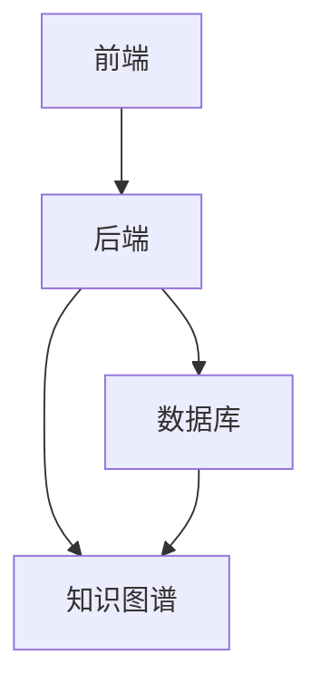

                 


# 《AI Agent在智能个性化教育中的应用》

---

## 关键词：AI Agent, 个性化教育, 人工智能, 教育技术, 智能系统, 知识图谱

---

## 摘要：  
随着人工智能技术的快速发展，AI Agent（人工智能代理）在教育领域的应用逐渐成为研究热点。本文深入探讨了AI Agent在智能个性化教育中的核心概念、技术原理、系统架构及实际应用。通过分析AI Agent的感知、决策和执行机制，结合具体教育场景，展示了其在个性化学习路径规划、教育资源推荐、智能交互等方面的优势。本文还详细讲解了AI Agent的算法实现，如推荐算法、自然语言处理和强化学习，并通过项目实战案例，展示了如何构建一个基于AI Agent的智能教育系统。最后，本文总结了当前AI Agent在教育中的应用现状，并展望了未来的发展方向。

---

# 第1章：AI Agent的基本概念与技术原理

## 1.1 AI Agent的定义与核心特征

### 1.1.1 AI Agent的基本概念  
AI Agent是一种能够感知环境、自主决策并执行任务的智能实体。它通过与用户或环境的交互，能够理解需求、解决问题并提供个性化服务。在教育领域，AI Agent可以作为学习助手，帮助学生完成个性化学习目标。

### 1.1.2 AI Agent的核心特征  
AI Agent具有以下核心特征：  
1. **自主性**：能够在无需外部干预的情况下独立运行。  
2. **反应性**：能够实时感知环境并做出响应。  
3. **目标导向性**：以实现特定目标为导向进行决策。  
4. **学习能力**：能够通过数据和经验不断优化自身性能。  

### 1.1.3 AI Agent与传统教育技术的区别  
传统教育技术主要依赖于固定的课程内容和教师的指导，而AI Agent能够根据学生的学习情况动态调整教学策略，提供个性化的学习路径和资源推荐。

---

## 1.2 AI Agent在教育中的作用

### 1.2.1 AI Agent在个性化教育中的优势  
AI Agent能够根据学生的学习进度、兴趣和能力，提供个性化的学习建议和资源推荐，从而提高学习效率和效果。

### 1.2.2 AI Agent在教育中的应用场景  
1. **学习路径规划**：根据学生的学习目标和能力，制定个性化的学习计划。  
2. **资源推荐**：基于学生的学习需求，推荐适合的教材、视频和练习题。  
3. **智能交互**：通过自然语言处理技术，与学生进行实时对话，解答问题并提供建议。  

### 1.2.3 AI Agent对教育模式的变革  
AI Agent的引入将教育从传统的“以教师为中心”模式转变为“以学生为中心”的模式，使教育更加灵活和个性化。

---

## 1.3 智能个性化教育的需求与挑战

### 1.3.1 个性化教育的需求分析  
个性化教育需求主要体现在以下几个方面：  
1. **学习目标的多样化**：学生有不同的学习目标和兴趣。  
2. **学习节奏的差异化**：学生的学习速度和进度各不相同。  
3. **学习资源的丰富性**：需要提供多样化的学习资源以满足不同需求。  

### 1.3.2 AI Agent在教育中的技术挑战  
1. **数据隐私与安全**：学生数据的收集和使用需要符合隐私保护法规。  
2. **模型可解释性**：AI Agent的决策过程需要透明，以便教师和学生理解。  
3. **多模态数据处理**：需要处理文本、语音、图像等多种数据类型。  

### 1.3.3 教育场景中的伦理与隐私问题  
AI Agent在教育中的应用需要遵守伦理规范，确保数据的合法使用和保护学生隐私。

---

## 1.4 本章小结  
本章介绍了AI Agent的基本概念和核心特征，分析了其在教育中的作用和优势，并探讨了智能个性化教育的需求与挑战。下一章将深入探讨AI Agent的核心概念与原理，包括感知、决策和执行机制。

---

# 第2章：AI Agent的核心概念与原理

## 2.1 AI Agent的感知机制

### 2.1.1 数据采集与处理  
AI Agent通过传感器、数据库或用户输入等方式采集数据，并对其进行清洗、特征提取和预处理。  

### 2.1.2 知识表示与推理  
知识表示是将知识以计算机可理解的形式表示，常用的知识表示方法包括语义网络、知识图谱等。推理则是基于知识库进行逻辑推理，以支持决策。  

### 2.1.3 感知模型的构建  
感知模型通常基于机器学习算法，如支持向量机（SVM）和随机森林（Random Forest），用于分类、回归和聚类等任务。  

---

## 2.2 AI Agent的决策机制

### 2.2.1 决策树与规则引擎  
决策树是一种基于树状结构的决策方法，规则引擎则通过预定义的规则进行决策。  

### 2.2.2 基于机器学习的决策模型  
基于机器学习的决策模型包括支持向量机（SVM）、神经网络和强化学习等，能够处理复杂的问题并提供高精度的决策。  

### 2.2.3 多目标优化与权衡  
在教育场景中，决策通常需要在多个目标之间进行权衡，如学习效率与学习兴趣之间的平衡。  

---

## 2.3 AI Agent的执行机制

### 2.3.1 动作规划与执行  
动作规划是指根据决策结果制定具体的操作步骤，并通过执行模块完成任务。  

### 2.3.2 反馈机制与自适应调整  
AI Agent通过实时反馈不断调整其行为，以优化学习效果。  

### 2.3.3 执行过程中的异常处理  
在执行过程中，AI Agent需要能够识别和处理异常情况，确保系统的稳定运行。  

---

## 2.4 AI Agent的核心算法与数学模型

### 2.4.1 基于强化学习的决策模型  
强化学习是一种通过试错机制优化决策的算法，广泛应用于游戏、机器人等领域。  

### 2.4.2 基于图论的知识表示方法  
知识图谱是一种基于图论的知识表示方法，能够有效地表示复杂的知识关系。  

### 2.4.3 基于概率论的不确定性处理  
概率论是处理不确定性问题的重要工具，常用于分类、预测和决策等领域。  

---

## 2.5 本章小结  
本章详细讲解了AI Agent的核心概念与原理，包括感知、决策和执行机制，以及相关算法与数学模型。下一章将探讨AI Agent在教育中的系统架构与设计。

---

# 第3章：AI Agent在教育中的系统架构与设计

## 3.1 教育场景中的系统需求分析

### 3.1.1 用户需求分析  
用户包括学生、教师和家长，他们分别有不同的需求和使用场景。  

### 3.1.2 功能需求分析  
系统需要具备知识图谱构建、学习路径规划、资源推荐和智能交互等功能。  

### 3.1.3 性能需求分析  
系统需要具备高可用性、低延迟和高扩展性，以支持大规模用户同时在线使用。  

---

## 3.2 系统功能设计

### 3.2.1 知识图谱构建

#### 3.2.1.1 知识图谱的概念与作用
知识图谱是一种结构化的知识表示方法，能够帮助AI Agent更好地理解和组织知识。

#### 3.2.1.2 知识图谱的构建流程
1. 数据收集：从多种来源收集教育相关数据。  
2. 数据清洗：去除噪声数据，确保数据质量。  
3. 实体识别与抽取：从数据中提取实体和关系。  
4. 知识融合：将不同来源的知识进行整合。  
5. 知识表示：将知识以图结构的形式表示。  

#### 3.2.1.3 知识图谱的可视化
知识图谱可以通过图数据库（如Neo4j）进行存储和可视化，帮助教师和学生更好地理解知识结构。  

---

## 3.3 系统架构设计

### 3.3.1 系统架构概述
AI Agent教育系统的架构通常包括前端、后端和数据层。前端负责用户交互，后端负责业务逻辑处理，数据层负责数据存储和管理。  

### 3.3.2 系统架构图


---

## 3.4 系统接口设计

### 3.4.1 API接口设计
系统需要提供RESTful API接口，供其他系统或应用调用。  

### 3.4.2 接口文档
接口文档需要详细描述API的功能、参数、返回值和调用方式。  

---

## 3.5 系统交互设计

### 3.5.1 交互流程设计
用户与AI Agent的交互流程通常包括：需求分析、任务分配、执行任务和反馈结果。  

### 3.5.2 交互界面设计
交互界面需要简洁直观，确保用户能够轻松完成操作。  

---

## 3.6 本章小结  
本章详细探讨了AI Agent在教育中的系统架构与设计，包括需求分析、功能设计、架构设计和接口设计。下一章将深入探讨AI Agent的算法与数学模型实现。

---

# 第4章：AI Agent的算法与数学模型实现

## 4.1 推荐算法

### 4.1.1 基于协同过滤的推荐算法
协同过滤是一种基于用户行为的推荐算法，分为基于用户的协同过滤和基于物品的协同过滤。  

#### 4.1.1.1 基于用户的协同过滤
基于用户的协同过滤通过寻找与当前用户相似的用户，推荐这些用户喜欢的物品。  

#### 4.1.1.2 基于物品的协同过滤
基于物品的协同过滤通过分析物品之间的相似性，推荐与当前物品相似的物品。  

### 4.1.2 基于深度学习的推荐算法
基于深度学习的推荐算法包括神经网络协同过滤（Neural Collaborative Filtering, NCF）和图神经网络（Graph Neural Network, GNN）。  

---

## 4.2 自然语言处理

### 4.2.1 基于词嵌入的文本表示
词嵌入是一种将单词或短语映射到高维向量空间的技术，常用算法包括Word2Vec和GloVe。  

### 4.2.2 基于序列模型的文本生成
序列模型如循环神经网络（RNN）和Transformer模型常用于文本生成任务。  

---

## 4.3 强化学习

### 4.3.1 Q-Learning算法
Q-Learning是一种经典的强化学习算法，适用于离线学习场景。  

### 4.3.2 Deep Q-Network (DQN)
DQN通过深度神经网络近似Q值函数，能够处理高维状态空间和动作空间。  

---

## 4.4 本章小结  
本章详细讲解了AI Agent在教育中的算法与数学模型实现，包括推荐算法、自然语言处理和强化学习。下一章将通过具体案例展示这些算法的应用。

---

# 第5章：AI Agent教育系统的项目实战

## 5.1 环境安装与配置

### 5.1.1 系统环境
- 操作系统：Linux/Windows/MacOS  
- Python版本：3.6+  
- 依赖库：TensorFlow、Keras、Neo4j、Flask  

### 5.1.2 安装步骤
1. 安装Python环境：`python --version`  
2. 安装依赖库：`pip install -r requirements.txt`  

---

## 5.2 系统核心实现

### 5.2.1 知识图谱构建
代码示例：
```python
from neo4j import GraphDatabase
from neo4j.exceptions importNeo4jError

class KnowledgeGraph:
    def __init__(self, uri, user, password):
        self.driver = GraphDatabase.driver(uri, auth=(user, password))
    
    def create_node(self, label, properties):
        with self.driver.session() as session:
            session.write_transaction(self._create_node, label, properties)
    
    def _create_node(self, tx, label, properties):
        node = tx.create_node(label, properties)
        return node
    
    def create_relationship(self, start_label, start_id, end_label, end_id, relation_type):
        with self.driver.session() as session:
            session.write_transaction(self._create_relationship, start_label, start_id, end_label, end_id, relation_type)
    
    def _create_relationship(self, tx, start_label, start_id, end_label, end_id, relation_type):
        start_node = tx.find_node(start_label, 'id', start_id)
        end_node = tx.find_node(end_label, 'id', end_id)
        relationship = tx.create_relationship(relation_type, start_node, end_node)
        return relationship
```

### 5.2.2 学习路径规划
代码示例：
```python
def recommend_learning_path(user_id, knowledge_graph):
    # 获取用户当前的知识水平
    user_knowledge = knowledge_graph.get_user_knowledge(user_id)
    
    # 确定需要学习的模块
    required_modules = knowledge_graph.find_required_modules(user_knowledge)
    
    # 返回学习路径
    return required_modules
```

---

## 5.3 案例分析与总结

### 5.3.1 案例分析
以一名高中学生为例，系统为其推荐个性化的学习路径和资源。  

### 5.3.2 总结
通过项目实战，我们可以看到AI Agent在教育中的巨大潜力，但也需要解决数据隐私和模型可解释性等问题。

---

# 第6章：AI Agent在教育中的应用案例分析

## 6.1 应用案例分析

### 6.1.1 案例1：智能学习助手
AI Agent作为智能学习助手，为学生提供个性化的学习建议和资源推荐。  

### 6.1.2 案例2：智能考试系统
AI Agent通过分析学生的考试数据，提供个性化的复习计划和考试策略。  

---

## 6.2 总结与经验分享

### 6.2.1 成功经验
1. 数据的准确性和完整性是关键。  
2. 模型的可解释性有助于用户信任和接受。  
3. 系统的实时性和响应速度直接影响用户体验。  

### 6.2.2 案例分析总结
通过具体案例分析，我们可以看到AI Agent在教育中的应用前景广阔，但也需要在实践中不断优化和改进。

---

# 第7章：总结与展望

## 7.1 全文总结

### 7.1.1 核心内容回顾
本文从AI Agent的基本概念出发，深入探讨了其在教育中的应用，包括感知、决策和执行机制，以及系统的架构设计和算法实现。  

### 7.1.2 主要结论
AI Agent在智能个性化教育中的应用前景广阔，能够显著提升学习效率和效果，但也需要解决数据隐私和模型可解释性等挑战。

---

## 7.2 未来展望

### 7.2.1 技术发展
随着人工智能技术的不断进步，AI Agent在教育中的应用将更加智能化和个性化。  

### 7.2.2 应用场景扩展
未来，AI Agent将不仅仅局限于个性化学习，还将扩展到教育管理、教师辅助等领域。  

### 7.2.3 挑战与机遇
尽管面临数据隐私和模型可解释性等挑战，但AI Agent在教育中的应用也带来了巨大的机遇，如提高教育质量、促进教育公平等。  

---

## 7.3 最佳实践Tips

### 7.3.1 数据隐私保护
在收集和使用学生数据时，必须严格遵守相关法律法规，确保数据隐私和安全。  

### 7.3.2 模型可解释性
模型的可解释性是用户信任和接受AI Agent的关键，需要在设计和实现中注重模型的透明性。  

### 7.3.3 系统安全性
系统的安全性是保障用户数据和系统稳定性的基石，需要在设计和实现中加强安全防护。  

---

## 7.4 本章小结  
本章总结了全文的主要内容，并展望了AI Agent在教育中的未来发展方向。通过最佳实践Tips，本文为读者提供了宝贵的建议和启示。

---

## 作者：AI天才研究院/AI Genius Institute & 禅与计算机程序设计艺术/Zen And The Art of Computer Programming  

---

**注意：文章中涉及到的代码示例、图表和公式等内容需要根据实际内容补充和完善，以确保文章的完整性和专业性。**

