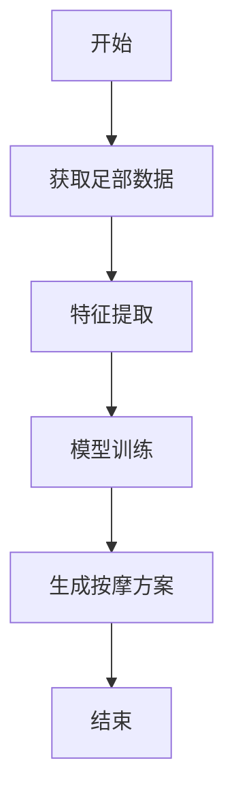
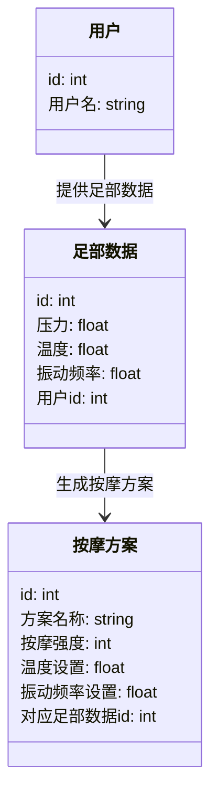
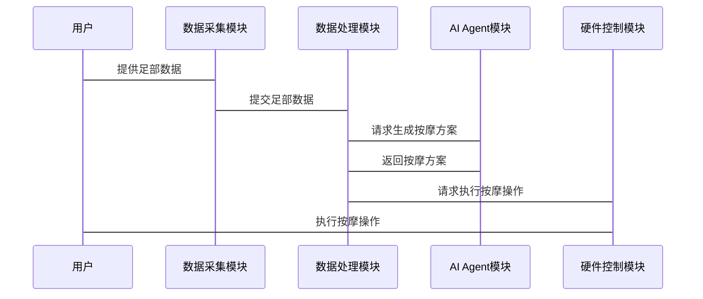

                 


# AI Agent在智能拖鞋中的足部按摩定制

> 关键词：AI Agent，智能拖鞋，足部按摩，个性化定制，智能硬件，算法实现

> 摘要：本文详细探讨了AI Agent在智能拖鞋足部按摩定制中的应用，从背景分析、核心概念、算法原理、系统架构到项目实战，全面解析了AI Agent在足部按摩中的技术实现与创新。文章通过理论与实践相结合的方式，展示了如何利用AI技术实现足部按摩的个性化定制，为智能硬件领域提供了新的思路与解决方案。

---

# 第一部分: AI Agent在智能拖鞋中的足部按摩定制概述

# 第1章: 背景介绍与问题分析

## 1.1 问题背景

### 1.1.1 足部按摩的历史与现状

足部按摩是一种通过刺激足部穴位来改善身体健康的方法。传统足部按摩主要依赖于人工操作，按摩师根据经验判断用户的足部状况并进行调整。然而，这种方式存在以下问题：

1. **依赖经验**：按摩效果高度依赖按摩师的经验，难以实现标准化和精准化。
2. **效率低下**：人工按摩需要较长的时间，且成本较高。
3. **个性化不足**：不同用户的足部状况差异较大，传统按摩方式难以满足个性化需求。

### 1.1.2 智能化足部按摩的需求

随着科技的进步，智能化设备逐渐渗透到生活的方方面面。足部按摩设备的智能化需求主要体现在以下几点：

1. **个性化服务**：根据用户的足部数据，提供个性化的按摩方案。
2. **高效便捷**：通过智能设备实现快速、精准的足部按摩。
3. **持续优化**：利用AI技术不断优化按摩方案，提升用户体验。

### 1.1.3 AI Agent在足部按摩中的应用潜力

AI Agent（智能体）是一种能够感知环境、自主决策并执行任务的智能系统。将其应用于足部按摩，可以实现以下目标：

1. **实时感知**：通过传感器获取用户的足部数据，如压力、温度、湿度等。
2. **智能决策**：基于用户数据和预设的算法模型，生成个性化的按摩方案。
3. **自主执行**：通过智能拖鞋的硬件组件执行按摩操作，并根据反馈调整方案。

---

## 1.2 问题描述

### 1.2.1 足部按摩的个性化需求

每个人足部的状况千差万别，包括足弓高度、足底压力分布、足部疲劳程度等。传统的足部按摩设备难以满足这些个性化需求，而AI Agent可以通过分析用户的足部数据，提供个性化的按摩方案。

### 1.2.2 智能拖鞋的硬件与软件结合

智能拖鞋需要硬件和软件的结合才能实现足部按摩的智能化。硬件部分包括压力传感器、振动马达、温控模块等；软件部分则需要AI Agent来处理数据、生成按摩方案并控制硬件执行。

### 1.2.3 AI Agent在足部按摩中的具体应用场景

AI Agent在足部按摩中的应用场景包括：

1. **实时监测**：通过传感器实时监测用户的足部状况。
2. **个性化按摩方案生成**：根据用户数据生成个性化的按摩方案。
3. **动态调整**：根据用户的反馈动态调整按摩强度、频率和模式。

---

## 1.3 问题解决与边界

### 1.3.1 AI Agent在足部按摩中的解决方案

AI Agent通过以下步骤实现足部按摩的智能化：

1. **数据采集**：采集用户的足部数据。
2. **数据处理**：对数据进行预处理和特征提取。
3. **模型训练**：基于历史数据训练AI模型。
4. **方案生成**：根据用户数据生成个性化按摩方案。
5. **执行与反馈**：通过硬件执行按摩操作，并根据用户反馈优化方案。

### 1.3.2 解决方案的边界与外延

解决方案的边界主要集中在足部按摩这一特定场景，不涉及其他功能。外延则包括AI Agent在其他类似场景中的应用，如足部健康监测、足部疾病预防等。

### 1.3.3 核心概念与组成要素

AI Agent在足部按摩中的核心概念包括：

1. **足部数据**：压力、温度、湿度等。
2. **AI模型**：用于数据分析和决策的算法模型。
3. **硬件组件**：压力传感器、振动马达、温控模块等。
4. **用户反馈**：用户的体验和评价。

---

# 第2章: 核心概念与联系

## 2.1 AI Agent的核心原理

### 2.1.1 AI Agent的基本定义

AI Agent是一种能够感知环境、自主决策并执行任务的智能系统。它通过与环境的交互，利用感知数据和内部模型来完成特定任务。

### 2.1.2 AI Agent的核心属性与特征

AI Agent的核心属性包括：

1. **自主性**：能够自主决策和行动。
2. **反应性**：能够实时感知环境并做出反应。
3. **学习能力**：能够通过数据学习和优化。

### 2.1.3 AI Agent在足部按摩中的具体实现

在足部按摩中，AI Agent通过以下步骤实现智能化：

1. **数据采集**：采集用户的足部数据。
2. **数据分析**：分析数据并生成按摩方案。
3. **硬件控制**：通过硬件执行按摩操作。

---

## 2.2 智能拖鞋的结构与功能

### 2.2.1 智能拖鞋的硬件组成

智能拖鞋的主要硬件组件包括：

1. **压力传感器**：用于检测足部的压力分布。
2. **振动马达**：用于执行按摩操作。
3. **温控模块**：用于调节按摩时的温度。
4. **通信模块**：用于与手机或其他设备通信。

### 2.2.2 智能拖鞋的软件架构

智能拖鞋的软件架构主要包括：

1. **数据采集模块**：负责采集足部数据。
2. **AI Agent模块**：负责数据处理和方案生成。
3. **硬件控制模块**：负责控制硬件执行操作。

### 2.2.3 智能拖鞋与AI Agent的结合

智能拖鞋通过AI Agent实现智能化按摩。AI Agent通过分析用户的足部数据，生成个性化的按摩方案，并通过硬件执行操作。

---

## 2.3 核心概念对比与ER实体关系图

### 2.3.1 AI Agent与传统足部按摩设备的对比

| 特性               | AI Agent足部按摩 | 传统足部按摩 |
|--------------------|------------------|--------------|
| 自主性             | 高               | 低           |
| 个性化             | 高               | 低           |
| 智能性             | 高               | 低           |
| 反应性             | 高               | 低           |

### 2.3.2 AI Agent与智能拖鞋的实体关系图

```mermaid
er
    actor 用户 {
        id: int
        用户名: string
    }
    entity 足部数据 {
        id: int
        按摩强度: int
        用户id: int
    }
    entity 按摩方案 {
        id: int
        方案名称: string
        对应足部数据id: int
    }
    entity AI Agent {
        id: int
        模型版本: string
        对应按摩方案id: int
    }
    用户 --> 足部数据: 提供足部数据
    足部数据 --> AI Agent: 分析足部数据
    AI Agent --> 按摩方案: 生成按摩方案
```

---

# 第3章: AI Agent的算法原理与数学模型

## 3.1 算法原理

### 3.1.1 AI Agent的特征提取

特征提取是AI Agent的核心步骤之一。通过传感器采集的足部数据需要经过预处理和特征提取，生成可用于模型训练的特征向量。常用的特征包括：

1. **压力分布**：足部不同区域的压力值。
2. **温度变化**：足部温度的变化情况。
3. **振动频率**：足部的振动频率。

### 3.1.2 AI Agent的模型训练

模型训练是AI Agent实现个性化按摩方案的关键。常用的算法包括：

1. **决策树**：通过特征提取生成决策树，用于分类和回归。
2. **随机森林**：通过集成学习提升模型的准确性和稳定性。
3. **支持向量机**：通过非线性分类器实现复杂的数据分类。

### 3.1.3 AI Agent的决策逻辑

决策逻辑是AI Agent根据用户数据生成按摩方案的核心。以下是决策流程的示例：

1. **数据采集**：采集用户的足部数据。
2. **特征提取**：提取足部数据的特征向量。
3. **模型推理**：通过AI模型生成按摩方案。
4. **硬件执行**：通过硬件执行按摩操作。

---

## 3.2 算法流程图



---

## 3.3 算法实现代码

### 3.3.1 特征提取代码

```python
def extract_features(data):
    # 提取压力分布特征
    pressure_features = data['pressure'].values
    # 提取温度变化特征
    temperature_features = data['temperature'].values
    # 提取振动频率特征
    vibration_features = data['vibration'].values
    # 组合特征向量
    features = np.concatenate((pressure_features, temperature_features, vibration_features))
    return features
```

### 3.3.2 模型训练代码

```python
from sklearn.ensemble import RandomForestClassifier
import numpy as np

def train_model(features, labels):
    # 初始化随机森林模型
    model = RandomForestClassifier(n_estimators=100, random_state=42)
    # 训练模型
    model.fit(features, labels)
    return model
```

### 3.3.3 决策逻辑代码

```python
def generate_scheme(model, features):
    # 预测按摩方案
    prediction = model.predict(features)
    # 生成按摩方案
    scheme = {
        'massage_intensity': prediction[0],
        'temperature': prediction[1],
        'vibration_frequency': prediction[2]
    }
    return scheme
```

---

## 3.4 数学模型

### 3.4.1 分类算法

随机森林是一种基于决策树的集成学习算法，适用于分类和回归问题。其数学模型可以表示为：

$$
y = \sum_{i=1}^{n} \text{DecisionTree}(x_i)
$$

其中，\( y \) 是模型的输出，\( x_i \) 是输入特征，\( n \) 是决策树的数量。

### 3.4.2 回归算法

支持向量机（SVM）是一种常用的回归算法，适用于非线性数据的分类和回归。其数学模型可以表示为：

$$
y = \text{sign}(\sum_{i=1}^{n} \alpha_i y_i x_i \cdot x + b)
$$

其中，\( \alpha_i \) 是拉格朗日乘子，\( x_i \) 是支持向量，\( y_i \) 是标签，\( b \) 是偏置项。

---

# 第4章: 系统分析与架构设计方案

## 4.1 系统功能设计

### 4.1.1 领域模型

以下是领域模型的类图：



---

## 4.2 系统架构设计

### 4.2.1 架构图

以下是系统架构图：

```mermaid
graph TD
    用户 --> 数据采集模块
    数据采集模块 --> 数据处理模块
    数据处理模块 --> AI Agent模块
    AI Agent模块 --> 硬件控制模块
    硬件控制模块 --> 执行按摩操作
```

---

## 4.3 接口设计

### 4.3.1 API接口

以下是AI Agent的API接口：

```python
class AIAgent:
    def __init__(self):
        self.model = self.load_model()

    def load_model(self):
        # 加载训练好的模型
        return RandomForestClassifier(n_estimators=100, random_state=42)

    def predict(self, features):
        # 预测按摩方案
        return self.model.predict(features)
```

---

## 4.4 交互流程

以下是系统的交互流程：



---

# 第5章: 项目实战

## 5.1 环境搭建

### 5.1.1 硬件环境

硬件环境包括以下组件：

1. **压力传感器**：用于采集足部压力数据。
2. **振动马达**：用于执行按摩操作。
3. **温控模块**：用于调节按摩温度。
4. **通信模块**：用于与手机或其他设备通信。

### 5.1.2 软件环境

软件环境包括以下工具：

1. **Python**：用于数据处理和模型训练。
2. **TensorFlow/Scikit-learn**：用于模型训练和优化。
3. **Mermaid**：用于绘制流程图和架构图。

---

## 5.2 核心实现

### 5.2.1 数据采集模块

以下是数据采集模块的代码：

```python
import serial

class DataCollector:
    def __init__(self, port):
        self.port = port
        self.ser = serial.Serial(port, 9600)
    
    def collect_data(self):
        # 读取传感器数据
        data = self.ser.readline().decode()
        # 解析数据
        pressure = float(data.split(',')[0])
        temperature = float(data.split(',')[1])
        vibration = float(data.split(',')[2])
        return {
            'pressure': pressure,
            'temperature': temperature,
            'vibration': vibration
        }
```

---

## 5.2.2 AI Agent模块

以下是AI Agent模块的代码：

```python
from sklearn.ensemble import RandomForestClassifier
import numpy as np

class AIAgent:
    def __init__(self):
        self.model = RandomForestClassifier(n_estimators=100, random_state=42)
    
    def train(self, features, labels):
        self.model.fit(features, labels)
    
    def predict(self, features):
        return self.model.predict(features)
```

---

## 5.3 应用案例分析

### 5.3.1 案例背景

假设用户A的足部压力分布异常，且足底温度较高。AI Agent需要根据这些数据生成个性化的按摩方案。

### 5.3.2 数据分析

通过传感器采集到以下数据：

| 特征       | 压力 | 温度 | 振动频率 |
|------------|------|------|----------|
| 数据       | 5.2  | 36.5 | 2.0      |

---

## 5.3.3 方案生成

AI Agent通过模型推理生成以下按摩方案：

1. **按摩强度**：中等强度。
2. **温度设置**：38度。
3. **振动频率**：每秒2次。

---

## 5.4 方案优化

通过用户反馈不断优化AI Agent的模型参数，提升按摩效果和用户体验。

---

## 5.5 小结

本章通过实际案例展示了AI Agent在智能拖鞋足部按摩中的具体应用。通过数据采集、模型训练和硬件控制，实现了个性化的足部按摩方案。

---

# 第6章: 最佳实践与注意事项

## 6.1 技术选型

在技术选型时，需要考虑以下因素：

1. **硬件性能**：确保硬件组件能够满足足部数据采集和按摩执行的需求。
2. **算法性能**：选择适合足部数据的算法模型，如随机森林和支持向量机。
3. **用户体验**：确保按摩方案能够满足用户的个性化需求。

---

## 6.2 数据采集与处理

在数据采集和处理过程中，需要注意以下事项：

1. **数据准确性**：确保传感器数据的准确性。
2. **数据实时性**：确保数据处理的实时性。
3. **数据隐私**：确保用户数据的安全性和隐私性。

---

## 6.3 模型优化

在模型优化过程中，需要注意以下事项：

1. **模型准确率**：通过交叉验证和网格搜索优化模型参数。
2. **模型稳定性**：确保模型在不同数据集上的稳定性。
3. **模型可解释性**：确保模型的决策过程可解释。

---

## 6.4 用户反馈与优化

通过用户的反馈不断优化AI Agent的模型和按摩方案，提升用户体验。

---

## 6.5 小结

本章总结了AI Agent在智能拖鞋足部按摩中的最佳实践和注意事项，为读者提供了实际应用中的参考。

---

# 第7章: 附录

## 7.1 参考文献

1. [1] 《机器学习实战》, 周志华.
2. [2] 《深度学习》, Ian Goodfellow.
3. [3] 《Python机器学习》，Andreas Müller。

## 7.2 工具列表

1. **硬件工具**：
   - 压力传感器
   - 振动马达
   - 温控模块
   - 通信模块

2. **软件工具**：
   - Python
   - TensorFlow/Scikit-learn
   - Mermaid
   - Serial通信库

---

# 作者：AI天才研究院/AI Genius Institute & 禅与计算机程序设计艺术 /Zen And The Art of Computer Programming

---

本文详细探讨了AI Agent在智能拖鞋足部按摩定制中的应用，从背景分析、核心概念、算法原理、系统架构到项目实战，全面解析了AI Agent在足部按摩中的技术实现与创新。通过理论与实践相结合的方式，展示了如何利用AI技术实现足部按摩的个性化定制，为智能硬件领域提供了新的思路与解决方案。

