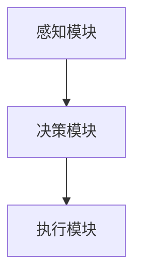

                 


# AI Agent的持续学习：保持知识更新

> 关键词：AI Agent, 持续学习, 知识更新, 在线学习, 离线学习, 模型更新, 数据管理

> 摘要：AI Agent的持续学习是确保其在动态环境中保持高效和准确的关键。本文详细探讨了AI Agent持续学习的背景、核心概念、算法原理、系统架构设计以及实际应用案例。通过分析在线学习和离线学习的机制，模型更新策略，数据管理方法，系统架构设计，项目实战，最佳实践等多方面内容，本文为读者提供了全面的指导，帮助他们理解并实现AI Agent的持续学习。

---

## 正文

---

### 第1章: AI Agent与持续学习概述

#### 1.1 AI Agent的基本概念

##### 1.1.1 什么是AI Agent
AI Agent（人工智能代理）是指能够感知环境并采取行动以实现目标的智能实体。AI Agent可以是软件程序、机器人或其他智能系统，其核心目标是通过感知和行动与环境交互，完成特定任务。

##### 1.1.2 AI Agent的核心特征
- **自主性**：能够在没有外部干预的情况下独立运作。
- **反应性**：能够根据环境的变化实时调整行为。
- **目标导向**：所有行动都以实现特定目标为导向。
- **学习能力**：通过经验或数据不断优化自身性能。

##### 1.1.3 AI Agent的应用场景
- **智能助手**：如Siri、Alexa等，能够根据用户需求执行任务。
- **自动驾驶**：通过实时感知和决策实现自主驾驶。
- **智能客服**：通过自然语言处理与用户交互，解决用户问题。

#### 1.2 持续学习的定义与重要性

##### 1.2.1 持续学习的定义
持续学习是指AI Agent在运行过程中，能够不断更新和扩展其知识库，以适应新的数据和环境变化。与传统的离线训练不同，持续学习强调在线更新和动态调整。

##### 1.2.2 持续学习的重要性
- **适应性**：能够快速适应新环境和新任务。
- **实时性**：在动态环境中保持高效反应。
- **可扩展性**：能够处理不断增加的数据量和任务复杂性。

##### 1.2.3 持续学习与传统机器学习的区别
| 特性          | 传统机器学习               | 持续学习                  |
|---------------|-----------------------------|---------------------------|
| 数据处理      | 离线训练，一次性输入数据     | 在线处理，实时更新数据     |
| 适应性        | 无法适应新数据             | 能够实时适应新数据         |
| 应用场景      | 静态环境，数据变化不大       | 动态环境，数据变化频繁       |

#### 1.3 AI Agent持续学习的应用场景

##### 1.3.1 在智能助手中的应用
AI Agent通过持续学习，能够根据用户的使用习惯和反馈，不断优化其响应策略，提供更个性化的服务。

##### 1.3.2 在自动驾驶中的应用
自动驾驶系统需要实时处理道路状况、交通信号和其他车辆的动态，持续学习能够帮助系统快速适应各种复杂场景。

##### 1.3.3 在智能客服中的应用
智能客服通过持续学习，能够不断优化其对话策略，提高问题解决效率和用户满意度。

#### 1.4 本章小结
本章介绍了AI Agent的基本概念、持续学习的重要性以及其在不同场景中的应用。持续学习是AI Agent在动态环境中保持高效和准确的关键能力。

---

### 第2章: 持续学习的基本机制

#### 2.1 在线学习机制

##### 2.1.1 在线学习的实时更新特点
在线学习的核心特点是实时更新。AI Agent在接收到新数据后，能够立即调整其模型参数，以适应新数据的变化。

##### 2.1.2 数据流处理与模型更新
在线学习通常处理的是数据流，数据以实时的方式不断输入到系统中。模型更新需要在数据流中进行，以保证实时性。

##### 2.1.3 在线学习的优缺点分析
- **优点**：实时性强，能够快速适应新数据。
- **缺点**：计算资源消耗较大，模型更新需要实时处理。

##### 2.1.4 在线学习的数学模型
在线学习的模型更新可以表示为：
$$ w_{t+1} = w_t + \eta (y_t - \hat{y}_t) $$
其中，$w_t$ 是当前的模型参数，$\eta$ 是学习率，$y_t$ 是真实标签，$\hat{y}_t$ 是模型预测值。

#### 2.2 离线学习机制

##### 2.2.1 离线学习的批量处理特点
离线学习的核心是批量处理数据。AI Agent在离线阶段一次性加载所有数据，并进行批量训练。

##### 2.2.2 离线学习的数据预处理步骤
离线学习通常需要进行数据清洗、特征提取等预处理步骤，以确保数据质量。

##### 2.2.3 离线学习的周期性更新策略
离线学习通常在特定时间点（如每天结束时）进行模型更新，以保证模型的稳定性和准确性。

##### 2.2.4 离线学习的数学模型
离线学习的模型更新可以表示为：
$$ \min_{w} \sum_{i=1}^{n} (y_i - \hat{y}_i)^2 $$

#### 2.3 混合学习机制

##### 2.3.1 在线与离线学习的结合
混合学习机制结合了在线和离线学习的优点，能够在保证实时性的同时，进行高效的批量更新。

##### 2.3.2 混合学习的优势与挑战
- **优势**：结合了在线学习的实时性和离线学习的高效性。
- **挑战**：需要协调在线和离线更新的频率和时间。

##### 2.3.3 混合学习的实际应用案例
混合学习机制在智能推荐系统中得到了广泛应用。系统可以在用户交互时实时更新推荐策略，同时定期进行批量优化。

#### 2.4 本章小结
本章详细介绍了在线学习和离线学习的基本机制，以及混合学习的优势和挑战。了解这些机制有助于设计高效的AI Agent持续学习系统。

---

### 第3章: AI Agent的模型更新策略

#### 3.1 参数化更新策略

##### 3.1.1 微调模型参数的方法
微调是一种常见的参数化更新策略。通过在新数据上进行微调训练，可以逐步调整模型参数，使其适应新任务。

##### 3.1.2 知识蒸馏技术的应用
知识蒸馏是一种通过教师模型指导学生模型学习的技术。教师模型通常是一个预训练的大模型，学生模型则是一个较小的模型。通过知识蒸馏，学生模型能够继承教师模型的知识，从而实现快速更新。

##### 3.1.3 参数化更新的数学模型
参数化更新可以通过梯度下降方法实现：
$$ \theta_{t+1} = \theta_t - \eta \nabla J(\theta_t) $$
其中，$\theta_t$ 是当前的模型参数，$\eta$ 是学习率，$J(\theta_t)$ 是损失函数。

#### 3.2 非参数化更新策略

##### 3.2.1 知识图谱的构建与更新
知识图谱是一种以图结构表示知识的方式。非参数化更新策略通过动态更新知识图谱，保持模型的知识库最新。

##### 3.2.2 嵌入存储技术的应用
嵌入存储是一种将知识表示为向量的技术。非参数化更新策略通过更新这些向量，实现知识库的动态调整。

##### 3.2.3 非参数化更新的数学模型
非参数化更新可以通过最近邻搜索实现：
$$ \text{更新向量} = \text{最近邻向量} + \delta $$
其中，$\delta$ 是更新量。

#### 3.3 模型更新策略的选择
| 情况          | 参数化更新策略             | 非参数化更新策略           |
|---------------|-----------------------------|-----------------------------|
| 数据量        | 适用于小数据集             | 适用于大数据集             |
| 计算资源      | 计算资源消耗较低           | 计算资源消耗较高           |
| 适应性        | 更新速度较快             | 更新速度较慢               |

#### 3.4 本章小结
本章介绍了参数化和非参数化两种模型更新策略，并分析了它们的优缺点。选择合适的更新策略对于AI Agent的持续学习至关重要。

---

### 第4章: AI Agent的持续学习中的数据管理

#### 4.1 数据预处理与特征提取

##### 4.1.1 数据清洗
数据清洗是去除噪声数据，确保数据质量的重要步骤。

##### 4.1.2 特征提取
特征提取是将原始数据转换为更有意义的特征表示的过程。

##### 4.1.3 数据增强
数据增强是通过增加数据的多样性和复杂性，提高模型的泛化能力。

#### 4.2 数据流的实时处理

##### 4.2.1 数据流的实时处理方法
数据流的实时处理需要高效的队列管理和并行处理技术。

##### 4.2.2 数据流的存储与管理
实时数据需要高效的存储和管理策略，以保证快速访问和更新。

#### 4.3 数据版本控制

##### 4.3.1 数据版本控制的重要性
数据版本控制能够保证数据的可追溯性和一致性。

##### 4.3.2 数据版本控制的实现方法
数据版本控制可以通过版本号和元数据管理实现。

#### 4.4 数据安全与隐私保护

##### 4.4.1 数据安全的重要性
数据安全是持续学习系统中不可忽视的重要因素。

##### 4.4.2 数据隐私保护的实现方法
数据隐私保护可以通过加密技术和访问控制实现。

#### 4.5 本章小结
本章讨论了AI Agent持续学习中的数据管理策略，包括数据预处理、实时处理、版本控制和安全保护等方面。

---

### 第5章: AI Agent的系统架构设计

#### 5.1 系统功能设计

##### 5.1.1 系统功能模块
AI Agent的系统功能模块包括感知模块、决策模块和执行模块。

##### 5.1.2 功能模块之间的关系
感知模块负责数据采集，决策模块负责策略制定，执行模块负责行动执行。

#### 5.2 系统架构设计

##### 5.2.1 系统架构图


##### 5.2.2 系统组件之间的交互
感知模块通过传感器或数据接口获取环境信息，传递给决策模块。决策模块根据当前状态和目标，制定行动策略，并将指令传递给执行模块。执行模块根据决策模块的指令，执行相应的动作，并将反馈信息传递给感知模块，形成闭环。

#### 5.3 系统接口设计

##### 5.3.1 接口定义
系统接口定义包括感知接口、决策接口和执行接口。

##### 5.3.2 接口协议
接口协议可以使用RESTful API或消息队列等方式实现。

#### 5.4 系统交互设计

##### 5.4.1 系统交互流程
感知模块 → 决策模块 → 执行模块 → 感知模块。

##### 5.4.2 交互流程优化
通过并行处理和异步通信，优化系统交互效率。

#### 5.5 本章小结
本章讨论了AI Agent的系统架构设计，包括功能模块、架构图和接口设计等方面。

---

### 第6章: 项目实战——实现一个持续学习的AI Agent

#### 6.1 环境安装

##### 6.1.1 安装Python
安装Python 3.8或更高版本。

##### 6.1.2 安装依赖库
安装TensorFlow、Keras、Scikit-learn等机器学习库。

#### 6.2 核心代码实现

##### 6.2.1 模型定义
```python
import tensorflow as tf
from tensorflow.keras import layers

model = tf.keras.Sequential([
    layers.Dense(64, activation='relu'),
    layers.Dense(1)
])
```

##### 6.2.2 模型训练
```python
model.compile(optimizer='adam', loss='mse')
model.fit(X_train, y_train, epochs=10, batch_size=32)
```

##### 6.2.3 模型更新
```python
def update_model(new_X, new_y):
    model.fit(new_X, new_y, epochs=5, batch_size=16)
```

#### 6.3 代码应用解读与分析

##### 6.3.1 模型定义的解读
定义了一个包含两个全连接层的深度学习模型，第一层有64个神经元，激活函数为ReLU，第二层有1个神经元，输出为回归值。

##### 6.3.2 模型训练的解读
使用Adam优化器和均方误差损失函数，训练模型10个 epochs，每个 batch size 为32。

##### 6.3.3 模型更新的解读
在接收到新数据时，进行5个 epochs的微调训练，每个 batch size 为16。

#### 6.4 实际案例分析

##### 6.4.1 案例背景
假设我们正在开发一个智能客服系统，需要通过持续学习来提高对话质量。

##### 6.4.2 案例实现
在每次用户与客服交互后，系统会收集新的对话数据，并进行模型更新。

##### 6.4.3 案例分析
通过持续学习，智能客服系统能够不断优化其对话策略，提高用户满意度。

#### 6.5 本章小结
本章通过一个实际案例，详细介绍了如何实现一个持续学习的AI Agent，包括环境安装、代码实现和案例分析等内容。

---

### 第7章: 总结与展望

#### 7.1 本章总结
本文详细探讨了AI Agent的持续学习问题，包括基本概念、学习机制、模型更新策略、数据管理、系统架构设计和项目实战等内容。通过这些内容的讨论，读者可以全面了解AI Agent的持续学习方法。

#### 7.2 未来展望
随着AI技术的不断发展，AI Agent的持续学习将更加智能化和自动化。未来的研究方向包括更高效的模型更新方法、更智能的数据管理策略以及更强大的系统架构设计。

#### 7.3 最佳实践 tips

##### 7.3.1 模型更新的频率
模型更新的频率需要根据具体场景和资源情况来定。频繁的更新能够提高实时性，但会增加计算开销。

##### 7.3.2 数据管理的重要性
数据管理是持续学习系统中不可忽视的重要部分，高质量的数据是模型性能的基础。

##### 7.3.3 系统架构的设计
系统架构设计需要充分考虑扩展性和可维护性，以应对未来的扩展需求。

#### 7.4 本章小结
本章总结了全文内容，并对未来的研究方向和实践建议进行了展望。

---

### 作者：AI天才研究院 & 禅与计算机程序设计艺术

---

这篇文章详细探讨了AI Agent的持续学习问题，从基础概念到实际应用，全面覆盖了相关知识。通过系统的分析和丰富的案例，读者可以深入了解AI Agent的持续学习方法，并能够将其应用到实际项目中。希望本文对读者有所帮助！

