                 


# AI Agent的系统架构设计与实现

> 关键词：AI Agent，系统架构，算法原理，实现方案，应用案例

> 摘要：AI Agent（人工智能代理）是一种能够感知环境、自主决策并执行任务的智能体。本文从AI Agent的核心概念出发，详细探讨其系统架构设计与实现的关键技术，包括知识表示、行为决策、搜索算法、系统架构设计等，并结合实际案例，深入分析AI Agent在不同场景中的应用。文章旨在为读者提供一份全面的指南，帮助其理解AI Agent的系统架构设计与实现的全过程。

---

## 第1章 AI Agent的基本概念与背景

### 1.1 AI Agent的定义与特点

#### 1.1.1 AI Agent的定义
AI Agent（人工智能代理）是一种能够感知环境、自主决策并执行任务的智能实体。AI Agent的核心目标是通过感知环境信息，利用内置的知识和算法，做出最优决策，并通过执行层实现目标。

#### 1.1.2 AI Agent的核心特点
AI Agent具有以下核心特点：
1. **自主性**：能够在没有外部干预的情况下自主运行。
2. **反应性**：能够实时感知环境并做出反应。
3. **目标导向**：基于目标驱动行为。
4. **学习能力**：通过经验或数据优化自身性能。

#### 1.1.3 AI Agent与传统软件的区别
AI Agent与传统软件的区别主要体现在以下几个方面：
1. **自主性**：AI Agent具有自主决策能力，而传统软件通常需要人工干预。
2. **智能性**：AI Agent具备学习和推理能力，而传统软件通常是基于规则的。
3. **适应性**：AI Agent能够适应环境变化，而传统软件通常是静态的。

### 1.2 AI Agent的应用场景

#### 1.2.1 智能助手
AI Agent在智能助手中的应用非常广泛，例如Siri、Alexa等，它们能够通过语音交互为用户提供信息查询、任务执行等服务。

#### 1.2.2 自动化系统
在工业自动化领域，AI Agent可以用于机器人调度、流程优化等任务，显著提高生产效率。

#### 1.2.3 多智能体协作
在多智能体协作场景中，AI Agent需要与其他智能体协同工作，例如在自动驾驶中，多个AI Agent需要协调完成交通任务。

### 1.3 本章小结
本章主要介绍了AI Agent的基本概念、特点及其应用场景。AI Agent作为一种智能实体，具有广泛的应用前景，尤其是在智能助手、自动化系统和多智能体协作等领域。

---

## 第2章 AI Agent的核心概念

### 2.1 知识表示

#### 2.1.1 知识表示的定义
知识表示是AI Agent理解世界的基础。知识表示通过某种形式化的方式，将现实世界中的信息表示为计算机可处理的形式。

#### 2.1.2 常见的知识表示方法
1. **谓词逻辑**：通过谓词和逻辑规则表示知识。
2. **语义网络**：通过节点和边表示概念及其关系。
3. **框架表示法**：通过框架结构表示对象及其属性。
4. **知识图谱**：通过图结构表示实体及其关系。

#### 2.1.3 知识图谱的构建
知识图谱的构建通常包括数据采集、数据清洗、实体识别、关系抽取和知识表示等步骤。知识图谱构建的流程可以用以下mermaid图表示：

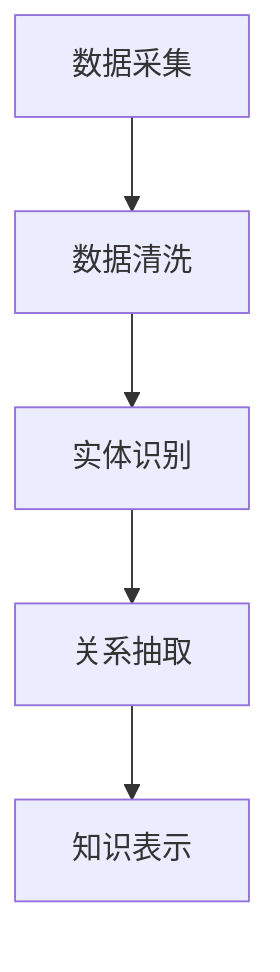

### 2.2 行为决策

#### 2.2.1 决策树的构建
决策树是一种常见的行为决策方法，它通过树状结构表示决策过程。决策树的构建过程可以用以下mermaid图表示：

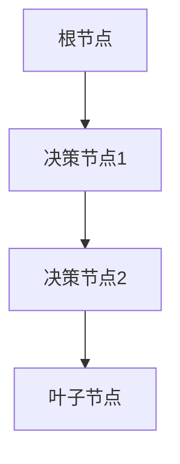

#### 2.2.2 基于规则的决策
基于规则的决策方法通过预定义的规则来指导行为。规则通常采用if-else语句的形式。以下是一个简单的基于规则的决策示例：

```python
if condition1:
    action1
elif condition2:
    action2
else:
    action3
```

#### 2.2.3 基于机器学习的决策
基于机器学习的决策方法通常使用分类算法（如随机森林、支持向量机）或回归算法来训练模型。以下是一个简单的决策树模型训练过程：

```python
from sklearn.tree import DecisionTreeClassifier
model = DecisionTreeClassifier()
model.fit(X_train, y_train)
```

### 2.3 本章小结
本章主要介绍了AI Agent的核心概念，包括知识表示和行为决策。知识表示是AI Agent理解世界的基础，而行为决策是AI Agent实现目标的关键。

---

## 第3章 AI Agent的算法原理

### 3.1 深度优先搜索

#### 3.1.1 算法原理
深度优先搜索（DFS）是一种用于树或图遍历的算法，它通过尽可能深入地访问每个节点来实现。DFS的搜索过程可以用以下mermaid图表示：

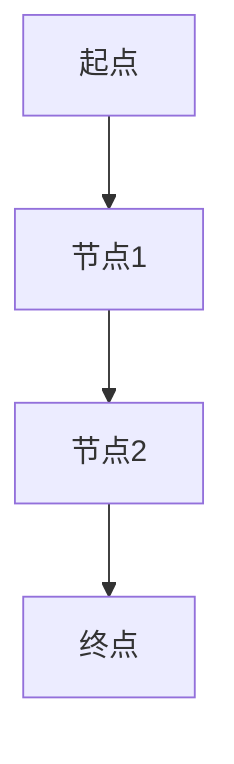

#### 3.1.2 算法实现
以下是DFS的Python实现代码：

```python
def dfs(graph, start, visited=None):
    if visited is None:
        visited = set()
    if start not in visited:
        visited.add(start)
        for neighbor in graph[start]:
            dfs(graph, neighbor, visited)
    return visited
```

### 3.2 广度优先搜索

#### 3.2.1 算法原理
广度优先搜索（BFS）是一种用于树或图遍历的算法，它通过逐层访问节点来实现。BFS的搜索过程可以用以下mermaid图表示：

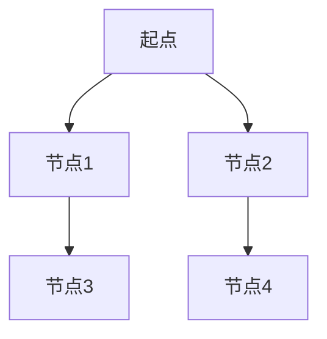

#### 3.2.2 算法实现
以下是BFS的Python实现代码：

```python
from collections import deque

def bfs(graph, start):
    visited = set()
    queue = deque([start])
    visited.add(start)
    while queue:
        node = queue.popleft()
        for neighbor in graph[node]:
            if neighbor not in visited:
                visited.add(neighbor)
                queue.append(neighbor)
    return visited
```

### 3.3 A*算法

#### 3.3.1 算法原理
A*算法是一种基于启发式搜索的最短路径算法，它通过评估函数f(n) = g(n) + h(n)来选择下一个节点。A*算法的搜索过程可以用以下mermaid图表示：


#### 3.3.2 算法实现
以下是A*算法的Python实现代码：

```python
import heapq

def a_star(graph, start, goal):
    open_list = []
    heapq.heappush(open_list, (0, start))
    g_score = {node: float('inf') for node in graph.nodes}
    g_score[start] = 0
    f_score = {node: float('inf') for node in graph.nodes}
    f_score[start] = heuristic(start, goal)
    visited = set()

    while open_list:
        current = heapq.heappop(open_list)
        if current[1] == goal:
            break
        if current[1] in visited:
            continue
        visited.add(current[1])
        for neighbor in graph[current[1]]:
            tentative_g_score = g_score[current[1]] + graph[current[1]][neighbor]
            if tentative_g_score < g_score[neighbor]:
                g_score[neighbor] = tentative_g_score
                f_score[neighbor] = g_score[neighbor] + heuristic(neighbor, goal)
                heapq.heappush(open_list, (f_score[neighbor], neighbor))
    return visited
```

### 3.4 本章小结
本章主要介绍了AI Agent中常用的算法原理，包括深度优先搜索、广度优先搜索和A*算法。这些算法在AI Agent的路径规划和任务调度中具有重要作用。

---

## 第4章 AI Agent的系统架构设计

### 4.1 系统架构概述

#### 4.1.1 分层架构
分层架构是一种常见的系统架构设计方法，它将系统划分为多个层次，每个层次负责不同的功能。分层架构的结构可以用以下mermaid图表示：

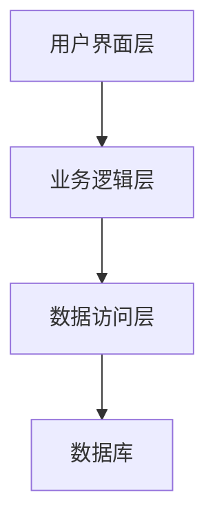

#### 4.1.2 分布式架构
分布式架构是一种将系统功能分布在多个节点上的架构设计方法。分布式架构的结构可以用以下mermaid图表示：

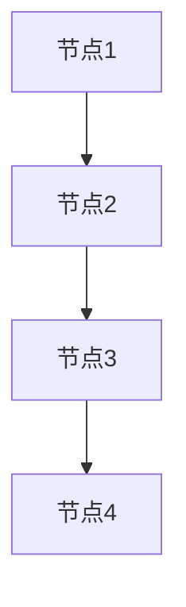

#### 4.1.3 微服务架构
微服务架构是一种将系统功能分解为多个微服务的架构设计方法。微服务架构的结构可以用以下mermaid图表示：

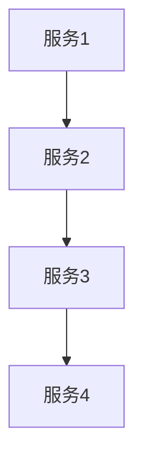

### 4.2 系统功能设计

#### 4.2.1 感知层
感知层负责获取环境信息，通常包括传感器和数据采集模块。感知层的功能可以用以下mermaid图表示：

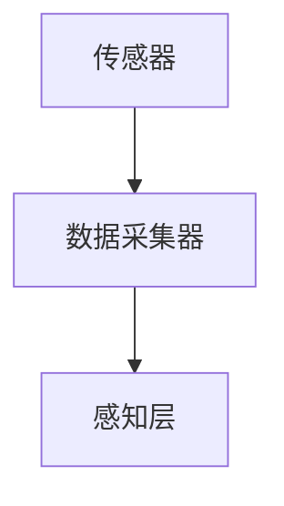

#### 4.2.2 决策层
决策层负责根据感知层获取的信息做出决策。决策层的功能可以用以下mermaid图表示：

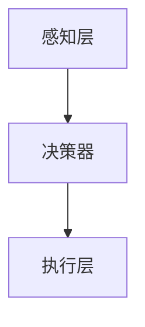

#### 4.2.3 执行层
执行层负责根据决策层的指令执行具体操作。执行层的功能可以用以下mermaid图表示：

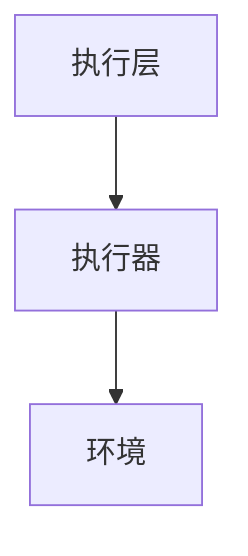

### 4.3 系统架构设计图

系统架构设计图可以用以下mermaid图表示：

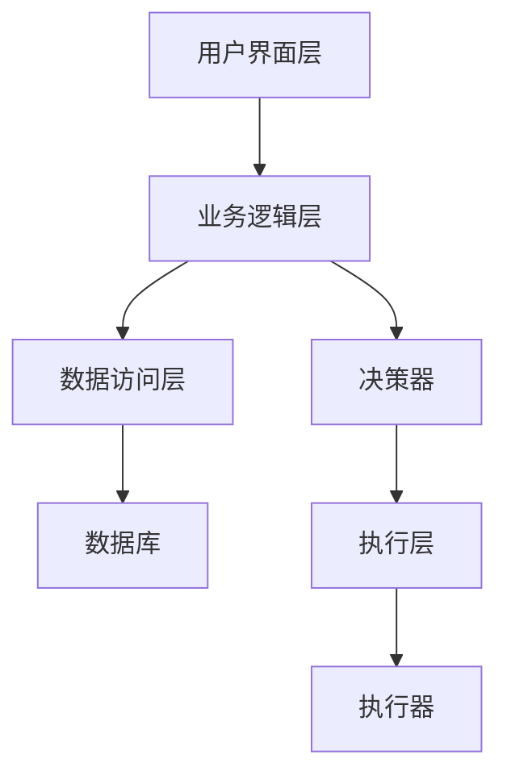

### 4.4 系统接口设计

系统接口设计需要定义各个模块之间的接口。以下是一个简单的系统接口设计示例：

```python
interface PerceptionInterface:
    def get_sensor_data():
        pass

interface DecisionInterface:
    def make_decision(data):
        pass

interface ActionInterface:
    def execute_action(action):
        pass
```

### 4.5 系统交互流程

系统交互流程可以用以下mermaid序列图表示：

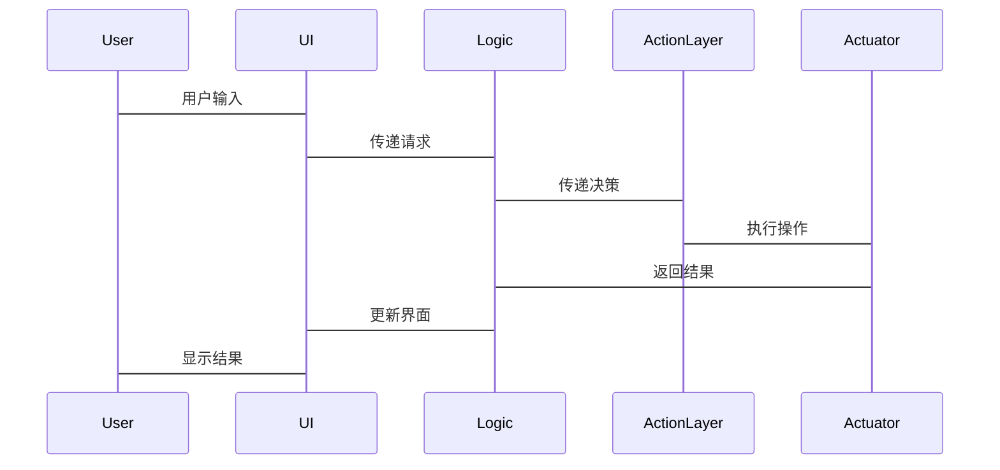

### 4.6 本章小结
本章主要介绍了AI Agent的系统架构设计，包括分层架构、分布式架构和微服务架构。同时，详细讨论了系统的功能设计、接口设计和交互流程。

---

## 第5章 AI Agent的项目实战

### 5.1 项目背景与需求分析

#### 5.1.1 项目背景
本项目旨在开发一个基于AI Agent的智能助手，能够通过语音交互为用户提供信息查询、任务执行等服务。

#### 5.1.2 项目需求
1. **用户交互**：支持语音输入和输出。
2. **信息查询**：能够查询天气、新闻等信息。
3. **任务执行**：能够执行设置提醒、发送消息等任务。

### 5.2 系统设计

#### 5.2.1 系统功能模块
系统功能模块可以用以下mermaid图表示：

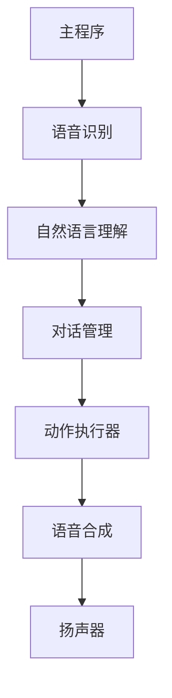

### 5.3 系统实现

#### 5.3.1 环境安装
项目开发需要以下环境：
1. Python 3.8+
2. pip
3. 语音识别库（例如，speechRecognition）
4. 语音合成库（例如，gTTS）

安装命令：
```bash
pip install speechRecognition gTTS
```

#### 5.3.2 核心代码实现

##### 语音识别模块
```python
import speech_recognition as sr

def recognize_speech():
    r = sr.Recognizer()
    with sr.Microphone() as source:
        print("请说话...")
        audio = r.listen(source)
    try:
        text = r.recognize_google(audio)
        print("识别结果：" + text)
        return text
    except sr.UnknownValueError:
        print("无法识别语音")
        return ""
```

##### 自然语言理解模块
```python
from gtts import gTTS

def text_to_speech(text):
    tts = gTTS(text=text, lang='zh')
    tts.save("output.mp3")
    print("语音合成完成")
```

##### 对话管理模块
```python
class DialogManager:
    def __init__(self):
        self.conversations = []

    def process_dialog(self, text):
        response = "您好，我是AI助手。请问有什么可以帮助您的吗？"
        self.conversations.append((text, response))
        return response
```

##### 动作执行模块
```python
class ActionExecutor:
    def __init__(self):
        pass

    def execute_action(self, action):
        if action == "设置提醒":
            print("提醒已设置")
        elif action == "发送消息":
            print("消息已发送")
        else:
            print("未知操作")
```

#### 5.3.3 系统实现流程
系统实现流程可以用以下mermaid图表示：


### 5.4 案例分析与实现

##### 实例1：天气查询
用户输入：“北京的天气如何？”
系统响应：
1. 语音识别模块识别用户输入。
2. 自然语言理解模块解析用户意图。
3. 对话管理模块生成查询天气的请求。
4. 动作执行模块查询天气数据。
5. 语音合成模块将天气信息合成语音并播放。

##### 实例2：设置提醒
用户输入：“提醒我明天早上8点开会。”
系统响应：
1. 语音识别模块识别用户输入。
2. 自然语言理解模块解析用户意图。
3. 对话管理模块生成设置提醒的请求。
4. 动作执行模块设置提醒。
5. 语音合成模块确认提醒设置成功。

### 5.5 项目小结
本章通过一个智能助手项目的实战，详细讲解了AI Agent的系统实现过程，包括环境安装、核心代码实现和系统交互流程。

---

## 第6章 扩展与展望

### 6.1 研究热点
当前AI Agent领域的研究热点包括：
1. **多智能体协作**：研究如何实现多个AI Agent的协同工作。
2. **强化学习**：研究如何通过强化学习优化AI Agent的行为决策。
3. **人机协作**：研究如何实现人与AI Agent的有效协作。

### 6.2 未来发展方向
AI Agent的未来发展方向包括：
1. **边缘计算**：研究如何在边缘设备上实现AI Agent。
2. **可信AI**：研究如何提高AI Agent的可信性和透明性。
3. **可持续AI**：研究如何实现AI Agent的可持续发展。

### 6.3 本章小结
本章总结了AI Agent领域的研究热点和未来发展方向，为读者提供了进一步学习和研究的方向。

---

## 作者信息

作者：AI天才研究院/AI Genius Institute & 禅与计算机程序设计艺术 /Zen And The Art of Computer Programming

---

通过以上思考，我们可以看到，AI Agent的系统架构设计与实现是一个复杂而有趣的过程，涉及多个领域的知识和技术。希望本文能够为读者提供一份全面的指南，帮助其理解AI Agent的系统架构设计与实现的全过程。

