                 


# AI驱动的企业创新项目管理：敏捷方法与AI辅助决策的结合

## 关键词：AI、企业创新、项目管理、敏捷方法、AI辅助决策

## 摘要：本文探讨了如何将AI技术与敏捷方法结合，用于企业创新项目的管理。通过分析传统项目管理的局限性，提出了一种基于AI辅助决策的敏捷项目管理方法，详细讲解了AI驱动的决策模型、敏捷方法的核心要素，以及它们在企业创新中的应用。本文还通过实际案例分析，展示了AI驱动的系统架构设计和项目实战的应用。

---

# 第一部分: AI驱动的企业创新项目管理背景

## 第1章: AI驱动的企业创新项目管理概述

### 1.1 企业创新项目管理的背景与挑战

#### 1.1.1 传统项目管理的局限性
传统项目管理方法（如瀑布模型）在企业创新项目中面临以下问题：
- **需求变更困难**：创新项目通常需要快速响应市场变化，但瀑布模型不擅长处理需求变更。
- **缺乏灵活性**：固定的时间表和预算难以适应创新过程中的不确定性。
- **团队协作低效**：依赖严格的层级结构，团队成员之间的沟通不畅，导致效率低下。

#### 1.1.2 企业创新项目管理的核心问题
- 创新项目通常涉及复杂的技术和多变的市场需求。
- 需要快速迭代和试错，以适应市场变化。
- 团队成员需要高效协作，同时保持灵活性。

#### 1.1.3 AI技术在项目管理中的应用潜力
AI技术可以通过以下方式提升项目管理效率：
- **数据驱动的决策支持**：利用历史数据和实时数据，提供更精准的决策建议。
- **自动化任务分配与跟踪**：通过AI算法优化任务分配，自动跟踪项目进度。
- **风险预测与管理**：基于AI模型预测项目中的潜在风险，并提出应对策略。

### 1.2 敏捷方法与AI辅助决策的结合

#### 1.2.1 敏捷方法的基本概念
敏捷方法是一种以迭代和增量开发为核心的项目管理方法，强调个体互动、客户合作、响应变化和交付可用的软件。其核心理念包括：
- **迭代开发**：将项目分解为小的、可管理的迭代周期（如Sprint）。
- **持续交付**：每个迭代周期结束时交付可用的增量产品。
- **客户协作**：与客户保持密切合作，确保最终产品满足需求。

#### 1.2.2 AI辅助决策的定义与特点
AI辅助决策是指利用人工智能技术（如机器学习、自然语言处理）来辅助人类做出决策的过程。其特点包括：
- **数据驱动**：基于大量数据进行分析和预测。
- **实时响应**：能够快速处理实时数据并提供决策支持。
- **自适应性**：能够根据环境变化调整决策策略。

#### 1.2.3 两者的结合对企业创新的意义
- **提高效率**：通过AI辅助决策优化项目管理和资源分配。
- **增强灵活性**：敏捷方法的迭代开发与AI的实时反馈相结合，能够更快地适应变化。
- **提升质量**：AI技术可以帮助识别潜在风险，优化项目执行过程，从而提高项目质量。

### 1.3 本章小结
本章介绍了企业创新项目管理的背景与挑战，分析了传统项目管理方法的局限性，并探讨了敏捷方法与AI辅助决策的结合对企业创新的重要意义。

---

## 第2章: AI辅助决策的原理与方法

### 2.1 AI辅助决策的核心原理

#### 2.1.1 数据驱动的决策模型
数据驱动的决策模型基于大量数据，通过统计分析和机器学习算法生成决策建议。其核心步骤包括：
1. 数据采集：收集与项目相关的各种数据（如市场数据、项目进度数据等）。
2. 数据清洗：对数据进行预处理，去除噪声和异常值。
3. 数据分析：利用机器学习算法对数据进行建模和分析。
4. 决策生成：基于模型结果生成决策建议。

#### 2.1.2 机器学习在决策中的应用
机器学习在决策中的应用主要体现在以下几个方面：
- **预测模型**：利用回归、分类等算法预测项目进度、成本和风险。
- **聚类分析**：将项目数据进行聚类，识别潜在的模式和趋势。
- **强化学习**：通过试错和奖励机制优化决策策略。

#### 2.1.3 自然语言处理在项目管理中的作用
自然语言处理（NLP）技术在项目管理中的应用包括：
- **文档分析**：自动分析项目文档，提取关键信息（如需求、风险等）。
- **情感分析**：分析团队成员的情感倾向，识别潜在的团队冲突。
- **自动摘要**：生成项目报告的摘要，帮助团队快速了解项目进展。

### 2.2 敏捷方法的理论基础

#### 2.2.1 敏捷宣言的核心理念
敏捷宣言的核心理念包括：
- **个体互动高于流程**：强调团队协作和个体互动的重要性。
- **客户合作高于合同谈判**：注重与客户的紧密合作，确保项目符合需求。
- **响应变化高于遵循计划**：强调灵活性和对变化的快速响应。
- **交付可用的软件高于全面文档**：注重实际交付成果，而不是过度依赖文档。

#### 2.2.2 敏捷方法的主要流派
敏捷方法的主要流派包括：
- **Scrum**：强调迭代开发和角色分工。
- **Kanban**：基于看板方法，强调持续交付和可视化流程。
- **Extreme Programming (XP)**：注重测试驱动开发和代码质量。

#### 2.2.3 敏捷方法与传统项目管理的对比
| 对比维度          | 敏捷方法                          | 传统项目管理                    |
|-------------------|-----------------------------------|-------------------------------|
| 方法论            | 迭代开发，注重灵活性              | 瀑布模型，注重计划性            |
| 项目文档          | 文档轻量，注重交付成果            | 文档繁重，注重过程记录          |
| 团队协作          | 强调个体互动和客户合作            | 依赖层级结构和严格流程          |
| 变化处理          | 善于应对变化，快速调整            | 难以应对变化，变更流程复杂      |

### 2.3 AI与敏捷方法的结合模型

#### 2.3.1 模型的基本架构
AI与敏捷方法的结合模型包括以下几个核心模块：
1. **数据采集模块**：收集项目相关数据（如任务进度、团队反馈等）。
2. **AI决策模块**：利用机器学习算法生成决策建议。
3. **敏捷执行模块**：根据决策建议调整项目执行策略。
4. **反馈优化模块**：根据项目执行结果优化AI模型。

#### 2.3.2 数据流与决策流的整合
以下是数据流与决策流的整合流程图：

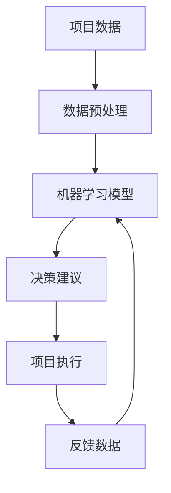

#### 2.3.3 模型的验证与优化
模型的验证与优化过程如下：
1. **数据验证**：确保数据质量和完整性。
2. **模型训练**：利用训练数据训练机器学习模型。
3. **模型评估**：通过测试数据评估模型性能。
4. **模型优化**：根据评估结果优化模型参数。

### 2.4 本章小结
本章详细讲解了AI辅助决策的核心原理和敏捷方法的理论基础，并提出了AI与敏捷方法的结合模型，为后续章节的系统设计和项目实战奠定了理论基础。

---

## 第3章: 敏捷方法在企业创新项目管理中的应用

### 3.1 敏捷方法在项目启动阶段的应用

#### 3.1.1 用户故事的识别与优先级排序
用户故事是敏捷方法中的基本单位，用于描述项目需求。其识别和优先级排序过程如下：
1. **用户故事识别**：与客户合作，识别关键需求。
2. **优先级排序**：根据业务价值和实现难度对用户故事进行排序。

#### 3.1.2 项目目标的动态调整
在项目启动阶段，项目目标可能需要根据市场变化和客户需求进行动态调整。以下是调整流程：

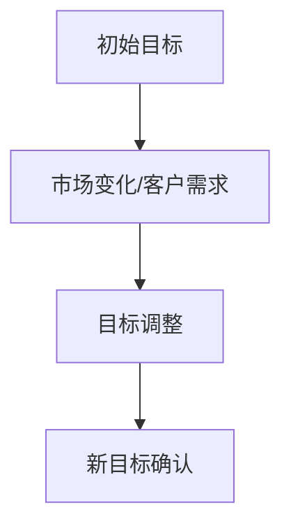

#### 3.1.3 团队角色与职责的分配
敏捷方法中的团队角色包括：
- **Scrum Master**：负责团队的日常协调和障碍解决。
- **Product Owner**：负责产品 backlog 的定义和优先级排序。
- **开发团队**：负责具体任务的开发和实现。

### 3.2 敏捷方法在项目执行阶段的应用

#### 3.2.1 迭代开发与持续交付
迭代开发是指将项目分解为小的、可管理的迭代周期（如Sprint），每个迭代周期结束时交付可用的增量产品。以下是迭代开发的流程：

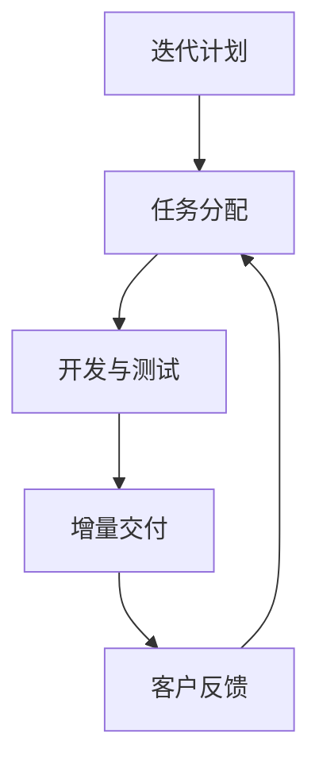

#### 3.2.2 看板管理与任务跟踪
看板管理是一种可视化管理方法，通过看板卡片和泳道表示任务的状态和流程。以下是看板管理的示意图：

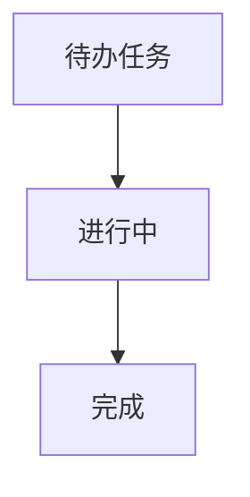

#### 3.2.3 每日站会与进度汇报
每日站会是敏捷团队中的一个关键实践，用于同步进度和解决问题。以下是每日站会的流程：

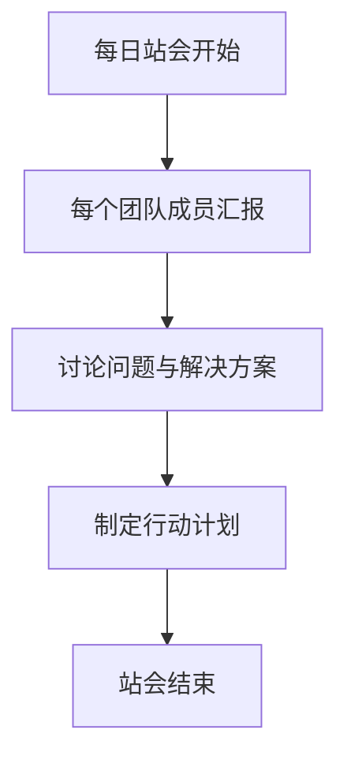

### 3.3 敏捷方法在项目收尾阶段的应用

#### 3.3.1 项目回顾与经验总结
项目回顾是敏捷项目管理中的一个重要环节，用于总结经验教训并优化未来项目。以下是项目回顾的流程：

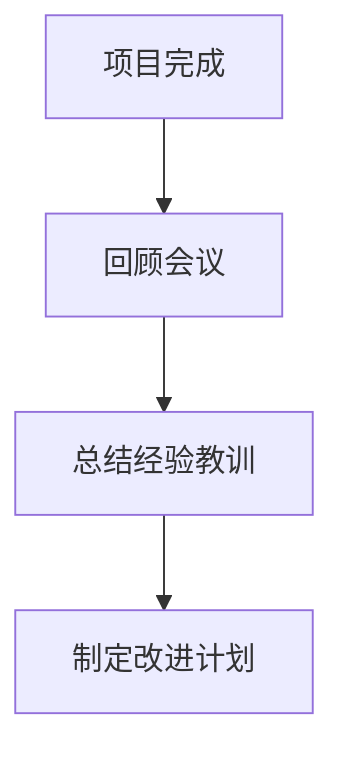

#### 3.3.2 项目文档的整理与归档
项目文档的整理与归档是项目收尾阶段的重要任务，包括：
- **文档分类**：将文档按类型和版本进行分类。
- **文档存储**：将文档存放在安全且易于访问的存储位置。
- **文档管理**：建立文档的版本控制和访问权限。

#### 3.3.3 团队解散与知识转移
团队解散时，需要进行知识转移，确保项目知识的传承。以下是知识转移的流程：

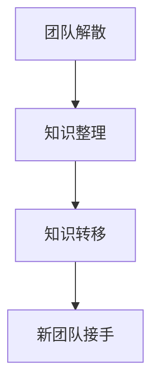

### 3.4 本章小结
本章详细探讨了敏捷方法在企业创新项目管理中的应用，重点分析了其在项目启动、执行和收尾阶段的具体实践，并通过实例展示了其在实际项目中的应用效果。

---

## 第4章: AI驱动的企业创新项目管理系统架构

### 4.1 系统功能模块划分

#### 4.1.1 项目管理模块
项目管理模块负责项目的整体管理，包括：
- **任务管理**：任务分配、进度跟踪和优先级排序。
- **风险管理**：识别、评估和应对项目风险。
- **资源管理**：资源分配和利用效率优化。

#### 4.1.2 团队协作模块
团队协作模块用于团队成员之间的协作，包括：
- **沟通工具**：实时聊天、视频会议和文档共享。
- **任务分配**：任务分配和进度跟踪。
- **知识库**：项目知识的存储和共享。

#### 4.1.3 数据分析模块
数据分析模块负责对项目数据进行分析，包括：
- **数据可视化**：通过图表和仪表盘展示项目数据。
- **预测分析**：利用机器学习算法预测项目进度和风险。
- **决策支持**：基于数据分析结果提供决策建议。

### 4.2 系统架构设计

#### 4.2.1 分层架构设计
系统架构采用分层架构，包括：
- **表现层**：用户界面，包括任务管理、团队协作和数据分析功能。
- **业务逻辑层**：处理用户的请求并调用相应的服务。
- **数据访问层**：与数据库进行交互，完成数据的增删改查操作。

#### 4.2.2 微服务架构设计
微服务架构设计将系统分解为多个独立的服务，每个服务负责特定的功能。以下是微服务架构的示意图：

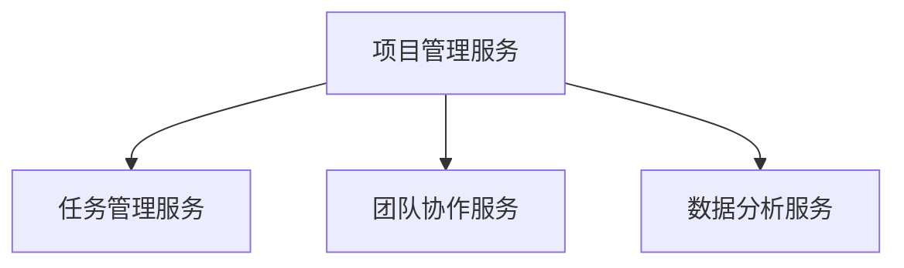

#### 4.2.3 数据流与服务调用关系
以下是数据流与服务调用关系的示意图：

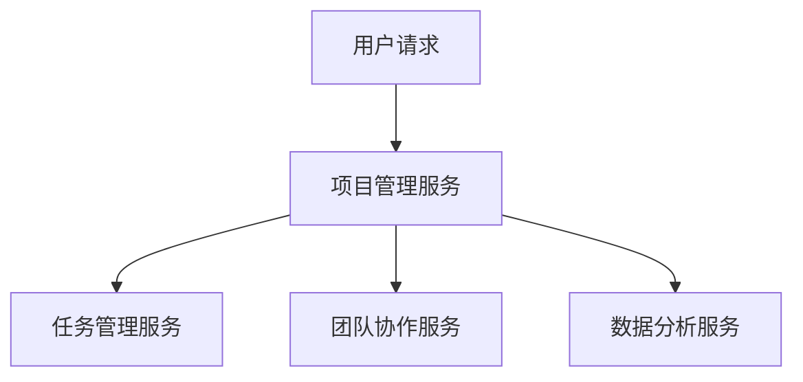

### 4.3 系统接口设计

#### 4.3.1 系统接口设计
系统接口设计包括：
- **REST API**：用于前后端的数据交互。
- **WebSocket**：用于实时通信和事件通知。

#### 4.3.2 接口设计示例
以下是任务管理接口的设计示例：

```http
POST /api/tasks
Content-Type: application/json

{
    "taskName": "开发新功能",
    "assignee": "开发人员",
    "dueDate": "2023-12-31"
}
```

### 4.4 系统交互设计

#### 4.4.1 系统交互流程
以下是系统交互的流程图：

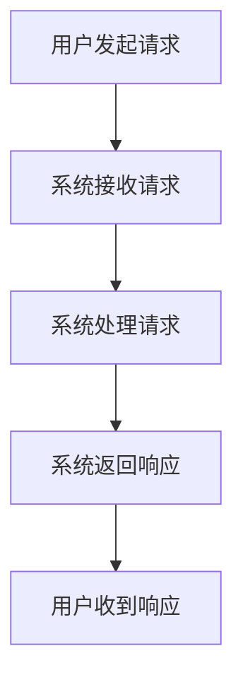

#### 4.4.2 交互设计示例
以下是任务分配的交互流程：

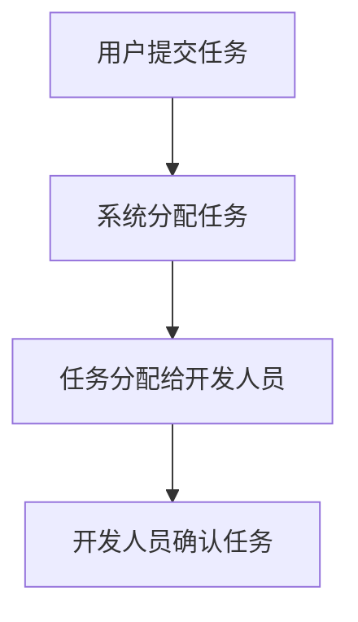

### 4.5 本章小结
本章详细介绍了AI驱动的企业创新项目管理系统的架构设计，包括功能模块划分、系统架构设计、接口设计和交互设计，为后续章节的项目实战奠定了基础。

---

## 第五部分: 项目实战

## 第5章: 项目实战分析与实现

### 5.1 项目背景与目标

#### 5.1.1 项目背景
某创新型科技公司计划开发一款智能客服系统，旨在通过AI技术提升客户服务体验。项目目标包括：
- **实现智能对话功能**：通过自然语言处理技术提供智能客服服务。
- **提升客户满意度**：通过数据分析优化客户服务质量。
- **实现快速迭代**：通过敏捷方法快速响应客户需求变化。

### 5.2 项目实施过程

#### 5.2.1 环境安装与工具配置
项目实施前需要完成以下环境安装与工具配置：
1. **安装开发环境**：安装JDK、Python、Node.js等开发工具。
2. **安装项目管理工具**：安装Jira、Trello等项目管理工具。
3. **安装AI框架**：安装TensorFlow、PyTorch等机器学习框架。

#### 5.2.2 核心功能实现

##### 5.2.2.1 自然语言处理模型的实现
以下是自然语言处理模型的实现代码：

```python
import tensorflow as tf
from tensorflow.keras import layers

# 定义模型
model = tf.keras.Sequential([
    layers.Embedding(input_dim=10000, output_dim=100),
    layers.LSTM(128),
    layers.Dense(1, activation='sigmoid')
])

# 编译模型
model.compile(optimizer='adam', loss='binary_crossentropy', metrics=['accuracy'])
```

##### 5.2.2.2 任务管理功能的实现
以下是任务管理功能的实现代码：

```python
from fastapi import FastAPI

app = FastAPI()

@app.post("/tasks")
async def create_task(task: dict):
    return task
```

#### 5.2.3 项目测试与优化

##### 5.2.3.1 功能测试
功能测试包括以下步骤：
1. **任务分配测试**：测试任务能否正确分配给开发人员。
2. **智能对话测试**：测试智能客服是否能够准确理解用户需求。
3. **数据分析测试**：测试数据分析功能是否能够生成准确的报告。

##### 5.2.3.2 性能优化
性能优化包括以下方面：
- **算法优化**：通过调整模型参数和优化算法提升模型性能。
- **代码优化**：通过代码重构和性能调优提升系统运行效率。
- **数据库优化**：通过索引优化和查询优化提升数据库性能。

### 5.3 项目总结与经验分享

#### 5.3.1 项目成果
本项目成功实现了智能客服系统的核心功能，提升了客户满意度，并通过敏捷方法实现了快速迭代和持续优化。

#### 5.3.2 经验总结
- **团队协作的重要性**：敏捷方法强调团队协作，团队成员之间的高效沟通和紧密合作是项目成功的关键。
- **持续学习与优化**：技术更新换代快，团队需要不断学习新技术，优化项目管理方法。
- **数据驱动的决策**：通过数据分析和机器学习技术，可以更准确地预测项目风险和优化项目执行策略。

### 5.4 本章小结
本章通过一个实际案例分析，展示了AI驱动的企业创新项目管理系统的项目实战过程，包括环境配置、核心功能实现、项目测试与优化，以及项目总结与经验分享。

---

## 附录: AI驱动的企业创新项目管理系统的工具与资源

### A.1 AI相关工具
- **TensorFlow**：Google开发的机器学习框架。
- **PyTorch**：Facebook开发的深度学习框架。
- **NLP工具**：如spaCy、NLTK等。

### A.2 敏捷方法工具
- **Jira**：项目管理工具，支持敏捷方法。
- **Trello**：看板管理工具。
- **Slack**：团队协作工具。

### A.3 其他资源
- **敏捷宣言**：https://agilemanifesto.org/
- **Scrum指南**：https://scrumguides.org/
- **Kanban方法**：https://kanbanize.com/

---

## 作者：AI天才研究院（AI Genius Institute） & 禅与计算机程序设计艺术（Zen And The Art of Computer Programming）

---

以上是《AI驱动的企业创新项目管理：敏捷方法与AI辅助决策的结合》的技术博客文章的完整目录大纲，具体内容可以根据实际需求进一步扩展和详细阐述。

