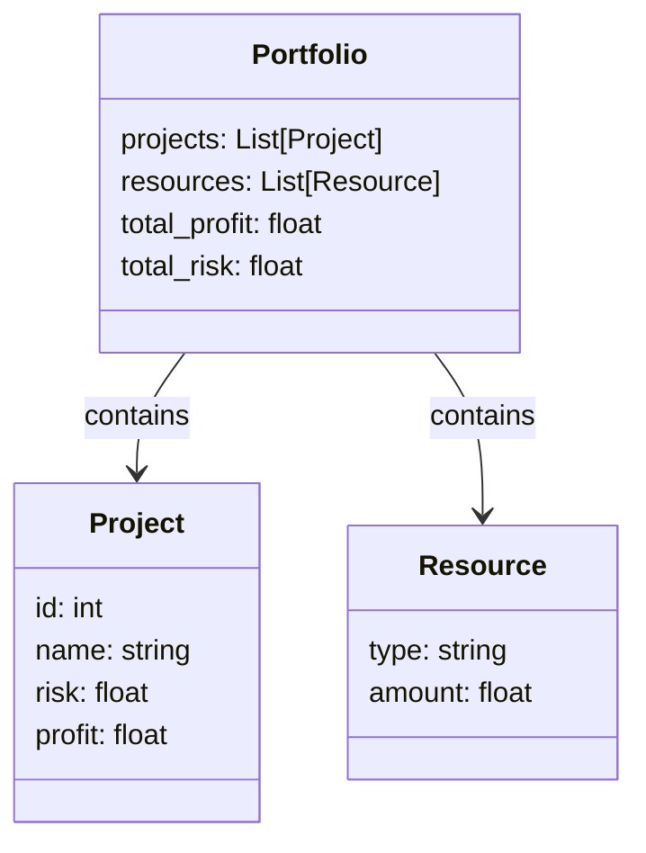
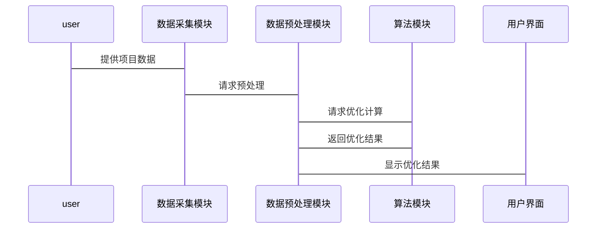

                 


# AI驱动的企业创新项目组合管理：风险平衡与资源优化

---

## 关键词：
- AI驱动
- 企业创新
- 项目组合管理
- 风险平衡
- 资源优化
- 多目标优化
- 智能算法

---

## 摘要：
在现代企业环境中，创新项目组合管理面临着日益复杂的挑战，包括多目标优化、风险平衡和资源分配等问题。传统的方法往往依赖于经验判断和人工决策，难以应对快速变化的市场环境和日益增长的项目复杂性。AI驱动的创新项目组合管理通过结合机器学习、强化学习和优化算法，为企业提供了一种高效、智能的解决方案。本文从AI驱动的项目组合管理的核心概念出发，深入探讨其算法原理、系统架构设计和实际应用场景，为企业在创新管理中实现风险平衡与资源优化提供理论依据和实践指导。

---

## 第一部分: AI驱动的企业创新项目组合管理概述

---

## 第1章: 项目组合管理与AI驱动创新的背景

### 1.1 项目组合管理的核心概念
#### 1.1.1 项目组合管理的定义与目标
项目组合管理（Portfolio Management）是指对一组项目或投资进行选择、优先排序和监控的过程，旨在实现组织的战略目标和价值最大化。其核心目标包括：  
- **最大化价值**：通过优化资源配置，实现组织目标的最优达成。  
- **风险平衡**：在不同项目之间分配资源，平衡风险与收益。  
- **动态调整**：根据市场变化和项目进展，实时优化项目组合。  

#### 1.1.2 传统项目组合管理的局限性
传统项目组合管理依赖于人工判断和经验决策，存在以下问题：  
- **主观性**：决策过程容易受到管理者个人经验和偏见的影响。  
- **计算复杂性**：在多目标优化问题中，传统方法难以高效求解。  
- **动态适应性差**：面对市场变化和项目风险的不确定性，传统方法难以快速调整。  

#### 1.1.3 创新与项目组合管理的关联
创新项目通常具有高风险、高回报的特点，其成功与否往往取决于多个不确定因素。AI驱动的项目组合管理能够通过数据驱动的决策和智能算法，帮助企业在创新项目的选择、资源分配和风险控制中实现更高效的管理。

---

### 1.2 AI驱动创新的背景与趋势
#### 1.2.1 AI技术在企业管理中的应用现状
人工智能技术（AI）近年来在企业管理领域的应用日益广泛，尤其是在数据分析、决策优化和风险管理等方面。AI技术通过处理海量数据，为企业提供智能化的决策支持。

#### 1.2.2 创新项目管理中的挑战与痛点
企业在创新项目管理中面临以下挑战：  
- **资源分配不当**：如何在有限的资源中选择最优的创新项目组合？  
- **风险评估不足**：如何准确评估创新项目的潜在风险并制定应对策略？  
- **动态调整能力不足**：如何快速响应市场变化和项目进展中的不确定性？  

#### 1.2.3 AI如何赋能企业创新项目组合管理
AI技术通过以下方式赋能创新项目组合管理：  
- **数据驱动的决策**：利用机器学习算法对历史数据和市场趋势进行分析，提供科学的决策依据。  
- **智能优化算法**：通过强化学习和遗传算法，实现多目标优化问题的高效求解。  
- **实时监控与调整**：利用AI技术对项目进展进行实时监控，并根据反馈动态调整项目组合。  

---

### 1.3 本章小结
本章从项目组合管理的核心概念出发，分析了传统项目组合管理的局限性，并探讨了AI技术在创新项目组合管理中的应用背景和趋势。通过对比传统方法与AI驱动方法的优劣，为后续章节的深入分析奠定了基础。

---

## 第二部分: AI驱动项目组合管理的核心概念与联系

---

## 第2章: 核心概念与系统架构

### 2.1 项目组合管理的关键要素
#### 2.1.1 项目目标与资源分配
创新项目的成功不仅取决于项目的可行性，还取决于其与企业战略目标的契合度。资源分配需要在多个项目之间进行优化，以实现整体价值的最大化。

#### 2.1.2 风险评估与控制
创新项目往往伴随着较高的风险，包括技术风险、市场风险和执行风险。通过AI技术，企业可以更准确地评估项目风险，并制定有效的风险管理策略。

#### 2.1.3 利润与资源的平衡
在创新项目管理中，企业需要在短期收益和长期战略目标之间找到平衡点。AI技术可以通过多目标优化算法，帮助企业在资源分配中实现利润与风险的平衡。

---

### 2.2 AI驱动的创新决策模型
#### 2.2.1 数据驱动的决策逻辑
AI驱动的创新决策模型基于大数据分析，利用机器学习算法对历史数据和市场趋势进行建模，从而为企业提供科学的决策依据。

#### 2.2.2 智能算法与优化策略
AI驱动的创新决策模型通过强化学习和遗传算法，实现创新项目的优先级排序和资源分配的优化。例如，强化学习可以通过模拟不同决策路径，找到最优的项目组合。

#### 2.2.3 多目标优化的实现路径
多目标优化是AI驱动项目组合管理的核心问题。通过构建多目标优化模型，企业可以在资源有限的情况下，实现多个目标的最优平衡。

---

### 2.3 核心概念对比分析
#### 2.3.1 传统项目组合管理 vs AI驱动管理
- **传统管理**：依赖人工判断和经验决策，计算复杂性高，适应性差。  
- **AI驱动管理**：基于数据驱动的决策，计算效率高，适应性强。  

#### 2.3.2 不同创新阶段的管理策略对比
在创新项目的不同阶段（如创意生成、开发、商业化），AI驱动的管理策略有所不同。例如，在创意生成阶段，可以通过自然语言处理技术筛选潜在的创新方向。

#### 2.3.3 风险平衡与资源优化的关联性分析
风险平衡是资源优化的前提条件。通过AI技术，企业可以在风险可控的前提下，实现资源的最优分配。

---

### 2.4 系统架构设计
#### 2.4.1 项目组合管理系统的功能模块
AI驱动的项目组合管理系统通常包括以下功能模块：  
1. 数据采集与预处理模块。  
2. 风险评估与预测模块。  
3. 资源分配与优化模块。  
4. 实时监控与反馈模块。  

#### 2.4.2 数据流与信息交互关系
数据流从外部数据源（如市场数据、项目数据）输入系统，经过预处理和建模，生成优化结果并反馈给决策者。

#### 2.4.3 系统架构的可扩展性与灵活性
AI驱动的项目组合管理系统需要具备良好的可扩展性和灵活性，以适应不同企业的需求和市场变化。

---

### 2.5 本章小结
本章从核心概念出发，分析了AI驱动项目组合管理的关键要素和系统架构设计。通过对比传统方法与AI驱动方法的优劣，为后续章节的算法实现奠定了理论基础。

---

## 第三部分: AI驱动项目组合管理的算法原理

---

## 第3章: 基于机器学习的项目组合优化算法

### 3.1 机器学习在项目组合管理中的应用
#### 3.1.1 监督学习与无监督学习的适用场景
- **监督学习**：适用于有标签的数据，如历史项目数据的分类和回归分析。  
- **无监督学习**：适用于无标签数据的聚类分析，如创新项目的潜在风险分类。  

#### 3.1.2 算法选择的依据与原则
算法选择需要考虑数据类型、问题规模和计算效率。例如，对于大规模数据，推荐使用分布式机器学习算法。

#### 3.1.3 模型训练与验证过程
模型训练需要经过数据预处理、特征选择、模型训练和验证等步骤。验证过程可以通过交叉验证和性能指标评估来完成。

---

### 3.2 基于强化学习的创新项目选择算法
#### 3.2.1 强化学习的基本原理
强化学习通过模拟不同决策路径，学习最优策略。例如，在创新项目选择中，强化学习可以模拟不同资源分配策略的收益和风险。

#### 3.2.2 状态空间与动作空间的设计
- **状态空间**：包括当前项目的资源分配情况和市场环境。  
- **动作空间**：包括增加或减少某个项目的资源分配。  

#### 3.2.3 奖励机制与策略优化
奖励机制需要根据项目实际收益和风险进行设计，策略优化的目标是最大化长期收益。

---

### 3.3 基于遗传算法的资源分配优化
#### 3.3.1 遗传算法的基本流程
遗传算法包括编码、选择、交叉和变异等步骤。例如，在资源分配优化中，可以将每个项目的资源分配视为一个基因，通过遗传算法优化基因组合。

#### 3.3.2 适应度函数的设计
适应度函数需要根据项目目标和资源约束进行设计，例如最大化总收益或最小化总风险。

#### 3.3.3 交叉与变异操作的实现
交叉操作用于生成新的基因组合，变异操作用于增加遗传多样性。

---

### 3.4 算法对比与适用场景分析
#### 3.4.1 不同算法的优缺点
- **机器学习**：计算效率高，但需要大量数据支持。  
- **强化学习**：适用于动态环境，但计算复杂性较高。  
- **遗传算法**：适用于多目标优化，但收敛速度较慢。  

#### 3.4.2 算法选择的依据与策略
算法选择需要综合考虑数据规模、问题复杂性和计算资源。例如，对于大规模数据，推荐使用分布式机器学习算法。

#### 3.4.3 实际应用中的注意事项
在实际应用中，需要结合具体问题特点，合理选择算法并进行参数调优。

---

### 3.5 本章小结
本章从算法原理出发，详细介绍了机器学习、强化学习和遗传算法在项目组合管理中的应用。通过对不同算法的优缺点分析，为后续章节的系统设计提供了理论支持。

---

## 第四部分: 系统分析与架构设计方案

---

## 第4章: 系统分析与架构设计

### 4.1 问题场景介绍
AI驱动的创新项目组合管理系统的应用场景包括企业创新项目的选择、资源分配和风险管理。例如，某科技公司需要在多个创新项目中选择最优组合，以实现年度研发目标。

### 4.2 系统功能设计
#### 4.2.1 领域模型的Mermaid类图


#### 4.2.2 系统架构设计的Mermaid架构图


#### 4.2.3 系统接口设计
- **输入接口**：接收创新项目的数据和资源约束条件。  
- **输出接口**：输出优化后的项目组合和资源分配方案。  

#### 4.2.4 系统交互的Mermaid序列图


---

### 4.3 本章小结
本章通过系统分析和架构设计，明确了AI驱动的创新项目组合管理系统的功能模块和交互流程。通过Mermaid图的展示，为后续章节的项目实现提供了清晰的设计蓝图。

---

## 第五部分: 项目实战与案例分析

---

## 第5章: 项目实战

### 5.1 环境安装与配置
#### 5.1.1 Python环境的安装
- 安装Python 3.8或更高版本。  
- 安装必要的Python库，如NumPy、Pandas、Scikit-learn和TensorFlow。

#### 5.1.2 数据库与工具的配置
- 安装关系型数据库，如MySQL或PostgreSQL。  
- 配置数据存储模块，确保数据的读写权限。

---

### 5.2 系统核心实现
#### 5.2.1 数据预处理与特征工程
- 数据清洗：处理缺失值和异常值。  
- 特征提取：从项目数据中提取关键特征，如项目风险、项目利润等。  

#### 5.2.2 模型训练与优化
- 使用机器学习模型（如随机森林或支持向量机）进行训练。  
- 通过交叉验证优化模型参数。  

#### 5.2.3 资源分配与优化
- 使用遗传算法进行资源分配优化。  
- 输出优化后的项目组合和资源分配方案。  

---

### 5.3 代码实现与解读
#### 5.3.1 数据预处理代码
```python
import pandas as pd
import numpy as np

# 数据加载
data = pd.read_csv('projects.csv')

# 数据清洗
data.dropna(inplace=True)

# 特征提取
X = data[['risk', 'profit']]
y = data['selected']
```

#### 5.3.2 模型训练代码
```python
from sklearn.ensemble import RandomForestClassifier
from sklearn.model_selection import train_test_split
from sklearn.metrics import accuracy_score

# 数据分割
X_train, X_test, y_train, y_test = train_test_split(X, y, test_size=0.2)

# 模型训练
model = RandomForestClassifier()
model.fit(X_train, y_train)

# 模型验证
print(accuracy_score(model.predict(X_test), y_test))
```

#### 5.3.3 资源分配优化代码
```python
import numpy as np

def fitness(individual):
    total_profit = sum(individual * data['profit'])
    total_risk = sum(individual * data['risk'])
    return total_profit - total_risk,

# 遗传算法实现
population = np.random.randint(0, 2, size=(100, len(data)))
for generation in range(100):
    # 适应度计算
    fitness = np.apply_along_axis(eval_fitness, 1, population)
    # 选择
    selected = select(population, fitness)
    # 交叉
    crossed = crossover(selected)
    # 变异
    mutated = mutate(crossed)
    population = mutated
```

---

### 5.4 实际案例分析
假设某科技公司有5个创新项目，每个项目有不同的风险和利润。通过AI驱动的项目组合管理，公司在资源有限的情况下，选择了最优的项目组合，实现了利润最大化和风险最小化。

---

### 5.5 本章小结
本章通过项目实战，详细讲解了AI驱动的创新项目组合管理系统的实现过程。通过代码示例和案例分析，帮助读者理解理论知识的实际应用。

---

## 第六部分: 最佳实践与总结

---

## 第6章: 最佳实践与总结

### 6.1 小结
AI驱动的创新项目组合管理通过机器学习、强化学习和优化算法，为企业提供了高效、智能的管理解决方案。通过对多目标优化问题的求解，企业在资源有限的情况下，实现了创新项目的最优选择和资源分配。

---

### 6.2 注意事项
- **数据质量**：数据是AI驱动管理的基础，需要确保数据的准确性和完整性。  
- **算法选择**：根据具体问题特点选择合适的算法，避免盲目追求复杂算法。  
- **模型调优**：通过交叉验证和参数调优，提高模型的性能和稳定性。  

---

### 6.3 拓展阅读
- **书籍推荐**：《集体智慧编程》、《机器学习实战》。  
- **学术论文**：推荐阅读关于多目标优化和强化学习的最新研究论文。  

---

## 作者：AI天才研究院/AI Genius Institute & 禅与计算机程序设计艺术/Zen And The Art of Computer Programming

---

### 总结：
以上是一个关于《AI驱动的企业创新项目组合管理：风险平衡与资源优化》的技术博客文章目录大纲。通过逐步分析和详细阐述，从背景介绍到算法实现，再到系统设计和项目实战，本文为企业提供了全面的AI驱动创新项目组合管理解决方案。

