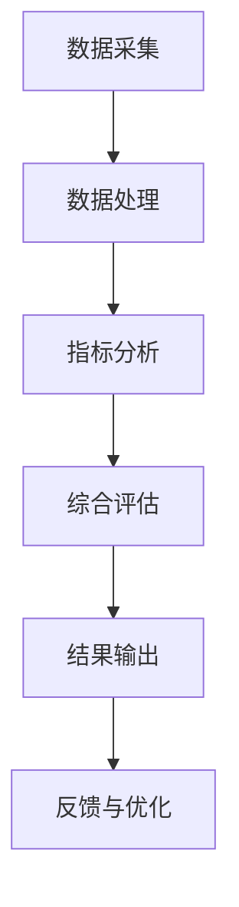
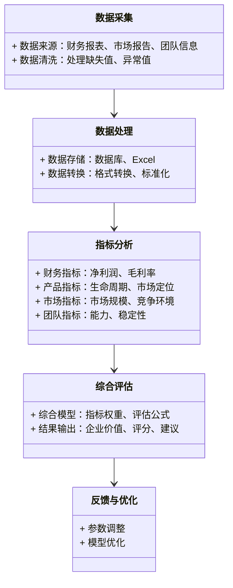

                 

# 如何评估初创企业的价值

> 关键词：初创企业，企业价值评估，财务分析，产品指标，市场分析，团队评估，估值方法

> 摘要：本文详细探讨了如何系统性地评估初创企业的价值，从背景介绍到具体方法，从核心指标到实际案例，全面解析评估的关键点，帮助读者掌握初创企业价值评估的核心技巧和实际应用。

---

## 第一部分: 初创企业价值评估的背景与重要性

### 第1章: 初创企业价值评估的背景与重要性

#### 1.1 初创企业价值评估的背景
##### 1.1.1 初创企业的定义与特点
初创企业是指刚成立的、处于早期发展阶段的企业。其特点包括：
- **规模小**：通常员工数量少，业务范围有限。
- **高成长性**：初创企业的目标通常是快速扩展市场份额和收入。
- **高风险性**：由于市场不确定性和资源有限，初创企业面临较高的失败风险。
- **创新性**：初创企业通常以创新的产品或服务进入市场。

##### 1.1.2 初创企业价值评估的必要性
- **投资决策**：对于投资者来说，评估初创企业的价值是决定是否投资的关键。
- **融资需求**：初创企业需要通过价值评估来吸引投资者或获得贷款。
- **企业战略**：企业内部战略规划需要基于价值评估的结果。
- **风险管理**：通过价值评估可以识别潜在风险，制定应对策略。

##### 1.1.3 初创企业价值评估的常见误区
- **过于依赖财务数据**：初创企业早期可能没有稳定的财务数据，导致评估偏差。
- **忽视市场因素**：市场环境的变化对初创企业价值的影响不可忽视。
- **低估团队作用**：团队的能力和稳定性对企业的价值至关重要，但常被低估。

#### 1.2 初创企业价值评估的核心概念
##### 1.2.1 企业价值的定义与构成
企业价值是指企业在市场上所能产生的全部经济价值，包括：
- **资产价值**：企业的有形和无形资产。
- **未来现金流**：企业未来产生的现金流的现值。
- **品牌价值**：品牌的市场影响力和客户忠诚度。

##### 1.2.2 初创企业价值评估的关键要素
- **财务表现**：收入、利润、现金流等财务指标。
- **产品竞争力**：产品的市场定位、技术创新能力。
- **市场潜力**：市场规模、增长速度、竞争环境。
- **团队能力**：创始人和核心团队的经验、能力。
- **风险因素**：市场风险、技术风险、财务风险。

##### 1.2.3 初创企业价值评估的边界与外延
- **边界**：评估范围通常限于企业自身的经营状况，不考虑外部不可控因素。
- **外延**：企业未来发展的潜力和扩展能力也是评估的重要部分。

#### 1.3 初创企业价值评估的挑战与机遇
##### 1.3.1 初创企业价值评估的难点
- **数据不足**：初创企业早期数据有限，难以准确评估。
- **不确定性**：市场和技术的不确定性导致评估结果的波动性大。
- **主观判断**：价值评估需要一定的主观判断，尤其是在早期阶段。

##### 1.3.2 初创企业价值评估的创新方法
- **动态评估**：根据市场变化和企业表现，动态调整评估模型。
- **多维度评估**：结合财务、产品、市场、团队等多维度进行综合评估。
- **情景分析**：通过情景分析评估不同情况下企业的价值变化。

##### 1.3.3 初创企业价值评估的未来趋势
- **数据驱动**：利用大数据和人工智能技术提高评估的准确性。
- **实时评估**：随着市场变化，实时更新企业价值评估结果。
- **多因素模型**：结合更多维度的因素，构建更全面的评估模型。

#### 1.4 本章小结
本章介绍了初创企业价值评估的背景、核心概念和面临的挑战与机遇，为后续的深入分析奠定了基础。

---

## 第二部分: 初创企业价值评估的核心指标与方法论

### 第2章: 初创企业价值评估的核心指标

#### 2.1 财务指标分析
##### 2.1.1 营业收入与成本分析
- **营业收入**：企业的核心收入来源，反映了产品的市场需求。
- **成本结构**：固定成本和变动成本的比例，影响盈利能力。

##### 2.1.2 净利润与盈利能力
- **净利润**：衡量企业整体盈利能力的重要指标。
- **利润率**：包括毛利率、净利率，反映了企业的经营效率。

##### 2.1.3 现金流与财务健康状况
- **现金流**：企业的资金流动情况，包括经营活动、投资活动和筹资活动的现金流。
- **财务健康状况**：通过现金流分析评估企业的财务稳定性。

#### 2.2 产品指标分析
##### 2.2.1 产品市场定位
- **目标市场**：产品的目标客户群体和市场定位。
- **竞争优势**：产品与竞争对手相比的核心优势。

##### 2.2.2 产品生命周期
- **引入阶段**：产品刚进入市场，风险较高。
- **成长阶段**：产品逐渐被市场接受，收入增长快。
- **成熟阶段**：产品市场份额稳定，收入增长放缓。
- **衰退阶段**：产品市场份额下降，收入减少。

##### 2.2.3 产品竞争力评估
- **技术创新**：产品是否具有技术创新能力。
- **客户满意度**：客户对产品的满意度和忠诚度。

#### 2.3 市场指标分析
##### 2.3.1 市场规模与增长潜力
- **市场规模**：目标市场的总体容量。
- **增长潜力**：市场未来增长的预期速度。

##### 2.3.2 市场份额与竞争对手分析
- **市场份额**：企业在市场中的占有率。
- **竞争对手分析**：竞争对手的数量、市场份额和竞争优势。

##### 2.3.3 市场定位与客户群体
- **市场定位**：企业在市场中的位置和品牌形象。
- **客户群体**：目标客户的特征、需求和行为习惯。

#### 2.4 团队指标分析
##### 2.4.1 团队构成与能力评估
- **创始人能力**：创始人的行业经验、领导能力和创新意识。
- **团队结构**：团队成员的分工和协作能力。
- **团队稳定性**：团队的凝聚力和稳定性。

##### 2.4.2 团队历史表现与成功案例
- **过往成就**：团队是否在之前的企业中有成功的经验。
- **成功案例**：团队是否曾成功推出过类似的产品或服务。

##### 2.4.3 团队稳定性与凝聚力
- **稳定性**：团队成员是否稳定，是否有频繁的人员变动。
- **凝聚力**：团队成员之间的合作和信任程度。

#### 2.5 综合指标分析
##### 2.5.1 综合价值评估模型
- **模型构成**：将财务、产品、市场、团队等多方面因素综合起来，构建一个全面的价值评估模型。
- **指标权重分配**：根据各指标的重要性分配权重，权重通常基于行业特点和企业实际情况。

##### 2.5.2 指标权重分配与优化
- **权重分配**：根据企业的具体情况调整各指标的权重。
- **动态调整**：随着企业的发展和市场环境的变化，动态调整指标权重。

##### 2.5.3 综合指标的动态调整
- **动态评估**：定期更新评估指标，以反映企业的最新情况。
- **反馈机制**：根据评估结果调整企业的战略和运营。

#### 2.6 本章小结
本章详细分析了初创企业价值评估的核心指标，包括财务指标、产品指标、市场指标和团队指标，并探讨了如何将这些指标综合起来进行评估。

---

### 第3章: 初创企业价值评估的方法论

#### 3.1 初创企业价值评估的主要方法
##### 3.1.1 现金流折现法（DCF模型）
- **定义**：DCF模型通过将未来现金流折现到现值，计算企业的整体价值。
- **公式**：$$企业价值 = \sum_{t=1}^{n} \frac{CF_t}{(1+r)^t} + \frac{残值}{(1+r)^n}$$
  其中，CF_t是第t年的现金流，r是折现率，n是项目的寿命，残值是项目结束时的残值。

##### 3.1.2 相对估值法
- **定义**：通过比较同类企业的估值倍数（如市盈率、市净率）来估算企业的价值。
- **公式**：$$企业价值 = 可比企业平均倍数 \times 企业的相应指标$$

##### 3.1.3 股权自由现金流模型
- **定义**：将企业的股权自由现金流折现到现值，计算企业的股权价值。
- **公式**：$$股权价值 = \sum_{t=1}^{n} \frac{FCFe}{(1+r)^t} + \frac{残值}{(1+r)^n}$$
  其中，FCFe是股权自由现金流，r是股权资本成本。

##### 3.1.4 市盈率与市净率法
- **市盈率法**：$$P/E = \text{市盈率} = \frac{\text{股价}}{\text{每股收益}}$$
- **市净率法**：$$P/B = \text{市净率} = \frac{\text{股价}}{\text{每股净资产}}$$

#### 3.2 不同方法的优缺点对比
##### 表3.1 不同估值方法的优缺点对比

| 方法               | 优点                           | 缺点                           |
|--------------------|--------------------------------|--------------------------------|
| DCF模型           | 精确性高，考虑了未来现金流     | 计算复杂，需要假设合理的折现率 |
| 相对估值法         | 简单易行，适合快速估值         | 主观性高，依赖可比企业数据       |
| 股权自由现金流模型 | 突出股权价值，考虑了股权资本成本| 计算复杂，需要详细的历史数据     |
| 市盈率与市净率法   | 易于理解和计算                 | 适用于不同行业的可比性较低       |

#### 3.3 方法选择与优化
##### 3.3.1 根据企业特点选择评估方法
- **高成长性企业**：DCF模型更适合，因为需要考虑未来高增长的现金流。
- **稳定型企业**：相对估值法和市盈率法更适用，因为稳定的企业更容易找到可比公司。

##### 3.3.2 方法的综合应用与优化
- **混合方法**：结合多种方法进行交叉验证，提高评估结果的准确性。
- **动态调整**：根据市场变化和企业实际情况，动态调整评估方法和参数。

##### 3.3.3 方法的动态调整与更新
- **定期评估**：定期对企业价值进行重新评估，更新评估方法和参数。
- **反馈机制**：根据实际结果调整评估方法，优化评估过程。

#### 3.4 本章小结
本章介绍了几种常用的初创企业价值评估方法，并通过对比分析，帮助企业选择最适合的评估方法，同时强调了动态调整和综合应用的重要性。

---

## 第三部分: 初创企业价值评估的系统架构与工具

### 第4章: 初创企业价值评估的系统分析

#### 4.1 价值评估的系统架构
##### 4.1.1 评估目标与范围
- **目标**：通过系统化的方法，准确评估初创企业的价值。
- **范围**：包括财务、产品、市场和团队等多方面的评估。

##### 4.1.2 评估流程与步骤
1. **数据收集**：收集企业的财务数据、市场数据和团队信息。
2. **指标分析**：分别分析财务、产品、市场和团队指标。
3. **模型构建**：根据分析结果，构建综合评估模型。
4. **结果解读**：解读评估结果，提出改进建议。

##### 4.1.3 评估工具与技术
- **数据可视化工具**：如Tableau、Power BI，用于直观展示数据。
- **数据分析工具**：如Excel、Python（Pandas、NumPy）、R，用于数据分析和建模。
- **估值模型工具**：如Excel模板、Python脚本，用于构建DCF模型等。

#### 4.2 系统功能设计
##### 4.2.1 数据采集与处理模块
- **数据来源**：包括企业财务报表、市场报告、团队信息等。
- **数据清洗**：处理缺失数据、异常值等。
- **数据存储**：将数据存储在数据库中，便于后续分析。

##### 4.2.2 指标分析模块
- **财务指标分析**：计算净利润、毛利率等财务指标。
- **产品指标分析**：分析产品生命周期、市场定位等。
- **市场指标分析**：分析市场规模、竞争环境等。
- **团队指标分析**：评估团队能力、稳定性等。

##### 4.2.3 综合评估模块
- **模型构建**：根据指标权重，构建综合评估模型。
- **结果输出**：生成评估报告，包括企业的综合价值、各指标的评分和改进建议。

##### 4.2.4 反馈与优化模块
- **反馈机制**：根据评估结果，调整评估模型和参数。
- **持续优化**：定期更新数据和模型，保持评估的准确性。

#### 4.3 系统架构设计
##### 图4.1 系统架构设计的Mermaid图

##### 图4.2 系统功能模块的Mermaid图

#### 4.4 本章小结
本章从系统架构的角度，详细介绍了初创企业价值评估的实现过程，包括数据采集、指标分析、模型构建和结果输出等环节，并通过图表展示了系统的功能模块和架构设计。

---

## 第四部分: 初创企业价值评估的实践与总结

### 第5章: 初创企业价值评估的实践案例

#### 5.1 案例背景介绍
##### 5.1.1 案例企业概况
- **企业名称**：某初创科技公司。
- **主营业务**：开发和销售人工智能产品。
- **成立时间**：成立3年，处于成长期。
- **财务状况**：年收入500万元，净利润50万元，现金流为正。

##### 5.1.2 评估目标
- **确定企业价值**：为潜在投资者提供参考。
- **识别潜在问题**：发现业务中的瓶颈和风险。

#### 5.2 数据收集与分析
##### 5.2.1 财务数据
- **收入**：500万元。
- **净利润**：50万元。
- **现金流**：正现金流，但规模较小。

##### 5.2.2 产品数据
- **产品生命周期**：处于成长阶段。
- **市场定位**：目标客户为中小企业，市场潜力大。
- **竞争优势**：技术领先，但市场竞争激烈。

##### 5.2.3 市场数据
- **市场规模**：预计未来5年年均增长20%。
- **市场份额**：目前约为5%，目标是提升至10%。
- **竞争环境**：主要竞争对手包括几家成熟的科技公司。

##### 5.2.4 团队数据
- **创始人**：创始人有10年行业经验，团队成员稳定。
- **团队能力**：技术团队强大，但市场和销售团队有待加强。

#### 5.3 评估模型构建
##### 5.3.1 指标权重分配
- **财务指标**：权重40%
- **产品指标**：权重30%
- **市场指标**：权重20%
- **团队指标**：权重10%

##### 5.3.2 综合评估公式
$$企业价值 = 0.4 \times 财务评分 + 0.3 \times 产品评分 + 0.2 \times 市场评分 + 0.1 \times 团队评分$$

#### 5.4 评估结果与解读
##### 表5.1 各指标评分
| 指标类别 | 评分 |
|----------|------|
| 财务指标 | 80   |
| 产品指标 | 75   |
| 市场指标 | 65   |
| 团队指标 | 70   |

##### 5.4.1 综合评估结果
$$企业价值 = 0.4 \times 80 + 0.3 \times 75 + 0.2 \times 65 + 0.1 \times 70 = 32 + 22.5 + 13 + 7 = 74.5$$

##### 5.4.2 结果解读
- **综合评分74.5分**：企业在各方面表现较为均衡，财务状况良好，产品和技术有竞争力，但市场扩展和团队能力需要加强。
- **潜在风险**：市场竞争加剧可能影响市场份额，团队在市场和销售方面的能力不足可能制约未来发展。

#### 5.5 优化建议
##### 5.5.1 财务方面
- **优化成本结构**：降低固定成本，提高边际利润。
- **增加收入来源**：探索新的销售渠道或增值服务。

##### 5.5.2 产品方面
- **技术创新**：持续投入研发，保持技术领先。
- **产品扩展**：开发新产品线，覆盖更多客户群体。

##### 5.5.3 市场方面
- **品牌建设**：加大市场推广力度，提升品牌知名度。
- **渠道扩展**：拓展分销渠道，进入新市场。

##### 5.5.4 团队方面
- **加强市场团队**：招聘有经验的市场和销售人才。
- **团队培训**：定期进行培训，提升团队整体能力。

#### 5.6 本章小结
本章通过一个实际案例，详细展示了初创企业价值评估的全过程，包括数据收集、指标分析、模型构建和结果解读，并提出了具体的优化建议。

---

## 第五部分: 初创企业价值评估的工具与最佳实践

### 第6章: 初创企业价值评估的工具与建议

#### 6.1 价值评估的工具推荐
##### 6.1.1 数据分析工具
- **Excel**：适合简单的数据分析和图表制作。
- **Python**：适合复杂的数据分析和建模，常用库包括Pandas、NumPy、Matplotlib。
- **R**：适合统计分析和数据挖掘。

##### 6.1.2 估值模型工具
- **Excel估值模板**：常用的DCF模型模板。
- **Python脚本**：自定义估值模型，灵活性高。
- **在线估值工具**：如SaaS平台提供的在线估值工具。

#### 6.2 价值评估的最佳实践
##### 6.2.1 数据准确性
- **确保数据来源可靠**：使用权威的市场报告和财务报表。
- **数据清洗**：处理缺失值和异常值，确保数据质量。

##### 6.2.2 方法选择
- **根据企业特点选择方法**：高成长性企业适合DCF模型，稳定型企业适合相对估值法。
- **动态调整**：根据市场变化和企业实际情况，动态调整评估方法和参数。

##### 6.2.3 团队协作
- **跨部门协作**：财务、市场、产品和团队评估需要跨部门协作。
- **定期评估**：定期对企业价值进行评估，保持评估的时效性。

#### 6.3 价值评估的注意事项
##### 6.3.1 风险管理
- **识别潜在风险**：市场风险、技术风险、财务风险等。
- **制定应对策略**：针对不同风险制定相应的应对措施。

##### 6.3.2 持续优化
- **定期回顾**：定期回顾评估结果，发现改进空间。
- **持续学习**：学习最新的评估方法和工具，提升评估能力。

#### 6.4 本章小结
本章介绍了初创企业价值评估的工具和最佳实践，强调了数据准确性、方法选择和团队协作的重要性，并提出了风险管理的注意事项。

---

## 第六部分: 结论与展望

### 第7章: 结论与展望

#### 7.1 本研究的主要结论
- **初创企业价值评估是投资决策的关键**：准确的评估能帮助企业制定合理的战略和融资计划。
- **多维度评估是核心**：财务、产品、市场和团队等多方面指标的综合评估是准确评估的基础。
- **动态调整是关键**：随着市场环境和企业状况的变化，需要动态调整评估方法和参数。

#### 7.2 对未来研究的展望
- **数据驱动的评估方法**：利用大数据和人工智能技术，提高评估的准确性和效率。
- **实时评估系统的开发**：开发实时更新的评估系统，帮助企业及时了解自身价值变化。
- **全球市场分析**：研究不同市场环境下的评估方法，为企业全球化战略提供支持。

#### 7.3 本章小结
本章总结了研究的主要结论，并对未来的研究方向提出了展望，为初创企业价值评估的进一步发展提供了方向。

---

## 参考文献
- Smith, J. (2020). *Valuation of Startups: A Comprehensive Guide*. John Wiley & Sons.
- Johnson, R. (2019). *Financial Modeling for Dummies*. For Dummies.
- Brown, T. (2021). *The Innovator's Guide to Value Creation*. McGraw-Hill.

---

## 作者：AI天才研究院/AI Genius Institute & 禅与计算机程序设计艺术/Zen And The Art of Computer Programming

