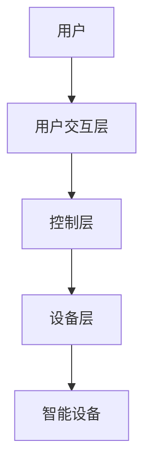
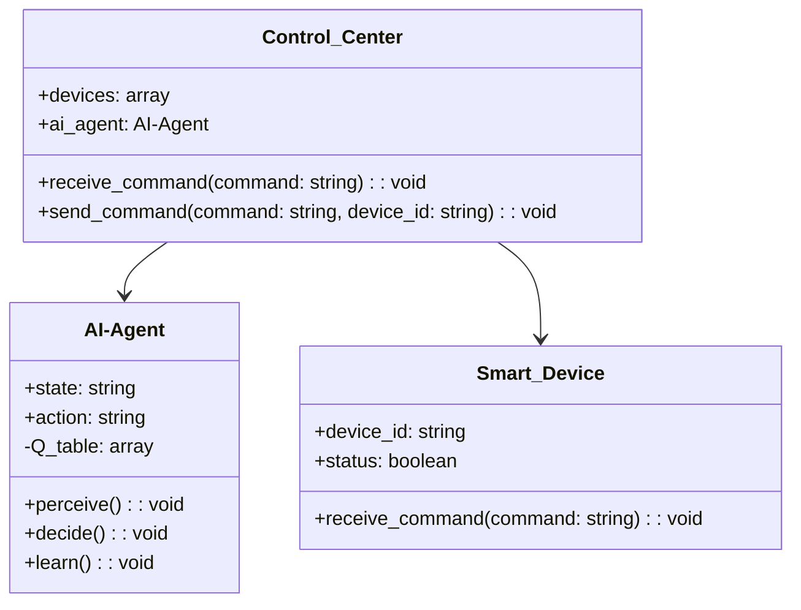
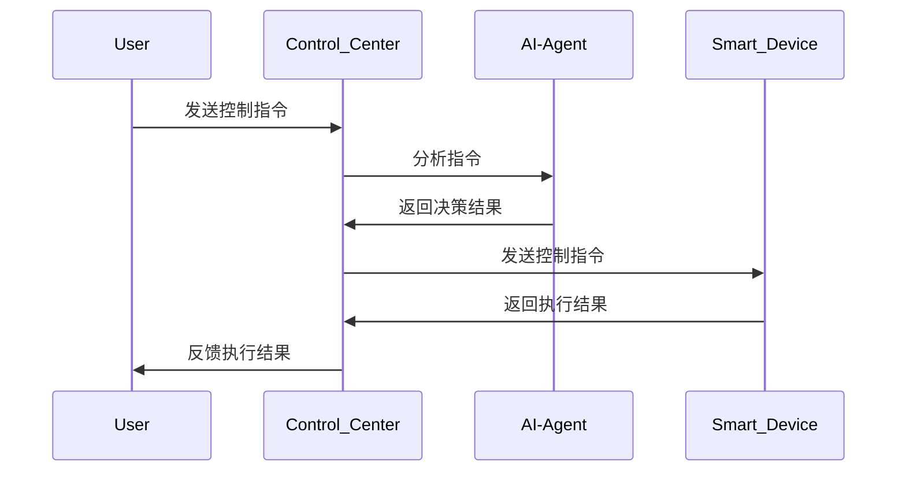

                 


# 实现基于AI Agent的智能家居控制系统

> **关键词**: AI Agent, 智能家居, 系统架构, 控制算法, 项目实战

> **摘要**: 本文详细探讨了基于AI Agent的智能家居控制系统的设计与实现。首先介绍了智能家居的发展现状和AI Agent的基本概念，分析了AI Agent在智能家居控制中的优势与挑战。接着，从核心概念、算法原理、系统架构等多方面展开深入讨论，结合实际案例，详细讲解了系统的实现过程。最后，总结了项目中的关键经验与未来的发展方向。

---

# 第一部分: 基于AI Agent的智能家居控制系统背景介绍

## 第1章: 智能家居的发展与AI Agent的结合

### 1.1 智能家居的发展现状

#### 1.1.1 智能家居的定义与特点
智能家居是指通过物联网技术、人工智能技术等，将家庭中的各种设备（如灯光、空调、电视、安防设备等）连接起来，实现智能化管理与控制的系统。其特点包括：

- **智能化**: 能够通过传感器和AI算法实现自主控制。
- **互联互通**: 各设备之间可以通过网络进行通信和协同工作。
- **用户友好**: 提供便捷的用户交互界面，满足个性化需求。

#### 1.1.2 智能家居的发展历程
智能家居的概念起源于20世纪90年代，经历了从单一设备控制到全屋智能的演变。近年来，随着AI和物联网技术的快速发展，智能家居系统逐渐走向普及。

#### 1.1.3 当前智能家居的主要技术与应用
当前，智能家居的主要技术包括物联网（IoT）、人工智能（AI）、语音识别、云计算等。应用场景涵盖家庭安防、能源管理、环境控制、智能照明等领域。

---

### 1.2 AI Agent的基本概念

#### 1.2.1 AI Agent的定义
AI Agent（人工智能代理）是指能够感知环境并采取行动以实现目标的智能实体。它可以是一个软件程序或物理设备，通过与环境交互来完成特定任务。

#### 1.2.2 AI Agent的核心特点
- **自主性**: AI Agent能够自主决策，无需人工干预。
- **反应性**: 能够实时感知环境变化并做出反应。
- **目标导向**: 以实现特定目标为导向进行行动。

#### 1.2.3 AI Agent与传统智能家居控制的区别
传统智能家居控制系统通常基于规则引擎，只能执行预设的指令。而AI Agent能够通过学习和适应，动态调整控制策略，提供更智能化的服务。

---

### 1.3 基于AI Agent的智能家居控制系统的优势

#### 1.3.1 提高智能家居的智能化水平
AI Agent能够通过学习用户行为和环境数据，优化控制策略，提供更智能的服务。

#### 1.3.2 实现多设备协同控制
AI Agent可以协调多个设备的工作，实现无缝协同，提升系统的整体效率。

#### 1.3.3 提供更个性化的用户体验
通过分析用户的使用习惯，AI Agent可以定制个性化的控制方案，满足用户的多样化需求。

---

### 1.4 当前智能家居控制系统中的问题与挑战

#### 1.4.1 系统集成复杂性
不同品牌和类型的设备之间存在兼容性问题，增加了系统集成的难度。

#### 1.4.2 设备兼容性问题
由于各种设备使用不同的协议和标准，导致设备之间的互联互通存在障碍。

#### 1.4.3 数据安全与隐私保护
智能家居系统涉及大量的用户数据，如何确保这些数据的安全性和隐私性是一个重要挑战。

---

## 1.5 本章小结
本章介绍了智能家居的发展现状，阐述了AI Agent的基本概念及其在智能家居控制中的优势，同时分析了当前系统面临的问题与挑战。

---

# 第二部分: 基于AI Agent的智能家居控制系统的核心概念

## 第2章: AI Agent与智能家居的核心概念与联系

### 2.1 AI Agent的核心原理

#### 2.1.1 AI Agent的基本工作原理
AI Agent通过感知环境、分析数据、制定决策并执行行动来实现目标。其工作流程包括以下几个步骤：

1. **感知环境**: 通过传感器或API获取环境数据。
2. **分析数据**: 利用AI算法对数据进行分析和处理。
3. **制定决策**: 根据分析结果生成控制策略。
4. **执行行动**: 执行决策并反馈结果。

#### 2.1.2 AI Agent的感知、决策与执行过程
- **感知**: AI Agent通过传感器或API获取设备状态、用户指令等信息。
- **决策**: 基于感知到的信息，AI Agent通过机器学习模型生成控制策略。
- **执行**: 根据决策结果，AI Agent向设备发送控制指令。

#### 2.1.3 AI Agent的分类与应用场景
AI Agent可以根据功能和应用场景分为多种类型，常见的包括：

- **反应式AI Agent**: 基于当前感知做出实时反应。
- **认知式AI Agent**: 具备推理和规划能力，能够处理复杂任务。
- **混合式AI Agent**: 结合反应式和认知式的特点，适用于复杂的动态环境。

---

### 2.2 智能家居系统的核心要素

#### 2.2.1 智能家居的设备层
智能家居系统的设备层包括各种智能设备，如智能灯泡、智能空调、智能门锁等。这些设备通过物联网技术实现互联互通。

#### 2.2.2 智能家居的控制层
控制层是智能家居系统的核心，负责接收用户的指令并协调各设备的工作。控制层可以基于AI Agent实现智能化控制。

#### 2.2.3 智能家居的用户交互层
用户交互层是用户与系统之间的接口，包括手机APP、语音助手（如智能音箱）等。

---

### 2.3 AI Agent与智能家居系统的实体关系图

```mermaid
erd
  软件系统
    智能家居控制中心
      包含AI Agent
  硬件设备
    智能灯泡
    智能空调
    智能门锁
  用户
    通过手机APP或语音助手进行控制
  数据流
    AI Agent <-> 智能家居设备
    用户 <-> 智能家居控制中心
```

---

## 2.4 本章小结
本章详细介绍了AI Agent的核心原理及其在智能家居系统中的应用，分析了智能家居系统的构成要素，并通过实体关系图展示了各组件之间的关系。

---

## 第三部分: 基于AI Agent的智能家居控制系统的算法原理

## 第3章: AI Agent的算法实现

### 3.1 AI Agent的感知算法

#### 3.1.1 数据采集与预处理
AI Agent通过传感器或API获取环境数据，例如温度、湿度、光照强度等。数据预处理包括数据清洗、标准化等步骤。

#### 3.1.2 数据分析与特征提取
通过对采集到的数据进行分析，提取有用的特征，例如时间序列特征、用户行为特征等。

#### 3.1.3 感知模型的建立
感知模型可以基于机器学习算法（如随机森林、支持向量机）或深度学习算法（如LSTM）进行训练，以提高感知的准确性。

---

### 3.2 AI Agent的决策算法

#### 3.2.1 决策模型的构建
决策模型的目标是根据感知到的信息生成最优的控制策略。常用的决策算法包括强化学习（如Q-learning）和规则引擎。

#### 3.2.2 决策模型的训练与优化
通过历史数据训练决策模型，并通过不断优化模型参数来提高决策的准确性和效率。

---

### 3.3 AI Agent的执行算法

#### 3.3.1 控制指令的生成
根据决策结果，AI Agent生成具体的控制指令，例如“打开灯”、“调节空调温度”。

#### 3.3.2 指令的执行与反馈
AI Agent将生成的指令发送给相应的设备执行，并实时反馈执行结果。

---

## 3.4 算法实现的代码示例

```python
# 示例：基于强化学习的决策算法
import numpy as np

class AI-Agent:
    def __init__(self, state_space, action_space):
        self.state_space = state_space
        self.action_space = action_space
        self.Q = np.zeros((state_space, action_space))

    def perceive(self, state):
        # 感知环境状态
        return state

    def decide(self, state):
        # 通过Q-learning算法选择动作
        if np.random.rand() < 0.1:
            action = np.random.randint(self.action_space)
        else:
            action = np.argmax(self.Q[state])
        return action

    def learn(self, state, action, reward):
        # 更新Q值
        self.Q[state][action] += reward
```

---

## 3.5 本章小结
本章详细讲解了AI Agent的感知、决策与执行算法，并通过代码示例展示了算法的实现过程。

---

## 第四部分: 基于AI Agent的智能家居控制系统的系统架构

## 第4章: 系统架构设计

### 4.1 系统整体架构



#### 4.1.1 系统功能模块
- **用户交互层**: 提供用户与系统交互的界面，如手机APP、语音助手。
- **控制层**: 负责接收用户指令并协调各设备的工作。
- **设备层**: 包含各种智能设备，如智能灯泡、智能空调等。

---

### 4.2 系统架构图



---

### 4.3 系统接口设计

#### 4.3.1 用户交互接口
- **输入接口**: 用户通过手机APP或语音助手输入指令。
- **输出接口**: 系统通过屏幕或语音反馈执行结果。

#### 4.3.2 设备控制接口
- **输入接口**: 设备向控制中心发送状态信息。
- **输出接口**: 控制中心向设备发送控制指令。

---

### 4.4 系统交互流程



---

## 4.5 本章小结
本章详细介绍了基于AI Agent的智能家居控制系统的系统架构设计，包括功能模块、系统架构图、接口设计和交互流程。

---

## 第五部分: 基于AI Agent的智能家居控制系统的项目实战

## 第5章: 项目实战

### 5.1 项目环境安装

#### 5.1.1 系统环境
- 操作系统：Linux/Windows/MacOS
- 开发工具：Python、Jupyter Notebook、PyCharm
- 依赖库：numpy、pandas、scikit-learn、tensorflow

#### 5.1.2 设备连接
- 智能设备：支持Wi-Fi或蓝牙连接的智能灯泡、空调等。
- 开发环境：智能家居开发套件（如Arduino、Raspberry Pi）

---

### 5.2 系统核心代码实现

#### 5.2.1 AI Agent的核心代码

```python
class AI-Agent:
    def __init__(self, state_space, action_space):
        self.state_space = state_space
        self.action_space = action_space
        self.Q_table = np.zeros((state_space, action_space))

    def perceive(self, state):
        # 感知环境状态
        return state

    def decide(self, state):
        # 选择动作
        if np.random.rand() < 0.1:
            action = np.random.randint(self.action_space)
        else:
            action = np.argmax(self.Q_table[state])
        return action

    def learn(self, state, action, reward):
        # 更新Q值
        self.Q_table[state][action] += reward
```

#### 5.2.2 设备控制代码

```python
class Smart_Device:
    def __init__(self, device_id):
        self.device_id = device_id
        self.status = False

    def receive_command(self, command):
        # 执行命令
        if command == "on":
            self.status = True
        elif command == "off":
            self.status = False
```

---

### 5.3 项目案例分析与实现

#### 5.3.1 案例背景
假设我们需要实现一个基于AI Agent的智能灯泡控制系统，用户可以通过手机APP或语音助手控制灯泡的开关。

#### 5.3.2 实现过程
1. **安装开发环境**: 安装必要的库和工具。
2. **连接智能设备**: 将智能灯泡连接到Wi-Fi。
3. **训练AI Agent**: 使用历史数据训练AI Agent的决策模型。
4. **系统集成**: 将AI Agent与智能灯泡和用户交互界面集成。
5. **测试与优化**: 进行功能测试并优化系统性能。

---

### 5.4 项目总结

#### 5.4.1 项目成果
成功实现了基于AI Agent的智能灯泡控制系统，用户可以通过手机APP或语音助手实现远程控制。

#### 5.4.2 项目经验
- 系统集成需要考虑设备的兼容性和数据通信的稳定性。
- AI Agent的训练需要大量的数据支持，数据质量直接影响系统的性能。

---

## 5.5 本章小结
本章通过一个具体的项目案例，详细讲解了基于AI Agent的智能家居控制系统的实现过程，包括环境安装、核心代码实现、案例分析与总结。

---

## 第六部分: 总结与展望

## 第6章: 总结与展望

### 6.1 项目总结

#### 6.1.1 核心成果
- 实现了基于AI Agent的智能家居控制系统。
- 提高了系统的智能化水平和用户体验。

#### 6.1.2 关键经验
- 系统设计需要考虑设备的兼容性和数据的安全性。
- AI Agent的训练需要高质量的数据和高效的算法。

---

### 6.2 项目展望

#### 6.2.1 系统优化
- 进一步优化AI Agent的算法，提高系统的响应速度和准确性。
- 增加更多的设备类型，扩展系统的应用场景。

#### 6.2.2 功能扩展
- 引入更多AI技术（如自然语言处理、计算机视觉）提升系统的智能化水平。
- 提供更丰富的用户交互方式，如手势控制、面部识别等。

---

## 6.3 本章小结
本章总结了项目的成果与经验，并展望了未来的发展方向。

---

## 作者

**作者：AI天才研究院/AI Genius Institute & 禅与计算机程序设计艺术 /Zen And The Art of Computer Programming**

---

# 结语
本文详细探讨了基于AI Agent的智能家居控制系统的实现过程，从理论到实践，全面解析了系统的架构设计、算法实现和项目实战。希望本文能够为相关领域的研究人员和开发者提供有价值的参考和启发。

