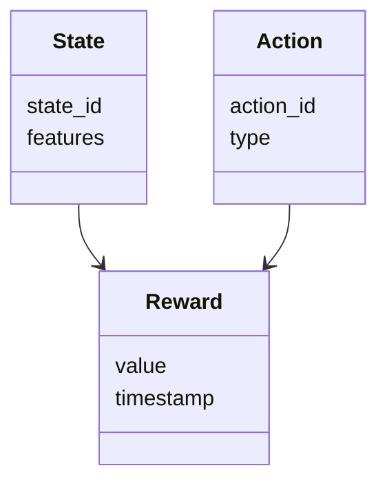
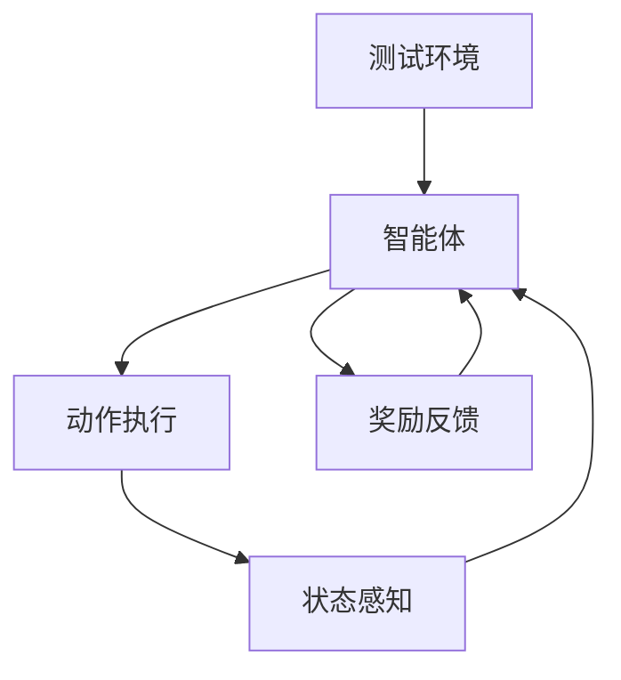
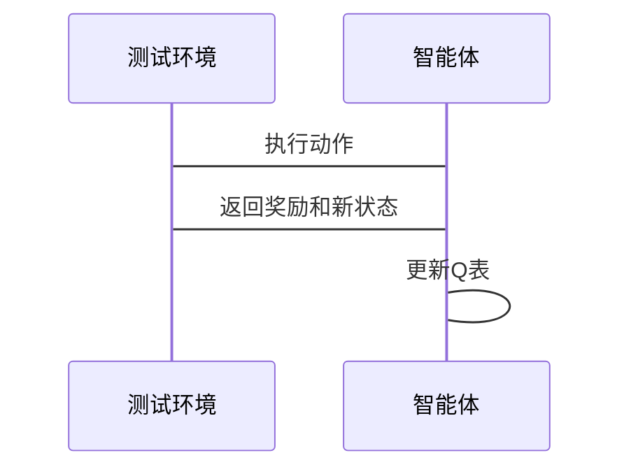

                 


# 强化学习在AI Agent自动化测试中的应用

> 关键词：强化学习，AI Agent，自动化测试，Q-learning，Deep Q-Networks，系统架构

> 摘要：本文探讨了强化学习在AI Agent自动化测试中的应用，从强化学习的基本概念到AI Agent的设计，再到算法实现和系统架构，详细阐述了如何利用强化学习提升自动化测试的效率和智能性。通过实际案例分析，本文展示了如何将强化学习应用于实际测试场景，并提供了系统的架构设计和代码实现。

---

## 正文

### 第一部分: 强化学习与AI Agent概述

#### 第1章: 强化学习与AI Agent的基本概念

##### 1.1 强化学习的基本概念

###### 1.1.1 什么是强化学习
强化学习是一种机器学习范式，通过智能体与环境的交互来学习最优策略。智能体通过执行动作并观察环境的反馈（奖励或惩罚）来优化其行为，目标是在长期累计的奖励中最大化。

$$
\text{奖励} = f(\text{状态}, \text{动作})
$$

###### 1.1.2 强化学习的核心要素
- **状态（State）**：环境在某一时刻的观察。
- **动作（Action）**：智能体在给定状态下的选择。
- **奖励（Reward）**：智能体执行动作后获得的反馈。
- **策略（Policy）**：智能体选择动作的规则。
- **值函数（Value Function）**：衡量状态或动作的价值。

###### 1.1.3 强化学习与监督学习的区别
| 特性 | 强化学习 | 监督学习 |
|------|----------|----------|
| 数据 | 环境反馈 | 标签数据 |
| 目标 | 最大化奖励 | 分类/回归 |
| 交互 | 主动探索 | 被动学习 |

##### 1.2 AI Agent的基本概念

###### 1.2.1 什么是AI Agent
AI Agent（智能体）是能够感知环境、做出决策并执行动作的实体。它可以是一个软件程序或物理设备，目标是通过与环境的交互完成特定任务。

###### 1.2.2 AI Agent的分类
- **简单反射型Agent**：基于当前状态做出反应。
- **基于模型的反射型Agent**：维护环境模型，用于决策。
- **目标驱动型Agent**：基于目标选择动作。
- **效用驱动型Agent**：基于效用函数优化决策。

###### 1.2.3 AI Agent的核心功能
- **感知**：通过传感器或接口获取环境信息。
- **决策**：基于感知信息做出最优选择。
- **执行**：将决策转化为具体动作。

##### 1.3 强化学习在AI Agent中的应用背景

###### 1.3.1 自动化测试的定义与特点
自动化测试是通过工具模拟人工操作，自动执行测试用例并验证结果的过程。其特点包括高效性、重复性、可扩展性。

###### 1.3.2 AI Agent在自动化测试中的优势
- **智能性**：能够自主选择测试用例和测试路径。
- **自适应性**：根据测试结果动态调整测试策略。
- **效率提升**：通过优化测试路径减少测试时间。

###### 1.3.3 强化学习在自动化测试中的潜力
强化学习可以通过模拟测试场景，训练AI Agent学习最优测试策略，从而提高测试覆盖率和效率。

---

#### 第2章: 强化学习的核心原理

##### 2.1 强化学习的基本原理

###### 2.1.1 状态、动作、奖励的关系
智能体通过选择动作改变状态，并根据环境反馈的奖励调整策略。

$$
Q(s, a) = Q(s, a) + \alpha [r + \gamma \max Q(s', a') - Q(s, a)]
$$

其中：
- \( Q(s, a) \)：状态 \( s \) 下选择动作 \( a \) 的价值。
- \( \alpha \)：学习率。
- \( \gamma \)：折扣因子。
- \( r \)：奖励。
- \( s' \)：下一状态。

###### 2.1.2 Q-learning算法的原理
Q-learning是一种经典的强化学习算法，通过更新Q表（Q-table）来学习最优策略。算法流程如下：


###### 2.1.3 策略与价值函数的定义
- **策略（Policy）**：决定智能体在状态 \( s \) 下选择动作 \( a \) 的概率分布。
- **价值函数（Value Function）**：衡量状态 \( s \) 或动作 \( a \) 的价值。

##### 2.2 强化学习的数学模型

###### 2.2.1 Q-learning的数学公式
$$
Q(s, a) = Q(s, a) + \alpha [r + \gamma \max Q(s', a') - Q(s, a)]
$$

其中：
- \( \alpha \) 是学习率，控制更新步长。
- \( \gamma \) 是折扣因子，平衡当前奖励与未来奖励的重要性。

###### 2.2.2 策略梯度方法的数学模型
策略梯度方法通过优化策略参数 \( \theta \) 来最大化期望奖励。

$$
\nabla_\theta J(\theta) = \mathbb{E}[ \nabla_\theta \log \pi_\theta(a|s) Q_\theta(s, a) ]
$$

其中：
- \( J(\theta) \) 是目标函数。
- \( \pi_\theta(a|s) \) 是策略函数。
- \( Q_\theta(s, a) \) 是价值函数。

###### 2.2.3 状态转移矩阵的定义
状态转移矩阵 \( P \) 定义了从状态 \( s \) 执行动作 \( a \) 后转移到状态 \( s' \) 的概率。

$$
P(s, a, s') = \Pr(s' | s, a)
$$

##### 2.3 强化学习的算法实现

###### 2.3.1 Q-learning算法的实现步骤
```python
import numpy as np

class QLearning:
    def __init__(self, state_space, action_space, learning_rate=0.1, gamma=0.9):
        self.state_space = state_space
        self.action_space = action_space
        self.lr = learning_rate
        self.gamma = gamma
        self.q_table = np.zeros((state_space, action_space))

    def choose_action(self, state, epsilon=0.1):
        if np.random.random() < epsilon:
            return np.random.randint(self.action_space)
        return np.argmax(self.q_table[state])

    def update_q_table(self, state, action, reward, next_state):
        self.q_table[state, action] += self.lr * (reward + self.gamma * np.max(self.q_table[next_state]) - self.q_table[state, action])
```

---

#### 第3章: AI Agent的强化学习模型设计

##### 3.1 AI Agent的状态空间设计

###### 3.1.1 状态空间的定义与划分
状态空间是智能体所有可能状态的集合。在自动化测试中，状态可以表示为测试步骤或界面元素。

###### 3.1.2 状态空间的特征提取
通过特征提取技术（如PCA）将高维状态空间降维，提高算法效率。

###### 3.1.3 状态空间的维度优化
通过合并相似状态或使用经验 replay 方法，降低状态空间的维度。

##### 3.2 AI Agent的动作空间设计

###### 3.2.1 动作空间的定义与分类
动作空间是智能体所有可能动作的集合。在自动化测试中，动作可以是点击按钮或输入文本。

###### 3.2.2 动作空间的策略选择
通过 ε-greedy 策略平衡探索与利用，避免陷入局部最优。

###### 3.2.3 动作空间的执行机制
通过模拟器或API接口执行动作，并观察环境反馈。

##### 3.3 AI Agent的奖励机制设计

###### 3.3.1 奖励函数的定义与设计
奖励函数定义了智能体在不同状态和动作下的反馈，直接影响学习效果。

###### 3.3.2 奖励机制的优化方法
通过引入延迟奖励或多目标奖励，提升智能体的长期决策能力。

###### 3.3.3 奖励机制的动态调整
根据测试场景的变化，动态调整奖励函数，适应不同的测试需求。

---

### 第二部分: 强化学习在自动化测试中的应用

#### 第4章: 自动化测试场景中的强化学习建模

##### 4.1 测试场景介绍
自动化测试场景包括测试用例生成、测试路径选择和异常处理。

##### 4.2 系统功能设计

###### 4.2.1 领域模型设计


---

#### 第5章: 系统架构设计与实现

##### 5.1 系统架构设计

###### 5.1.1 系统架构图


##### 5.2 系统接口设计

###### 5.2.1 系统接口说明
- **输入接口**：接收测试环境的状态和动作。
- **输出接口**：返回奖励和下一步动作。

##### 5.3 系统交互设计

###### 5.3.1 交互流程图


---

#### 第6章: 项目实战与优化

##### 6.1 环境配置

###### 6.1.1 环境安装
- 安装Python和相关库（如numpy、matplotlib）。
- 配置测试环境（如Selenium）。

##### 6.2 核心代码实现

###### 6.2.1 核心代码
```python
class AutomatedTester:
    def __init__(self, state_space, action_space):
        self.agent = QLearning(state_space, action_space)
        self.env = TestEnvironment()

    def run_test(self, episodes=100):
        for episode in range(episodes):
            state = self.env.reset()
            while not self.env.done:
                action = self.agent.choose_action(state)
                next_state, reward, done = self.env.step(action)
                self.agent.update_q_table(state, action, reward, next_state)
                state = next_state
                if done:
                    break
```

##### 6.3 代码应用解读与分析
- **初始化**：创建Q-learning智能体和测试环境。
- **运行测试**：执行多个 episodes，每个 episode 包括状态感知、动作选择、奖励更新和状态转移。
- **终止条件**：当测试完成或达到最大 episode 数时，终止测试。

##### 6.4 实际案例分析
通过具体测试案例（如Web界面自动化测试），展示如何训练AI Agent完成复杂测试任务。

##### 6.5 系统优化
- **算法优化**：引入经验 replay 和渐近策略。
- **性能优化**：并行化测试执行和结果分析。

---

### 第三部分: 最佳实践与总结

#### 第7章: 最佳实践与经验分享

##### 7.1 关键点总结
- **算法选择**：根据测试场景选择合适的强化学习算法。
- **状态与动作设计**：合理划分状态和动作空间。
- **奖励机制设计**：设计合理的奖励函数，平衡短期和长期目标。

##### 7.2 小结
强化学习为AI Agent在自动化测试中的应用提供了新的可能性，通过智能体与环境的交互，可以实现高效的测试用例生成和执行。

##### 7.3 注意事项
- **环境复杂性**：复杂环境可能影响学习效率。
- **算法收敛性**：确保算法能够收敛到最优策略。
- **资源限制**：考虑计算资源和时间限制。

##### 7.4 拓展阅读
- 《Deep Reinforcement Learning》
- 《Reinforcement Learning: Theory and Algorithms》

---

### 作者

作者：AI天才研究院/AI Genius Institute & 禅与计算机程序设计艺术 /Zen And The Art of Computer Programming

---

通过以上结构，本文系统地探讨了强化学习在AI Agent自动化测试中的应用，从理论基础到算法实现，再到系统设计和项目实战，全面展示了如何利用强化学习提升自动化测试的效率和智能性。希望本文能够为相关领域的研究者和实践者提供有价值的参考和启发。

