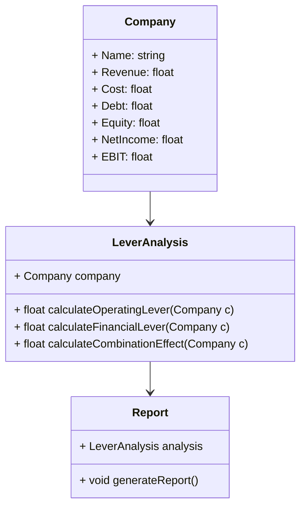
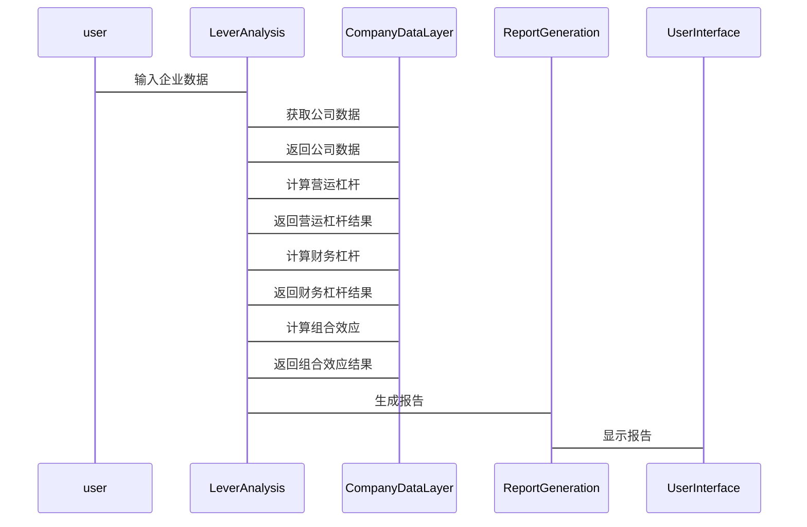

                 


# 彼得林奇对公司营运杠杆与财务杠杆组合效应的动态分析

> 关键词：彼得·林奇，营运杠杆，财务杠杆，杠杆组合，动态分析，企业价值

> 摘要：本文深入探讨了彼得·林奇在投资分析中对营运杠杆与财务杠杆组合效应的动态分析方法。通过定义与特点、数学模型与公式、组合效应分析、彼得·林奇的分析方法、系统架构与算法实现、项目实战案例、结论与建议等部分，全面解析了杠杆组合对企业价值的影响。文章结合理论与实践，提供了详细的分析框架和实际案例，帮助读者更好地理解和应用这些概念。

---

## 第一部分: 背景介绍

### 第1章: 营运杠杆与财务杠杆的定义与特点

#### 1.1 营运杠杆的定义与特点

##### 1.1.1 营运杠杆的定义
营运杠杆是指企业在经营活动中利用固定成本和变动成本的比例，通过提高销售额来增加净利润的能力。简单来说，营运杠杆高的企业，其净利润对销售额的变化更加敏感。

##### 1.1.2 营运杠杆的核心特点
- **固定成本高**：企业通过固定成本的投入，放大销售增长带来的利润。
- **边际成本低**：随着销售量的增加，边际成本的增加有限，利润增长较快。
- **风险与收益并存**：营运杠杆高意味着利润增长潜力大，但也意味着销售下滑时的风险更大。

##### 1.1.3 营运杠杆与财务杠杆的区别
- **定义**：营运杠杆是通过经营效率和成本结构来放大收益，而财务杠杆是通过债务融资来放大收益。
- **风险**：营运杠杆的风险主要来自经营环境的变化，而财务杠杆的风险主要来自债务的偿付压力。
- **收益**：营运杠杆的收益增长潜力更大，而财务杠杆的收益增长受制于债务的利息支出。

#### 1.2 财务杠杆的定义与特点

##### 1.2.1 财务杠杆的定义
财务杠杆是指企业通过债务融资来放大股东权益回报的能力。当企业使用债务融资时，债务利息可以在税后支付，从而放大净利润。

##### 1.2.2 财务杠杆的核心特点
- **杠杆效应**：通过债务融资，股东权益的回报可以被放大。
- **固定成本**：债务的利息是固定的，无论企业盈利多少，都需要支付。
- **风险**：财务杠杆的使用增加了企业的财务风险，因为债务需要按时偿还。

##### 1.2.3 财务杠杆与营运杠杆的联系
- **协同效应**：营运杠杆和财务杠杆可以协同作用，共同放大企业的收益。
- **风险叠加**：两者结合使用时，风险也会叠加，需要谨慎管理。

#### 1.3 营运杠杆与财务杠杆的组合效应

##### 1.3.1 组合效应的定义
组合效应是指营运杠杆和财务杠杆共同作用，对企业价值产生的综合影响。

##### 1.3.2 组合效应的分类
- **正向组合效应**：营运杠杆和财务杠杆共同放大收益，企业价值显著增加。
- **反向组合效应**：营运杠杆和财务杠杆的作用相互抵消，企业价值增长有限。
- **负面组合效应**：营运杠杆和财务杠杆的作用导致企业价值下降，甚至引发财务危机。

##### 1.3.3 组合效应的动态变化
- **短期动态**：短期内，营运杠杆和财务杠杆的组合效应可能迅速放大收益，但也可能迅速放大亏损。
- **长期动态**：长期来看，组合效应的稳定性取决于企业的经营效率和财务健康状况。

---

### 第2章: 营运杠杆与财务杠杆的数学模型与公式

#### 2.1 营运杠杆的数学模型

##### 2.1.1 营运杠杆比率的计算公式
营运杠杆比率（OL）= 变化前的EBIT / 变化后的EBIT

##### 2.1.2 营运杠杆对ROE的影响公式
ROE = (净利润 / 平均股东权益) × 100%

##### 2.1.3 营运杠杆与企业盈利能力的关系
当营运杠杆较高时，企业盈利能力对销售额的变化更加敏感。

#### 2.2 财务杠杆的数学模型

##### 2.2.1 财务杠杆比率的计算公式
财务杠杆比率（DL）= 总资产 / 股东权益

##### 2.2.2 财务杠杆对ROE的影响公式
ROE = (净利润 / 平均股东权益) × 100%

##### 2.2.3 财务杠杆与企业财务风险的关系
财务杠杆高时，企业的财务风险也高，因为需要偿还更多的债务。

#### 2.3 营运杠杆与财务杠杆的组合效应公式

##### 2.3.1 组合效应的数学表达式
组合效应 = 营运杠杆效应 × 财务杠杆效应

##### 2.3.2 组合效应的动态变化模型
动态变化模型可以通过对营运杠杆和财务杠杆的相互作用进行建模，分析其对ROE的影响。

##### 2.3.3 组合效应的实际应用案例
通过具体案例分析，展示如何利用组合效应公式进行企业价值评估。

---

### 第3章: 营运杠杆与财务杠杆的组合效应分析

#### 3.1 组合效应的正向影响

##### 3.1.1 高营运杠杆与高财务杠杆的组合优势
当企业同时具备高营运杠杆和高财务杠杆时，可以显著放大收益。

##### 3.1.2 组合效应对企业价值的影响
组合效应可以显著提升企业价值，特别是在销售增长较快时。

##### 3.1.3 组合效应在企业扩张中的应用
通过合理使用组合效应，企业可以在扩张过程中放大收益。

#### 3.2 组合效应的反向影响

##### 3.2.1 高营运杠杆与低财务杠杆的风险
虽然营运杠杆高，但如果财务杠杆低，企业无法充分利用杠杆效应放大收益。

##### 3.2.2 低营运杠杆与高财务杠杆的限制
营运杠杆低，即使财务杠杆高，企业也无法充分利用杠杆效应放大收益。

##### 3.2.3 组合效应在企业收缩中的应用
在企业收缩时，高组合效应可能导致收益迅速下降，需要谨慎管理。

#### 3.3 组合效应的动态变化

##### 3.3.1 组合效应的短期与长期变化
短期内，组合效应可能迅速放大收益或亏损；长期来看，其稳定性取决于企业的经营效率和财务健康状况。

##### 3.3.2 组合效应的周期性变化
在经济周期变化中，组合效应的表现也会有所不同，需要根据经济环境调整杠杆策略。

##### 3.3.3 组合效应的行业差异
不同行业的组合效应表现不同，需要根据行业特点进行分析。

---

### 第4章: 彼得·林奇的杠杆分析方法

#### 4.1 彼得·林奇的投资理念

##### 4.1.1 彼得·林奇的投资哲学
彼得·林奇主张通过深入研究企业基本面，寻找具有高成长潜力的企业进行投资。

##### 4.1.2 彼得·林奇的核心投资理念
- 选择具有强大竞争优势的企业。
- 关注企业的财务健康状况，特别是杠杆使用情况。
- 长期投资，耐心持有优质企业。

#### 4.2 彼得·林奇的杠杆分析方法

##### 4.2.1 营运杠杆与财务杠杆的结合
彼得·林奇在分析企业时，注重营运杠杆和财务杠杆的结合，寻找具有高组合效应的企业。

##### 4.2.2 动态分析方法
通过动态分析营运杠杆和财务杠杆的组合效应，评估企业在不同经济周期下的表现。

##### 4.2.3 企业案例分析
通过具体企业案例，展示彼得·林奇如何运用杠杆分析方法进行投资决策。

---

### 第5章: 系统架构与算法实现

#### 5.1 问题场景介绍

##### 5.1.1 问题背景
企业在经营过程中，需要合理使用营运杠杆和财务杠杆，以实现最大化价值。

##### 5.1.2 问题描述
如何通过动态分析营运杠杆和财务杠杆的组合效应，优化企业价值。

##### 5.1.3 问题解决
通过构建数学模型和算法，分析不同杠杆组合对企业价值的影响。

#### 5.2 系统功能设计

##### 5.2.1 领域模型（Mermaid类图）


##### 5.2.2 系统架构设计（Mermaid架构图）
```mermaid
architectural
    CompanyDataLayer
    +----+
    |    | CompanyData
    |    |
    |<--+
    |    |
    +----+
        |
        |
    +----+        +----+
    |    |        |    |
    LeverAnalysis  ReportGeneration
    |    |        |    |
    +----+        +----+
        |
        |
    +----+
    |    |
    UserInterface
```

##### 5.2.3 系统接口设计
- 输入：企业财务数据（收入、成本、债务、权益等）。
- 输出：营运杠杆、财务杠杆、组合效应的分析结果。

##### 5.2.4 系统交互（Mermaid序列图）


#### 5.3 算法实现

##### 5.3.1 算法原理
通过构建数学模型，分析营运杠杆和财务杠杆的组合效应对企业价值的影响。

##### 5.3.2 核心算法代码
```python
class Company:
    def __init__(self, name, revenue, cost, debt, equity):
        self.name = name
        self.revenue = revenue
        self.cost = cost
        self.debt = debt
        self.equity = equity

    def calculate_ebit(self):
        return self.revenue - self.cost

    def calculate_operating_lever(self):
        ebit_change = self.revenue * 0.1  # 假设收入增加10%
        new_revenue = self.revenue + ebit_change
        new_ebit = new_revenue - self.cost
        return (self.calculate_ebit() / new_ebit)  # 计算营运杠杆比率

    def calculate_financial_lever(self):
        net_income = self.calculate_ebit() * (1 - self.tax_rate)
        return (self.debt / self.equity) * (net_income / self.equity)

    def calculate_combination_effect(self):
        return self.calculate_operating_lever() * self.calculate_financial_lever()

class LeverAnalysis:
    def __init__(self, company):
        self.company = company

    def analyze(self):
        ol = self.company.calculate_operating_lever()
        fl = self.company.calculate_financial_lever()
        ce = ol * fl
        return {"operating_lever": ol, "financial_lever": fl, "combination_effect": ce}
```

##### 5.3.3 数学模型与公式
- 营运杠杆比率（OL）= 变化前的EBIT / 变化后的EBIT
- 财务杠杆比率（FL）= （净利润 / 平均股东权益）× 100%
- 组合效应（CE）= OL × FL

#### 5.4 项目实战

##### 5.4.1 环境安装
- 安装Python和必要的库（如numpy、pandas）。

##### 5.4.2 核心实现
- 编写公司类和杠杆分析类，实现营运杠杆、财务杠杆和组合效应的计算。

##### 5.4.3 实际案例分析
以某公司为例，输入财务数据，计算其营运杠杆、财务杠杆和组合效应。

##### 5.4.4 代码实现与分析
展示代码实现，并解释每部分的功能和计算结果。

---

### 第6章: 结论与建议

#### 6.1 结论
- 营运杠杆和财务杠杆的组合效应是影响企业价值的重要因素。
- 动态分析组合效应，可以帮助企业在不同经济周期下优化杠杆策略。
- 彼得·林奇的投资理念为杠杆分析提供了重要的指导。

#### 6.2 投资建议
- 合理使用营运杠杆和财务杠杆，避免过度杠杆化。
- 根据企业所处行业和经济环境，动态调整杠杆策略。
- 选择具有强大竞争优势和良好财务健康状况的企业进行投资。

#### 6.3 注意事项
- 杠杆的使用需要谨慎，特别是在经济不景气时。
- 定期监控企业的财务状况，及时调整杠杆策略。

#### 6.4 拓展阅读
- 《彼得·林奇的投资哲学》
- 《财务杠杆与企业价值》

---

## 作者：AI天才研究院/AI Genius Institute & 禅与计算机程序设计艺术 /Zen And The Art of Computer Programming

---

以上是《彼得林奇对公司营运杠杆与财务杠杆组合效应的动态分析》的技术博客文章的大纲和详细内容，涵盖了背景介绍、数学模型、系统架构、项目实战等多个方面，结合理论与实践，提供了详细的分析和实用的建议。

