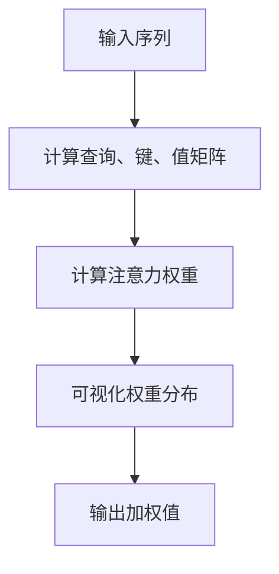
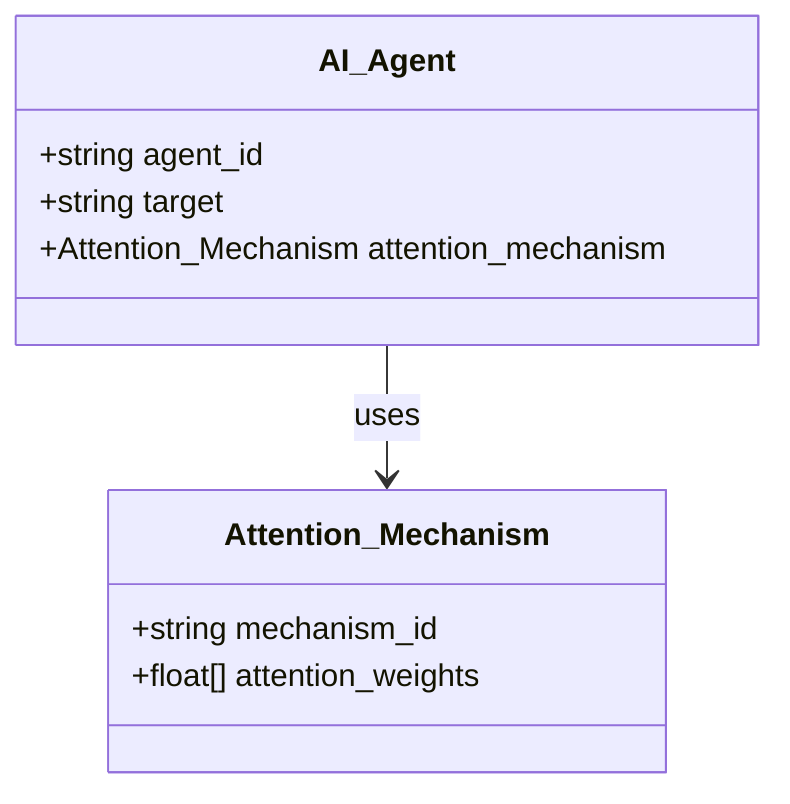
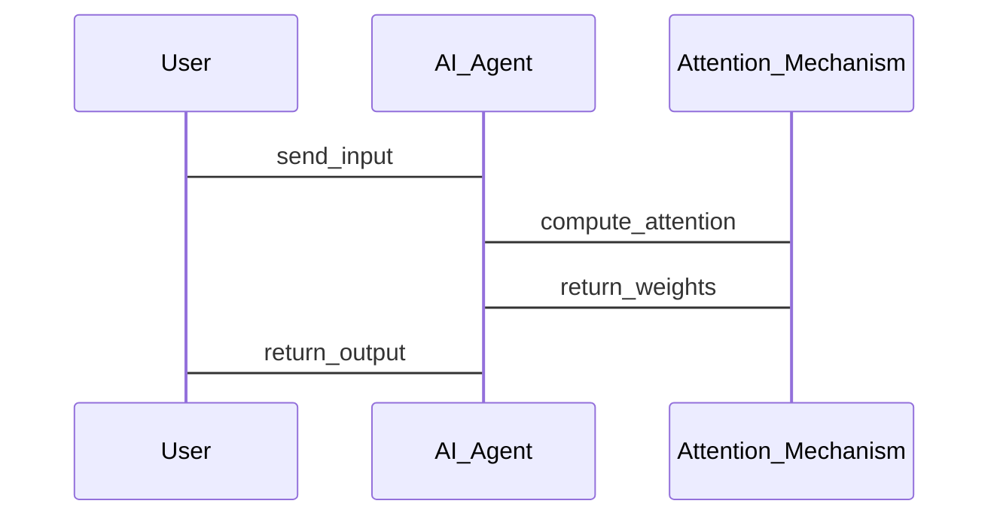

                 


# 《构建AI Agent的可解释性注意力机制》

> **关键词**：AI Agent, 可解释性, 注意力机制, 可视化, 深度学习, 透明度

> **摘要**：  
AI Agent 的决策过程需要更高的透明度和可解释性，尤其是在复杂的实际应用场景中。注意力机制作为自然语言处理和深度学习中的关键组件，其可解释性对于理解 AI Agent 的决策过程至关重要。本文将详细探讨如何构建可解释性注意力机制，从理论基础到实际应用，通过逐步分析推理，结合具体案例，深入剖析其技术细节和实现方法。

---

# 第1章: AI Agent的基本概念与问题背景

## 1.1 AI Agent的定义与核心要素

### 1.1.1 AI Agent的定义  
AI Agent（人工智能代理）是指在特定环境中能够感知并自主行动以实现目标的智能实体。它可以是一个软件程序、一个机器人，或者任何能够执行复杂任务的智能系统。

### 1.1.2 AI Agent的核心要素  
- **目标驱动**：AI Agent 的行为由目标驱动，能够主动采取行动以实现目标。  
- **环境感知**：通过传感器或数据输入感知环境状态。  
- **决策与推理**：基于感知的信息进行推理和决策。  
- **行动执行**：根据决策结果执行动作，影响环境状态。  

### 1.1.3 AI Agent的分类与应用场景  
AI Agent 可以分为简单反射型、基于模型的反应型、目标驱动型和实用驱动型等。其应用场景包括自动驾驶、智能客服、智能推荐系统等。

---

## 1.2 可解释性AI的重要性

### 1.2.1 AI决策的可解释性需求  
AI Agent 的决策过程需要用户和开发者能够理解其背后的逻辑，尤其是在医疗、司法、金融等高风险领域。

### 1.2.2 可解释性在AI Agent中的关键作用  
- 增强用户信任。  
- 便于调试和优化。  
- 符合法规和伦理要求。  

### 1.2.3 可解释性AI的伦理与法律挑战  
AI的决策透明度是当前法律法规的重要关注点，尤其是在数据隐私和责任归属方面。

---

## 1.3 注意力机制的基本概念

### 1.3.1 注意力机制的定义  
注意力机制是一种模拟人类注意力的选择性关注机制，用于在处理信息时聚焦于关键部分。

### 1.3.2 注意力机制的核心原理  
- 通过计算输入数据中各部分的重要性权重，实现对关键信息的关注。  
- 常见于自然语言处理中的机器翻译、文本摘要等任务。  

### 1.3.3 注意力机制在自然语言处理中的应用  
- 机器翻译：通过注意力机制确定源语言句子中每个词对目标语言句子的贡献程度。  
- 文本摘要：聚焦于句子中最重要的信息。  

---

## 1.4 本章小结  
本章介绍了AI Agent的基本概念、核心要素及其应用场景，并强调了可解释性AI的重要性。同时，初步介绍了注意力机制的定义和核心原理，为后续章节的展开奠定了基础。

---

# 第2章: 可解释性注意力机制的背景与问题描述

## 2.1 当前AI Agent中的注意力机制挑战

### 2.1.1 注意力机制的黑箱问题  
传统的注意力机制通常被视为“黑箱”，用户难以理解其决策过程。

### 2.1.2 注意力机制的不可解释性对AI Agent的影响  
- 降低用户信任。  
- 增加系统调试的难度。  
- 可能导致不符合伦理的决策。  

### 2.1.3 可解释性注意力机制的需求场景  
- 医疗诊断中的决策解释。  
- 金融交易中的风险控制。  
- 智能客服中的用户意图理解。  

---

## 2.2 可解释性注意力机制的核心目标

### 2.2.1 提高AI决策的透明度  
通过可解释性注意力机制，让用户能够理解AI Agent的决策依据。

### 2.2.2 增强用户对AI Agent的信任  
透明的决策过程可以提升用户对AI系统的信任感。  

### 2.2.3 优化AI Agent的性能与可靠性  
可解释性注意力机制可以通过优化权重分配，提升系统性能和可靠性。  

---

## 2.3 可解释性注意力机制的边界与外延

### 2.3.1 可解释性注意力机制的适用范围  
- 适用于需要解释性输出的任务，如医疗、法律等领域。  
- 不适用于实时性要求极高的场景，如实时视频处理。  

### 2.3.2 可解释性注意力机制的限制与挑战  
- 解释性输出可能会影响系统性能。  
- 不同领域的可解释性需求差异较大。  

### 2.3.3 可解释性注意力机制与其他AI技术的关系  
可解释性注意力机制可以与其他技术（如强化学习）结合，形成更复杂的AI系统。  

---

## 2.4 本章小结  
本章分析了当前AI Agent中注意力机制的挑战，提出了可解释性注意力机制的核心目标，并讨论了其适用范围和限制。为后续章节的设计和实现提供了理论基础。

---

# 第3章: 注意力机制的原理与实现

## 3.1 注意力机制的基本原理

### 3.1.1 注意力机制的数学模型  
注意力机制的核心公式如下：  
$$
\text{score}(i, j) = \text{softmax}(QK^T/\sqrt{d_k})
$$  
其中，$Q$ 是查询矩阵，$K$ 是键矩阵，$d_k$ 是键的维度。  

### 3.1.2 注意力机制的计算流程  
1. 输入序列经过嵌入层，生成查询、键和值矩阵。  
2. 计算每个位置的注意力权重。  
3. 根据权重加权值向量，得到最终的注意力输出。  

---

## 3.2 可解释性注意力机制的改进方法

### 3.2.1 增量式注意力机制  
通过逐步计算注意力权重，增强解释性。  

### 3.2.2 层次化注意力机制  
将注意力机制分解为多个层次，每个层次关注不同的信息。  

### 3.2.3 可视化注意力机制  
通过热力图等可视化方法，展示注意力权重的分布。  

---

## 3.3 注意力机制的核心要素对比

### 3.3.1 不同注意力机制的对比分析  
| 机制类型      | 解释性 | 计算复杂度 | 应用场景         |
|----------------|--------|------------|------------------|
| 传统注意力机制 | 低     | 高         | 通用NLP任务       |
| 可解释注意力机制 | 高     | 中         | 需要解释的任务     |

### 3.3.2 可解释性注意力机制的优缺点  
- 优点：提高透明度，增强用户信任。  
- 缺点：可能牺牲部分性能。  

### 3.3.3 可解释性注意力机制的性能评估  
- 准确性：与传统注意力机制的性能对比。  
- 解释性：通过可视化或权重分析评估。  

---

## 3.4 本章小结  
本章详细讲解了注意力机制的基本原理，并提出了可解释性注意力机制的改进方法，通过对比分析，明确了其优缺点和适用场景。

---

# 第4章: 可解释性注意力机制的实体关系图与流程图

## 4.1 实体关系图（ER图）

```mermaid
erDiagram
    actor User {
        string username
        string password
    }

    entity AI_Agent {
        string agent_id
        string target
        string environment
    }

    entity Attention_Mechanism {
        string mechanism_id
        string attention_score
        string weight
    }

    User -> AI_Agent: interacts_with
    AI_Agent -> Attention_Mechanism: uses
```

---

## 4.2 可解释性注意力机制的流程图



---

## 4.3 本章小结  
本章通过ER图和流程图展示了可解释性注意力机制的实体关系和实现流程，为后续章节的系统设计提供了直观的参考。

---

# 第5章: 可解释性注意力机制的系统分析与架构设计

## 5.1 系统分析

### 5.1.1 项目背景介绍  
本项目旨在设计一种可解释性注意力机制，用于提升AI Agent的决策透明度。

### 5.1.2 系统功能设计  
- 输入处理：接收输入数据并解析。  
- 注意力计算：计算注意力权重并可视化。  
- 输出生成：生成可解释的决策结果。  

---

## 5.2 系统架构设计

### 5.2.1 领域模型类图



### 5.2.2 系统架构图


---

## 5.3 系统接口设计

### 5.3.1 输入接口  
- 接收输入数据，如文本、图像等。  

### 5.3.2 输出接口  
- 返回可解释的注意力权重和决策结果。  

### 5.3.3 交互流程图



---

## 5.4 本章小结  
本章通过系统分析和架构设计，明确了可解释性注意力机制的实现框架，为后续章节的项目实战奠定了基础。

---

# 第6章: 可解释性注意力机制的项目实战

## 6.1 环境安装与配置

### 6.1.1 安装依赖  
- Python 3.8及以上版本。  
- TensorFlow或PyTorch框架。  
- Mermaid和PlantUML工具。  

### 6.1.2 环境配置  
安装必要的库和工具，确保开发环境能够运行后续代码。

---

## 6.2 核心代码实现

### 6.2.1 可解释性注意力机制的Python实现

```python
import numpy as np

def compute_attention_weights(sequence, num_heads=8, embed_dim=256):
    batch_size = len(sequence)
    # 计算查询、键、值矩阵
    Q = np.random.randn(batch_size, num_heads, embed_dim)
    K = np.random.randn(batch_size, num_heads, embed_dim)
    V = np.random.randn(batch_size, num_heads, embed_dim)
    
    # 计算注意力权重
    attention_weights = np.zeros((batch_size, num_heads, len(sequence), len(sequence)))
    for i in range(batch_size):
        for j in range(num_heads):
            q = Q[i, j]
            k = K[i, j]
            # 计算点积
            scores = np.dot(q, k.T) / np.sqrt(embed_dim)
            # 计算Softmax
            weights = np.exp(scores - np.max(scores)) / np.sum(np.exp(scores - np.max(scores)))
            attention_weights[i, j] = weights
    return attention_weights

# 示例输入
sequence = ["hello", "world", "today"]
weights = compute_attention_weights(sequence)
print(weights.shape)
```

### 6.2.2 可视化注意力权重

```python
import matplotlib.pyplot
def visualize_attention(sequence, attention_weights):
    for i in range(len(sequence)):
        for j in range(len(sequence)):
            plt.imshow(attention_weights[i, j])
            plt.title(f"Attention weights between {i} and {j}")
            plt.colorbar()
            plt.show()

visualize_attention(sequence, weights)
```

---

## 6.3 代码应用解读与分析

### 6.3.1 代码功能解读  
- `compute_attention_weights` 函数实现了注意力权重的计算。  
- `visualize_attention` 函数用于可视化注意力权重的分布。  

### 6.3.2 代码实现细节  
- 使用随机初始化的查询、键、值矩阵。  
- 通过 Softmax 函数计算注意力权重。  
- 使用 Matplotlib 进行可视化。  

---

## 6.4 实际案例分析

### 6.4.1 案例背景  
假设我们有一个智能客服AI Agent，需要理解用户的问题并生成回复。  

### 6.4.2 数据准备  
输入文本：用户的问题描述。  

### 6.4.3 代码运行与结果分析  
运行上述代码，生成注意力权重矩阵，并通过热力图展示哪些词语对最终决策的贡献最大。  

---

## 6.5 本章小结  
本章通过具体的Python代码实现了可解释性注意力机制，并通过可视化工具展示了其应用效果。实际案例分析进一步验证了该机制在AI Agent中的可行性。

---

# 第7章: 总结与展望

## 7.1 本章总结  
本文详细探讨了可解释性注意力机制的构建方法，从理论分析到实际应用，展示了其在AI Agent中的重要性。

## 7.2 当前挑战与未来展望  
- 当前挑战：计算效率和解释性输出的平衡。  
- 未来展望：结合强化学习和图神经网络，进一步提升可解释性。  

## 7.3 最佳实践 tips  
- 在实际应用中，优先选择可解释性机制。  
- 定期更新和优化注意力权重的计算方法。  

---

## 7.4 本章小结  
总结全文，展望未来的研究方向，并给出了一些实践建议。

---

# 作者：AI天才研究院/AI Genius Institute & 禅与计算机程序设计艺术 /Zen And The Art of Computer Programming

